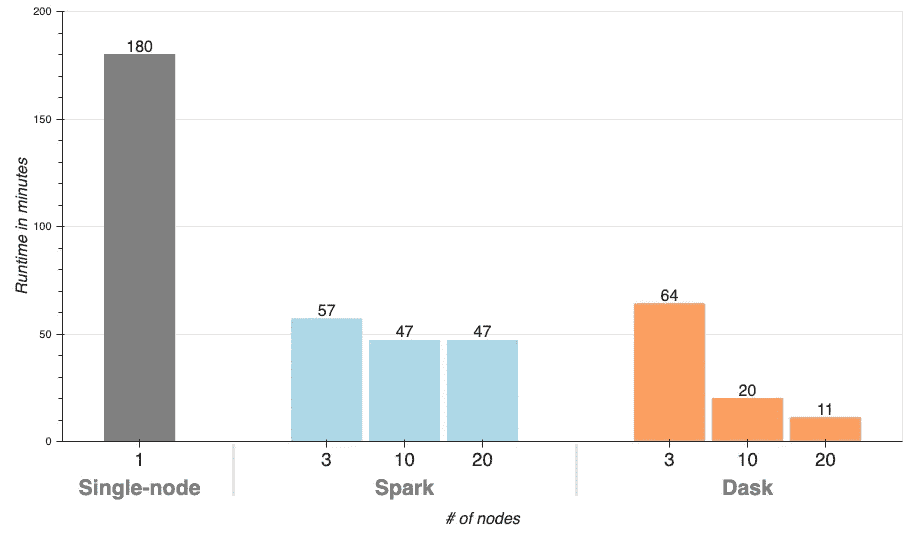
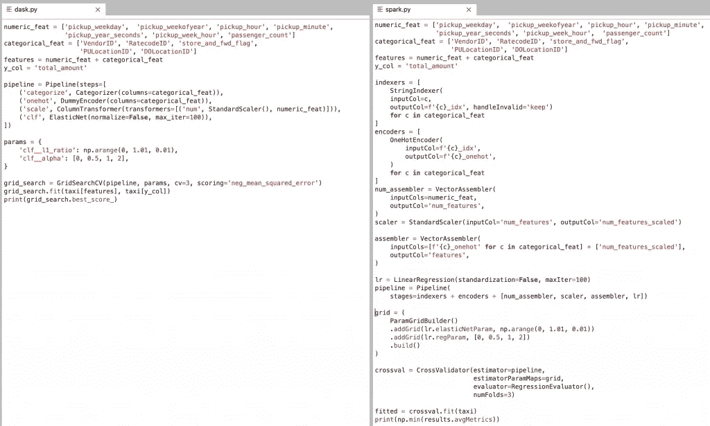

# 利用 Dask 调整增压超参数

> 原文：<https://towardsdatascience.com/supercharging-hyperparameter-tuning-with-dask-ab2c28788bcf?source=collection_archive---------50----------------------->

## Dask 将 scikit-learn 参数搜索速度提高了 16 倍以上，Spark 提高了 4 倍以上

照片由[斯潘塞·戴维斯](https://unsplash.com/@spencerdavis?utm_source=medium&utm_medium=referral)在 [Unsplash](https://unsplash.com?utm_source=medium&utm_medium=referral) 上拍摄

声明:我是[土星云](https://www.saturncloud.io/)的高级数据科学家——我们用 Python 和 Dask 让企业数据科学变得快速而简单。

超参数调整是构建机器学习模型的一个关键部分，通常也是痛苦的部分。从你的模型中挤出每一点性能可能意味着数百万美元广告收入的差异，或者医疗保健模型中患者的生死。即使你的模型需要一分钟来训练，你也可能要等几个小时来完成网格搜索(想想 10x10 的网格，交叉验证，等等。).每次你等待一个搜索完成都会打破一个迭代周期，并且增加你的模型产生价值的时间。简而言之:

*   更快的运行时间意味着更多的迭代，以在截止日期之前提高准确性
*   更快的运行时间意味着更快的交付，因此您可以处理另一个项目
*   这两个要点都意味着将价值提升到您组织的底线

在这篇文章中，我们将看到如何通过在 Saturn Cloud 上用 Dask 代码 [**替换 scikit-learn 管道中的几行代码，将超参数搜索的速度提高超过**16 倍。这使得传统的通宵参数搜索变成了几秒钟的等待。我们还尝试用 Apache Spark 进行类似的网格搜索，这需要更多的代码修改，但仍然比 Dask 慢得多。****](https://saturncloud.io/)

# 一、Dask 是什么？

[Dask](https://dask.org/) 是一个灵活、健壮的并行计算框架，内置于 Python 中，并为 Python 服务。它可以处理常见的数据结构，比如数组和数据帧，但是也可以用来并行处理那些不适合的复杂操作。事实上，并行数组和数据帧实际上是熟悉的`numpy`和`pandas`对象的集合，并且具有匹配的 API。通过这种方式，数据科学家不需要学习全新的框架，就可以在大数据上执行他们的代码。

# 实验设置

我们将使用公开可用的[纽约出租车数据集](https://www1.nyc.gov/site/tlc/about/tlc-trip-record-data.page)并训练一个线性回归模型，该模型可以[使用与乘客接送相关的属性来预测出租车乘坐的费用金额](https://www.kaggle.com/c/new-york-city-taxi-fare-prediction)。

我们将首先使用单节点 Python 包(`pandas`和`scikit-learn`)完成数据加载和网格搜索，然后强调使用 Dask 或 Spark 并行化网格搜索需要做哪些更改。所有三个工作负载使用相同的数据执行相同的网格搜索，我们在整篇文章中将它们称为**单节点**(对于单节点 Python)、 **Dask** (对于 Dask 集群)和 **Spark** (对于 Spark 集群)。

# 五金器具

对于所有任务，我们都使用 AWS 的 r 5.2x 大型实例(8 个内核，64GB RAM)。对于 Python，我们只使用一个节点，对于 Spark 和 Dask，我们在具有不同数量工作节点的集群上运行工作负载，以跟踪运行时(3、10 和 20)。

Spark 集群使用亚马逊 EMR 管理，而 Dask 集群使用[土星云](https://www.saturncloud.io/)管理。

# 给我看看结果吧！

如果您想跳过代码并查看性能改进，请跳到[结果](#abed)部分。

# 单节点工作流

首先，加载数据！我们随机抽取数据进行基准测试。

然后，创建一些特征:

我们正在使用一个 scikit-learn [弹性网](https://scikit-learn.org/stable/modules/generated/sklearn.linear_model.ElasticNet.html)模型，它可以基于`l1_ratio`参数执行 L1、L2 和弹性网正则化。我们还将尝试几个`alpha`的值，创建一个包含 404 个商品和三重交叉验证的网格，从而得到 1212 个适合搜索的模型。

当我们训练一个线性模型时，我们需要一次性编码分类特征并缩放数字特征。注意定义`GridSearchCV`时的`n_jobs=-1`参数指示 scikit-learn 在机器中的所有内核上并行化模型训练(这还没有使用 Dask，因为单节点并行化是 scikit-learn 自带的)。

最后，我们可以运行网格搜索并检索最佳分数:

如果你在和我们一样大小的机器上运行这个，大约需要 3 个小时。

# 顺便来看看

Dask 在单节点上运行良好，并且可以扩展到具有数千个节点的集群。要开始使用 Dask，我们需要[初始化一个客户端](https://docs.dask.org/en/latest/setup.html)，在这种情况下，我们将[使用 Saturn Cloud 的`SaturnCluster`设置我们的集群](https://www.saturncloud.io/docs/getting-started/spinning/dask/)。

在读取数据时，我们需要做的唯一改变是使用`dask.dataframe`包，而不是`pandas`。*所有特征工程代码保持完全相同*，因为 Dask 数据帧实现了 pandas API。

然后创建我们的管道和网格搜索:

注意 Dask 有几个不同的预处理和`GridSearchCV`类，用于加速预处理和避免网格搜索过程中不必要的重新计算。pipeline 和 estimator ( `ElasticNet`)类直接来自 scikit-learn。

我们可以像使用单节点 scikit-learn 一样使用网格搜索:

使用 20 个节点运行这个网格搜索的运行时间为**11**14】分钟！只需更改大约 10 行代码，性能就提高了 16 倍。让我夸张地再说一遍。

> *改 10 行代码 16 倍提升！*

# 火花

[Apache Spark](https://spark.apache.org/) 是 Scala 内置的大数据处理引擎，带有一个 Python 接口，向下调用 Scala/JVM 代码。它是 Hadoop 处理生态系统中的一个主要部分，围绕 MapReduce 范式构建，具有数据帧接口以及机器学习。

为了使用 Spark 运行我们的工作负载，我们需要重构我们的 Python 代码，以使用 Spark 的 DataFrame 以及 Spark ML 管道、预处理和模型类。

特征工程看起来与熊猫略有不同:

然后，我们设置我们的预处理管道和网格搜索。Spark ML 希望所有的特性都在一个向量列中，所以我们使用`VectorAssembler`来收集所有处理过的列。

然后，我们运行网格搜索，得到最佳结果:

在 20 个节点的集群上，这大约需要 47 分钟。

下面是一个并列的网格搜索代码，让您感受一下 Dask 在这个例子中有多简单:

代码量:Dask(左)和 Spark(右)

# 结果

我们用 404 个配置和 3 倍交叉验证进行了超参数搜索，使用弹性网络模型从纽约出租车数据集预测出租车出行持续时间。我们从单节点 Python 实现开始，并使用 Dask 和 Spark 将其转移到集群。从下表中我们可以看到，Dask 搜索比单节点和 Spark 集群版本快得多，同时只需要最少的代码更改。

我们在不同规模的集群上运行了 Dask 和 Spark 工作负载，以了解更大的集群如何缩短参数搜索时间:

与 Spark 和 Dask 集群相比的单节点 scikit-learn

# 为什么 Dask 这么快？

Dask 跨集群中的节点和核心并行化模型拟合，因此当向群集中添加更多机器时，您可以预期近似线性的加速。并行化工作会带来一些开销，这就是为什么我们通过添加 19 台机器获得了 16 倍的性能提升。

在这个例子中，Spark 的速度要慢得多，因为 Spark 网格搜索实现并没有并行化网格，它只是并行化模型拟合。这变成了连续的网格搜索，每个 fit 中的部分在集群中并行化。有一个项目 [joblibspark](https://github.com/joblib/joblib-spark) 正在积极开发中，该项目旨在 spark 集群上并行化 scikit-learn 管道。在撰写本文时，我们无法成功运行 joblibspark。

所有代码都可以在[这里](https://github.com/saturncloud/saturn-cloud-examples/tree/main/machine_learning/hyperparameter_tuning)获得。

# 您需要更快的超参数搜索吗？

是啊！你可以用[土星云](https://www.saturncloud.io/)在几秒钟内启动 Dask 集群。Saturn 处理所有工具基础设施、安全性和部署方面的问题，让您立即开始使用 Dask。点击[在你的 AWS 账户中免费试用土星](https://manager.aws.saturnenterprise.io/register)！