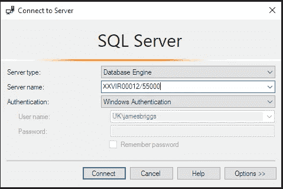
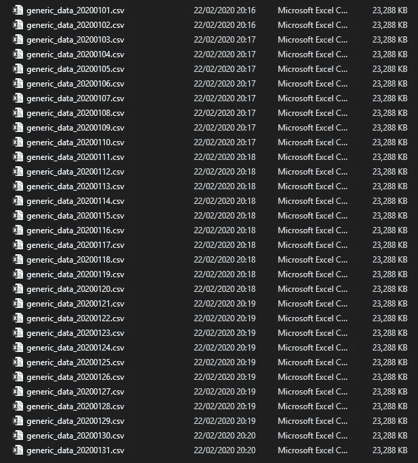

# 用 Python 为 MS SQL Server 增压

> 原文：<https://towardsdatascience.com/supercharging-ms-sql-server-with-python-e3335d11fa17?source=collection_archive---------3----------------------->

## 如何使用 Python 来自动化 SQL 的一切


由[马修·施瓦茨](https://unsplash.com/@cadop?utm_source=medium&utm_medium=referral)在 [Unsplash](https://unsplash.com?utm_source=medium&utm_medium=referral) 上拍摄的照片

在工作中，我大量使用 SQL**。它并不是没有令人讨厌的细微差别和限制，但归根结底，它是所有数据职业的基础。因此，对于任何在数据领域工作的人来说，这是绝对必要的。精通 SQL 非常重要。**

**虽然 SQL 很棒，但为什么要满足于棒呢？为什么我们不**给 SQL** 增压？**

**SQL 的局限性源于它是一种声明性语言，这意味着我们告诉 SQL 我们想要什么，然后 SQL 将从指定的数据库中获取这些信息。对于许多数据提取或简单的数据操作任务，这是所有需要的。**

**但是如果我们想要更多呢？**

**这正是我将在本文中向您展示的。**

****

**Axel Antas-Bergkvist 在 [Unsplash](https://unsplash.com?utm_source=medium&utm_medium=referral) 上拍摄的照片**

# **它始于一个基础**

**点击[此处](https://gist.github.com/jamescalam/1a13bee1d81439ca4b2511d7e9370f53)查看完整脚本**

**这段代码是增强 MS SQL server 的基础。一旦构建完成，我们就可以从 Python 连接到 SQL，只需:**

```
sql = Sql('database123')
```

**简单对吗？有几件事情正在进行，所以让我们剖析代码。**

```
class Sql:
```

**首先要注意的是，我们将它包含在一个类中。我发现这种方法是合理的，因为在这种格式中，我们可以为这个特定的数据库添加或删除进程。一旦看到这是如何工作的，这就更有意义了。**

**我们初始化我们的类:**

```
def __init__(self, database, server="XXVIR00012,55000"):
```

**我和我的同事几乎总是连接到同一个服务器。所以我将这个公共服务器名设置为`server`的默认参数。**

> **您的服务器名称可以在“连接到服务器”对话框中找到，也可以在 MS SQL Server Management Studio 的窗口顶部找到:**

****

**接下来，我们建立与 SQL 的连接:**

```
self.cnxn = pyodbc.connect("Driver={SQL Server Native Client 11.0};"
                           "Server="+self.server+";"
                           "Database="+self.database+";"
                           "Trusted_Connection=yes;")
```

**多亏了 [pyodbc](https://pypi.org/project/pyodbc/) 模块，这变得非常容易。我们简单地将一个连接字符串传递给`pyodbc.connect(...)`函数，更多细节可以在[这里](https://docs.microsoft.com/en-us/sql/connect/python/pyodbc/step-3-proof-of-concept-connecting-to-sql-using-pyodbc?view=sql-server-ver15)找到。**

**最后，我喜欢在`Sql`类中创建一个查询字符串，它随着传递给该类的每个查询而更新:**

```
self.query = "-- {}\n\n-- Made in Python".format(datetime.now()
                                              .strftime("%d/%m/%Y"))
```

**这允许我们记录我们的代码，同时也作为一个可读性更强的输出，提供给那些更愿意阅读 SQL 代码的同事。**

***注意，我将在下面的代码片段中排除对* `*self.query*` *部分代码的更新，如果需要，请查看提供的链接中的完整代码。***

****

**照片由[路易莎·阿泽维多](https://unsplash.com/@heyluisa?utm_source=medium&utm_medium=referral)在 [Unsplash](https://unsplash.com?utm_source=medium&utm_medium=referral) 上拍摄**

# **积木**

**有几个基本功能我觉得非常有用，几乎每天都在使用。这些都侧重于将数据传入或传出数据库。**

**让我们从以下目录开始:**

****

**对于我们当前的项目，我们需要:**

*   **将这些文件导入 SQL server**
*   **将它们合并到一个表中**
*   **基于列中的类别动态创建多个表**

**在进一步充实我们的 SQL 类之后，这将变得像下面这样简单:**

**让我们从头开始。**

## **推送数据帧**

**点击[这里](https://gist.github.com/jamescalam/74e18f935e223c4aa486dc517e689d84)查看完整的脚本，或者[这个](https://gist.github.com/jamescalam/9532e8813f8161e66f420b0f427e7c87)脚本可以维护数据类型(但是偶尔会在不太干净的数据集上抛出错误)**

**这个函数包含在我们的 SQL 类中。它允许我们轻松地将 Pandas 数据帧推送到 SQL 数据库。**

**这在需要上传大量文件时特别有用。然而，允许 Python 将数据导入 SQL 的真正力量来自于 Python 的灵活性。**

> **将十几个 Excel 工作簿中的特定选项卡导入 SQL 可能是一场噩梦。但是使用 Python 很容易。现在我们已经构建了一个函数，允许我们使用 Python 来读取这些选项卡，并为我们将它们导入 SQL。**

## **指南**

**点击[此处](https://gist.github.com/jamescalam/586f79e4d9aba64d6e30d70de72d3f90)查看完整脚本**

**该功能实际上用于`union` 和`drop` 功能。它只是让我们尽可能简单地执行 SQL 代码。**

**`response` 参数为我们提供了将查询输出提取到数据帧的选项。允许我们从`generic_jan` 表中的`colX` 中提取所有唯一值，只需使用:**

```
sets = list(sql.manual("SELECT colX AS 'category' FROM generic_jan GROUP BY colX", response=True)['category'])
```

## **联盟**

**现在我们已经构建了`manual` 函数，创建`union` 函数很容易:**

**点击[此处](https://gist.github.com/jamescalam/0ee0dfc9b907e6a59f5d3b2ab2d02d9e)查看完整脚本**

**这只是循环遍历我们通过`table_list`提供的表名列表，为所有给定的表名构建一个联合查询。然后用`self.manual(query)`执行。**

## **滴**

**我们能够将大量的表上传到 SQL Server。这很好，但会很快使我们的数据库人满为患。为了解决这个问题，我们将创建一个`drop` 函数:**

**点击[此处](https://gist.github.com/jamescalam/b316c1714c30986fff58c22b00395cc0)查看完整脚本**

**同样，由于有了`manual` 功能，这个功能非常简单。这允许我们通过向`tables` 提供一个字符串来删除单个表，或者通过向`tables`提供一个表名列表来删除多个表。**

****

**[阿德里安](https://unsplash.com/@aows?utm_source=medium&utm_medium=referral)在 [Unsplash](https://unsplash.com?utm_source=medium&utm_medium=referral) 上拍摄的照片**

**当将这些极其简单的函数结合起来时，我们可以利用 Python 的优势来大规模扩展 SQL Server 的功能。**

**如果你有兴趣了解更多，请查看`pysqlplus`的 [GitHub 回购](https://github.com/jamescalam/pysqlplus)。这是一个小项目，只是为了增强我自己的工作场所与 MS SQL Server 的交互而构建的。**

**尽管如此，我希望它可以帮助其他一些用户找到将 Python 集成到他们的 SQL 例程中的方法。我个人几乎每天都在使用它，它是如此简单却又无比强大。**

**感谢阅读！**

***如果你有兴趣学习更多关于 Python 和云中 SQL 的知识，可以看看我在 Coursera* [*上发表的关于 IBMs 可扩展数据科学基础课程的评论，点击这里*](https://www.coursera.org/learn/ds) *:***

**[](/a-summary-of-the-advanced-data-science-with-ibm-specialization-1-4-5caf48c011df) [## 对 IBM 可伸缩数据科学基础的回顾

### 我的想法是，在 IBM 的高级数据中，对可伸缩数据科学基础中的关键概念进行分解…

towardsdatascience.com](/a-summary-of-the-advanced-data-science-with-ibm-specialization-1-4-5caf48c011df)**