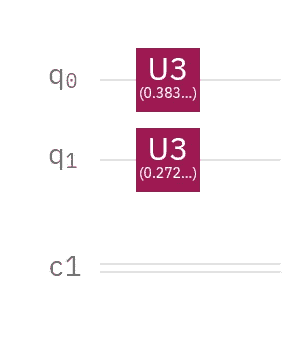
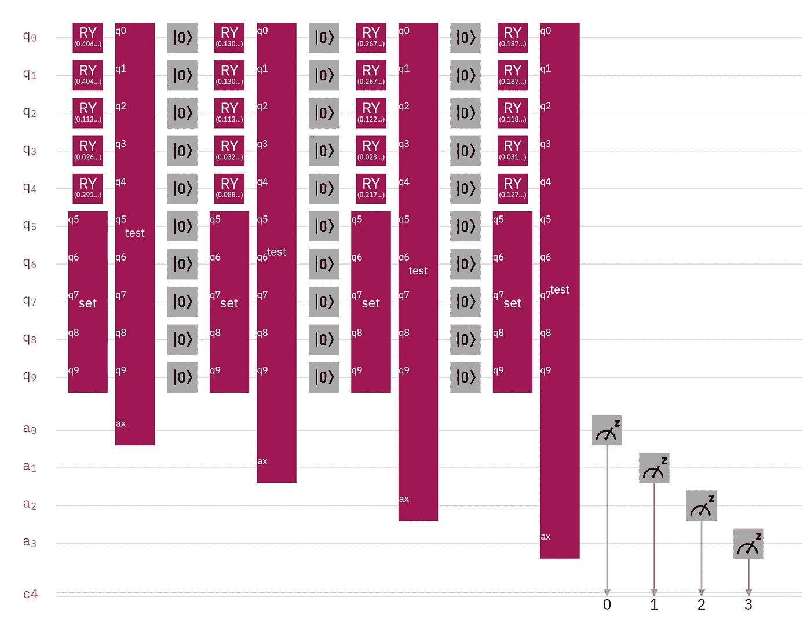
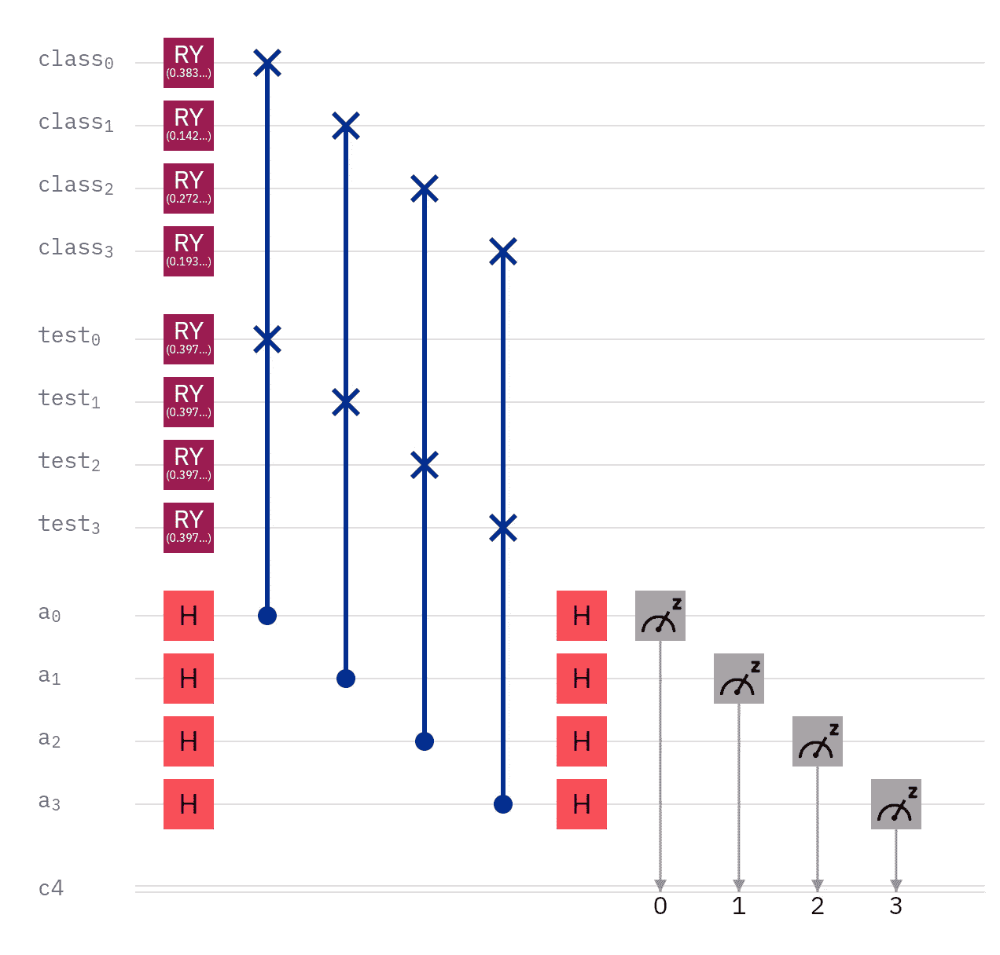
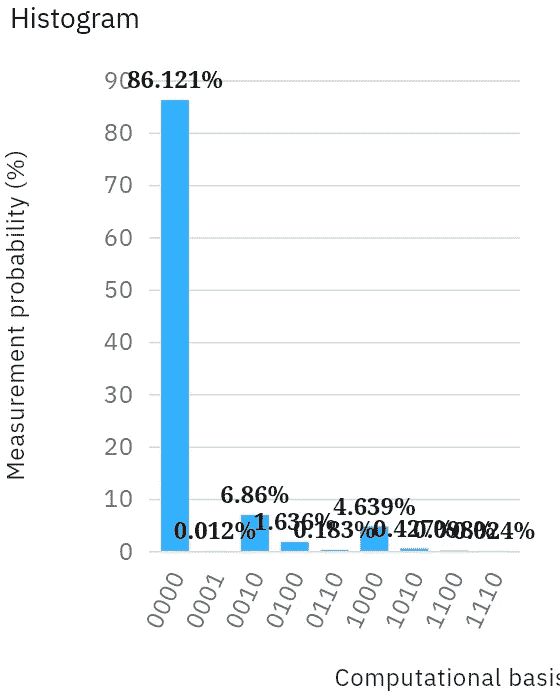

# 经典数据的超密集编码

> 原文：<https://towardsdatascience.com/superdense-encoding-of-classical-data-5a2ef02d09d8?source=collection_archive---------47----------------------->

## 使用具有双振幅编码的维数减少

我之前的一篇文章题为“ [130，780 点量子分类](https://link.medium.com/EThfMrMFv9)”，其中的电路使用 20 个量子位来映射所有数据，这导致了一个 Twitter 帖子，激励我思考我可以减少多少量子位计数。老实说，这条赛道并没有引起太多的注意；我专注于用一个相当大的真实数据集获得准确的分类结果。然而，公平地说，第一种有效的编码不一定是最佳编码策略。

## 介绍

量子计算的众多挑战之一是将经典数据映射到量子位，也就是“量子位”。在我的上一篇文章中，数据集有五个特性(也就是数据列)和四个类。最简单的方法是将每一类的每个特征映射到一个量子位，结果是 5×4 = 20 个量子位。我已经考虑过在每个量子位上映射两个特征的可能性，但是，我还是保持简单来验证算法是否真的有效。

顺便说一下，请记住，每个量子位代表数千行经典数据。每个向量代表一个类别中一列的标准化平均值。

## 原始电路

虽然你看不到下面的 20 个数据量子位，但你看到 5 个数据量子位(最上面的 5 个量子位)被重置，每个重复使用 3 次。这是因为当你在电路中添加量子位时，模拟器的速度会明显变慢，直到两个小时后的某个时候达到运行时错误(至少对于 IBM Q 体验来说)。然而，重置和重复使用更少的量子位，可以完成更多的计算。

与我已经发表的所有其他电路相比，这个电路的一个独特反馈是，OpenQASM 子例程的使用将电路压缩得如此之多，以至于它似乎实际上没有做太多事情，尤其是没有做任何“量子”的事情。此外，虽然“设置”盒仅仅是重置和重用量子位，但“测试”盒隐藏了非常量子交换测试。因此，即使子例程使编码变得更简单和容易，我将放弃它们，以便未来的电路公开显示它们的组件门。

对于那些没有读过我上一篇文章的人来说，所有进行交换测试的电路都必须在模拟器上运行的原因是因为 Fredkin gates 转换成了大量的门。真实量子位的有限连通性加剧了电路深度的问题，这导致 CNOTs 在已经很重要的步数上增加了更多的电路深度。当测量开始时，退相干已经使结果变得毫无价值。

## 降维

数据集的每一列都是数据的一个维度，所以我们从五个维度开始。然而，一个量子位不是五维的，所以我们需要某种降维策略来将这个数据集映射到少于 20 个量子位。使用旋转和[量子态层析成像](https://link.medium.com/Fz8wDKFGy9)，我们可以将数据映射到 10 个量子位，这是一个显著的减少。然而，如果我们使用经典的预处理，我们甚至可以做得更好。

这个算法很松散地受到了[主成分分析(PCA)](https://youtu.be/FgakZw6K1QQ) 的启发。你可能看不到任何相似之处，但思考如何将数据集缩减为二维帮助我进一步将五维数据缩减为一维。

## 双振幅编码

如果你看了视频，“[量子机器学习- 24 -编码经典信息](https://youtu.be/LHzWAyT5rMI)，”魏特克博士描述了我的编码策略的一个变种。然而，我实际上并没有对振幅进行编码，因为我并没有测量编码的量子位。此外，振幅在布洛赫球的顶部和底部附近不太敏感，而在中部附近更敏感，这似乎会扭曲交换测试的结果。

相反，我用圆周率的分数。我希望每次旋转的量是一致的，不管我们在布洛赫球的哪个位置。

## 算法

我不可否认不是数学家，所以这个算法的降维部分可能有捷径。正如之前我的上一篇文章中所展示的，除了别的以外，我专注于让我的算法工作。如果它们有效，我会发布我所拥有的，然后在后续项目中进行优化。

1.  对于每个类，使用公式((平均值-最小值)/(最大值-最小值))对每个要素(列)的平均值进行归一化，其中最大值和最小值是全局最大值和最小值
2.  对于每个类别，将上述标准化平均值相加
3.  使用步骤 1 中的公式归一化步骤 2 中的总和；全局最大值和全局最小值再次来自整个数据集，因此我们可能映射的所有测试值将保持在 0 到 1 的范围内
4.  将每个归一化总和乘以 pi

该算法的最终结果是每个类由一个值表示，范围从圆周率值的 0%到 100%。

## 问题

对于四个类，我们可以使用 U3 门来映射每个量子位的两个类。这是本文顶部显示的电路。每个量子位围绕 y 轴有一个 0 到π的旋转，围绕 z 轴有一个 0 到π的旋转。

问题是这些数据被压缩得太多了，没有用。或者说，至少，我还没想好怎么用。在 Twitter 上，我把它比作使用 ZIP 文件，你必须用它提取内容，然后才能使用。

然而，通过量子态断层扫描提取内容并不成功，否则我会在这里展示这个电路。此外，如果没有其他原因，量子 ZIP 文件对增加的电路深度没有意义。从最少数量的有用量子位开始是有意义的。

## 最佳选择

对于给定数据集中的四类数据，所需数据量子位的最小数量似乎是四，或者每个数据量子位一类。我们可以用 RY 门代替 U3 门。

前一篇文章的电路的目标是量子分类，所以这里是该算法的修订版。前四个量子位代表四类数据，中间四个量子位代表我们想要分类的新数据点，底部四个量子位是用于[交换测试](https://link.medium.com/SGohDH3Ky9)的 ancilla 量子位。

测试数据量子位可能看起来是多余的，但这种冗余是必要的，因为我们正在运行四个不同的交换测试。在这种情况下，我们可以在一个模拟量子位上使用重置门，但我宁愿明确指出，每个类别比较都需要它自己的类别数据量子位、测试数据量子位和辅助量子位。

## 结果

当量子状态相同时，交换测试以 1 的概率测量|0 >,当量子状态最大程度地相反时(在 Bloch 球的相对侧),以 0.5 的概率测量|0>。例如，测量值为 0.9 表示各州之间距离相对较近。因此，测量|0 >的概率最高的类是最接近测试数据点的类。

如果您进行传统的后处理，测量|0 >的最高概率是类 0，这很好，因为这是我获取测试数据点的地方。为了完全公开，数据，甚至类，有很多重叠，所以很容易得到不正确的结果。但是，因为是数据有重叠，所以使用 scikit-learn 或其他方法，我们应该会看到同样不正确的结果。

## 结论

本文顶部的电路显示了仅映射到两个量子位的 130，780 个数据点。虽然我目前还没有一种算法可以处理这种程度的压缩，但这并不是不可能的。

使用稍微少一点的压缩，并将相同的数据映射到仅四个量子位，我们仍然可以运行诸如量子分类之类的算法。这与我之前实现的 20 量子位相比是一个巨大的减少。

## 未来的工作

我仍在考虑使用最大限度压缩数据的方法，并希望在未来的文章中分享对此的感悟。我也期待有一天在真正的硬件上运行这个算法。尽管我现在可以在 ibmq_16_melbourne 上运行它，但没有办法优化电路的量子位连接，结果将是一个退相干(如果这是一个真实的词)的混乱。

## 承认

感谢 IBM 一如既往的为量子位，无论是真实的还是模拟的。本文所有图片均来自 IBM Q Experience。也感谢[量子直觉](https://www.youtube.com/channel/UC-2knDbf4kzT3uzWo7iTJyw) ( [@explore_quantum](https://twitter.com/explore_quantum?s=09) )和[量子史蒂夫](https://www.youtube.com/channel/UClJb9qILKt0lhmrbLW7-eVw)([@史蒂夫 _quantum](https://twitter.com/steve_quantum?s=09) )没有对将 130780 个数据点映射到 20 个量子位留下深刻印象。