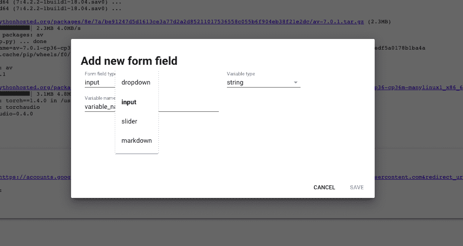
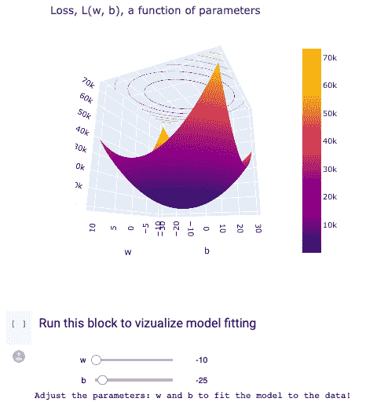
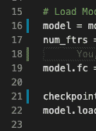

# 使用 Google Colab 为您的 Jupyter 笔记本提供超强动力

> 原文：<https://towardsdatascience.com/superpower-your-google-colab-720d54dd6a06?source=collection_archive---------18----------------------->

## 您的 Jupyter 笔记本体验即将升级

Google Colab 是一个免费的基于浏览器的笔记本环境，完全运行在云中。它有一个类似于谷歌文档的界面，它是一个游戏改变者。

**首先，如果你以前没有用过 Colab，那你就错过了。以下是几个原因:**

1.  **无服务器:** Colab 允许你在浏览器中立即弹出一个完全无服务器的 Jupyter 笔记本。这意味着您不必担心配置硬件、您的 Python 版本和路径，或者您是在 Windows、MacOS 甚至是手机上！
2.  **分享:**你可以无缝分享笔记本，就像一个谷歌文档。
3.  **免费 GPU:** 一键免费 GPU。对我来说太棒了，因为我有一台 MacBookAir，所以肯定没有 GPU。

## 对于超级大国来说:

*   **版本控制**:你的笔记本上是否堆满了大量注释掉的代码？这也扰乱了你的思维。使用 Colab，您可以随意删除任何代码，因为每次保存时，Colab 都会为您保留一个版本，您可以恢复到该版本。cmd/ctrl+G 打开您的修订历史，您可以命名您过去的修订。这样你就可以随时删除旧代码，保持笔记本整洁。
*   **键盘快捷键**:键盘快捷键很多。只需在工具栏的*工具*选项下进行检查。更好的是，它们都是完全可配置的。我经常使用快捷键来添加新的单元格。
*   **把“ *#@title 这是一个块”*放在一个代码单元格的顶部:**你的单元格刚有了标题就变得可压缩了。这是清理笔记本的好方法。
*   **将“*###节标题*”放入一个文本单元格:**它将使所有内容直到下一个带有“# # #”的文本框都折叠起来，因此您可以折叠整个节。
*   **表单:**您可以添加滑块、下拉框和其他表单元素，无需任何代码，只需点击悬停在代码单元格右上角的三个点，然后点击“添加表单”。这使得其他想要与您的笔记本进行交互的人无需编辑代码就可以这样做。

使用表单滑块允许用户调整模型参数。

*   [**seed bank**](https://research.google.com/seedbank/)**:**谷歌在 colabs 中托管了一个完整的深度学习和数据科学概念证明库，你只需点击一个按钮就可以打开并运行它。 [GAN 合成器](https://research.google.com/seedbank/seed/gansynthtwo)有人吗？
*   **使用 GPU:** 进入运行时- >更改运行时类型，选择 GPU。瞧啊。你现在有一个图形处理器。对于深度学习和一些可并行化的数据科学算法是必不可少的(XGBoost 有人吗？？)同时，您可以添加更多内存。单击更改运行时类型后，可以选择切换到更多 RAM。
*   Colab Pro: Colab 确实有超时和使用限制(它们相当大，比如一天十个小时)。但是，如果你发现自己遇到了这些问题，你可以每月支付 10 美元购买 Colab Pro，它可以延长运行时间，并更好地访问更强大的 GPU。这是我刚刚为我的深度学习项目买的，太棒了！
*   **评论功能:**你知道如何在谷歌文档上发表评论吗？现在你也可以在 Colab 上这样做了！这很好，因为笔记本实际上一半是编码环境，一半是报告。轻松地与他人分享您的发现，他们可以直接在您的笔记本上发表评论！
*   **自动完成:**难以记住所有那些 Matplotlib 或 NumPy 函数和函数参数？好吧，Colab 可以自动完成，所以你只需要开始输入；当你输入的时候，它会显示出剩下的函数名，参数和任何文档。

## 有几件事我希望他们会补充…

1.  **自动格式化**:如果你能按下“ctrl + f”键，你的代码就会自动格式化，那不是很好吗？
2.  类似 vscode 的 Git 指示:看看自上次提交以来您修改和添加了哪些行不是很好吗？像这样:

1.  Linter :当我在做一些 Linter 知道会出错或者只是糟糕/无用代码的事情时，我很想得到那些红色的曲线。

## Colab 的缺点是什么？

*   我最近在一个深度学习项目上工作了 40+小时；随着代码库变得越来越大(深度学习比数据科学更容易发生这种情况)，用笔记本管理变得越来越困难。
*   如果你使用太多的 RAM 或 GPU，你的会话就会崩溃，你将不得不重新运行所有的代码。它也会在休眠一段时间后超时。
*   如果你想访问谷歌硬盘上的文件，每次安装硬盘时都必须这样做。它会变得很烦人。

考虑到这一切，如果你以前从未使用过，Colab 绝对是一个更高的水平；如果你有，这些功能会给你超能力！