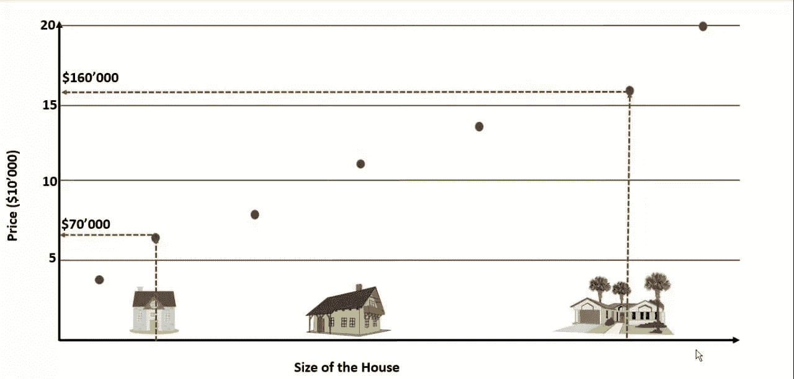
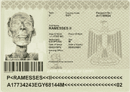
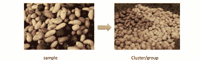

# 每个人的监督和非监督学习

> 原文：<https://towardsdatascience.com/supervised-and-unsupervised-learning-for-everyone-526f9b746dd5?source=collection_archive---------38----------------------->

## 不管你是技术天才还是街舞者，任何人都可以理解机器学习

来源:https://www.pexels.com/@freestockpro

不管你是技术天才还是街舞者，听说了机器学习并出于好奇或原始的激情决定去寻找它。以错误的方式被引入这些概念，感觉就像从直升机上被丢进了大海。我是以不太友好的方式被引入这些概念的，相信我，这一点也不好玩，这就是为什么我花时间以一种**简单、初学者友好和吸引人的方式写这篇文章。**

在这篇文章中，在保持事情简单的同时，我将稍微深入一点，明确解释**监督和非监督机器学习**的确切含义，这样即使是初学者或非技术人员也可以消化信息，而不会因其复杂性而便秘。

说完这些，让我们来看看是什么把我们带到这里的。

[**机器学习**](https://beltus.github.io/vision/blog/what-is-machine-learning/) 大致分为 2 大类:**有监督和无监督**机器学习。

# 什么是监督学习？

插图:DAVIDE BONAZZI/@SALZMANART

有监督的机器学习包括使用明确标记的数据训练计算机系统。标记数据在这里是指输入已经用相应的期望输出标签进行了标记。机器学习算法(模型)通过迭代过程从这些标记的数据中学习，然后使其能够执行未来预测。例如，这里有一个类比可以帮助你理解这个概念。

> 可以把监督学习算法想象成这样的学生，他们被给予大量的实践问题(数据),并被指示通过找到这些问题中的信息和它们的相关答案(输出)之间的模式来找到解决这些问题的方法。

在上面的场景中，目标变成了能够找到最有效的数据(练习题)以提供给最有效的算法(学习风格)，从而获得最佳的表现(答案)

监督学习问题被进一步分成两个子类— **分类和回归**。这两个子类之间的唯一区别是算法旨在预测的输出或目标的类型，这将在下面解释。

# 1.分类问题

来源:[https://www . wkrg . com/northwestern-Florida/new-penalty-for-animal-breakers-take-effect-Monday-in-Florida/](https://www.wkrg.com/northwest-florida/new-penalties-for-animal-abusers-take-effect-monday-in-florida/)

在分类中，目标是识别一个对象(输入)属于哪个类别。例如，我们可能有兴趣确定图像是否包含**狗或猫**，颜色**红色或黑色**，电子邮件**垃圾邮件或真实邮件**，患者是否携带**艾滋病毒**。在上面的例子中，分类目标只取 2 个类的分类问题被称为**二元分类问题**。另一方面，如果目标输出取 2 个以上的值，这是一个**多类分类**问题。比如说；分类花的类型，分类汽车的类型等

# 2.回归问题

截图来源:[https://www . slide share . net/gabrielspmoreira/introduction-to-data-science-123459159](https://www.slideshare.net/gabrielspmoreira/introduction-to-data-science-123459159)

回归问题是当要预测的输出变量是数值时。这与上面看到的分类相反。让我们举个例子，你可能会对确定伊斯坦布尔的房价、生活在昆布的男人的体重、喀麦隆教师的薪水(T21)等感兴趣。**价格**、**权重、**和**薪水**是上图所示的数值，纵轴表示房价。

***趣味问答*** 这只是为了刺激和巩固回归和分类的区别。如果你准备好了，那我们走吧。

***以下哪项是分类问题？***

> 1.通过一个人的笔迹来预测他/她的性别。根据面积预测房价
> 3。预测明年季风是否正常
> 4。预测下个月一张音乐专辑的销量

在这篇文章的最后，我将提供答案，所以保持冷静，让我们继续前进。

# 用于分类和回归的监督机器学习算法。

下面概述的处理回归和分类任务的不同算法类似于不同的学习风格，每个学生都使用不同的学习风格在上面分类下的类比中得出答案。这些算法中的哪一个在特定的分类和回归问题中表现得最好，由数据科学家来决定。

信守我让事情变得简单的承诺。以下是根据问题的具体特征来解决监督机器学习问题的最常用算法列表。

> 支持向量机
> 线性回归
> 逻辑回归
> 朴素贝叶斯
> 线性判别分析
> 决策树
> 随机森林
> K-最近邻算法
> 神经网络(多层感知器)
> 相似性学习

有关不同算法的更多信息，请查看 scikit-learn 网站 以及本文末尾的参考链接。

分类问题的一些有趣应用是在**垃圾邮件检测、图像识别、语音识别。**你还可以查看一下机器学习的一些现实生活中的应用概述[**这里**](https://beltus.github.io/vision/blog/what-is-machine-learning/)

在我们继续之前，让我们冷静一下这个令人震惊的事实..

> 法老拉美西斯二世是唯一一位获得护照并登上飞往法国的飞机的埃及法老。

来源:[https://www . ancient-origins . net/history-named-people/mummy-passport-0010944](https://www.ancient-origins.net/history-famous-people/mummy-passport-0010944)

# 什么是无监督机器学习？

来源:[https://www.pexels.com/@alittleimagery](https://www.pexels.com/@alittleimagery)

与有监督的机器学习相反，在无监督的机器学习中，模型被输入没有**人类预定义标签的数据。**在数据中寻找隐藏的结构、模式或关系，这取决于算法。

让我与你分享这个类比。

> 想象一下，你对游泳一无所知，不幸的是，你的朋友带你去参加泳池派对，故意把你推进去。你需要弄清楚如何游泳，并让自己离开那个冰冷的游泳池。

以此类推，**你**就是**模型(算法)**，**池**就是**数据**。没有游泳教练教你游泳，因此得名**无人监管。**

就像监督学习一样，非监督学习可以分为两种类型:聚类和关联技术。

# 1.聚类分析技术

来源:[https://www.guru99.com](https://www.guru99.com/supervised-vs-unsupervised-learning.html)/

在聚类分析中，该算法使用未标记的数据，其目的是根据某些**相似性或不相似性标准**将数据分成称为**簇**的组。相似的数据点被分组在同一个聚类下，如上图所示。

聚类可以分为**排他聚类、重叠聚类、层次聚类、概率聚类**在本文中我不会深入讨论这些，但是可以在文章末尾的链接中找到更多信息。

以下是机器学习中最常用的一些聚类算法。

***层次聚类
* K-means 聚类
* K-NN (k 近邻)
*主成分分析
*奇异值分解
*独立成分分析**

对于好奇的读者来说，请参考文章末尾的链接以获得关于这些技术的更多信息。

# 2.关联规则技术

来源:[https://medium . com/@ agupta . rkl/market-basket-analysis-using-association-rule-mining-66 b 61 c 0 D5 f 26](https://medium.com/@agupta.rkl/market-basket-analysis-using-association-rule-mining-66b61c0d5f26)

在关联问题中，模型学习数据之间的关系，然后得出某些规则。这种无监督学习技术是关于在大型数据库中发现变量之间的 ***有趣关系*** 。例如，买新房子的人很可能会买新家具，买牙刷的人很可能会买牙膏，等等。

已经提出了许多产生关联规则的算法。一些众所周知的算法是:

> *** Apriori 算法
> * Eclat 算法和
> *频繁模式增长**

下面包含解释个别技术的链接。

# 无监督学习技术的应用。

无监督学习在 e ***探索性分析*** 中非常有用，因为它可以自动识别数据中的结构。例如，通过基因表达测量对癌症患者分组，根据浏览和购买历史对购物者分组，通过电影观众给出的评级对电影分组。

这篇关于机器学习的 [***文章***](https://beltus.github.io/vision/blog/what-is-machine-learning/) 提供了机器学习的一些有趣的日常现实应用。

> 测验的答案:预测一个人的性别，预测明年季风是否正常都是分类任务。另外两个是回归。

我知道你答对了！！

希望你喜欢读这篇文章，就像我喜欢写它一样。非常感谢您的建议和意见。

# 参考文献。

 [## 用通俗易懂的语言解释机器学习

### 在最近的演讲活动中，我遇到了试图从概念上解释机器学习而不…

towardsdatascience.com](/explaining-machine-learning-in-laymans-terms-9b92284bdad4) 

[https://www.guru99.com/unsupervised-machine-learning.html#7](https://www.guru99.com/unsupervised-machine-learning.html#7)

[https://www.wikiwand.com/en/Unsupervised_learning](https://www.wikiwand.com/en/Unsupervised_learning)

[https://medium . com/@ mandysdana/machine-learning-types-of-class ification-9497 BD 4 F2 e 14](https://medium.com/@Mandysidana/machine-learning-types-of-classification-9497bd4f2e14)
[https://medium . com/datadriveninvestor/class ification-algorithms-in-machine-learning-85 c0ab 65 ff 4](https://medium.com/datadriveninvestor/classification-algorithms-in-machine-learning-85c0ab65ff4)
[https://towardsdatascience . com/unsupervised-learning-and-data-clustering-eeecb 78 b 42 a](/unsupervised-learning-and-data-clustering-eeecb78b422a)

[https://medium . com/@ mandysdana/machine-learning-types-of-class ification-9497 BD 4 F2 e 14](https://medium.com/@Mandysidana/machine-learning-types-of-classification-9497bd4f2e14)
[https://medium . com/datadriveninvestor/class ification-algorithms-in-machine-learning-85 c 0 ab 65 ff 4](https://medium.com/datadriveninvestor/classification-algorithms-in-machine-learning-85c0ab65ff4)
[https://towards data science . com/unsupervised-learning-and-data-clustering-eeecb 78 b 42 a](/unsupervised-learning-and-data-clustering-eeecb78b422a)
[https://www.wikiwand.com/en/Unsupervised_learning](https://www.wikiwand.com/en/Unsupervised_learning)