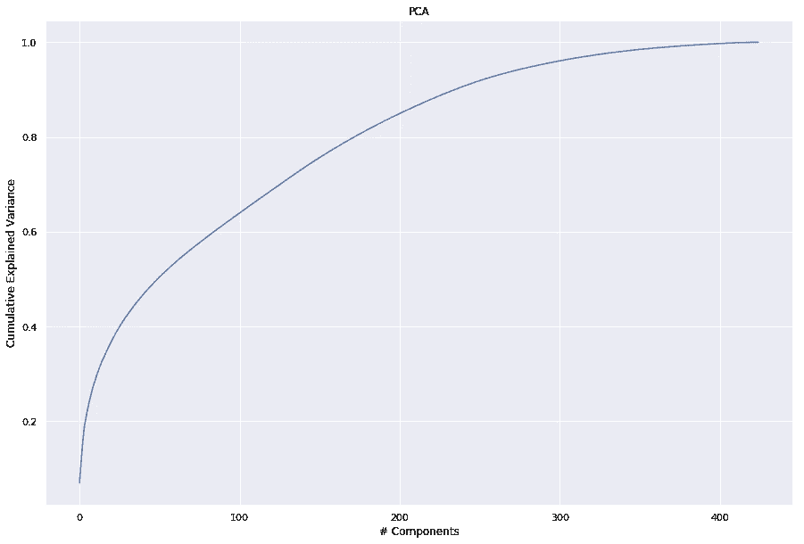

# 监督和非监督学习识别客户

> 原文：<https://towardsdatascience.com/supervised-and-unsupervised-learning-to-identify-customers-568cfa0badea?source=collection_archive---------47----------------------->

## 解决同一问题的两种不同方法。


[雷锐](https://unsplash.com/@ray30?utm_source=unsplash&utm_medium=referral&utm_content=creditCopyText)在 [Unsplash](https://unsplash.com/s/photos/machine-learning?utm_source=unsplash&utm_medium=referral&utm_content=creditCopyText) 上拍照

欢迎来到我在 [Udacity 的](https://www.udacity.com/)数据科学家纳米学位的最后一个项目。我正在经历职业转变，从学术界(我有天体物理学博士学位)转向工业界，这个纳米学位是我朝着那个方向迈出的一步。

我选择这个项目是因为涉及到两种不同类型的机器学习算法应用于相同的数据。还因为这是各种行业都很常见的问题。这个项目的数据和大纲是由贝塔斯曼子公司 Arvato Financial Solutions 提供的。所有的工作都在这个[环节](https://github.com/cnegrelli/Arvato_identify_customers)中完成。

# 目标

我们希望利用无监督和有监督的机器学习技术和人口统计数据，为德国的一家邮购销售公司识别新客户。

# 数据

该数据包括 4 个数据集:

*   客户:德国一家邮购销售公司的客户的人口统计数据，包括 3 列，提供关于客户的广泛信息(191 652 x 369)。
*   AZDIAS:德国一般人口的人口统计信息(891 211 x 366)。
*   MAILOUT-TRAIN:公司营销活动目标的人口统计信息-TRAIN 集，包括一个回应列，该列指明每个接收人是否成为公司的客户(42 982 x 367)。
*   MAILOUT-TEST:公司营销活动目标的人口统计信息—测试集(42 833x 366)。

人口统计列没有直观的名称，这给分析带来了困难，但是我们可以从 Arvato 提供的元数据中获得每个列的含义。

# 数据争论

我不得不在数据上争论不休:

1.  删除客户数据中多余的列。

我们没有使用这些数据。

2.识别缺失的值。

数据包含许多缺失值，但其中一些是编码的。我必须非常仔细地查看元数据才能发现:

*   所有值=-1 表示未知。
*   对于 16 列，值=0 表示未知。
*   对于 74 列，value=9 表示未知。
*   对于对象列，value=X 或 XX 表示未知。

我必须将所有这些值转换成 NaNs。

3.删除缺少大量值的列。

在下图中，我显示了缺少更多值的列:


有 6 列缺少 50%以上的值。我们删除这些列。

4.删除有大量缺失值的行。

在下图中，我根据缺失数据的百分比显示了行的计数:


大多数行的缺失数据不到 10%，我们只保留那些行。

5.将对象列转换为数字列。

我们有六个非数字列:

*   两个实际上是数字，所以我把它们转换了。
*   一个是约会。我将该列转换为 datetime 类型，然后只保存年份。
*   一个只有两个值。我把它们映射到 0 和 1。
*   剩下的两列是分类的，没有序号，所以我必须通过 Panda 的 get_dummies()方法执行热编码。

6.填充 NaNs。

因为大多数数据是分类的，所以我选择用 mode by 列来填充缺失的值。为了做到这些，我实现了一个估算器()。

7.删除高度相关的列。

按照这里的步骤，我删除了 AZDIAS 和 CUSTOMERS 数据帧中相关性大于 0.95 的列。

8.删除 id 列。

对于模型来说，名为 LNR 的 id 列并不是一个有趣的特性。

步骤 2-8 是在一个名为 clean_data()的函数中实现的。

9.缩放数据。

我们需要缩放数据，以获得机器学习模型的准确性能。我使用了 StandardScaler()，它通过移除平均值并缩放到单位方差来标准化特征。

# **使用无监督学习识别普通人群中的客户群。**

在项目的这一部分，我们执行无监督聚类来识别客户群。

1.  主成分分析。

争论之后，我们以 425 列结束。由于这个数字非常大，我们对 AZDIAS 数据集进行了主成分分析，目的是降低维数。



我决定保留 170 个组件，它们占累计解释方差的 80%左右。

2.使聚集

我做了一个 K 均值聚类。首先，我只取了一个数据样本，用不同数量的聚类来拟合算法。我在下面的图中显示了结果:


按照肘方法，我选择保留 16 个集群(我也可以选择 7 个集群，但我决定用 16 个)。

然后，我用 AZDIAS 数据集拟合 K-means 算法，并预测每一行的聚类数。

3.客户数据

我将具有 170 个特征的拟合 PCA 和具有 16 个聚类的拟合 K-means 应用于客户数据，以获得每行的预测聚类数。

为了识别客户群，我们必须比较这些聚类:


很明显，客户子群体主要由集群 10、12 和 2 表示。这三个集群的人是公司的目标。哪些主成分(PC)与这些集群相关联？哪些是代表性最不足的(13、5、6、8)？

我们可以看看这 7 个被标识为代表过多(蓝色)和代表不足(绿色)的集群的第一主成分的值。


很难对情况进行详尽的分析，但有一个明确的结论:

对于 PC # 0，所有代表不足的聚类具有小于 1 的值，而代表过多的聚类具有更大的值。PC # 1 的情况几乎相反。

分析 PC # 0，我们看到与列最相关的是:MOBI_REGIO、PLZ8_ANTG1、KBA13_ANTG1、KBA05_ANTG1、LP_STATUS_FEIN、KBA13_BAUMAX、HH_EINKOMMEN_SCORE、KBA13_ANTG4、KBA13_ANTG3、PLZ8_ANTG3。

作为一个例子，让我们看看 MOBI _ 区域列的哪种值与 PC#0>1(客户)相关，哪些值与 PC#0 相关<1 (non-clients):


In general, we can associate positive values with clients and negative values with no clients. Since all these features are scaled to mean=0 the this means values above and under the mean. The MOBI_REGIO column is related to mobility, high values indicate low mobility. So, people with low mobility are our target.

After repeating this proceeding for the other 9 columns I found out that:

**结论—** 我们正在寻找高收入、高社会地位、流动性低且附近有 1-2 户人家的人。

# **使用监督学习预测客户响应概率**

在项目的这一部分，我们训练一个分类器来预测测试数据集中的人对活动做出响应的可能性。

1.  使用 wrangling 步骤中描述的 clean_data()函数清理训练数据。
2.  将特征与目标分开。目标是二进制标签 0 或 1。从下一张图中可以看出，数据是不平衡的:


3.使用标准缩放器()缩放特征

4.训练不同的简单模型，看看它们的表现。

我训练了 5 个模型并计算了 roc_auc。由于数据的不平衡，我使用了这个指标(也因为它是 Kaggle 比赛中用来测试我的结果的指标)。

由于结果的度量，我选择保持梯度推进算法。

5.寻找最佳参数

我使用 GridSearchCV 扫描了以下参数空间。

```
param_grid = {'max_depth': [3,4,5],
             'loss':['deviance', 'exponential'],
             'n_estimators': [100, 150, 200]}
```

我发现最好的参数是 max_depth=4，loss=deviance(默认)，n_estimators=100(默认)，ROC_AUC=0.779。

6.预测测试数据的标签。

首先，我必须清理测试数据。我使用了带有不删除行选项的 clean_data 函数，还保存了 id 列，因为我在第 7 步中需要它。

我用拟合最佳模型的 predict_proba 方法预测了标签的概率(因为我们使用的是 roc_auc，所以我们对精确值不感兴趣)。

7.将结果上传到 [Kaggle 比赛](https://www.kaggle.com/c/udacity-arvato-identify-customers/leaderboard#score)

我取得了 0.77698 的成绩，提交时的第 91 名。

# 结论

我喜欢这个项目，因为它有很多值得探索的东西。数据争论的步骤真的很长，而且列没有直观的名称这一事实使得一切变得更加困难。幸运的是，大多数特征都是数字，这简化了事情。

无监督模型很容易实现，但需要大量的工作来理解结果。得出一个详尽的结论是困难的，但我对我得出的结论感到高兴:我们正在寻找高收入、高社会地位、流动性低且附近有 1-2 个家庭的房子的人。

监督模型更难，我必须测试不同的模型，寻找最佳参数。上传我的成绩到 Kaggle 后，我得到了 0.77698 分。我对结果很满意，但我知道还有改进的空间。

我能做些什么来改进模型？
-设计一些功能:例如，我可以将年份变量转换为桶
-用平均值或其他技术填充 NaNs
-测试更多的分类器或更大的参数空间

你有其他想法吗？