# 监督学习算法:解释和简单代码

> 原文：<https://towardsdatascience.com/supervised-learning-algorithms-explanaition-and-simple-code-4fbd1276f8aa?source=collection_archive---------16----------------------->

监督学习算法采用一组已知的输入数据(学习集)和对数据的已知响应(输出)，并形成一个模型来生成对新输入数据的响应的合理预测。如果您有正在尝试预测的输出的现有数据，请使用监督学习。

它们可以用于分类或回归。在这篇文章中，我将展示每一个的一些例子。

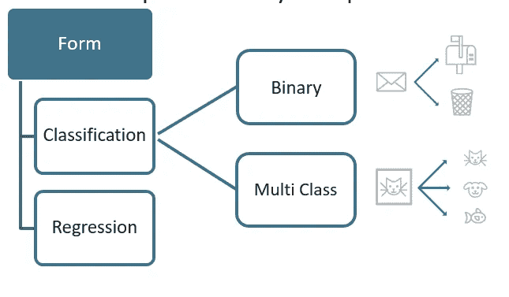

# **分类算法**

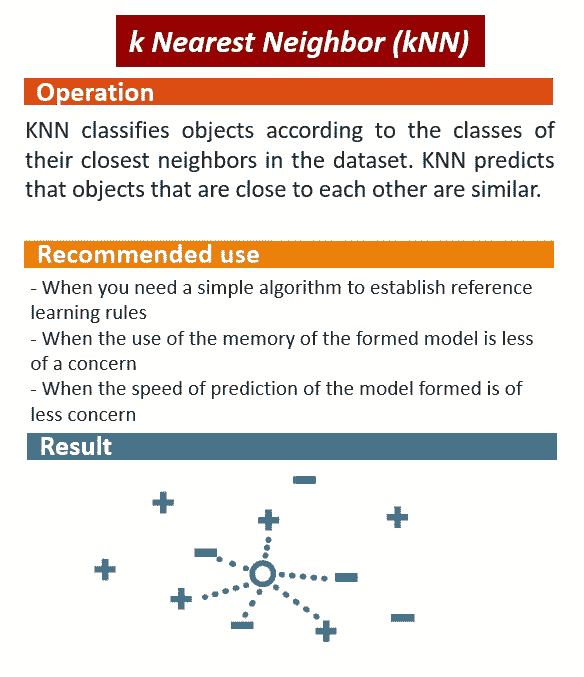

k 最近邻分类器

```
***1) Import the Classifier* ****from** sklearn.neighbors **import** KNeighborsClassifier***2) Create arrays for the features and the response variable* **    
y = df['target'].values      
X = df.drop('target', axis=1).values ***3) Create a k-NN classifier with 6 neighbors* **  
knn = KNeighborsClassifier(n_neighbors =   6) ***4) Fit the classifier to the data* **    
knn.fit(X,y) ***5) make predictions***
new_prediction = knn.predict(X_new)
```

## **选择正确的集群数量**

```
***1) Setup arrays to store train and test accuracies*** neighbors = np.arange(1, 9)
train_accuracy = np.empty(len(neighbors))
test_accuracy = np.empty(len(neighbors))***2) Loop over different values of k***
for i, k in enumerate(neighbors): ***3) Setup a k-NN Classifier with k neighbors***
   knn = KNeighborsClassifier(n_neighbors=k) ***4) Fit the classifier to the training data***
   knn.fit(X_train, y_train) ***5) Compute accuracy on the training set***
   train_accuracy[i] = knn.score(X_train, y_train) ***6) Compute accuracy on the testing set***
   test_accuracy[i] = knn.score(X_test, y_test)***7) Generate plot***
plt.title('k-NN: Varying Number of Neighbors')
plt.plot(neighbors, test_accuracy, label = 'Testing Accuracy')
plt.plot(neighbors, train_accuracy, label = 'Training Accuracy')
plt.legend()
plt.xlabel('Number of Neighbors')
plt.ylabel('Accuracy')
```

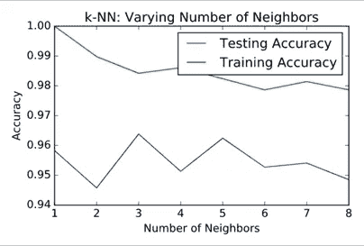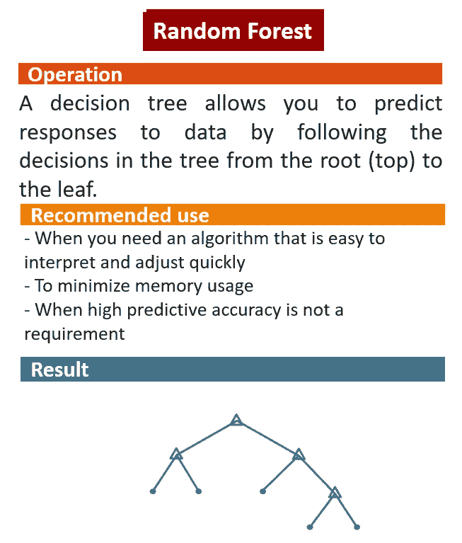

随机森林分类器

```
***1) Import the Classifier* from** sklearn.ensemble **import** RandomForestClassifier***2) input data as np array*** y = df[‘target'].values
X = df.drop(‘target', axis=1).values***3) import model and fit(train) data*** rfc = RandomForestClassifier(n_estimators=100)
rfc.fit(X, y)**4) make predictions** pred_rfc = rfc.predict(X_test)
```

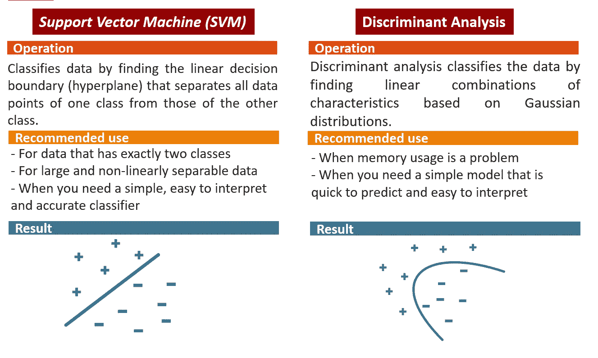

支持向量机(SVM)和判别分析

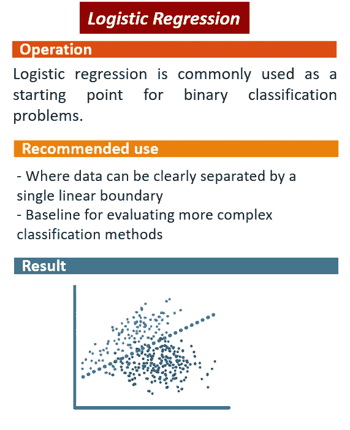

```
***1) Import the necessary modules* **     
**from** sklearn.linear_model **import** LogisticRegression       
**from** sklearn.metrics **import** confusion_matrix, classification_report ***2) Create training and test sets*** 
X_train, X_test, y_train, y_test = train_test_split(X, y, test_size = 0.4, random_state=42) ***3) Create the classifier:* **   
logreg = LogisticRegression() ***4) Fit the classifier to the training data* **     logreg.fit(X_train,y_train) ***5) Predict the labels of the test set* **     
y_pred = logreg.predict(X_test)
```

**logistic 回归的 ROC 曲线**

ROC 曲线是一种图示，其说明了二元分类器系统在其辨别阈值变化时的诊断能力。ROC 曲线是通过在各种阈值设置下绘制真阳性率对假阳性率而创建的。真阳性率也称为灵敏度、召回率或检测概率。假阳性率也称为假警报概率

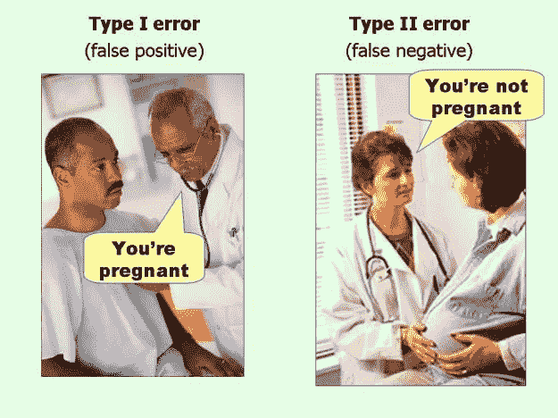

来自:[https://flowing data . com/2014/05/09/type-I-and-ii-errors-simplified/](https://flowingdata.com/2014/05/09/type-i-and-ii-errors-simplified/)

```
***1) Import the necessary modules*** from sklearn.metrics import roc_curve ***2) Compute predicted probabilities***    
y_pred_prob = logreg.predict_proba(X_test)[:,1] ***3) Generate ROC curve values*** 
fpr, tpr, thresholds = roc_curve(y_test, y_pred_prob) ***4) Plot ROC curve* **    
plt.plot([0, 1], [0, 1], 'k--')       
plt.plot(fpr, tpr)       
plt.xlabel('False Positive Rate')       
plt.ylabel('True Positive Rate')       
plt.title('ROC Curve')       
plt.show()
```

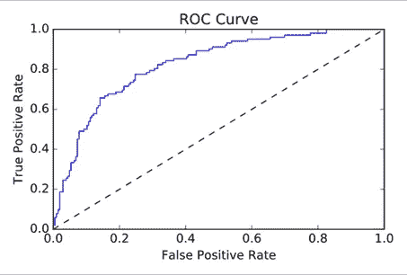

ROC 曲线下的面积越大，模型越好。

# 回归算法

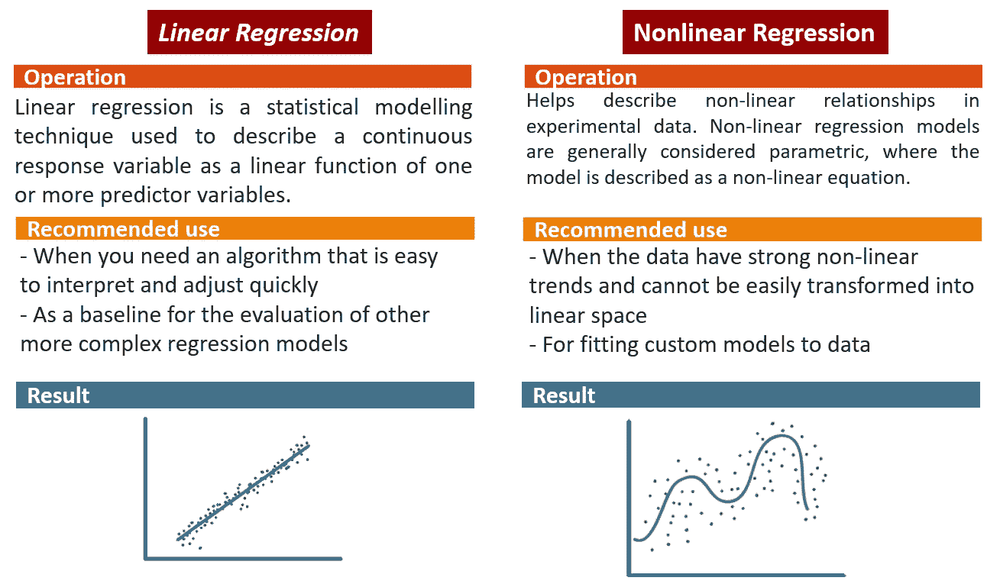

线性和非线性回归

```
***1) Import LinearRegression* **     
**from** sklearn **import** linear_model       
**from** sklearn.linear_model **import** LinearRegression***2) Create the regressor* **    
reg = linear_model.LinearRegression()***3) Create the prediction space* **    
prediction_space =  np.linspace(min(X_fertility),max(X_fertility)).reshape(-1,1)***4) Fit the model to the data* **    
reg.fit(X_fertility,y)***5) Compute predictions*** 
y_pred = reg.predict(prediction_space)***6) Plot regression line***       
plt.plot(prediction_space, y_pred,  color='black', linewidth=3)       plt.show()
```

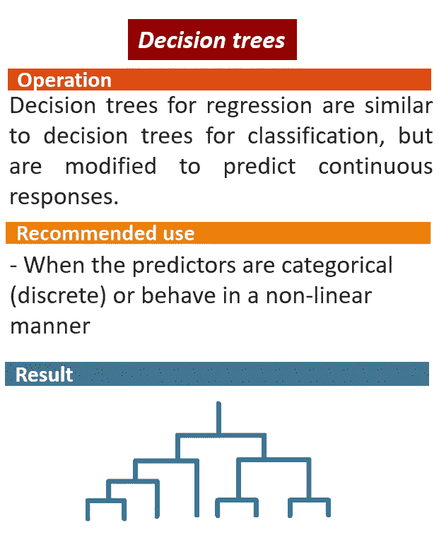

```
***1) Import Decision Tree Regressor***
from sklearn.tree   import DecisionTreeRegressor***2) Create a decision tree regression model* **  
decision_tree = DecisionTreeRegressor() ***3) Fit the model to the training features  and targets* **     decision_tree.fit(train_features,train_targets) ***4) Check the score on train and test* **    print(decision_tree.score(train_features,   train_targets))       print(decision_tree.score(test_features,test_targets))
```

最后，还有两个回归算法:

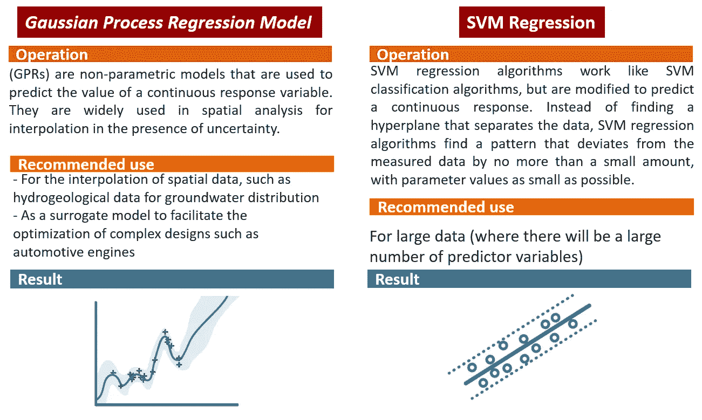

*高斯过程回归模型(GPR)和支持向量机(SVM)回归*

# 感谢阅读！！

> 如果你想继续阅读这样的故事，你可以[在这里订阅！](https://fesan818181.medium.com/membership)

如果你想看看这些算法在真实世界的数据集中表现如何，我建议你阅读下一篇文章:

[](/feature-engineering-and-algorithm-accuracy-for-the-titanic-dataset-5891cfa5a4ac) [## 泰坦尼克号数据集的特征工程和算法精度

### 机器学习最流行的数据集之一对应于泰坦尼克号事故

towardsdatascience.com](/feature-engineering-and-algorithm-accuracy-for-the-titanic-dataset-5891cfa5a4ac) 

或者阅读这个项目，我正在处理来自我的研究的数据:

[](/datascience-in-oil-and-gas-engineering-projects-daace6e6c7f) [## 石油和天然气工程项目中的数据科学。

### 探索性数据分析

towardsdatascience.com](/datascience-in-oil-and-gas-engineering-projects-daace6e6c7f)