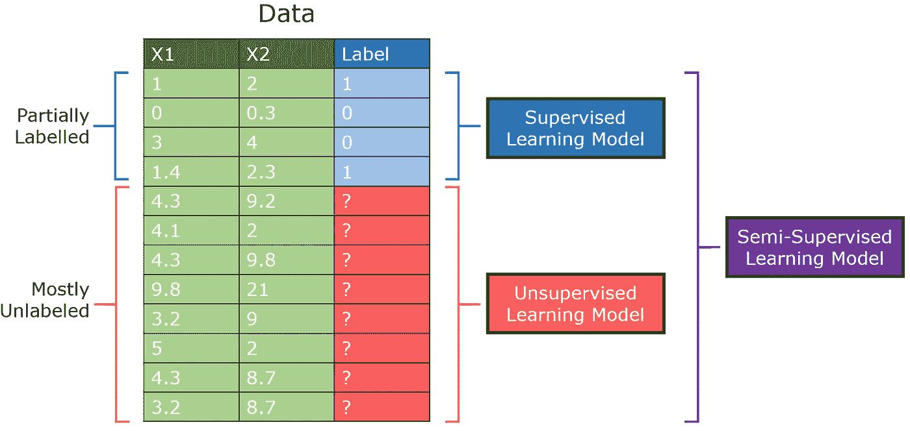
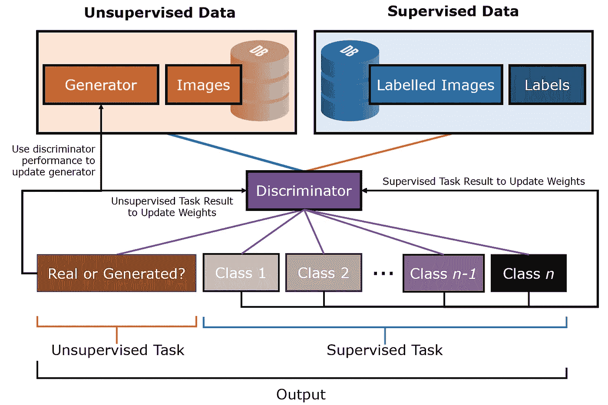

# 监督学习，但是更好:半监督学习

> 原文：<https://towardsdatascience.com/supervised-learning-but-a-lot-better-semi-supervised-learning-a42dff534781?source=collection_archive---------14----------------------->

来源: [Pixabay](https://pixabay.com/illustrations/machine-mechanical-eye-blue-look-1776925/)

## 为什么半监督学习是 ML 的未来

监督学习是人工智能领域探索的第一种学习类型。自从它的概念提出以来，无数的算法——从简单的逻辑回归到大规模的神经网络——已经被研究以提高准确性和预测能力。

然而，一项重大突破表明，添加*无监督数据*可以提高泛化能力和性能。事实上，在无数的场景中，带标签的数据并不是现成的。半监督学习可以在标准任务上取得最先进的结果，只需要一小部分标记数据——数百个训练样本。

在我们对半监督学习的探索中，我们将涵盖:

1.  *半监督学习简介*。什么是半监督学习，它与其他学习方法相比如何，半监督学习算法的框架/思想过程是什么？
2.  *算法:半监督 GANs* 。与传统 gan 的比较，半监督 gan 的过程和性能的解释。
3.  *机器学习的用例与未来*。为什么半监督学习会有这么大的需求，在哪里可以应用。

# 半监督学习简介

半监督学习算法代表了监督和非监督算法之间的中间地带。虽然没有正式定义为机器学习的“第四”元素(监督、非监督、强化)，但它将前两者的各个方面结合成了自己的方法。

这些算法对有一些标签的数据进行操作，但大部分是无标签的。传统上，人们要么选择监督路径，只对带有标签的数据进行操作，从而极大地减小数据集的大小；否则，人们会选择无监督的路线并丢弃标签，同时保留数据集的其余部分用于类似聚类的工作。

作者创建的图像。

在真实世界的数据中，情况往往如此。由于标注非常昂贵，尤其是在大多数数据集存在的量级上，大型数据集(尤其是用于企业目的的数据集)可能只有几个标注。例如，考虑确定用户活动是否具有欺诈性。在一百万个用户中，公司知道有一万个用户是这样，但是其他九万个用户可能是恶意的，也可能是良性的。

半监督学习允许我们对这些类型的数据集进行操作，而不必在选择监督学习或无监督学习时进行权衡。

通常，半监督学习算法在这个框架上运行:

1.  半监督机器学习算法使用有限的一组标记样本数据来训练自己，从而产生一个“部分训练”的模型。
2.  部分训练的模型标记未标记的数据。因为样本标记数据集有许多严重的限制(例如，现实世界数据中的选择偏差)，标记的结果被认为是“伪标记”数据。
3.  标记和伪标记数据集相结合，创建了一种独特的算法，结合了监督和非监督学习的描述和预测方面。

半监督学习使用分类过程来识别数据资产，并使用聚类过程将其分组为不同的部分。

# 算法:半监督 GAN

半监督 GAN(Semi-Supervised GAN，缩写为 SGAN)是[生成对抗网络](https://medium.com/analytics-vidhya/gans-for-everyone-an-intuitive-explanation-of-the-revolutionary-concept-2f962c858b95)架构的变体，用于解决半监督学习问题。

在传统的 GAN 中，训练一个鉴别器来预测图像是真实的(来自数据集)还是伪造的(由生成器模型生成)，允许它从图像中学习鉴别特征，即使没有标签。虽然大多数人通常使用 GANs 中的生成器(该生成器已被训练为生成与数据集中的图像相似的图像)来生成真实生成的图像，但也可以通过迁移学习使用鉴别器作为起点来开发同一数据集上的分类器，从而使受监督的任务受益于无监督的训练。由于已经学习了大多数图像特征，所以执行分类的训练时间和准确度将会好得多。

然而，在 SGAN 中，鉴别器同时以两种模式训练:无监督和有监督。

*   在*无监督*中，鉴别器需要区分真实图像和生成的图像，就像在传统的 GAN 中一样。
*   在【T4 监督】中，鉴别器需要将图像分类到预测问题中的几个类别中，就像在标准的神经网络分类器中一样。

为了同时训练这两种模式，鉴别器必须输出 1 + *n* 节点的值，其中 1 表示“真或假”节点，而 *n* 是预测任务中的类别数。

在半监督 GAN 中，鉴别器模型被更新以预测 K+1 个类，其中 K 是预测问题中的类的数量，并且附加的类标签被添加用于新的“*假的*”类。它包括同时为非监督 GAN 任务和监督分类任务直接训练鉴别器模型。整个数据集可以通过 SGAN 传递-当训练示例有标签时，调整鉴别器的权重，否则，忽略分类任务，鉴别器调整其权重，以更好地区分真实图像和生成的图像。

作者创建的图像。

虽然允许 SGAN 无监督地训练允许模型从非常大的未标记数据集中学习非常有用的特征提取，但监督学习允许模型利用提取的特征并将其用于分类任务。结果是一个分类器，即使在非常非常少的标记样本(几十到几百个)上训练，它也能在像 MNIST 这样的标准问题上取得令人难以置信的结果。

SGAN 巧妙地结合了非监督学习和监督学习的各个方面，以相互加强，允许两个世界的最佳部分一起工作，以最少的标签产生令人难以置信的结果。

# 机器学习的使用案例和未来

在一个可用数据量不断呈指数增长的时代，无监督的数据根本不能停下来等待标签赶上。无数真实世界的数据场景都是这样出现的——例如，YouTube 视频或网站内容。从爬行引擎和内容聚合系统到图像和语音识别，半监督学习无处不在。

半监督学习结合监督学习和非监督学习(分别)的过度拟合和“欠拟合”趋势的能力创建了一个模型，该模型可以在泛化的同时出色地执行分类任务，给定最少量的标记数据和大量的未标记数据。除了分类任务之外，半监督算法还有其他广泛的用途，如增强聚类和异常检测。尽管该领域本身相对较新，但算法仍在不断被创造和完善，因为它们在当今的数字世界中有着巨大的需求。

半监督学习确实是机器学习的未来。