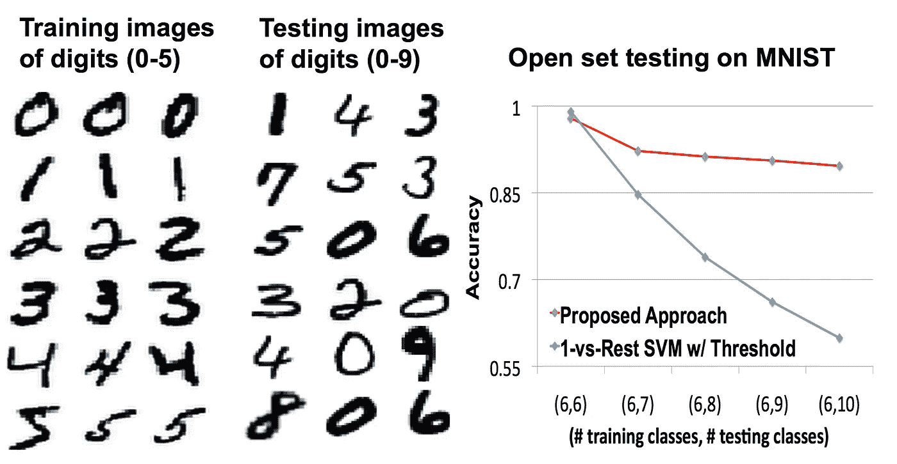
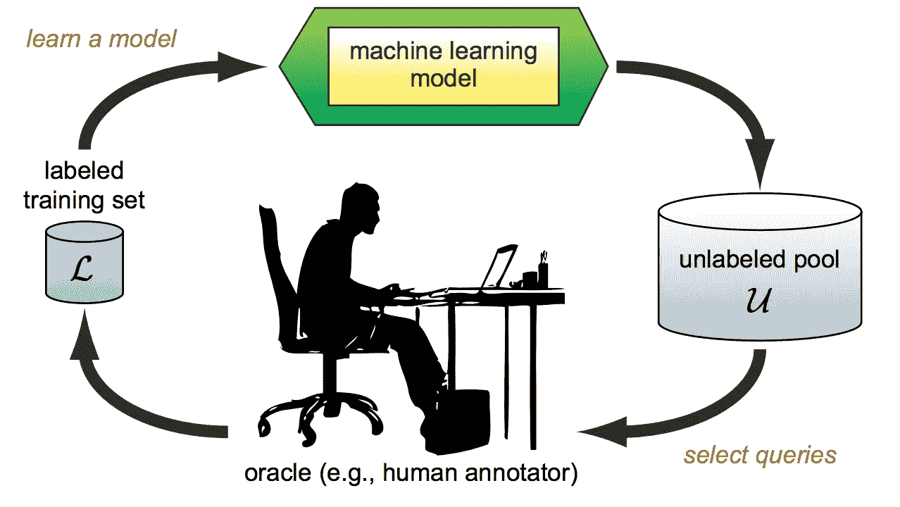
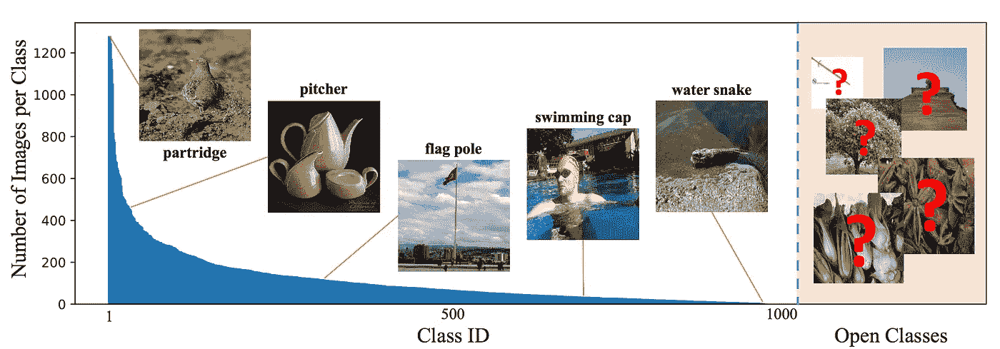

# 监督学习是不够的

> 原文：<https://towardsdatascience.com/supervised-learning-is-not-enough-8254814dfcc5?source=collection_archive---------33----------------------->

## 为了在人工智能方面取得进展，我们的模型需要学会应对混乱的现实世界

谢尔盖·阿库利奇在 [Unsplash](https://unsplash.com?utm_source=medium&utm_medium=referral) 上的照片

在 2002 年的一次新闻发布会上，美国国防部长唐纳德·拉姆斯菲尔德解释了情报报告的基本局限性:

> “有已知的已知；有些事情我们知道我们知道。我们也知道有已知的未知；也就是说，我们知道有些事情我们不知道。但也有未知的未知——那些我们不知道自己不知道的。如果纵观我们国家和其他自由国家的历史，后一类往往是困难的。”

这句名言蕴含着深刻的智慧，我们可以将其转化为机器学习研究。通常，我们收集一些数据，并将这些数据分成训练集和测试集。一个成功的模型将能够预测测试集中的许多实例:这些是已知的知识。对于测试集中的其他实例，即已知的未知量，就不那么确定了。

然而，在这种传统的、有监督的学习体系中，未知的未知是缺失的。根据定义，只有当 ML 模型被部署到生产中时，我们才会遇到未知的未知，在那里它会遇到真实的世界。当这种情况发生时，事情可能会出错，因为模型不知道正在发生什么，同时又对其预测过于自信。

## 开集识别

因此，监督学习不一定足以应对现实世界。现实世界简直太乱了，它往往会向我们扔新的东西。

这里有一个聪明的方法来测试这个想法:在 MNIST 数据上训练一个机器学习模型，但在训练期间只给它显示数字 0，1，2，3，4，5。然后，在测试过程中，向它显示整个数字范围。会有怎样的表现？

当在训练期间只看到类的子样本时，根据 MNIST 数据训练的模型的退化。[1]

结果很糟糕(见上面的蓝色曲线)。随着我们在训练过程中遗漏越来越多的类，准确度从接近 1 下降到大约 0.6。研究人员 Lalit Jain 及其合作者在 2014 年展示了这一结果。他们还提出了一种新的 ML 算法，以更好的方式推广到“未知的未知”(上面的红色曲线)——当然，警告是，这些未知的未知实际上是研究人员事先知道的。

*开集识别*是训练 ML 模型的挑战，这些模型不仅在已知数据上表现良好，还能识别是否有全新的东西扔给它们——并相应地调整预测的不确定性。解决这个问题是在现实世界中部署模型的重要一步。

如果模型能在不确定的时候问我们就更好了。

## 主动学习

主动学习的想法简单而有力。假设我们有一个大的未标记的数据池，和一个小的已标记的数据样本。然后，在已标记的数据上训练一个 ML 模型，并让该模型对未标记的数据实例进行排序，例如通过它对标签的不确定程度。选择最不确定的实例，由人类标记它们，将它们添加到标记的训练集中，并重新训练。

主动学习循环。[2]

如果未标记池是有限的，只需重复循环，直到标记了足够多的数据。然而，在现实世界中，未标记的池可能是无限的:在现代生产系统中，每秒钟都会产生新数据。

这是所有事情是如何组合在一起的:在现实世界中，我们需要擅长开集识别的模型，擅长识别一个新样本是否是以前从未经历过的，一个未知的未知。我们需要主动学习循环，以便模型可以在人类专家的帮助下快速有效地填补知识空白。这两个领域的进展对于现实世界的 ML 应用至关重要。

## 最后的想法

我在之前的[帖子](/the-origin-of-intelligent-behavior-3d3f2f659dc2)中提到了伊莱恩·赫尔茨贝格的惨死。2018 年 3 月 18 日晚上，赫尔茨贝格在亚利桑那州坦佩市的一条街道上骑车时，被一辆自动驾驶汽车撞了。尽管汽车模型已经在大量驾驶数据的基础上进行训练，但这些数据错过了足够多的行人骑自行车过马路的例子。对这个模型来说，赫尔茨贝格是一个未知的未知数。

图像数据中的长尾问题示例。[3]

不管我们用多少数据来训练我们的模型，模型总是会遗漏一些东西。这就是著名的*长尾问题*。然而我们人类是不同的:我们不仅仅是学习模式，我们有一种“为什么”我们看到的事物是这样的感觉。这种从第一原理进行推理的形式使我们能够推广到未知的长尾，这是监督 ML 模型中所缺少的技能。

实际上，一个模型永远不会真正“完成”学习。在现实世界的场景中，学习过程必须无限期地继续下去。监督学习是不够的。此外，模型需要善于识别未知的未知，更好的是，在最需要的时候主动要求我们澄清。

## 参考资料和进一步阅读

[ [1](https://www.wjscheirer.com/papers/wjs_eccv2014_openset.pdf) ] Jain 等，利用包含概率的多类开集识别
[ [2](http://burrsettles.com/pub/settles.activelearning.pdf) 落定，主动学习文献综述
[ [3](https://arxiv.org/pdf/1904.05160.pdf) 刘等，开放世界中的大规模长尾识别

 [## 智能行为的起源

### 为什么真正的人工智能需要的不仅仅是模式识别

towardsdatascience.com](/the-origin-of-intelligent-behavior-3d3f2f659dc2)