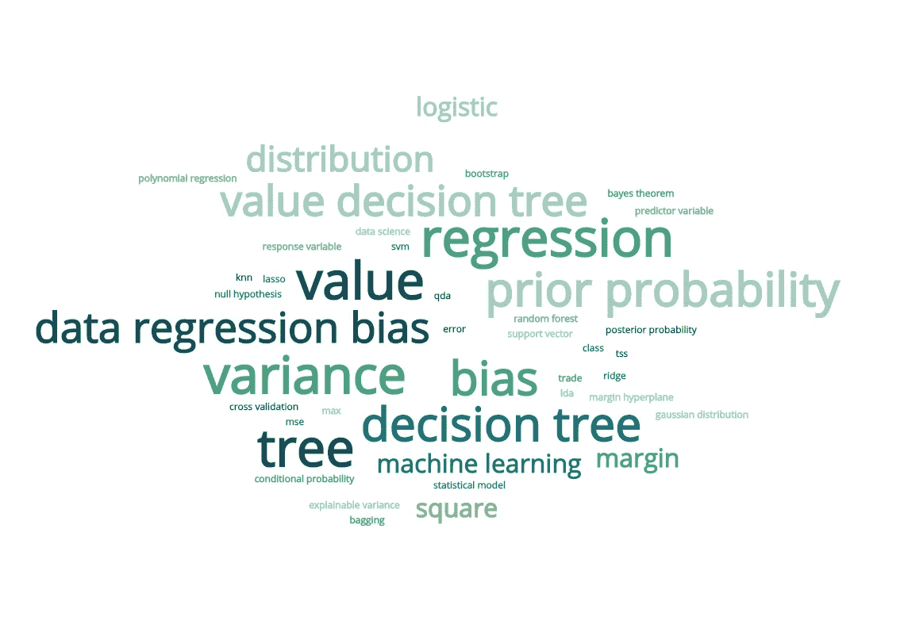

# 监督机器学习模型:你在实践中必须做出的决定

> 原文：<https://towardsdatascience.com/supervised-machine-learning-models-decisions-you-have-to-make-in-practice-ef23d565aa4b?source=collection_archive---------67----------------------->

## 聚在一起—选择哪种模式？要调整哪些超参数？如何评价？

虽然我提供了机器学习模型背后的一些直觉，但本文的重点不是解释机器学习模型背后的数学，而是它们的实际应用，即我将尝试回答使用什么、如何调优、如何评估等问题。本文讨论了数据科学家在尝试将模型与给定数据相匹配时需要考虑的任务、挑战、假设、利弊和注意事项。

通过 [monkeylearn](https://monkeylearn.com/word-cloud/) 生成的 Wordcloud

## 偏差-方差权衡

所有的模型都遭受这种权衡。理解这一点对于调整机器学习模型的性能来说是微不足道的。假设我们有一个数据集，我们已经拟合了一个 ML 模型。

一个好的模型应该是一致的，并且能够处理训练数据集中的任何变化，而本身没有太大的变化，也就是说，它应该已经对看不见的数据进行了推广(这是我们首先要达到的目标)。模型由于训练数据集中的变化而变化的量被解释为模型的方差。

偏差可以解释为模型倾向于较少的预测变量。具有非常高的偏差会使模型对数据的变化(较低的方差)不敏感，并导致对情况的不良近似。另一方面，较低的偏差会使模型利用所有不必要的信息，并允许较高的方差。

总之，考虑到模型和数据的需求和使用，这是一个数据科学家必须明智选择的权衡。

## 简单线性回归

让我们从简单开始，假设我们有一个斜率为 m、Y 轴截距为 c 的直线方程，给定这条直线，我们可以计算任意特定 X 值的 Y 值。简单 LR 旨在估计直线(称为回归线)的斜率和截距，该直线在某种程度上最适合所有数据点，即最小化残差平方和(称为最小二乘法)。

可能的情况是，我们将有一个零斜率(m)。这在某种程度上传达了 Y 对 X 值的独立性。我们使用零假设检验来检测这种行为，该检验确定 m 是否足够远离零。在实践中，我们使用 p 值，它在某种程度上告诉我们数据独立于预测变量的概率。我们从零假设假设的 t 分布中得到这个概率。最后，我们只需查看 p 值，如果它小于 0.05(一般情况下)，我们可以拒绝零假设。

一旦我们拒绝零假设，我们想知道我们的模型有多好地符合数据。为此，我们使用 R 平方度量(我们也可以使用 RSE，但是 RSE 依赖于 Y 的单位，不能推广到任何数据)。R-square 接近 1 意味着我们的 LR 模型解释了 Y 的可变性，是一个很好的拟合。如果 R 平方接近于 0，那么可能有两个原因。(参考下面的可解释差异部分)

## 多元线性回归

如果我们有不止一个预测变量呢？我们可以将简单的 LR 从直线扩展到多维超平面来拟合数据。想象一下，假设我们有两个预测变量。现在，我们在 3D 空间中拟合一个平面，其中响应是这两个预测变量的函数，具有一些截距。这可以进一步扩展到更高维度。

我们使用 f 统计量来检验零假设。尽管我们有单个预测因子的 p 值，为什么我们要看总体的 F 统计量？当有大量预测因子(比如 100 个)时，那么只是偶然地，我们保证观察到至少一个 p 值低于 0.05 的预测因子，即使在预测因子和反应之间没有真正的联系。但是，f-statistic 不会受此影响，因为它会根据预测值的数量进行调整。

一旦我们拒绝零假设，我们可能不得不选择只有重要的预测，以减少计算需求。这是使用子集选择方法完成的。

我们使用 R-square 来评估模型的拟合度。然而，需要注意的一点是，当我们包含更多的预测因子时，R-square 会得到改善。由我们来决定计算需求和模型拟合之间的权衡。此外，以更高的 R 平方为目标可能会导致过度拟合问题。

## 多项式回归

*它被认为是线性回归，因为它在预测系数中是线性的*

观察多重 LR，我们看到两个主要假设。首先，特定预测变量的变化对响应 Y 的影响独立于任何其他预测变量。(加法假设)。第二，由于预测变量的单位变化引起的响应 Y 的变化是恒定的。(线性假设)。

然而，我们的数据可能并不总是如此。我们可能不得不考虑更高程度的预测变量来恰当地拟合数据(注意:这就是过度拟合和偏差-方差概念出现的地方。此外，了解协同效应(即预测变量之间的交互效应)也是值得的

我们必须选择什么程度的预测变量？这是我们作为数据科学家试图解决的问题，选择这个程度和交互术语(称为特征工程)取决于我们。没有直接的答案或解决方案来处理这个问题。但是，可以使用残差图采用试错法。

残差图中，残差(*真实响应* — *估计响应*)相对于估计响应值绘制，这将揭示关于假设模型的一些见解。如果残差图没有显示模式，那么假设的模型与数据吻合得很好。否则，假设的模型会有一些问题，我们可能需要调整多项式的次数。

一旦我们最终确定了我们的模型，我们使用 R-square 评估拟合。我们必须注意，拥有更高程度的预测变量可能会过度拟合数据(看看偏差-方差权衡)。

## KNN 回归

到目前为止，我们一定已经理解了在线性回归设置中假设一个合适的模型来很好地拟合数据是非常重要的。KNN 回归消除了这种必要性，更加灵活。因此，如果预测准确性是我们的目标，给定足够的数据，KNN 优于线性回归。但是，这里有一个陷阱。“给定足够的数据”让我们陷入维度诅咒。KNN 回归是数据饥渴的，在更高的维度，实际上，永远不会有足够的数据，因此 KNN 比 LR 回归表现更差。此外，LR 更容易解释，因为它估计了每个预测因子对反应的影响。另一方面，KNN 是不可解释的，因为它只遵循数据，不关心预测。

*当每个预测值的观测值较少时，参数方法往往优于非参数方法*

## 逻辑回归

它特别用于两个类的分类设置中(可以调整为两个以上，但效率不高，因此这里不讨论)。它不是模拟响应 Y，而是利用逻辑函数来模拟 Y 属于特定类别的概率。这种分析可以用来观察特定预测变量的变化如何影响反应的几率。

通过最大化似然函数找到逻辑回归系数的估计。z 统计量类似于 t 统计量，用于执行零假设检验。较大的 z 统计量表示反对零假设的证据。使用分类错误率对逻辑回归模型进行评估。

当类被很好地分开时，逻辑回归不能在看不见的数据点上产生有希望的结果，即，即使对于数据中的小变化，它也是高度不稳定的。此外，在数据遭受“维数灾难”的更高维度中，由于缺乏足够的数据导致非常高的不稳定性，逻辑回归不能很好地执行。

## 贝叶斯分类器

它是一种理想的分类器，利用贝叶斯定理找出属于每一类的数据点的概率。数据点 X 的后验概率或类别 Y 的概率与类别 Y 的先验概率和 X 属于 Y 的类别条件概率的乘积成比例

它以最小的误差拟合数据。但不幸的是，我们不知道数据的确切类别条件概率和先验概率，我们试图在 LDA 和 QDA 的一些假设下进行估计。

**线性判别分析:**

LDA 可用于多类(> 2)分类设置。首先，我们分别对每一类中预测因子的分布进行建模。然后，我们利用贝叶斯定理找出数据点属于特定类别的概率。

可以使用属于相应类别的数据点的比例来找到每个类别的先验概率。然而，对于类别条件概率，我们必须假设从中提取数据点的分布。

我们假设数据点 X 是从多元高斯分布中提取的，该分布具有特定类别的均值向量和公共协方差矩阵。现在，我们的问题简化为估计每个类别和公共协方差的平均向量。判别方程在 x 上是线性的。

**二次判别分析:**

这类似于 LDA，除了关于所有类的预测变量的公共协方差的假设。这里，每个类都有自己的协方差矩阵。这导致判别方程在 x 上是二次的。

当决策边界是线性时，LDA 和逻辑回归方法往往表现更好。对于中度非线性边界，QDA 可能表现得更好。对于更复杂的决策边界，在有足够数据的情况下，选择好平滑参数的 KNN 表现得更好。

## 套索和岭回归

一般来说，我们最小化 RSS(称为最小二乘法)来估计回归设置中的预测系数。然而，由于拟合的灵活性，有时这些估计值可能会有很大的差异。

为了解决这个问题，我们通过向零收缩(正则化)一些预测系数估计值(在山脊的情况下)或通过使其正好为零(在套索的情况下)来惩罚预测系数估计值。岭和套索回归模型背后的直觉是，为了方差的更大减少，在模型偏差的轻微上升上进行妥协。

收缩量取决于一个参数(λ),这个参数必须由作为数据科学家的我们来决定。对于我们选择的每个λ值，产生一组不同的预测系数估计值，即对于每个λ，我们得到一个适合数据的不同模型。

从岭回归方程或套索回归方程中，我们可以观察到预测系数依赖于预测变量的尺度。因此，在对数据应用岭回归或套索回归之前，将数据中的每个预测值归一化至标准差为 1 是非常重要的。

我们使用训练数据的 R 平方值或测试数据的均方差(MSE)来比较每个模型。交叉验证方法可以用来决定λ的值。需要注意的是，在高维设置中，由于缺乏足够的数据，训练 R-square 具有很大的可变性，因此不应用于评估模型性能。

如果响应是许多系数大小大致相似的预测值的函数，则岭回归表现更好。如果少数预测因素主导了反应，那么套索回归表现更好。

## 决策树

基于树的方法将预测空间分割成多个框(树中的叶子),并对落入该框中的所有数据点进行相同的预测。在回归设置中，该预测通常是该框中所有训练观察的平均值，对于分类设置，多数投票被认为是预测对新数据点的响应。

在树中进行切割时，我们以具有最低可能 RSS(回归树)或分类误差(分类树)的方式决定预测变量及其切割点。对于分类设置，也可以使用像基尼指数和交叉熵这样的度量，因为它们对叶子(或盒子)的纯度更敏感。

作为一名数据科学家，我需要回答一个问题——什么时候我应该停止拆分树，或者我应该制作多少个盒子？

**成本复杂度剪枝或者最薄弱环节剪枝**:直观上，我们种一棵大树，然后剪枝，选择一棵导致误差最低的树。我们不是考虑所有可能的子树，而是使用一个调整参数α将树修剪到期望的水平。

对于每个阿尔法值，我们将有一个相应的树。随着 alpha 的增加，树被修剪的越来越多，导致分裂越来越少。分割越小，模型的方差越小，但偏差会有所增加。我们可以利用交叉验证来决定 alpha 的值，从而获得数据的最佳拟合。

**Bagging(bootstrapped Aggregation)**:我们利用 bootstrap 方法生成多个数据集，并为每个 Bootstrapped 数据集生成一个深度 Bootstrapped 树。尽管每个自举树都有很高的方差，但是对所有生长的树进行平均将会减少方差。我们利用出包测试误差来评估树的性能。

当预测准确性是我们的目标时，我们使用 Bagging。然而，打包损害了模型的可解释性。另一方面，成本复杂度修剪方法生成可解释树。

**随机森林:**这是一个有趣而聪明的打包方法，可以去相关生成的树。在 Bagging 中，在构建决策树时，我们允许所有预测变量参与分裂。如果几乎没有主要的预测因素，这个过程可能会产生高度相关的树。

在随机森林中，在每次分裂时，我们允许 m 个预测者的随机样本(大约 sqrt(预测者的数量))参与，从而允许所有预测者参与并进而产生去相关的树。这种方法的优势是显而易见的，因为对不相关的树进行平均会大大降低方差。

## 支持向量分类器

在进入支持向量分类器之前，我们必须了解最大间隔分类器。最大间隔分类器生成分离两个类的超平面，使得它垂直于每个属于不同类的最近的数据点。这些指导最大间隔分类器的数据点被称为“支持向量”。有趣的是，我们发现分类器只依赖于这些支持向量，而不依赖于所有其他数据点。

最大间隔分类器对不可分数据集的推广是支持向量分类器。由于我们无法找到完美分类数据集的硬边界，我们不得不允许一些数据点被错误分类。问题—我们应该允许多少个数据点被错误分类？

我们引入一个调整参数或成本“C ”,它允许模型对点进行错误的分类。可以使用交叉验证来选择它。c 控制支持向量分类器的偏差-方差权衡。位于其类的边缘的错误侧的数据点和位于边缘的点是该分类器中的支持向量，因为只有这些考虑了支持向量分类器的形成。

较小的 C 值说明了数据的硬拟合，并且非常不稳定，即，即使支持向量有很小的变化，分类器也会变化。这导致高方差但低偏差。另一方面，较高的 C 值允许较宽的余量，并产生具有较高偏差但较低方差的灵活分类器。

我们可以通过在预测器空间中引入更高阶特征以及交互项来拟合非线性决策边界。核和支持向量机的概念是随着这个概念的复杂初始化而出现的，但是中心思想是相同的。

## 可解释的方差(RSS、TSS、R 平方)

**总平方和:**是数据反应中固有的方差总量。

**残差平方和:** RSS 测量数据响应中的方差，这种方差不能用我们用来拟合的模型来解释。

**R-square:** 可以用我们过去拟合的模型解释的数据响应中方差的比例。R-square 接近 1 表示模型很好。无法解释的差异可能是由两个原因造成的:a .考虑的模型不能准确表示数据(直线不能符合二次型-数据)b .数据中的固有误差(由于无法建模的噪声)。

当在训练数据上测量 R-square 时，试图通过增加模型复杂性来实现更接近 1 的 R-square 会导致数据的过度拟合，因为它利用了数据中存在的固有噪声。因此，总是建议报告我们使用的数据集以及评估指标。

参考资料:*加雷斯·詹姆斯，丹妮拉·威滕，特雷弗·哈斯蒂，罗伯特·蒂布拉尼。《统计学习导论:在 r .纽约的应用》: Springer，2013 年。*