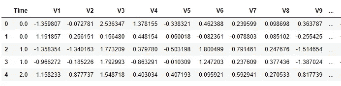
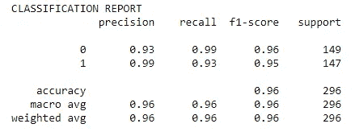
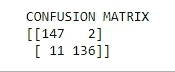

# 用于异常检测的监督机器学习技术:逻辑回归

> 原文：<https://towardsdatascience.com/supervised-machine-learning-technique-for-anomaly-detection-logistic-regression-97fc7a9cacd4?source=collection_archive---------12----------------------->

## 关于异常检测的小型数据科学文章


本·威克斯在 [Unsplash](https://unsplash.com?utm_source=medium&utm_medium=referral) 上拍照

这是我写的关于异常检测算法的系列文章的第 11 篇(也是最后一篇)。以下是之前的 10 篇文章，如果您想了解的话，每篇文章都侧重于不同的异常检测算法:

*   [1。隔离林](/isolation-forest-a-tree-based-algorithm-for-anomaly-detection-4a1669f9b782)
*   [2。k-最近邻(kNN)](/k-nearest-neighbors-knn-for-anomaly-detection-fdf8ee160d13)
*   [3。支持向量机(SVM)](/support-vector-machine-svm-for-anomaly-detection-73a8d676c331)
*   [4。无监督算法](/dbscan-a-density-based-unsupervised-algorithm-for-fraud-detection-887c0f1016e9)
*   [5。椭圆形信封](/machine-learning-for-anomaly-detection-elliptic-envelope-2c90528df0a6)
*   [6。局部异常值因子(LOF)](/anomaly-detection-with-local-outlier-factor-lof-d91e41df10f2)
*   [7。z 分数](/z-score-for-anomaly-detection-d98b0006f510)
*   [8。箱线图](/boxplot-for-anomaly-detection-9eac783382fd)
*   9。统计技术
*   10。时间序列异常检测

仔细观察，你会发现所有这些算法要么是统计的，要么是无监督的 ML 技术。无监督的，但许多这些算法实际上是围绕监督分类理论(如 kNN，SVM 或 DBSCAN)建立的。今天，我将采用一种“纯粹的”机器学习方法来进行异常检测，这意味着数据集将具有 0 和 1 标签，分别代表异常和非异常。

那么为什么监督分类在这个领域如此晦涩难懂呢？这背后有几个原因，但一个关键原因是严重的类别不平衡，这意味着只有一小部分数据代表异常。异常是罕见的事件，找到它们就像大海捞针。对于监督算法来说，这是一个很大的障碍，因为没有足够的例子可以学习！

无论如何，下面我将使用一种流行的算法——逻辑回归，用公开可用的数据编写一个监督分类的实现。

在以前的文章中，我通常动态地创建一个小的合成数据集，并用最少的代码实现算法，以给出它们如何工作的直觉。今天会有所不同，因为这是一个监督分类问题，我必须遵循所有的基本步骤。正如您将看到的，光是数据准备就要占用相当多的空间。

# 步骤 1:导入库

我们需要相当多的库来进行数据辩论、准备模型输入、模型构建和验证——所有的库都来自三个大的包:`pandas`、`nunpy`和`sklearn`。

```
# data wrangling
import pandas as pd
import numpy as np# inputs data preparation
from sklearn.preprocessing import RobustScaler
from sklearn.model_selection import train_test_split# modeling
from sklearn.linear_model import LogisticRegression# model validation
from sklearn.metrics import classification_report
from sklearn.metrics import confusion_matrix
```

# 第二步:数据争论

我正在使用一个来自 [Kaggle](https://www.kaggle.com/mlg-ulb/creditcardfraud) 的关于信用卡欺诈检测的流行数据集。欧洲持卡人在删除任何用户标识符后，在公共领域发布了该数据集。让我们导入并查看一下数据集，看看特征。

```
# import data
df = pd.read_csv("..\creditcard.csv")# view the column names
df.columns
```



```
# view the column names
df.columns>> Index(['Time', 'V1', 'V2', 'V3', 'V4', 'V5', 'V6', 'V7', 'V8', 'V9', 'V10', 'V11', 'V12', 'V13', 'V14', 'V15', 'V16', 'V17', 'V18', 'V19', 'V20', 'V21', 'V22', 'V23', 'V24', 'V25', 'V26', 'V27', 'V28', 'Amount', 'Class']
```

数据集有 31 列。第一列“时间”是交易时间戳，倒数第二列“金额”是交易金额，最后一列“类别”表示交易是否欺诈(欺诈= 1，非欺诈= 0)。其余的列，“V1”到“V28”是未知的特征，并且值被缩放。

现在看看欺诈和非欺诈案例的数量。

```
# number of fraud and non-fraud observations 
frauds = len(df[df.Class == 1])
nonfrauds = len(df[df.Class == 0])print("Frauds", frauds); print("Non-frauds", nonfrauds)>> Frauds 492
>> Non-frauds 284315
```

正如我所说，这是一个相当不平衡的数据集，在 25 万个观察中只有 492 个欺诈案例。这只占所有交易中欺诈案件的 0.17%。

# 步骤 3:输入数据准备

数据集非常干净，所以在下一步中，我们将缩放“Amount”和“Time”列，以确保它们与其他列的格式相似。

```
## scaling the "Amount" and "Time" columns 
rob_scaler = RobustScaler()df['scaled_amount'] = rob_scaler.fit_transform(df['Amount'].values.reshape(-1,1))
df['scaled_time'] = rob_scaler.fit_transform(df['Time'].values.reshape(-1,1))# now drop the original columns
df.drop(['Time','Amount'], axis=1, inplace=True)
```

现在让我们定义 X 和 y 输入变量。

```
# define X and y variables
X = df.loc[:, df.columns != 'Class']
y = df.loc[:, df.columns == 'Class']
```

由于这是一个不平衡的数据集，我们需要采取额外的步骤来进行子采样——称为欠采样——这样机器就不必大海捞针来学习示例。

```
# number of fraud cases
frauds = len(df[df.Class == 1])# selecting the indices of the non-fraud classes
fraud_indices = df[df.Class == 1].index
nonfraud_indices = df[df.Class == 0].index# from all non-fraud observations, randomly select observations equal to number of fraud observations
random_nonfraud_indices = np.random.choice(nonfraud_indices, frauds, replace = False)
random_nonfraud_indices = np.array(random_nonfraud_indices)# appending the 2 indices
under_sample_indices = np.concatenate([fraud_indices,random_nonfraud_indices])# undersample dataset
under_sample_data = df.iloc[under_sample_indices,:]# now split X, y variables from the under sample data
X_undersample = under_sample_data.loc[:, under_sample_data.columns != 'Class']
y_undersample = under_sample_data.loc[:, under_sample_data.columns == 'Class']
```

在将数据输入模型之前，将数据拆分为训练集和测试集。

```
# split dataset
X_train_undersample, X_test_undersample, y_train_undersample, y_test_undersample = train_test_split(X_undersample, y_undersample, test_size = 0.3, random_state = 0)
```

# 步骤 4:模型构建

像往常一样，实际的模型构建只需要 3 行代码，就可以对给定的数据集进行实例化、拟合和预测。由于这只是为了演示，我们将使用默认参数，不做任何调整。

```
# instantiate model
model = LogisticRegression()# fit 
model.fit(X_train_undersample, y_train_undersample)# predict
y_pred = model.predict(X_test_undersample)
```

# 第五步:模型评估

作为标准模型评估指标，我们正在制作分类报告和混淆指标。

```
classification_report = classification_report(y_test_undersample, y_pred)
confusion_matrix = confusion_matrix(y_test_undersample, y_pred)print("CLASSIFICATION REPORT")
print(classification_report)
print("CONFUSION MATRIX") 
print(confusion_matrix)
```



# 离别赠言

本文的目的是展示一种用于异常检测的纯监督机器学习方法。由于严重的阶级不平衡，在这个领域很少使用监督技术。由于一个数据集中只有少数异常观测值，算法没有足够的例子可以学习。

到目前为止，我写的 11 个算法没有一个是绝对好或更好的，这都归结于数据集的性质和它来自的领域。通常，一个简单的统计算法(如箱线图)足以过滤可能的候选者，而在其他情况下，一个复杂的算法可能是无用的。

希望你觉得这个系列有用，欢迎在下面发表评论，关注我的[媒体](https://medium.com/@mab.datasc)、[推特](https://twitter.com/DataEnthus)或 [LinkedIn](https://www.linkedin.com/in/mab-alam/) 。