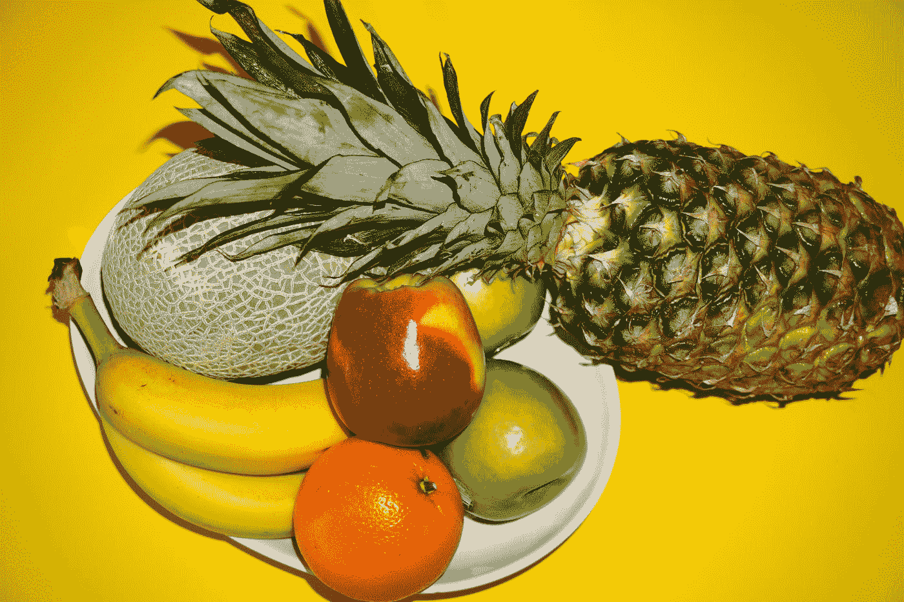

# 有监督和无监督机器学习的区别

> 原文：<https://towardsdatascience.com/supervised-vs-unsupervised-machine-learning-ae895afc57f?source=collection_archive---------66----------------------->

## 数据科学概念

## 他们实际上是如何比较的

肖恩·奥尔登多夫在 [Unsplash](https://unsplash.com?utm_source=medium&utm_medium=referral) 上拍摄的照片

机器学习能够处理大量数据。这些数据可能以多种不同的形式出现，从图像到电子表格再到文本。这些数据可以包含许多不同类型的信息，如密码、地址，甚至颜色模式。说到机器学习，有两种不同的方法:*无监督*和*有监督*学习。

这两种不同类型的学习实际上有很大的区别。这些差异导致了独特的计算机算法来迎合每一种类型的学习。例如，分类机器学习算法，如能够将图像标记为苹果或橙子的算法，保留用于监督机器学习。聚类算法，例如能够根据书写风格将书籍分组的算法，是为无监督的机器学习而保留的。

我们将探索两种类型的机器学习之间的差异，并确定哪种学习形式最适合特定的数据集。

> [在这里注册一个中级会员，可以无限制地访问和支持像我这样的内容！在你的支持下，我赚了一小部分会费。谢谢！](https://marco-santos.medium.com/membership)

# 监督学习

比方说，你正在开发一个机器学习模型，它能够区分在不久的将来价格会上涨的好股票投资和在下个月会贬值的坏股票投资。

由 [Austin Distel](https://unsplash.com/@austindistel?utm_source=medium&utm_medium=referral) 在 [Unsplash](https://unsplash.com?utm_source=medium&utm_medium=referral) 上拍摄的照片

传统上，你会向专门从事股票投资的财务顾问寻求建议。这些财务顾问由经验丰富的老顾问来指导哪家公司值得投资。他们被告知，精选的公司信息会导致股票价值上升。他们挑选股票的表现由这些经验丰富的顾问监督。

有监督的机器学习以类似的方式工作。通过向算法输入精选的公司信息，并给这些信息贴上良好投资的标签，你正在教会机器哪只股票值得投资。标记数据的行为是监督学习的表现。用于该问题的机器学习算法的具体类型是一种 ***分类*** 算法。

监督学习的一个重要指标是用于训练机器学习算法的数据集。如果该数据集完全标记或识别了您希望算法得出的答案，那么这是一个很好的机会，您正在处理一个有监督的机器学习算法。

照片由[马库斯·斯皮斯克](https://unsplash.com/@markusspiske?utm_source=medium&utm_medium=referral)在 [Unsplash](https://unsplash.com?utm_source=medium&utm_medium=referral) 拍摄

在选股机器学习模型的情况下，它可能处理的数据集包含公司财务信息，以及该信息是否会导致积极或消极的价格运动。如果你想看选股机器学习算法的例子，那么请查看下面的文章:

 [## 我建立了一个机器学习模型，像沃伦·巴菲特一样交易股票(第一部分)

### 使用机器学习来分析股票的基本面

medium.com](https://medium.com/swlh/teaching-a-machine-to-trade-stocks-like-warren-buffett-part-i-445849b208c6) 

上面的文章深入研究了基于监督学习的选股机器学习算法的开发。

# 无监督学习

对于无监督学习，假设你想开发一个约会应用程序，将约会档案分组在一起，以改善约会过程。然而，你不知道首先如何将它们组合在一起。应该按用户喜好分组还是按自身特点分组？也许根据他们的宗教或政治观点将他们归类？但是最终你仍然不能完全确定如何建立这些约会档案组。

照片由 [Yogas 设计](https://unsplash.com/@yogasdesign?utm_source=medium&utm_medium=referral)在 [Unsplash](https://unsplash.com?utm_source=medium&utm_medium=referral) 上拍摄

这就是无监督机器学习的用武之地。如果你不确定在一个大的数据集中是什么将数据从另一个中区分出来，那么你可以利用无监督学习。这就是无监督学习的用途——在你不知道你在寻找的数据中找到相关性和相似性。

你可能知道，与监督学习不同，无监督机器学习利用*未标记的*数据。 ***聚类*** 是一种流行的无监督学习形式，它检查数据片段以找到相似性和差异，从而将它们聚类或分组在一起。关于约会应用程序的开发，无监督学习将发现约会简档之间的差异和关系，以根据这些简档进行分组或聚类。

如果您希望看到聚类的实际应用，请查看下面的文章，其中实现了无监督的机器学习来将约会档案分组在一起:

 [## 我用机器学习和人工智能做了一个约会算法

### 利用无监督的机器学习约会应用

towardsdatascience.com](/dating-algorithms-using-machine-learning-and-ai-814b68ecd75e) 

# 哪种学习方式最好？

有监督的学习和无监督的学习之间没有更高级的学习形式。你只需要知道何时使用其中一个。因此，使用哪种形式的学习完全取决于我们在开发机器学习模型时面临的问题，或者我们将用于该模型的数据集。

## 取决于数据

关于数据集，您将使用的学习形式由以下因素决定:

*   标记数据集=监督学习
*   无标签数据集=无监督学习

照片由[杰克·卡特](https://unsplash.com/@carterjack?utm_source=medium&utm_medium=referral)在 [Unsplash](https://unsplash.com?utm_source=medium&utm_medium=referral) 上拍摄

如果数据集包含标签或标记，例如，一组带有相应名称(苹果、橘子、香蕉等)的水果图片。)然后我们将实现监督学习。然后，受监督的机器学习算法将基于图片的内容来学习哪个图片与每个标签相关联。

如果数据集不包含任何标签或标记，如水果示例，但没有相应的名称，那么我们将实现无监督学习。然后，无监督的机器学习算法将找到水果图片之间的差异和相似之处(颜色、形状、纹理等)。)将它们聚集在一起。

## 取决于问题

有时候，我们面临的问题决定了我们将使用哪种学习形式。在我们之前使用的例子中(选股模型和约会应用)，我们面临的问题决定了我们将使用哪种类型的学习。

对于选股模型，我们需要根据公司的财务报表来了解股票的表现，无论股价是上涨还是下跌。这个基本事实导致我们使用监督机器学习模型。

对于约会应用程序，我们不知道如何区分个人资料。交友档案的聚类是没有事实根据的。这将把我们带到无监督机器学习模型的使用。

# 关闭

[摇滚猴子](https://unsplash.com/@rocknrollmonkey?utm_source=medium&utm_medium=referral)在 [Unsplash](https://unsplash.com?utm_source=medium&utm_medium=referral) 上的照片

无监督学习和有监督学习之间的区别非常明显。监督机器学习模型被告知它应该如何基于标签或标记工作。一个无监督的机器学习模型被告知只是要弄清楚每一段数据是如何彼此不同或相似的。

使用其中一个的需要很大程度上取决于我们的数据是否有标签或标记。这也取决于我们所面临的问题，而问题通常会影响我们所面对的数据类型。

最终，在无人监督和有人监督之间没有一种更好的学习形式。你只需要知道何时何地应用它们。

[*在 Twitter 上关注我:@_Marco_Santos_*](https://twitter.com/_Marco_Santos_)