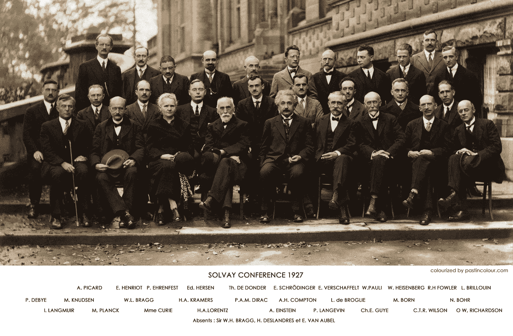
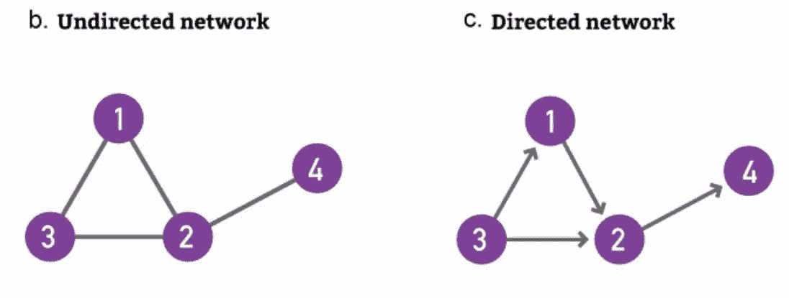
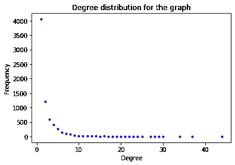
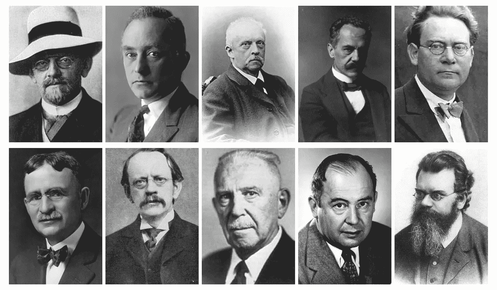
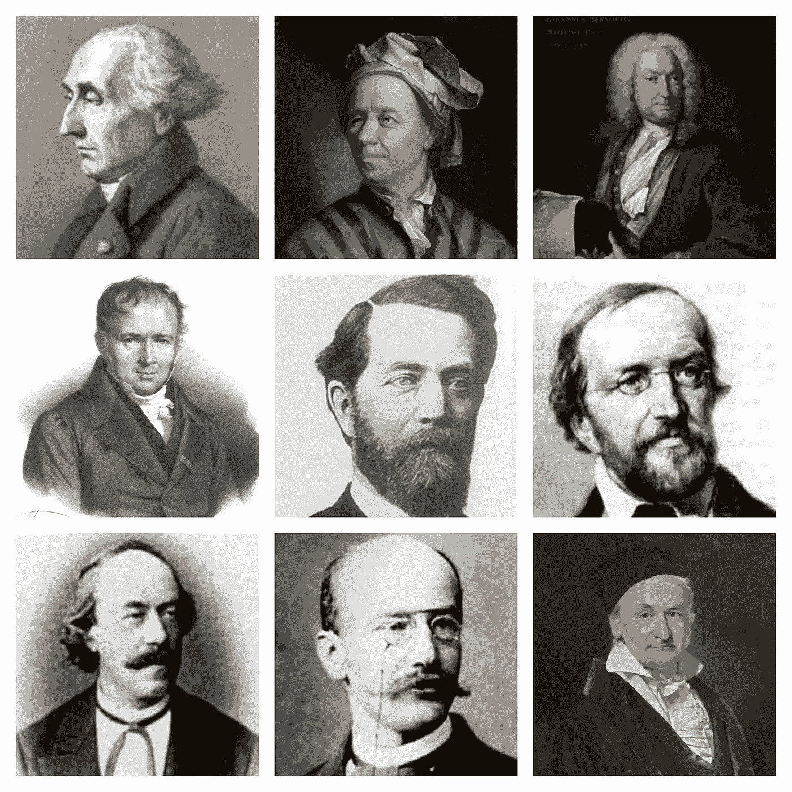
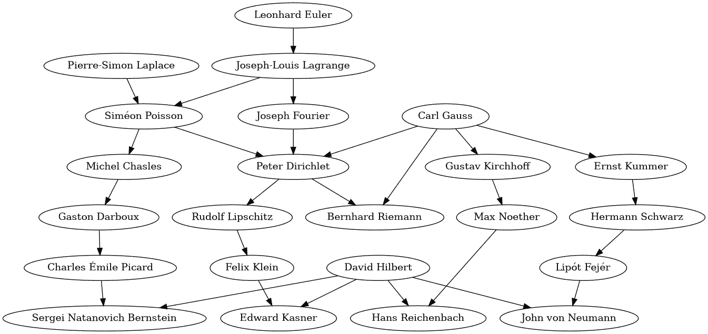

# 科学史上的监督者

> 原文：<https://towardsdatascience.com/supervisors-in-the-history-of-science-deec27d19519?source=collection_archive---------22----------------------->

## 分析导师与学生的关系，发现谁是历史上最重要的导师。



来源:https://imgur.com/fmVmslS

这是对科学史上导师和学生关系的数据分析。我试图利用数据科学来发现谁是历史上最重要的管理者。

在你继续之前，让我建议你写下你期望在这个分析中发现的伟大科学家的预测。我敢打赌，你们大多数人会对结果感到惊讶。

# **数据**

数据科学中的每个项目都包含一个需要解决的数据问题。在这种情况下，我们的数据集相当简单，到目前为止，它只包含主管和学生之间的关系。例如，我们有一个 Alfred Kleiner(主管)和 Albert Einstein(学生)之间的关系。总的来说，数据集有 7，070 个不同的人，6，517 个学生，2，862 个主管和 8，070 个关系。当然，很多人同时是主管和学生。

所有的数据都是使用简单的搜集技术从维基百科收集来的。该数据集包含了科学界重要人物库中可以接触到的所有人。细节不在本文讨论范围内，可以在 [github 库](https://github.com/mcherep/supervision)上找到。

我想强调的事实是，数据集没有任何关于个人的个人信息。这些无害的关系将揭示关于科学史的非常有趣的信息。敬请期待！

# 背景

我将简要解释我们需要继续下去的几个概念。如果你没有任何数学背景— *宝贝不要离开我—* 我保证会很简单。如果你有一些图论基础的背景知识，我建议你跳过这一节。我将回顾稍后会用到的概念。

图论是研究图形的数学领域(咄！).在这种情况下，图显然是我们正在寻找的结构，因为图是关系的模型。一个图是由一组通过边连接的节点(人)组成的(导师-学生关系)。

您可能已经在想，边只能在一个方向(有向图)或两个方向(无向图)连接节点。例如，监督学生表现为从监督者到学生的单向边。然而，如果我们认为监督者-学生关系是连接仅仅互相认识的人(例如，社交网络)，那么边连接监督者和学生，反之亦然。



来源:阿尔伯特-拉斯洛·巴拉巴希的《网络科学》

这到底为什么重要？嗯，两个节点之间的路径对我们的分析至关重要，这两种不同的结构允许完全不同的路径。哪一个对你分析我们的数据更有意义？

# 无向图

首先，我们将关系建模为无向图。这个决定对分析有重要影响，因为它认为导师和学生同等重要。

**组件**

图中的连通分量是一个子图，其中所有的节点都可以从至少另一个节点到达。我们的图有 84 个连通分量，但最大的分量占所有节点的 95.81%。这已经相当令人印象深刻了，因为我们从不同领域(例如化学、计算机科学)的人才库中收集了数据。这表明所有这些领域如何有一个共同的祖先，这将被证明是数学领域。

**学位**

无向图中节点𝑣的度是连接𝑣和其他节点的边的数量(即连接到特定人的人数)。这是前十名的学位排名:

```
1 Arnold Sommerfeld: 44
2 David Hilbert: 37
3 Dimitris Bertsimas: 34
4 Robert Solow: 30
5 Max Born: 29
6 Felix Klein: 28
7 Alonzo Church: 27
8 Franz Boas: 27
9 Abdus Salam: 25
10 J. J. Thomson: 24
```

这个列表已经很有趣了，也许你知道其中的一些。把它们记在心里，因为它们以后会出现。除了前十个，这是图中所有节点的度数分布



我们可以观察到，大多数人只与他们的主管有联系，并且有一个学位，而少数人有许多联系。这在统计学中被称为幂律分布。

**中间中心性**

中间中心性衡量节点𝑣的中心性，即所有节点对中通过𝑣.的最短路径所占的比例在这种情况下，我们可以使用这种中心性度量来提取关于图中人的重要性的见解。如果一个节点发现自己处于连接其他节点的最短路径中，那么它对于该连接是必不可少的。排名:

```
1 David Hilbert: 0.159
2 Max Born: 0.152
3 Hans Reichenbach: 0.121
4 Arnold Sommerfeld: 0.120
5 Hermann Helmholtz: 0.085
6 E. H. Moore: 0.073
7 J. J. Thomson: 0.071
8 Solomon Lefschetz: 0.070
9 John von Neumann: 0.058
10 Ludwig Boltzmann: 0.055
```

他们所有人，除了[赫尔曼·亥姆霍兹](https://en.wikipedia.org/wiki/Hermann_von_Helmholtz)和[约翰·冯·诺依曼](https://en.wikipedia.org/wiki/John_von_Neumann)，都生于 19 世纪，死于 20 世纪。亥姆霍兹几乎活到 20 世纪，冯·诺依曼在最开始就诞生了。他们在图表中(以及在科学史上)如此重要，因为他们是连接 18 世纪最伟大的数学家与 20 世纪和 21 世纪最伟大的科学家的一代人的一部分。



从左到右，从上到下:戴维·希尔伯特，梅克斯·玻恩，赫尔曼·亥姆霍兹，阿诺德·索末菲，赖欣巴哈，E. H .摩尔，J. J .汤姆森，所罗门·莱夫谢茨，约翰·冯·诺依曼，路德维希·玻尔兹曼

该奖项由戴维·希尔伯特获得！。希尔伯特出生于德国，是历史上最有影响力和普遍性的数学家之一。在希尔伯特的学生中，我们可以找到数学家[赫尔曼·维尔](https://en.wikipedia.org/wiki/Hermann_Weyl)和[哈斯克尔·库里](https://en.wikipedia.org/wiki/Haskell_Curry)。

我们还可以看到诺贝尔奖获得者梅克斯·玻恩，德国物理学家和数学家，在量子力学的发展中起着至关重要的作用。在玻恩的学生中，我们找到了诺贝尔奖获得者:玛利亚·戈珀特-梅耶、恩利克·费密和马克斯·德尔布吕克。他的另一个学生是罗伯特·奥本海默，在曼哈顿计划期间洛斯阿拉莫斯实验室的负责人，第一颗原子弹就是在那里被研发出来的。

德国物理学家阿诺德·索末菲(Arnold Sommerfeld)是量子物理领域的先驱，是获得诺贝尔奖学生最多的前两名。我们已经看到索末菲在我们的图中拥有最多的连接数。索末菲的学生包括诺奖得主[沃纳·海森堡](https://en.wikipedia.org/wiki/Werner_Heisenberg)、[沃尔夫冈·泡利](https://en.wikipedia.org/wiki/Wolfgang_Pauli)、[汉斯·贝特](https://en.wikipedia.org/wiki/Hans_Bethe)、[彼得·约瑟夫·威廉·德拜](https://en.wikipedia.org/wiki/Peter_Debye)、[莱纳斯·鲍林](https://en.wikipedia.org/wiki/Linus_Pauling)、[伊西多·艾萨克·拉比](https://en.wikipedia.org/wiki/Isidor_Isaac_Rabi)和[马克斯·冯·劳厄](https://en.wikipedia.org/wiki/Max_von_Laue)。事实上，阿尔伯特·爱因斯坦曾经告诉索末菲，他很钦佩他是如何从土壤中培养出这么多年轻人才的。索末菲可以说是科学史上最优秀的导师，以在家中或咖啡馆与学生见面而闻名。索末菲还拥有一个滑雪小屋，学生们被邀请在那里讨论物理。有趣的是，索末菲本人从未获得过诺贝尔奖，尽管他创下了 84 次提名的记录。

另一方面，我们还有英国物理学家、诺贝尔奖获得者 [J. J .汤姆森](https://en.wikipedia.org/wiki/J._J._Thomson)，他是唯一一个在拥有诺贝尔奖的学生方面可以与索末菲相抗衡的人。由于发现了电子，汤姆森的学生中有诺贝尔奖获得者[查尔斯·格洛弗·巴克拉](https://en.wikipedia.org/wiki/Charles_Glover_Barkla)、[尼尔斯·玻尔](https://en.wikipedia.org/wiki/Niels_Bohr)、[梅克斯·玻恩](https://en.wikipedia.org/wiki/Max_Born)、[威廉·亨利·布拉格](https://en.wikipedia.org/wiki/William_Henry_Bragg)、[欧文·理查森](https://en.wikipedia.org/wiki/Owen_Willans_Richardson)、[查尔斯·托马森·里斯·威尔逊](https://en.wikipedia.org/wiki/Charles_Thomson_Rees_Wilson)、[弗朗西斯·威廉·阿斯顿](https://en.wikipedia.org/wiki/Francis_William_Aston)和[欧内斯特·卢瑟福](https://en.wikipedia.org/wiki/Ernest_Rutherford)。事实上，汤姆森的儿子([乔治·佩杰特·汤姆生](https://en.wikipedia.org/wiki/George_Paget_Thomson))获得了 1937 年的诺贝尔物理学奖，只有布拉格、玻尔和西格班取得了同样的成就。

俄罗斯数学家[索罗门·莱夫谢茨](https://en.wikipedia.org/wiki/Solomon_Lefschetz)，在代数拓扑和几何方面做了基础性工作，指导了人工智能的创始人之一[约翰·麦卡锡](https://en.wikipedia.org/wiki/John_McCarthy_(computer_scientist))和统计学的重要人物[约翰·图基](https://en.wikipedia.org/wiki/John_Tukey)。

赫尔曼·赫尔姆霍茨是德国物理学家，在人类视觉、电动力学和热力学等几个领域做出了重大贡献。在他的学生中，我们可以找到诺贝尔奖得主[阿尔伯特·迈克耳孙](https://en.wikipedia.org/wiki/Albert_A._Michelson)、[威廉·维恩](https://en.wikipedia.org/wiki/Wilhelm_Wien)、[马普](https://en.wikipedia.org/wiki/Max_Planck)和[加布里埃尔·李普曼](https://en.wikipedia.org/wiki/Gabriel_Lippmann)。

最后，在名单上我们还可以找到匈牙利数学家、物理学家和计算机科学家约翰·冯·诺依曼。冯·诺依曼可以说是地球上最聪明的人之一。他是我一直以来最喜欢的科学家之一，所以我不敢简要描述他的工作。我只能说，如果你不太了解他，那就值得一读。只是为了好玩，打开他的维基百科页面，在右边他的图片下面找到“知名”部分。

**特征向量中心性**

特征向量中心性是测量中心性的不同方式。在这种情况下，当一个节点与另一个重要节点相关时，它的重要性就会增加。这个概念类似于 Google 在其 PageRank 算法中使用的概念。再次排名:

```
1 Arnold Sommerfeld: 0.578
2 Max Born: 0.214
3 Werner Heisenberg: 0.213
4 Wolfgang Pauli: 0.162
5 Hans Reichenbach: 0.158
6 Rudolph E. Peierls: 0.154
7 David Hilbert: 0.140
8 Ferdinand von Lindemann: 0.119
9 Gregor Wentzel: 0.110
10 Linus Pauling: 0.109
```

如果你碰巧读过中间中心性这一节，那么你已经熟悉了列表中的大多数人。

令人着迷的是，通过这种中心性的衡量，我们可以在不了解他的学生的任何情况下，仅仅根据他的后代的性质，发现阿诺德·索末菲的重要性。名单上的大多数人实际上都与阿诺德·索末菲有直接关系。

有三位科学家是我们在之前的中心性测量中没有看到的。沃纳·海森堡监督的鲁道夫·佩尔斯；费迪南·冯·林德曼，阿诺德·索末菲和戴维·希尔伯特等人的上司；和由阿诺德·索末菲监督的格雷戈尔·温策尔。

令人惊讶的是，排名第 13 位的 J. J .汤姆森没有进入前十名，因为他指导过如此多的诺贝尔奖获得者。

**桥梁**

桥是删除后会断开图的边。一个节点的桥边的数量给了我们一个很好的度量，这个节点连接图的不同部分有多重要，这些部分可能与不同的字段相关。排名:

```
1\. Franz Boas: 25
2\. Robert Solow: 21
3\. Arnold Sommerfeld: 19
4\. Alonzo Church: 19
5\. David Hilbert: 18
6\. John Archibald Wheeler: 16
7\. Felix Klein: 15
8\. Salomon Bochner: 14
9\. Garrett Birkhoff: 13
10\. Richard Karp: 13
11\. John Tate: 13
12\. Elias Stein: 12
13\. Marvin Minsky: 12
14\. Noam Chomsky: 11
```

再次，有很多熟悉的面孔，这也是一个很好的迹象，表明我们正在做正确的事情。

弗朗茨·博厄斯非常有趣。他是一名德国人类学家，指导过许多学生，成为该领域的中坚力量。令人惊讶的是，人类学家出现在数据集中，然而，我们可以将弗朗茨·博厄斯追溯到[亚伯拉罕·戈特瑟夫·卡斯特纳](https://en.wikipedia.org/wiki/Abraham_Gotthelf_K%C3%A4stner)，他是[卡尔·古斯塔夫·雅各布·雅各比](https://en.wikipedia.org/wiki/Carl_Gustav_Jacob_Jacobi)的共同祖先。

美国经济学家、诺贝尔奖获得者[罗伯特·索洛](https://en.wikipedia.org/wiki/Robert_Solow)也是经济学领域的一个重要节点，有诺贝尔奖获得者[乔治·阿克洛夫](https://en.wikipedia.org/wiki/George_Akerlof)、[约瑟夫·斯蒂格利茨](https://en.wikipedia.org/wiki/Joseph_Stiglitz)、[彼得·戴蒙德](https://en.wikipedia.org/wiki/Peter_Diamond)和[威廉·诺德豪斯](https://en.wikipedia.org/wiki/William_Nordhaus)等学生。

其他像阿隆佐·邱奇、理查德·卡普、马文·明斯基和 T21 都是数学和计算机科学领域之间的重要纽带，最近的两位获得了图灵奖。

我们还发现了其他一些伟大的数学家，如[所罗门·博克纳](https://en.wikipedia.org/wiki/Salomon_Bochner)、[菲利克斯·克莱因](https://en.wikipedia.org/wiki/Felix_Klein)、[加勒特·伯克霍夫](https://en.wikipedia.org/wiki/Garrett_Birkhoff)、[约翰·泰特](https://en.wikipedia.org/wiki/John_Tate)和[埃利亚斯·斯坦](https://en.wikipedia.org/wiki/Elias_M._Stein)。费利克斯·克莱因在几个不同的数学领域的贡献而广为人知。作为我们将在本文结尾看到的剧透，费利克斯·克莱因是导师-学生这条非凡道路的一部分，这条道路始于拉格朗日，止于约翰·冯·诺依曼。

美国物理学家约翰·阿奇博尔德·惠勒曾负责重振人们对广义相对论的兴趣，他是诺贝尔奖获得者理查德·费曼和基普·索恩的导师。

在名单的最后，我们遇到了诺姆·乔姆斯基，他是数学和语言学领域之间的枢纽。乔姆斯基是唯一一个和索恩一起，我们提到过的，今天还活着的人。

# 有向图

现在，我们把这个模型变成一个无向图，这个无向图更重视监督者而不是学生。我们为什么要这么做？嗯，随着这种变化，我们期望发现数学的创始人比其他人更相关，仅仅因为他们在谱系树的顶端。

**中间中心性**

我们将执行与无向图相同的分析，因此，有关该度量的定义，请参考上一节。与前面分析的主要区别在于，在这种情况下，路径只在从主管到学生的方向上有效。排名(去除异常值):

```
1 Joseph-Louis Lagrange: 0.002
2 Leonhard Euler: 0.002
3 Johann Bernoulli: 0.002
4 Siméon Poisson: 0.001
5 Felix Klein: 0.001
6 Peter Dirichlet: 0.001
9 Rudolf Lipschitz: 0.001
10 Ferdinand von Lindemann: 0.001
11 Carl Gauss: 0.001
```

多好的清单啊，令人满意。事实上，我们已经找到了一些我们今天所知道的数学的创始人。在这种情况下，我们有 18 世纪和 19 世纪出生的数学家。



从左到右，从上到下:约瑟夫·路易斯·拉格朗日、莱昂哈德·欧拉、约翰·伯努利、西蒙·泊松、费利克斯·克莱因、彼得·迪里克莱、鲁道夫·利普希茨、费迪南德·冯·林德曼、卡尔·高斯

这些是一些最伟大的数学家，如果你接受过数学教育，我肯定你知道他们的大多数名字。也有许多伟大的早期数学家失踪，值得一提:波恩哈德·黎曼，亨利·庞加莱，皮耶·德·费玛，戈特弗里德·莱布尼茨，埃瓦里斯特·伽罗瓦，卡尔·魏尔斯·特拉斯，尼尔斯·阿贝尔，卡尔·雅可比，奥古斯丁·路易·柯西，约瑟夫·傅立叶和皮埃尔·西蒙·拉普拉斯，仅举几例。

**路径**

在图论中，路径是连接一系列节点的一系列边。正如在“桥梁”小节中所承诺的，这张图表中有一些值得观察的路径。



从莱昂哈德·欧拉到约翰·冯·诺依曼的树

# 结论

这有希望是对这个数据集的第一次分析。然而，为了将来的分析，我会努力收集人们的个人信息。我们已经看到了数学家的重要性，特别是德国和法国的数学家，随着我们绘制图表，随着时间的推移，我们可能会发现美国科学家的迅速变化。

我开始这个项目是因为我自己一直在寻找监督者，我想了解更多关于监督者的历史。正如我们今天所看到的，我确信找到一个合适的主管的重要性。其实如果你和我的情况差不多，我可以推荐读[*‘一个博士是不够的！’*](https://www.amazon.com/PhD-Not-Enough-Survival-Science/dp/0465022227) *。*

我想分享的最后一个想法是数学的重要性。一切都是数学，当它变得更具体时，就有了更具体的名称。

如果你对一个我没有提到的科学家特别感兴趣，或者你想和我评论什么，请在评论中告诉我。

# 参考

如果你有兴趣学习更多关于图论的知识，并以类似的方式应用它，我真的推荐阿尔伯特-拉斯洛·巴拉巴西的[网络科学](http://networksciencebook.com/)。它很棒，可以在网上以多种语言免费下载。

这是我为这个项目准备的 github 库，以防代码对你有用。请给它一颗星，如果你觉得这个项目有趣，我将非常感谢。