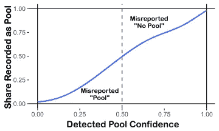
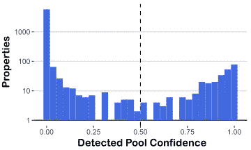
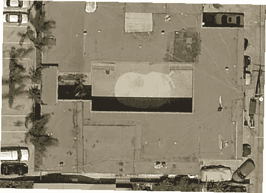
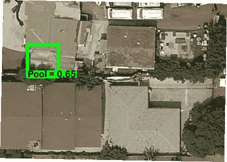
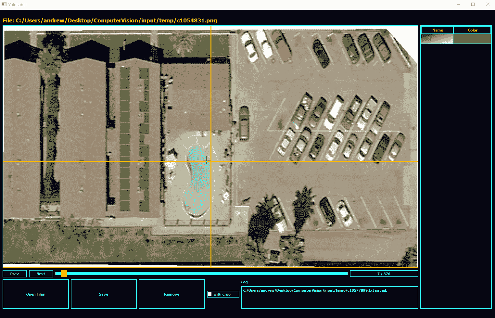
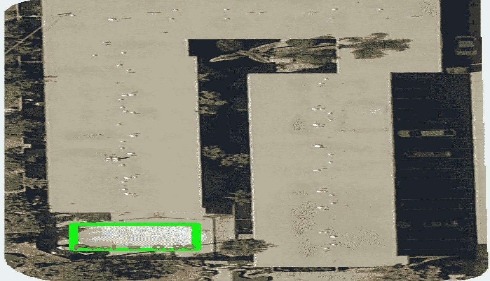

# 用计算机视觉补充财产数据库

> 原文：<https://towardsdatascience.com/supplementing-property-databases-with-computer-vision-ec519e5be66e?source=collection_archive---------59----------------------->

## 对象检测模型为改进现有的数据收集工作开辟了新的可能性

物业和地块数据库为学术和商业市场研究提供了巨大的价值。然而，这些数据库的维护成本很高，而且往往包含大量缺失、不正确或过时的记录。计算机视觉模型，加上可访问的卫星和街道图像，可以识别不正确的数据，并在这些模型经过训练以检测财产特征时估算缺失的记录。这种方法为收集数据提供了一种低成本的替代方法，否则需要通过现场访问、物业经理或业主进行报告。

在 [Res-Intel](https://res-intel.com/) ，我们正在使用计算机视觉模型来识别建筑特征，这些特征可以揭示建筑的能源使用和改造潜力。配有耗电的泳池泵、热水器和照明设备的游泳池是一个可以显著增加酒店能源使用的特色。县税评税员记录哪些财产有一个游泳池，并将这些信息存储在一个公共数据库中。然而，我们发现这些记录往往不完整或与观察不符。

# **物体检测 vs .公共记录**

在我们对圣地亚哥多户房产的分析中，我们发现税务评估员数据库没有为我们评估的近一半房产提供完整的池数据。为了填补报告空白，我们收集了所有多家庭房产的卫星图像数据，然后训练了一个对象检测模型，以在每个房产图像中找到池。我们成功地找到了丢失的记录，甚至在税务评估员的数据中发现了一些不一致的地方，否则这些数据会被忽略。

池的对象检测可以补充缺失的池记录并交叉验证现有记录。

在 10，714 个多户房产的样本中，42%的房产在税务评估员数据库中的“pool”字段中报告了缺失值。对象检测模型发现了 146 个在税务评估员记录中缺失的池，这可以在这张[互动地图](http://res-intel.info/medium/missing_pools.html)上查看。

税务评估员记录和模型的池检测置信度之间的不一致揭示了误报的池。(图片由作者提供)

大多数属性的预测具有接近 1 或 0 的置信度(注意纵轴上的对数标度)。零置信度意味着模型确定在资产处没有池。(图片由作者提供)

此外，一些评税员的记录似乎错误地报告了一处房产中存在一个游泳池:该模型在 114 处房产中检测到一个游泳池，评税员记录为“无游泳池”，而在 29 处房产中*没有*检测到一个游泳池，它记录为“游泳池”下面的卫星图像显示了一处多户房产，据估税员报告，该房产有一个游泳池。看起来好像在某个时期*的房产确实有一个游泳池，但是它已经被水泥填满了，这表明评税员的记录已经过时了。*

县税务评估员记录了这个地方的一个游泳池，但是很明显事情已经发生了变化。(图片由作者提供)

虽然对象检测方法经常在公共记录中发现错误，但重要的是要记住没有模型是完美的。事实上，我们对预测数据的手动检查导致我们发现了一些假阳性——模型预测存在一个水池，而实际上并没有。下图是一个例子，模型把铺在屋顶上的蓝色防水布误认为是游泳池。

该模型预测绿色边界框内的区域是具有 65%置信度的池。(图片由作者提供)

通过简单地限定如何使用预测，可以减轻甚至消除模型预测误差的影响。例如，在池检测模型与资产数据库记录相矛盾的情况下，我们可以选择仅当该模型以大于 90%的置信度预测池的存在时才相信该模型。

# **训练模特**

我们用来查找酒店特征的对象检测模型是由 Joseph Redmon 开发的“你只看一次”( YOLO)模型，此处[提供](https://pjreddie.com/darknet/)。目前有大量流行的对象检测模型，它们都是卷积神经网络(CNN)的扩展。CNN 通过提取一系列基于像素的基本特征并确定这些特征与一组对象类别之间的关系来对单个图像进行分类。水池、瓦片屋顶或汽车是可能在卫星图像中可见的对象类别的示例。经过训练的 CNN 模型可以预测像素集合代表一个池或任何其他可见对象的概率。一般来说，YOLO 模型和对象检测模型通过在更大图像内的提议区域上迭代其预测来扩展 CNN。

*训练*检测模型是校准分配给特征的权重的过程，这些特征用于预测图像中对象的存在。权重是通过*梯度下降*确定的，这是一个迭代过程，寻找使预测误差最小化的权重值(或与误差成比例的某个值)。

确定预测误差需要一个*地面真实*数据集，一系列手工标记物体的图像。我们的观察单位是单个物业的航拍图像，因此我们首先从高分辨率卫星图像光栅文件导出物业级别的图像。识别单个属性需要在栅格数据上叠加属性边界 shapefile。有了属性图像，我们使用 [YoloLabel](https://github.com/developer0hye/Yolo_Label) 来标记地面真实数据集，该数据集(正如您可以从名称中猜到的那样)以文本文件格式导出图像标签，该格式可以很容易地转换到 YOLO 模型。

手动标记图像的子集，并用于训练和验证模型。(图片由作者提供)

总共，我们标记了大约 2000 个池图像，并将它们分成*验证*和*训练*组。训练图像直接用于通过梯度下降来校准模型权重，而验证图像被搁置一边，稍后用于测量模型在它尚未看到的图像中检测对象的准确度。

*用于模型训练的计算资源*

训练神经网络模型是一项计算密集型任务。预处理 CNN 模型以提取有用的图像特征，减少了计算量；但是将这些特征连接到特定对象的数千个参数仍然可以通过迭代梯度下降过程进行优化。这种高度多维的优化问题通常需要高性能图形处理单元(GPU)提供的内存和计算能力。幸运的是，亚马逊网络服务(AWS)提供了远程弹性计算(EC2)服务器，这些服务器拥有强大的 GPU，可以以低廉的价格按小时租用。我们使用一个 p2.xlarge EC2 服务器，它带有一个 61 GB 内存的 GPU，以及一个预安装的 CUDA 和 TensorFlow 库，这些是利用 GPU 进行神经网络建模所必需的。训练池检测模型需要大约 18 个小时。

# **验证模型**

对一个模型最重要的测试是它在图像中检测到它还没有遇到的物体的准确性。我们的验证集包括 268 处房产，69 处有泳池，199 处没有。除了两个验证属性(AUC = 0.997)之外，集合检测模型准确预测了集合的存在和位置。这两个不正确的预测是假阴性:尽管模型*确实*检测到了这些属性的池，但它报告的置信度略低于 50%。总而言之，池检测模型证明是非常可靠的。

由训练的 YOLO 模型预测的池边界框。(图片由作者提供)

通过将预测的边界框与地面真实情况进行比较来评估对象预测的质量也是常见的做法，地面真实情况由两者之间的重叠统计或归一化距离来测量。然而，这些统计数据并不总是有效地传达关于模型性能的直觉。或者，我们可以目视检查图像的子集，并验证池边界框是否在正确的位置形成。上面的动画展示了随机选择的模型生成的边界框，它们精确地形成在目标位置周围。

## *关于 Res-Intel 工作的更多信息:*

[*Res-Intel*](https://res-intel.com/) *使用基于神经网络的对象检测模型，作为一种低成本工具，用于识别影响建筑能耗的属性特征。我们将这些数据与来自多个物业数据库的公共事业公司提供的汇总数据和记录相结合，以创建大规模的建筑级能源概况。我们与几家大型公用事业公司合作，构建和分析建筑组合，建立能耗数据模型，并设计研究来评估能效计划和技术。*