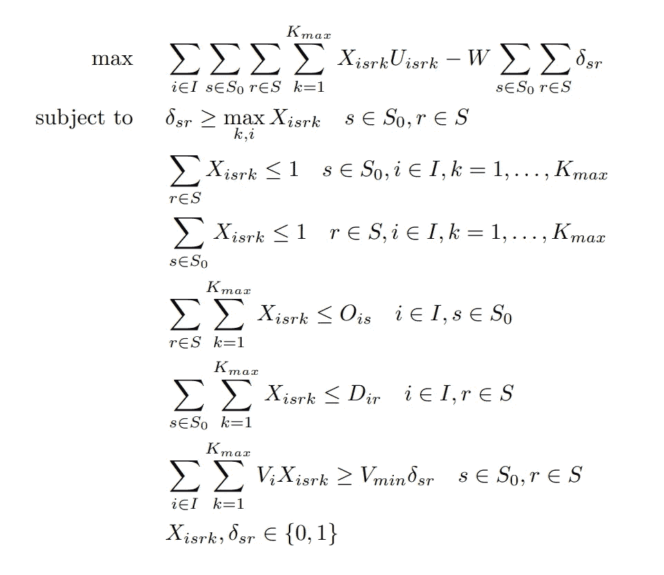

# 供应链优化:值得还是不值得？

> 原文：<https://towardsdatascience.com/supply-chain-optimization-worth-it-or-not-20ae4c6e635?source=collection_archive---------36----------------------->

## [商业科学](https://medium.com/tag/business-science)

## 数学优化的悖论不应该让你远离它的好处


由[约书亚·希伯特](https://unsplash.com/@joshnh?utm_source=medium&utm_medium=referral)在 [Unsplash](https://unsplash.com?utm_source=medium&utm_medium=referral) 上拍摄的照片

优化是如今人工智能对企业的一个主要卖点。每个人都希望提高自己的效率、收入和其他关键 KPI。这些都是合理的目标，也是可以实现的目标。我们可以使用优化原则来显著提高性能。

# 完美的不可能

然而，无论您如何努力实现最佳性能，完全优化都是不可能的。没有一个模型能够解释所有的可能性或实现完美的预测。在可预见的未来，人工智能技术还没有先进到足以让这成为可能。

而且，**定义什么是“最优”** [**提供了自己的挑战**](https://fab-evo.medium.com/the-zen-of-perfection-828010c87c98) 。每个企业都有独特的需求，因此，优化不同的目标。对一家公司来说是最优的策略在另一种情况下不太可能表现得一样好。完美是一个移动的目标，不是简单的一刀切的答案。


[engin akyurt](https://unsplash.com/@enginakyurt?utm_source=medium&utm_medium=referral) 在 [Unsplash](https://unsplash.com?utm_source=medium&utm_medium=referral) 上拍摄的照片

这就是为什么**优化是一个悖论**。它的目的使它不可能。你越想给它下定义，它就变得越难以捉摸。

# 为什么我们喜欢悖论

直面悖论并不是什么新鲜事。我们每天都要面对矛盾，对于像我这样的数学家来说，这通常很有趣。只需考虑一下在互联网上再次出现的自相矛盾的问题:

*如果你随机选择这个问题的一个答案，你答对的概率有多大？
A)25%
B)50%
C)0%
D)25%*

乍一看，这似乎很容易回答。但是你越想，越多的可能性看起来像正确的答案。这些可能性使这些答案变得不正确。最终，你意识到问题[没有答案](/the-1000-000-question-c89f2daa9b34)。你必须打破数学原理和逻辑。这种问题可能会让你一头雾水，但是试图讲道理是[磨砺批判性思维技能](https://www.researchgate.net/publication/263767004_Creative_Paradoxical_Thinking_and_Its_Implications_for_Teaching_and_Learning_Motor_Skills)的绝佳方式。


[沃洛德梅尔·赫里先科](https://unsplash.com/@lunarts?utm_source=medium&utm_medium=referral)在 [Unsplash](https://unsplash.com?utm_source=medium&utm_medium=referral) 拍摄的照片

然而，最优化的悖论可能特别令人讨厌。虽然有效的优化将提供一个提升，但它永远不会实现它所设定的目标。你永远不会给出最佳结果。

然而，我认为，正是这一点让优化和其他思维练习一样有趣。你有机会挑战关于做生意的最佳方式的假设。优化打开了新的可能性，与解决上面的问题不同，你得到了一个切实的结果的满足感。比如 **Boggi Milano** 可能并没有通过优化完全完善他们的供应链，但即使是**一个优化算法** [**的几次迭代也让库存效率提高了 18%**](https://customers.microsoft.com/en-us/story/837835-evo-pricing-boggi-milano-azure-italy) 。解决悖论的回报在优化中要大得多——你总是可以一点点接近完美。

# 优化背后的数学

尽管如此，即使没有尝试最优化的不可能性的矛盾，[最优化也是一个挑战](https://www.researchgate.net/publication/226934059_Why_Is_Optimization_Difficult)。最优化的数学和算法设计极其复杂。看一下我使用的优化公式中的一小部分:



作者提供的图片(抄送并注明出处)

正是因为这个原因，许多人发现优化令人生畏。如果你所有复杂的编程和困难的计算甚至都不会给你最终的答案，那何必呢？

# 优化就像洋葱

如果这还不够复杂，任何优化算法都不会涉及单一的优化计算。比如妖怪和洋葱(还有冻糕！)，优化有层次。您很少会有一个工作模型不包含至少几层相互依赖以给出结果的计算。

以 [**Evo 的**](https://evopricing.com/) **补给工具**为例。补货可用于优化供应链，实现全系统商店级补货。可以想象，优化这个需要优化大量的个体因素。**补充算法包含 3 个不同的优化循环:**

1.一个是根据需求确定每个商店的最佳产品组合

2.一个在整个系统范围内满足这一需求的系统，平衡现有资源和其他地方的需求

3.一个是以最具成本效益的方式在商店之间和仓库之间运送货物

必须在这些优化中的每一个内进行多次计算，优化在这些更大的优化模型内使用的因子。*单一模型需要层层优化*。剥开它们，你会发现优化比你想象的还要复杂。随着时间的推移，这留下了大量的空间来完善和改进结果，对于像我这样的数据科学家来说，这是一个既令人沮丧又令人兴奋的过程。

> 总会有误差，但总会有方法来改进我的结果:简而言之就是最优化的悖论。

# 如果最优结果是不可能的，那么优化值得吗？


Johannes Plenio 在 [Unsplash](https://unsplash.com?utm_source=medium&utm_medium=referral) 上拍摄的照片

所以如果你永远无法做到完美，优化值得吗？任何高管都会[很明显的说是](https://medium.com/datadriveninvestor/4-critical-data-science-skills-you-arent-learning-at-university-3c49797df948)。即使是微小的改进也会对底线产生重大影响，这对任何企业都有好处。

但是这并没有降低优化的复杂性。完美是不可能的，但我们必须不断努力实现它。我们不得不接受这个悖论。在尝试不可能的过程中，我们每天都离理想更近一步。

如果你对深入研究优化所需的计算或编程感兴趣，**Evo 大学** 有一门 [**优化课程**](https://university.evouser.com/course/view.php?id=26) **。我鼓励你查看一下，以便更深入地了解这个主题。**

还没入学？现在是时候了！前往[https://evo.ltd/join](https://evo.ltd/join)免费参观。

# 结论:值得

数学优化的许多功能和内在挑战不应该吓得你不敢抓住它的好处。


杰克·英格尔在 [Unsplash](https://unsplash.com?utm_source=medium&utm_medium=referral) 上的照片

毕竟不可能做到优于最优！你无法打败一个拥有高质量数据的设计良好的优化器。

我总是告诉我的父亲，尽管他一生都在 IBM 工作，但坐在方向盘后面时有一种意大利式的自豪感:谷歌地图导航将击败你的驾驶知识，除非你知道一些它不知道的东西。他今天还是不信任我，也许有一天？

PS 我定期写[商业科学](https://medium.com/tag/business-science)。推荐后续阅读:

[](/94-perfect-the-surprising-solution-to-the-200-billion-inventory-problem-b6ba0bc1417a) [## 94%完美:2000 亿美元库存问题的惊人解决方案

### 机器学习和人类经理一起修复供应链

towardsdatascience.com](/94-perfect-the-surprising-solution-to-the-200-billion-inventory-problem-b6ba0bc1417a) [](/fashion-is-broken-science-is-fixing-it-b771b1ab5b59) [## 时尚被打破了。科学正在修复它

### 转变 5 个核心时尚流程

towardsdatascience.com](/fashion-is-broken-science-is-fixing-it-b771b1ab5b59) 

```
Monthly Business Science in your inbox, new software, and University-level learning:[**Free access**](https://evouser.com/register)Questions? Please reach out on [Linkedin](https://www.linkedin.com/in/fabrizio-fantini/)
```