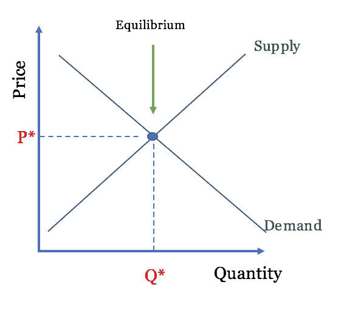
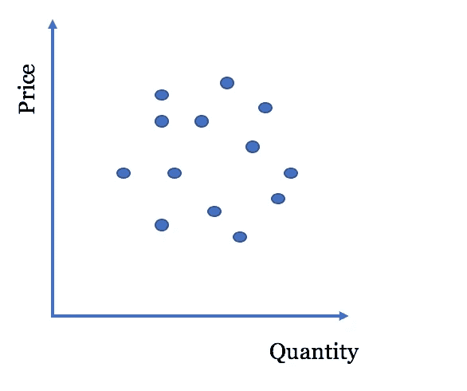
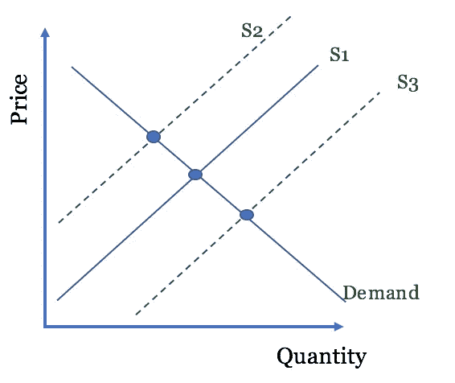
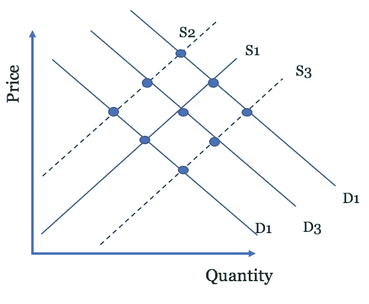
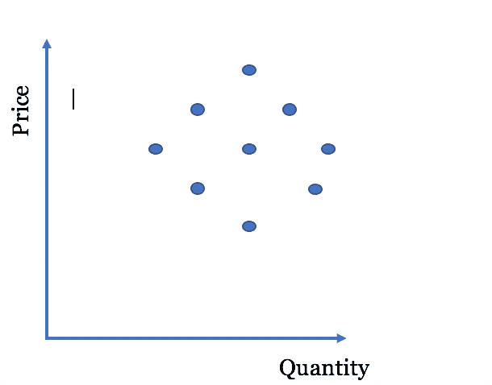
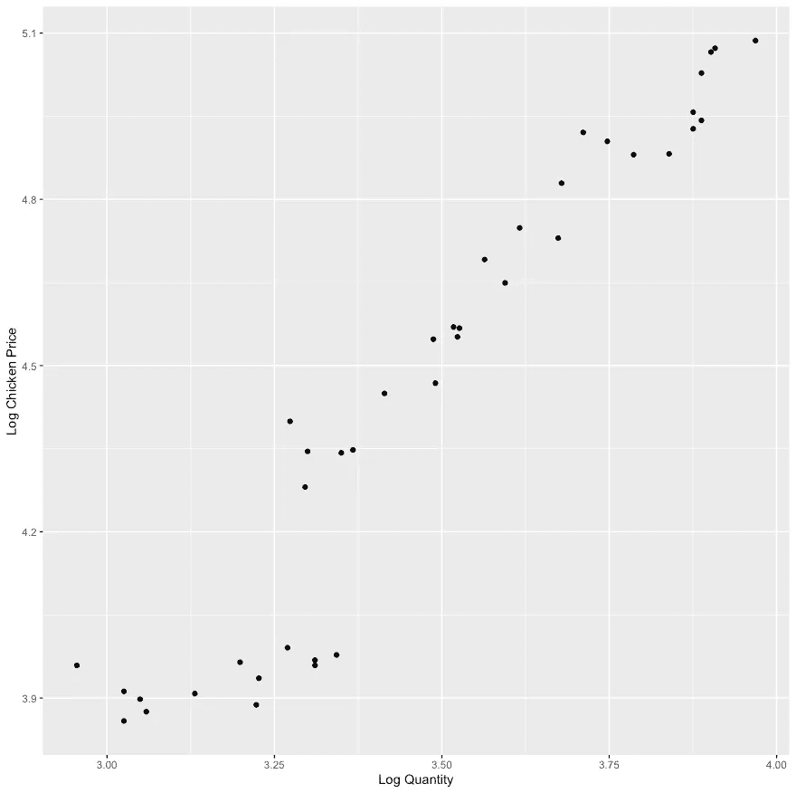
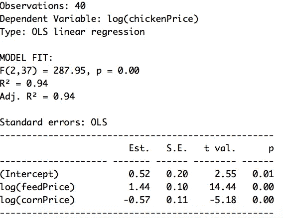
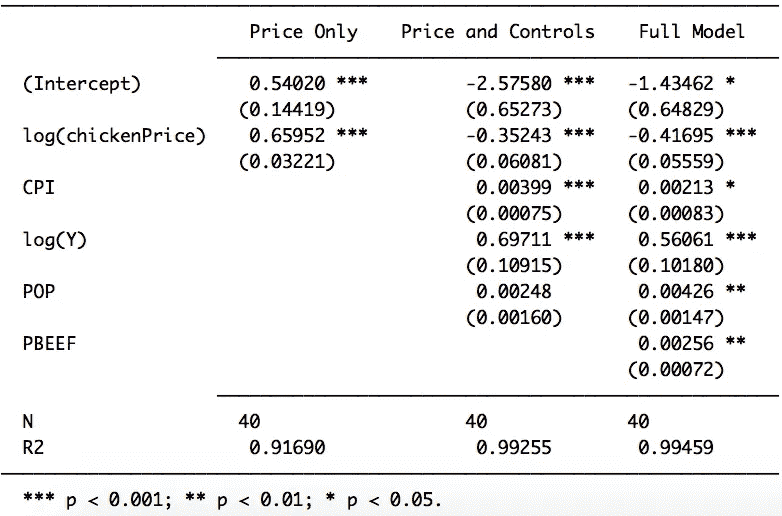
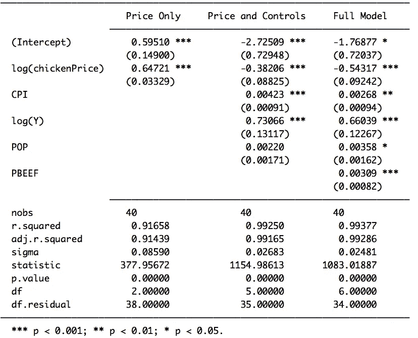

# 供给、需求和工具变量:经济学家工具箱给数据科学家的教训

> 原文：<https://towardsdatascience.com/supply-demand-and-the-instrumental-variable-lessons-for-data-scientists-from-the-economists-21af225187cd?source=collection_archive---------13----------------------->

## 和我一起假装一会儿。

假装——你好心但厌恶数据的前大学室友来向你寻求建议。看，他有了下一个颠覆可穿戴设备行业的大玩意:智能脚链(智能手表的明确继任者)。智能脚链将拥有一切——健康监测器、足部按摩器和睡眠追踪器，它会告诉你的 Keurig 什么时候该排队去喝早上的咖啡了。

只剩下一个问题。你的朋友需要一些市场分析来说服种子投资者，他可以以他们愿意支付的价格将智能脚链带给世界各地的千禧一代。这就是你进来的地方。你开始在网上搜寻可穿戴设备行业的数据(Kaggle 这次不会放弃)。最后，你偶然发现一些市场研究数据，开始埋头苦干，利用经济学原理课上残留在你大脑中的信息，开始估算需求曲线。这项工作似乎很简单——一些基本的线性回归，不需要 Keras 或 LightGBM 或 XGBoost。

所以，你开始你的探索性数据分析。你希望你的散点图显示出价格和数量之间明显的负关系，并在回归模型中出现一致的负价格系数。

你知道，就像这样。

眼熟吗？(作者创作)

相反，您最终会得到类似这样的结果:

和你想的不太一样。(作者创作)

你心里想，“这完全违背了 200 年来的价格理论”。然后，当事情没有按照你希望的方式发展时，你会求助于两个可靠的朋友——谷歌和 StackExchange。像往常一样，你会发现很多人都有同样的问题。

事实证明，这个问题非常简单。价格由需求和供给曲线的交点决定。这种关系给了我们第一次见识。为了估计需求曲线，我们需要供给曲线的变化或移动。通过观察供给曲线与需求曲线相交时的变化，我们可以描绘出需求曲线。大概是这样的:

由作者创建

太好了，问题解决了。或者，如果在保持需求不变的同时改变供给曲线是一个简单的壮举，那就有可能了。看，虽然我们需要供应曲线移动，但是我们没有办法用普通的最小二乘法(OLS)来保持我们的需求曲线不变。我们无法保持需求不变，这给了我们关于价格对需求量的影响的有偏见和不一致的系数估计。也就是说，在这种情况下，OLS 给我们的估计可能很好地反映了价格-数量关系的真实性质，即使是在大样本中。相反，我们可能观察不到任何关系，如下例所示。

左图:真实发生的事情。|右:我们能看到的。(作者创作)

谢天谢地，我们在 StackExchange 的朋友有一个来自 Phillip 和 Sewall Wright 的解决方案:工具变量回归。看，在喧嚣的 20 年代末——当时髦的女孩们挤进她们的福特汽车去爵士俱乐部时——菲利普·赖特和他的儿子休厄尔正为估算植物油和动物油的需求这个同样令人兴奋的问题而苦恼。当然，他们的散点图展示了和你的散点图一样的价格和数量之间的微弱关系。因此，他们开创了现在所谓的工具变量回归。他们在 1928 年面临的问题与你今天面临的问题没有什么不同，除了你开始分析智能脚链数据，他们被黄油和橄榄油卡住了。

# 什么是工具变量？

先说内生性。当一个变量的值与误差项 *u.* 相关时，该变量可被描述为内生变量。由于与统计偏差相关的各种原因，该变量可能是内生变量。也许研究人员遇到的最常见的内生性来源来自被忽略的变量偏差。当试图确定某个变量 *X、*对我们的因变量 *Y、*的影响，而不包括另一个与 X 和 Y 都相关的解释变量 *W* 时，就会出现省略变量偏差

例如，吸烟和饮酒都是可能与预期寿命负相关的习惯。然而，吸烟和饮酒本身也可能是相互关联的。因此，如果我们创建一个模型来估计吸烟对预期寿命的影响，而不包括饮酒习惯，我们可能会夸大吸烟对预期寿命的影响。忽略在我们的模型中包括酒精消费会给我们一个*有偏差的*吸烟回归系数。

省略变量偏差有一个相对简单的解决方案——在模型中包含省略变量。然而，有时克服统计偏差变得更加困难。考虑省略变量偏差的情况，我们只是没有省略变量的数据。另一个常见的问题是同时因果偏差的情况——在这种情况下， *X* 影响 *Y* 但 *Y* 也会增加*X。*经济学家在试图确定警方资助对犯罪的影响时会遇到这个问题。更多的警察理论上应该会降低犯罪率，但是更高的犯罪率可能会吸引更多的警察资金来打击这些犯罪率。在这两种情况下，运行简单的线性回归将会得到有偏差的回归系数。我们没有理由相信我们在这些模型中观察到的系数反映了 *X* 对 *Y.* 影响的真实性质

这就是工具变量发挥作用的地方。

工具变量是一个允许我们规避内生性问题的变量(我们称之为 *Z* )。当我们实施工具变量回归时，我们主要关注内生变量，并将其分解为两个组成部分。第一部分是有问题的内生部分。这是变量中产生统计偏差的部分。在省略的可变偏差示例中，这是与酒精消耗相关的部分。在同步因果关系的例子中，这是高犯罪率导致警察经费增加的部分。

然而，第二部分是我们感兴趣测量的变量的不成问题的外生部分。如果我们能够捕捉到这部分变量的影响，我们就可以获得无偏回归系数，从而估计 X 对 y 的影响的*真实性质*

工具变量，或简称为工具，允许我们分离出内生变量中没有问题的部分。如果工具变量 *Z，*满足两个特定标准，那么工具变量回归将给出我们的回归系数的估计值，该估计值比简单的普通最小二乘法的估计值更接近其*真值*。

这两个标准如下:

1.  **工具相关性:**工具变量， *Z，*必须与我们的内生变量， *X* 相关。数学上表示，corr ( *Z* ， *X* ) ≠ 0。直觉上，如果 *Z* 与 *X* 不相关，我们将无法根据我们的工具变量捕捉到 *X* 的任何变化。
2.  **工具外生性**或**工具有效性:**工具变量 *Z* 必须是外生性的——与误差项不相关。数学上表示，corr ( *Z* ，u) = 0。如果 *Z* 与误差项相关，那么我们将违反高斯-马尔可夫定理，并且无法确定 X 和 y 之间的无偏且一致的回归系数。

一个合适的工具满足这个描述:变量 Z 与变量 Y **仅通过其与 x**的相关性相关

为了进一步理解什么是好的工具，让我们看另一个经济研究的例子。劳动经济学家通常对学校教育的回报感兴趣，即多上一年学对个人工资的影响。然而，有几个混淆和不可观察的因素会影响一个人多上一年学的决定。一个不可观察的因素是天生的能力。先天能力水平较高的人更有可能多上一年学。因为多上一年学与能力相关，而我们无法在 OLS 模型中恰当地包含能力，所以受教育年限将是一个内生变量。

因此，像 Card (1995)这样的论文利用地理数据来估计学校教育-收入关系的真实性质。地理上靠近大学使得多上一年学更有可能。这满足了**仪器相关性条件。与此同时，个人的父母通常决定住在哪里。只要地理邻近性与能力不相关，这可以通过控制父母教育和收入等可观察因素来实现，那么邻近性变量应该是外生的。这满足了**仪器的有效性条件。**在学校教育回报的背景下，地理上的邻近性与终生收入*之间的关联仅仅通过*它对获得额外教育的可能性的积极影响。这是一份相关和有效的文书的要素。**

# IV 回归是如何工作的？

OLS 回归只是简单地将 Y 回归到 X 上，而 IV 回归包含两步过程(这就是 IV 回归的另一个名称是两步最小二乘法的原因)。第一步，我们在 z 上回归 x。这给了我们一组预测值，X̂.在第二步中，我们对预测值 X̂.回归 y 下面是 IV 回归过程的演示。

**第一步)**

> *x̂=π0+π1(z)+v*

其中 *v* 是误差项。

**步骤 2)**

> Y = ß0+ß1(X̂)+ ε

其中，ε是误差项。

因为我们的工具变量必须是外生的，所以由 *X* 对 *Z* 的回归预测的 X̂值也将是外生的。因此，这第一步移除了我们解释变量中有问题的内生部分， *X.* 这允许我们在 *X̂* 上回归 *Y* ，而不必担心内生性。

让我们暂时回到菲利普和休厄尔·赖特身上来。父子二人组意识到，要估计黄油的需求曲线，他们需要在保持需求不变的同时，隔离供应的变化。通过在供给变动时保持需求不变，莱特兄弟知道他们能够估计出各种供给曲线与需求曲线相交的所有点。为了做到这一点，莱特兄弟使用降雨作为他们的工具。父子二人推断，降雨量少会减少放牧，从而降低黄油产量。这将影响供应，但降雨应该不会对黄油需求产生任何有意义的影响。作为一种工具，降雨量满足相关条件——降雨量与黄油价格正相关。并且降雨满足外生条件——降雨只通过供给影响黄油价格。

菲利普和休厄尔·赖特为众多经济学家和聪明的分析师提供了有价值的见解。通过实施 IV 回归，使用改变供给而不是需求的变量作为工具，我们可以获得需求曲线的一致估计。我们现在准备带着真实数据的例子艰难前行。

# 数据

好吧，完全公开——我没有任何关于智能脚链或智能手表或智能任何东西的数据来分析这篇文章。然而，我所拥有的是 1960 年至 1999 年间肉鸡价格的一个非常令人兴奋的数据集。很有趣，我知道。然而，用于估计需求的 IV 回归原理适用于任何产品。

这些数据来自 Epple 和 McCallum (2006 年)。该数据集由鸡肉和牛肉价格、鸡饲料价格、人口、人均收入和通货膨胀的年度面板数据组成。

下面是对数数量和对数鸡肉价格的散点图(价格在 y 轴上，这是经济学的惯例)。

正如我们所看到的，这种关系似乎与需求曲线的方向相反，因为数量在价格上增加。因此，这个问题需要一个工具变量的方法。

# 识别需求曲线

正如我前面所讨论的，确定需求曲线需要保持需求不变，同时检测供给曲线的变化。正如前面 1700 左右的话应该已经说得很清楚了，这样做的关键是工具变量回归。具体来说，我们需要确定一个外生变量，它只通过对供应的影响来影响价格(T2)。

对于莱特兄弟和他们基于黄油的分析，选择的工具变量是降雨量。低降雨量减少了奶牛可以吃草的土地面积，从而降低了黄油产量。然而，没有理由相信降雨对黄油的需求有任何有意义的影响。对于我们的鸡肉或智能脚链数据，我们需要确定具有类似影响的变量——导致供应变化，同时对鸡肉/智能脚链需求没有任何影响。

寻找相关变量的第一个地方是输入。在我们的鸡肉数据中，我们有关于玉米和鸡饲料的信息。这些投入的价格通过它们对生产产出的成本的影响而与产出产品的价格相关联。当鸡饲料价格下降时，鸡肉价格也会下降，因为生产鸡肉变得更便宜。更便宜的投入意味着最终产品可以更便宜地生产。利润最大化的公司有动机生产更多，增加数量，同时降低价格。投入价格的变化导致供给曲线移动，使我们能够描绘出需求曲线。

这些原则很容易转移到智能脚链上——只需用钢铁、硅、铝和原油等类似投入材料的价格取代“鸡饲料”价格。

部署工具变量方法的第一步是回归我们工具的价格。大多数统计软件包都有计算 IV 回归的功能，而不必手动计算第一步 OLS 回归。然而，计算第一步回归允许我们诊断我们使用的工具是否是解决我们问题的有效工具。

一个重要的考虑是我们的工具是否相关。回想一下，当 corr(X，Z) ≠为 0 时，仪器是相关的。如果一个工具不能解释内生 X 变量的大部分变化，那么它就被认为是“弱工具”无需深究(更多信息可在此处找到)，使用弱工具的 IV 回归结果可以创建偏向 OLS 方向的参数估计。不理想。然而，一个简单的经验法则是，只要第一阶段回归的 F 统计量超过 10，就可以认为一个工具是*而不是*弱的。因此，我们将手动计算回归的第一阶段。

我们的 IV 回归方法的第一步是在工具上回归对数鸡肉价格:对数鸡饲料价格和对数玉米价格，这样我们的方程看起来像:

> ln(鸡价)= 0+1 * ln(鸡饲料)+2 * ln(玉米价格)。

下面是使用 jtools 包产生的第一阶段回归输出。287.95 的 F 统计量大大超过了判断我们的工具是否相关的经验法则。而且，调整后的-R 值 0.94 告诉我们，这些工具非常适合鸡肉价格。

因此，我们可以满怀信心地进入第二阶段。

在 IV 回归的第二阶段，我们根据内生自变量和任何其他外生自变量的预测值来回归因变量。在这种情况下，因变量是对数数量，预测变量是对数鸡肉价格。为了确保我们的回归系数不会因遗漏变量而有偏差，我们将包括额外的预测因素，如收入、通货膨胀、人口和牛肉价格。牛肉价格包括在内，因为它们代表了鸡肉的替代品。我们的模型被指定为:

> ln(Q)= 0+1 * ln(Pred。小鸡价格)+2 * ln(Y)+3(CPI)+4(牛肉价格)+4(人口)

其中 Q 代表数量，Y 代表收入，CPI 代表消费价格指数。

所以让我们估计一下我们的模型。下面是一组 OLS 回归的模型估计，其中 I *没有*实现工具变量。

正如我们在“仅价格”模型中看到的，价格对数量的影响是积极的，这与我们对需求曲线关系的预期相矛盾。然而，当我们在随后的两个模型中添加控制变量时，价格系数的符号会发生变化，以符合我们的预期。

然而，在咨询了菲利普和休厄尔·赖特之后，我们太聪明了，不会被这些有偏见的回归系数所迷惑。相反，我们需要实现我们的工具变量方法。当我们这样做时，用玉米和鸡饲料价格作为我们的工具，我们将获得无偏回归系数。以下是工具变量模型估计，控制变量与上述相同。

有趣的是，在没有额外控制的第一个模型中，价格变量的符号是错误的，就像上面的传统 ols 模型一样。这表明在价量关系中存在显著的遗漏变量偏差。然而，OLS 模型和 IV 模型之间的关键区别在于“全模型”规格。

OLS 模型表明，价格上涨 1%会导致鸡肉需求量下降 0.42%。然而，IV 模型表明，价格上涨 1%会导致鸡肉需求量下降 0.54%。IV 模型的结果表明 OLS 对价格-数量关系的估计偏向于零，因此*低估了*价格对数量的影响。

# 智能脚链行业的应用

在我们的例子中，有偏差的 OLS 结果和无偏差的 IV 结果之间的差异非常显著，尤其是对于快节奏鸡肉生产行业的数据科学家而言。对于你在智能脚链行业的朋友来说，这种差异也非常重要。

对于商业应用，对潜在市场的准确评估是很重要的。你的朋友希望将智能脚链引入可穿戴设备行业，他需要彻底了解消费者在决定购买哪种可穿戴产品时如何评估价格。如果你向你的朋友提供 OLS 结果，而不是我们上面例子中的 IV 结果，他会低估消费者对价格的敏感度。因此，他可能会把他的产品以过高的价格推向市场，超出消费者的支付能力。

因此，让我们回顾一下估算准确需求曲线的关键步骤。

**步骤 1)识别您的乐器**

回想一下，价格是在供给曲线和需求曲线的交叉点上确定的。正如 Philip 和 Sewall Wright 认识到的，我们可以通过保持需求不变，利用供给曲线的变化，并确定交点来描绘需求曲线。从统计学上来说，我们可以通过在 IV 回归过程中使用供应转移器作为工具来实现这一点。作为工具包括的关键变量是影响生产成本的变量，如投入材料的成本。在技术部门，这种投入可能包括硅、钴和铝。在肉类产品中，这些投入可能是玉米、小麦或农民为牲畜购买的其他商品的价格。在任何情况下，我们都需要批判性地思考，在我们感兴趣分析的任何市场中，是什么影响了生产商品的成本，然后在我们的模型中使用这些变量作为工具。

**第二步)检查你的仪器**

回想一下我们的两个条件:工具相关性和工具外生性。这些可以总结为一句话-Z 变量应该只通过它与 X 变量的关系来影响 Y 变量。就需求曲线而言，该工具应该只通过对供给曲线的影响来影响价格。也就是说，工具的变化不应对需求产生任何影响。这最后一部分与仪器的外生性有关，通常不是一个可测试的条件。这意味着，我们需要利用我们的行业专业知识和直觉来确定我们的工具是否只是按照预期转移供应。

在菲利普·赖特的问题中，降雨可以持久地影响需求和供给。更高的降雨量可能会阻止市场上的人离开舒适的小屋去买黄油。然而，利用我们的直觉，我们可以得出结论，这种关系可能很小，很难观察到，或者不存在。然而，要记住的重要一点是，我们必须批判性地思考我们的工具是否满足这两个必要条件。

**步骤 3)考虑省略的变量和模型规格**

正如联立方程被证明是确定需求曲线的一个问题一样，省略变量也是一个问题。正如我之前讨论的，省略变量会在我们的模型中引起统计偏差，这就是为什么使用控制变量很重要，即使在 IV 模型中也是如此。在估计需求曲线时，收入是一个关键变量。收入是需求转移因素——随着收入的增加，消费者倾向于以同样的价格要求更多的产品。对于市场分析师来说，了解消费者的收入和他们以一定价格购买产品的意愿之间的关系是一条关键信息。正如我们在上面的例子中看到的，包括收入和替代商品的价格等变量可以显著地改变回归系数，使其接近无偏的真实系数值。因此，我们应该努力追求并包括任何我们认为可能改变需求曲线的变量，作为我们模型中的外生变量。

此外，理解模型规范也很重要。两种最常见的规格是线性需求曲线和对数需求曲线。关于实现哪个规范的决定很大程度上取决于哪个解释更适合数据。在线性需求曲线中，价格每增加一个单位，需求量就会减少-1。同时，根据对数需求曲线，价格上涨百分之一*会减少百分之一的需求量。在任何情况下，我们都可以通过估计两个模型来测试哪个模型更好地拟合数据——一个模型中的数量和价格是对数转换的，另一个不是——并比较拟合优度度量，如 R。*

**第四步走向世界**

一旦您确定了潜在的工具，审查了它们的外来性和相关性，并考虑了您的模型规范，您就可以部署工具变量回归了。无论你是一家正在制定定价策略的初创公司，还是一家试图更好地了解你的客户群的老牌公司，工具变量都可以在你的数据科学武器库中扮演 ***工具*** 角色。