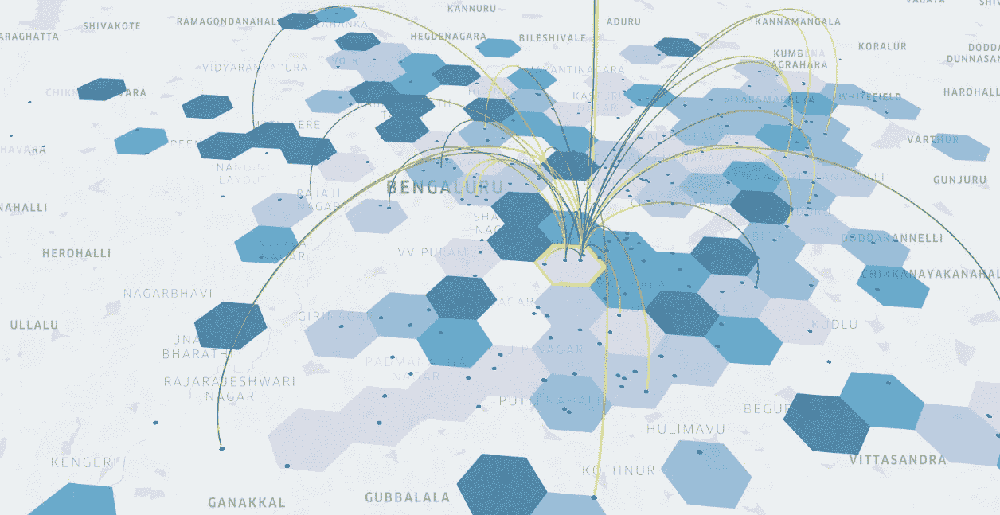
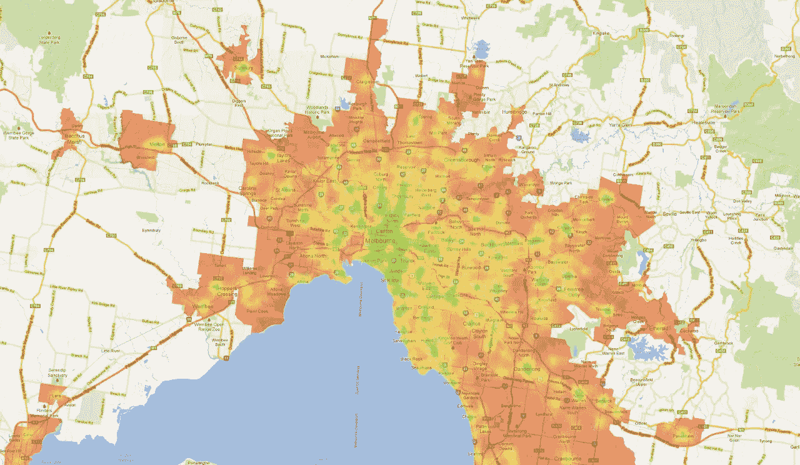
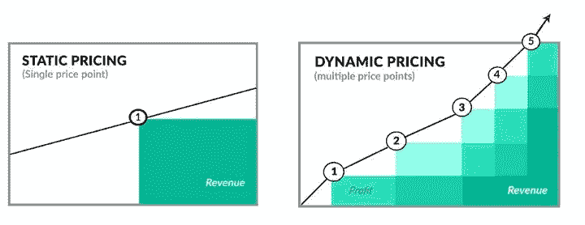
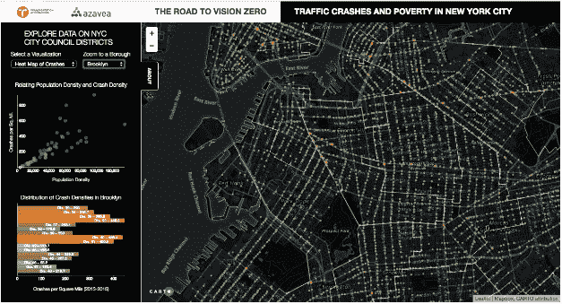
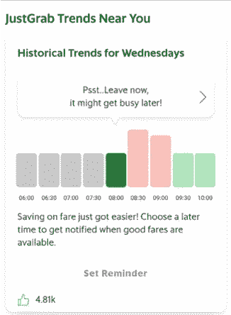
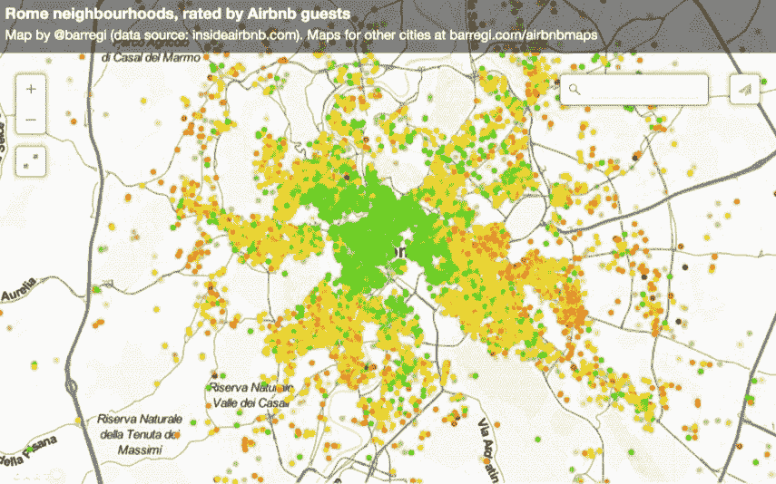

# 使用地理空间数据的实时供求差距

> 原文：<https://towardsdatascience.com/supply-demand-gaps-in-real-time-using-geospatial-data-b125a87119c1?source=collection_archive---------30----------------------->

## 分析这些差距是弥补差距和优化机组经济性的第一步

今天，每个人都使用谷歌地图导航到任何地方。同样，为什么每个公司都不应该有自己的地图来了解其资产(人、自行车、滑板车、汽车、设备、产品)在哪里，以及它们应该在哪里？

# “哪里”的问题。

如果你是一家在地面上有移动资产的公司，这些资产连接到互联网，并始终有一个唯一的位置——大约有 80%的数据有这个空间成分！

> *但是，我们都知道在 excel 表格中查看位置数据是没有用的。*

为了理解纬度，你需要能够在地图上可视化它们，理解“它们从哪里来”，识别你的业务指标的空间模式，以及它们如何在一个城市和城市内的不同部门之间变化。

# 一件有趣的轶事！

电子商务(服装)公司最重要的问题之一是欺诈和滥用折扣。在绘制他们的数据时，他们发现即使是欺诈也有空间模式！

大多数案件发生在大学周边地区，这意味着可能有学生滥用优惠券代码。

# 是经济学 101！

在空间模式的基础上更进一步，可视化您的位置数据也有助于您分析您的供需缺口以运行各种空间模型。

**这个流行语，供需！** 定义因组织而异。对于 [Grab](/understanding-supply-demand-in-ride-hailing-through-the-lens-of-grab-data-23e24224547f) 来说，单个供应单位是在线且空闲的司机，单个需求单位是查询乘车费用的用户。对于 [Airbnb](https://medium.com/airbnb-engineering/learning-market-dynamics-for-optimal-pricing-97cffbcc53e3) ，供应单位是一个 Airbnb 单位。

优步

如果你是一家超本地/拼车/酒店公司，你的目标应该始终是确保订购送货/服务/乘车的用户与最接近他们的司机/送货/服务合作伙伴相匹配，从而在最短的时间内弥合差距。换句话说，

> *供需匹配是您业务的核心和灵魂。*

弥补这些差距必然会带来更多的单位收入，从而提高用户的效率和体验。

您可以实施计划措施以在高需求区域产生供应，或者检查假设情景以增加高供应区域的需求！

现在你知道了这些差距在哪里，你会怎么做？

# 为您的合作伙伴提供更多$$$价值！

动态定价

让这些数据具有可操作性并弥合差距的一个简单方法是将你的“过剩供应”导向高需求领域。

像 Grab、**[*Swiggy*](https://blog.swiggy.com/news-updates/a-new-app-to-empower-our-delivery-partners)*这样的公司已经建立了合作伙伴应用程序，显示需求区域的热图。他们根据收取的费用“激励”合作伙伴。***

**如果你对优步的飙升定价感兴趣，你可以点击这里:**

** [## 位置数据如何帮助优步决定价格飙升

### 位置智能弥合供需差距

towardsdatascience.com](/how-location-data-helps-uber-decide-surge-in-price-7796ec9c8fba) 

例如，在高需求时期，优步在其基础定价上增加了一个乘数，以确保司机涌入该地区赚取更多的钱，而负担得起的乘客可以乘坐，而其他人可以等到票价下降。

有道理，对吧？司机或合作伙伴不应该根据他们的直觉来估计他们空闲时要去哪里。那些动作背后应该有真实的数字，真实的地图做后盾！

事实证明，这在天气恶劣、交通繁忙、高峰时间或像除夕或排灯节这样的特殊事件时非常有效！

# 引诱你的潜在客户！

在拼车/拼车公司的情况下，偏离骑车人的原始路线是不太可能的。既然供给不能被篡改，那救市就有需求！

你可以向那些低需求地区的客户发送有针对性的促销信息——提供优惠和折扣来吸引他们。

每当你的供需比低于某个阈值时，将所有低需求区域聚集起来，并发送自动促销。尝试和构思，总结出在哪些地方、哪些类型的顾客身上有效的方法。

如果你想了解更多关于地理营销的信息，请查看:

 [## 2020 年地理营销你需要知道的事情！

### 你是一家希望识别回头客的打车公司，还是一家希望接触到……

blog.locale.ai](https://blog.locale.ai/things-you-need-to-know-about-geomarketing-in-2020/) 

# 精心挑选下一条路线！

*供需缺口也有助于确定新配送中心的位置，或将一个仓库分成多个中心，或将所有中心集中到一个公共位置。*

了解您当前的订单是如何聚集的大有帮助！**聚类**基本上是指使用一定的分类标准将大量数据分成更小的组。

根据可以更有效地联系到您的客户的位置，可以轻松确定位置。

如果你的模式更像是班车服务，那么当你的路线确定后，你也可以进行同样的练习——确定你的取货点应该在哪里，或者应该采用哪组新路线！

阿扎韦亚

# 动需求玩神！

需求预测在跨公司的数据科学活动中非常常见。然而，这些模型不包含“位置”元素。

*如果贵公司处理自行车、自行车等资产的分配。的情况下，不仅应根据历史供需缺口优化位置，还应根据固定时间间隔内该地区的预测需求量优化位置。*

例如，[优步](http://analyticsindiamag.com/uber-uses-data-analytics-supply-positioning-segmentation/)知道什么时候、哪一天、哪个地区的需求量最大。他们对一个城市的过去数据进行 3-4 周的处理，然后根据一天中的每个小时和一周中的每一天进一步深入特定的中心/口袋。

夺取

Grab 走得更远——它在骑手应用程序上有一个**旅行趋势**小部件，供骑手了解未来的预测需求。其目的是鼓励对时间不敏感的乘客选择晚点乘车，为有更紧急需求的乘客服务。

*对于一家拥有仓库的超本地公司来说，了解和预测需求有助于在城市的不同配送中心储备不同的产品。*

即使是一线城市也有表现得像三线城市的口袋。需求预测是棘手的，虽然它与您的历史数据有很大关系，但它也涉及到在您的模型中使用外部数据源，如天气、交通等，以使您的模型更加精确和准确。

# 画画比较好的推荐！

爱彼迎（美国短租平台）

根据这篇 Airbnb [文章](https://learnairbnb.com/airbnb-supply-demand-dynamic-airbnb-pricing/)，

> *如果你没有基于位置的动态定价，你只是把大量的钱留在桌面上。*

酒店公司有固定的供应或占用。这里的需求是季节性因素。即使在一个城市内，在一个吸引人的季节，需求也会根据分行所在的社区或位置而变化。

*供需缺口有助于你设计好的推荐和定价策略。*

# 底线

毕竟，在超本地和打车领域，你的最大目标是确保你的用户在他们需要的时间和地点尽可能快和早地获得乘车服务，同时为你的乘客提供优质服务，为你的合作伙伴提供更好的生计。

*在一天中的不同时段进行基于位置的精细定价、促销和分配可以证明非常有利可图！*

在未来几年，你的成功很大程度上要归功于能够处理数据，预测客户想要什么，他们何时想要，通过什么渠道，最重要的是，他们希望在哪里可以获得。

如果不将空间环境添加到您的算法中，您最终会将所有这些操作决策留给猜测。

> *在*[*locale . ai*](http://locale.ai)*，我们的使命是为每一家收集位置数据的公司带来与优步和 Grab 相同水平的粒度分析。*

我们使用一个由 [**颗粒** **六边形网格**](/spatial-modelling-tidbits-honeycomb-or-fishnets-7f0b19273aab) 组成的系统来做这件事，我们把它当作最小的地理单元。这充当了在位置环境中工作的每个算法、分析和服务的基础。

要了解我们的工作，请查看:

 [## 使用地理空间数据进行移动分析的产品

### 是什么让实时位置数据的分析与众不同？

towardsdatascience.com](/a-product-for-movement-analytics-using-geospatial-data-2aa95b18d693) 

> 毕竟，每个公司都需要自己的谷歌地图。

***如果你想进一步钻研，可以在***[***LinkedIn***](https://www.linkedin.com/in/aditi-sinha-6b774ba9/)***或***[***Twitter***](https://twitter.com/aditi1002)***上与我取得联系。原来贴*** [***在这里。***](https://blog.locale.ai/how-analyzing-supply-demand-gaps-can-optimize-your-unit-economics/)**