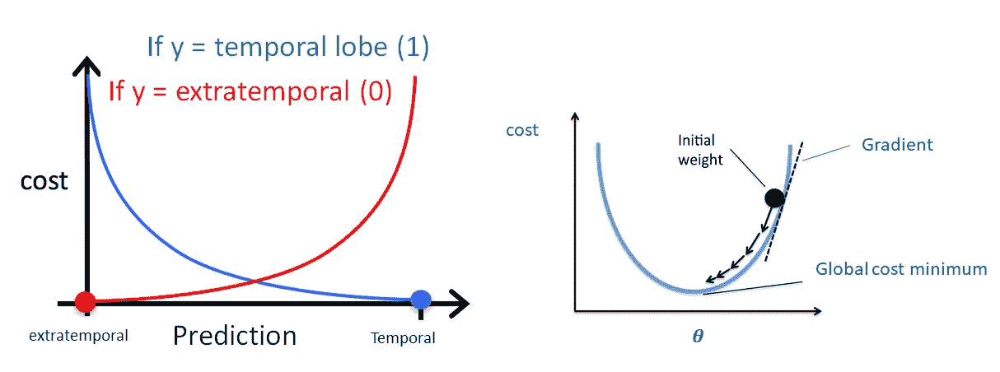
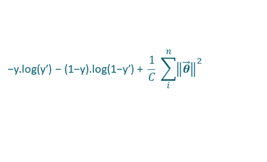
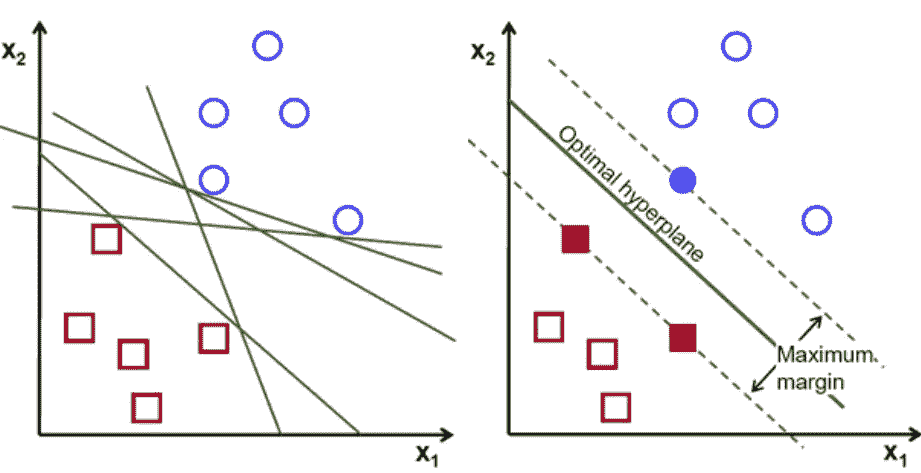
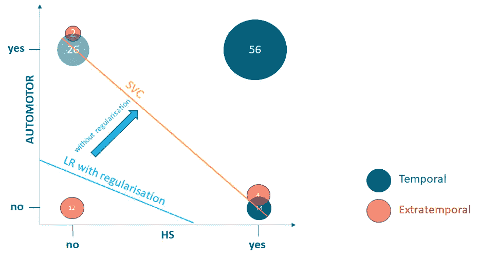
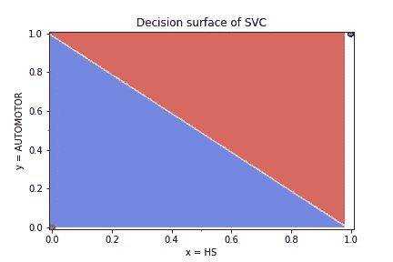

# 收敛支持向量分类器和逻辑回归

> 原文：<https://towardsdatascience.com/support-vector-classifiers-and-logistic-regression-similarity-97ff06aa6ec3?source=collection_archive---------44----------------------->

我将展示一个逻辑回归的决策边界何时收敛到 SVC 的决策边界的例子(从左上到右下的图解)，如这里在逻辑成本函数中减少正则化参数的步骤所示(C 是正则化的逆)。

# 介绍

支持向量分类器(SVC)和逻辑回归(LR)可以对齐到它们可以是完全相同的东西的程度。理解 SVC 和 LR 何时完全相同将有助于直观地了解它们到底有什么不同。

逻辑回归(LR)是一种使用 sigmoid 函数的概率分类模型，而支持向量分类器(SVC)是一种更具几何性的方法，可以最大限度地提高每类的利润率。它们的相似之处在于，它们都可以用决策边界来划分特征空间。我经常听到关于这两种机器学习算法之间差异的问题，对此的答案总是集中在 LR 中 log-odds 广义线性模型的精确细节以及 SVC 的最大边际超平面、软边际和硬边际上。

**我觉得看相反的情况很有用:**LR 和 SVC 什么时候完全一样？！

**答案:**当专门使用具有二元结果预测器的二元特征、没有正则化的 LR 模型和具有线性核的 SVC 时。

让我们简单回顾一下 LR 和 SVC，然后举例说明这些决策界限可以完全相同。

# 逻辑回归

让我们举一个例子，使用癫痫发作的样子(符号学)和我们在大脑扫描中发现的东西，尝试确定癫痫发作是来自大脑中的颞叶还是其他地方(颞外)。

**特征:**癫痫发作时会发生什么，例如手臂抖动或拨弄手指(符号学)以及脑部扫描异常，称为海马硬化(HS)(所有特征都是二元的)

目标预测因子:癫痫发作来自颞叶吗？(二进制)

图 1:逻辑回归总结

逻辑回归是一个分类模型，尽管它的名字。基本思想是给模型一组输入 x，它可以是多维的，并得到一个概率，如图 1 的右图所示。当我们希望二进制目标的概率在 0 和 1 之间时，这可能是有用的，而不是线性回归(图 1 的左图)。如果我们重新排列上面的 sigmoid 函数并求解 x，我们会得到 logit 函数(也称为 log-odds ),这是一个清晰的广义线性模型(图 1 中的底部方程)。

LR 是在该模型中寻找最佳(θ)系数，从而通过梯度下降将总误差(成本函数)降至最低(图 2):

图 2: LR 成本函数使用颞侧与颞外癫痫病灶作为目标预测因子。左边的图像用 cost = -y.log(p(x)) — (1-y)表示。log(1-p(x))。其中 y 是真正的二进制标签。右图显示了使用系数偏导数的梯度下降。

向成本函数添加正则化参数(1/C)(乘以系数的平方和):

等式 1:LR 的 L2 正则化的成本函数。L2 意味着θ系数是平方的。y 是真正的二进制标签。y’是模型预测的标签概率:p(x)。

Sklearn 有一个 [LogisticRegression()](https://scikit-learn.org/stable/modules/generated/sklearn.linear_model.LogisticRegression.html) 分类器，默认的正则化参数是 penalty=L2 和 C=1。这个术语惩罚过度拟合。不幸的是，在下面的特殊情况下，这也可能导致拟合不足，从而导致交叉验证性能变差。但是当这种规范化被移除时，对于下面的特殊情况，我们将看到它合并成与 SVC 相同的模型。

# 线性支持向量分类器

图 3:左边的线性决策边界。右图显示了从 SVC 优化得到的最大硬边界超平面。图片来自[https://towards data science . com/SVM-feature-selection-and-kernels-840781 C1 a6 c](/svm-feature-selection-and-kernels-840781cc1a6c)

LR 将绘制一个单一的边界来分隔时间和时间外癫痫发作，而线性 SVC 首先找到两个支持向量，然后找到最佳超平面(图 3 的右图)。为了优化这一点，SVC 使用了一种带有这些约束的[拉格朗日乘数](https://en.wikipedia.org/wiki/Lagrange_multiplier)方法:边缘超平面必须尽可能多地分离数据，并且两者之间的距离必须最大化。通过 [svm 中确定核的方法。SVC(kernel='linear')](https://scikit-learn.org/stable/modules/generated/sklearn.svm.SVC.html) ，我们有一个线性 SVM。

# 当 SVC 和 LR 收敛时

现在让我们以 2D 二元特征空间分类问题为例:

图 4:当线性 SVC 和 LR 收敛时

SVC 模型的边缘线重合，因为右下角和左上角的所有数据都重合。因此，SVC 的最大裕量为零，其决策边界为黄色(图 4)。

LR 有一个正则化参数 1/C，它与对数损失成本函数(图 2，等式 1)相结合，可以降低系数的幅度(图 1 ),导致蓝色决策边界。通过将 C 设置为一个大的数字，从而将正则化减少到零，两者的决策边界(蓝色和黄色)开始收敛。

这将适用于大多数二进制特征数据。接下来是 Python 代码，因此您可以复制图 4 中的可视化的更简单版本，其中决策边界完全收敛。

# 代码和结论:

可以在 GitHub 上找到一些简单的代码，用于合成基本数据，并拟合 SVC 和 LR(有和没有正则化),以便我们可以看到它们的决策边界收敛和重合:

[**https://github.com/thenineteen/ML_intuition**](https://github.com/thenineteen/ML_intuition)

**最终结果:**

****

**图 5:(上图)SVC 决策边界。(下图)LR 决策边界作为其成本函数中的正则化参数被减少。**

# **摘要**

**线性核 SVC 和逻辑回归可以产生相同的决策边界，即完全相同的模型，因此可以产生完全相同的性能指标，尽管使用完全不同的方法。当所有特征都是二进制的，目标变量是二进制的，并且 LR 的正则化参数设置为零时，会发生这种情况。**