# 支持向量机—解释

> 原文：<https://towardsdatascience.com/support-vector-machine-explained-8d75fe8738fd?source=collection_archive---------10----------------------->

## 详细的理论解释和代码示例

支持向量机(SVM)是一种监督机器学习算法，主要用于分类任务。它也适用于回归任务。

监督学习算法试图使用特征(自变量)来预测目标(因变量)。根据目标变量的特征，它可以是分类(离散目标变量)或回归(连续目标变量)任务。预测是通过将自变量映射到因变量的映射函数来完成的。SVM 的映射函数是一个**判定边界**，它区分两个或多个类别。如何绘制或确定决策边界是 SVM 算法中最关键的部分。

在创建决策边界之前，在 n 维空间中绘制每个观察值(或数据点)。“n”是使用的特征数量。例如，如果我们使用“长度”和“宽度”来对不同的“细胞”进行分类，则观察值被绘制在二维空间中，而决策边界是一条线。

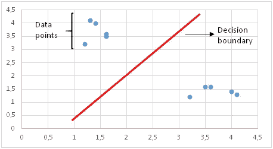

二维空间中的 SVM

这是一个非常简单的例子，只是为了说明 SVM 的想法。你在现实生活中遇到这样的任务的可能性极小。在这种情况下，决策边界是一条线。如果我们使用 3 个特征，则判定边界是三维空间中的平面。如果我们使用 3 个以上的特征，决策边界就变成了一个超平面，很难可视化。

支持向量

主要动机是绘制一个决策边界，使支持向量的距离最大化。以到支持向量的距离最大化的方式绘制决策边界。如果决策边界离支持向量太近，会对噪声高度敏感，不能很好地泛化。即使独立变量非常小的变化也可能导致错误分类。

决策边界的错误选择

数据点并不总是线性可分的，如上图所示。在这些情况下，SVM 使用了**核技巧**，它测量高维空间中数据点的相似性(或接近度),以使它们线性可分。下面的图更容易理解。如你所见，二维空间中两个不同的类不能用一条线分开。使用内核技巧可以使它们线性分离:

[图源](https://jakevdp.github.io/PythonDataScienceHandbook/05.07-support-vector-machines.html)

[图源](https://jakevdp.github.io/PythonDataScienceHandbook/05.07-support-vector-machines.html)

在我详细讲述内核技巧之前，我想提一下 c 参数和 T2 的概念。

# **软余量 SVM 和 C 参数**

真实数据是有噪声的，并且在大多数情况下不是线性可分的。一个标准的 SVM 试图将所有的正面和负面例子(即两个不同的类)分开，不允许任何点被错误分类。这导致过度拟合模型，或者在某些情况下，无法使用标准 SVM 找到决策边界。过度拟合的 SVM 在训练集上取得了很高的精度，但在新的、以前未见过的样本上表现不佳。为了解决这个问题，1995 年，Cortes 和 Vapnik 提出了“软边界”SVM 的概念，它允许一些例子被错误分类或位于决策边界的错误一侧。软边际 SVM 通常会产生更好通用模型。当确定决策边界时，软裕度 SVM 试图解决具有以下目标的优化问题:

*   增加决策边界到类别(或支持向量)的距离
*   最大化训练集中正确分类的点数

这两个目标之间显然有所取舍。决策边界可能必须非常接近一个特定类，才能正确标记训练集中的所有数据点。然而，在这种情况下，测试数据集的准确性可能会较低，因为决策边界对噪声和独立变量的微小变化过于敏感。另一方面，决策边界可能被放置在尽可能远的每个类，代价是一些错误分类的异常。这种权衡由 **c 参数控制。**

**C 参数**为每个错误分类的数据点增加一个惩罚。如果 c 很小，则对误分类点的惩罚也很低，因此以更大数量的误分类为代价选择了具有大余量的决策边界。如果 c 很大，SVM 试图最小化由于高惩罚导致的错误分类的例子的数量，这导致了具有较小裕度的决策边界。对于所有错误分类的例子，惩罚是不同的。它与到决策边界的距离成正比。

# **内核函数**

核函数是一种相似性度量。输入是原始特征，输出是新特征空间中的相似性度量。这里的相似性是指接近的程度。将数据点实际转换到高维特征空间是一个代价很高的操作。该算法实际上并不将数据点转换到新的高维特征空间。内核化 SVM 根据高维特征空间中的相似性度量来计算决策边界，而不实际进行变换。我想这也是为什么又叫**内核绝招**的原因吧。

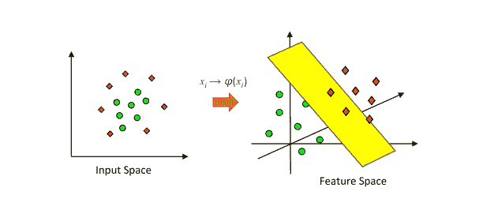

[图源](https://www.sciencedirect.com/science/article/pii/B9780128113189000272)

scikit-learn 中可用的核函数有线性、多项式、径向基函数(RBF)和 sigmoid。

RBF(或高斯 RBF)是一种广泛使用的核函数。它由**伽马**参数定义，该参数基本上控制单个训练点的影响距离。低 gamma 值表示较大的相似性半径，这将导致更多的点被组合在一起。对于高 gamma 值，这些点需要彼此非常接近，才能被视为在同一组(或类)中。因此，gamma 值非常大的模型往往会过度拟合。以下可视化更好地解释了这个概念:

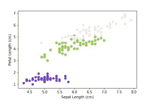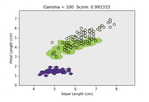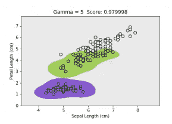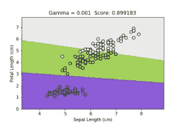

[数字来源](https://datatuts.com/svm-parameter-tuning/)

随着灰度系数的降低，分隔不同类别的区域变得更加一般化。非常大的 gamma 值会导致太特定的类别区域(过度拟合)。

# **伽玛与 C 参数**

对于线性核，我们只需要优化 c 参数。然而，如果我们想要使用 RBF 核，则需要同时优化 c 和γ参数。如果γ很大，c 的影响可以忽略不计。如果 gamma 很小，c 对模型的影响就像它对线性模型的影响一样。c 和γ的典型值如下。然而，根据应用可能存在特定的最佳值:

0.0001 < gamma < 10

0.1 < c < 100

> **对于 SVM 来说，记住输入数据需要归一化以使要素具有相同的比例和兼容性是非常重要的。**

# **SVM 的利与弊**

优点:

*   在维数大于样本数的情况下有效
*   当找到决策边界时，它使用训练点的子集而不是所有点，因此它是内存高效的
*   多才多艺，它提供了不同类型的内核函数，也可以创建自定义的内核函数

缺点:

*   需要小心规范化
*   难以理解预测背后的逻辑
*   当我们拥有大型数据集时，训练时间会增加，这会对性能产生负面影响

# **sci kit-学习示例**

我想通过一个简单的案例来展示语法和应该遵循的步骤。让我们从导入我们需要的库开始:

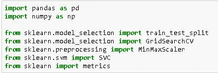

Scikit-learn 还提供实践数据集。乳腺癌数据集适合我们的任务:

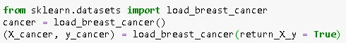

我们需要使用 scikit-learn 的 **train_test_split** 函数来拆分用于训练和测试的数据集。然后，我使用线性核创建用于分类的支持向量机对象，并使用训练数据集对其进行训练:

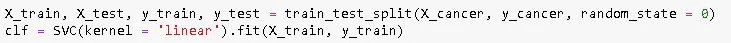

使用我们训练的模型，我们可以预测测试数据集中的目标变量，并测量模型的准确性:

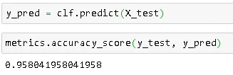

95%是一个相当不错的准确率，但是对于分类任务，还有另外两个衡量标准:**精度**和**召回**。这些术语非常重要，可以成为另一篇文章的主题。事实上，它们在谷歌的[机器学习速成班](https://developers.google.com/machine-learning/crash-course/classification/precision-and-recall)中有明确的解释。

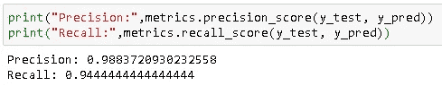

这是一个简单的线性可分的任务。对于不可线性分离的情况，我们可以使用 SVC 的核参数(即 kernel = 'rbf ')来使用核。我没有指定 c 参数，所以使用了默认值(c=1)。为了找到最佳参数，我们可以使用 scikit-learn 的 **GridSearchCV()** 函数。

感谢您的阅读。如果您有任何反馈，请告诉我。

# 我的其他帖子

*   [决策树和随机森林—解释](/decision-tree-and-random-forest-explained-8d20ddabc9dd)
*   [朴素贝叶斯分类器—解释](/naive-bayes-classifier-explained-50f9723571ed)
*   [用熊猫处理缺失值](/handling-missing-values-with-pandas-b876bf6f008f)
*   [用机器学习预测二手车价格](/predicting-used-car-prices-with-machine-learning-fea53811b1ab)
*   [数据清理和分析，附带奖励故事](/data-cleaning-and-analysis-with-a-bonus-story-36b3ae39564c)

# 参考

*   [https://datafrakankur . com/machine-learning-kernel-functions-3d-visualization/](https://datafreakankur.com/machine-learning-kernel-functions-3d-visualization/)
*   [https://www . science direct . com/science/article/pii/b 9780128113189000272](https://www.sciencedirect.com/science/article/pii/B9780128113189000272)
*   [https://datatuts.com/svm-parameter-tuning/](https://datatuts.com/svm-parameter-tuning/)
*   [https://jakevdp . github . io/python datascience handbook/05.07-support-vector-machines . html](https://jakevdp.github.io/PythonDataScienceHandbook/05.07-support-vector-machines.html)