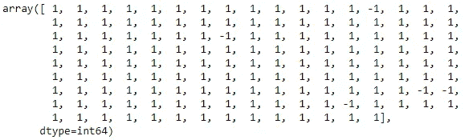
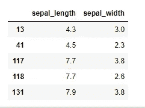
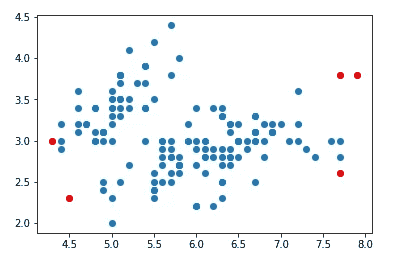

# 支持向量机(SVM)用于异常检测

> 原文：<https://towardsdatascience.com/support-vector-machine-svm-for-anomaly-detection-73a8d676c331?source=collection_archive---------3----------------------->

## 用于异常检测的小数据科学


[伊万·班杜拉](https://unsplash.com/@unstable_affliction?utm_source=medium&utm_medium=referral)在 [Unsplash](https://unsplash.com?utm_source=medium&utm_medium=referral) 拍摄的照片

## **一级 SVM:简介**

作为机器学习的专家或新手，你可能听说过支持向量机(SVM)——一种经常被引用并用于分类问题的监督机器学习算法。支持向量机使用多维空间中的超平面来将一类观察值与另一类分离。自然，SVM 用于解决多类分类问题。

然而，SVM 也越来越多地用于一类问题，其中所有数据都属于一个类。在这种情况下，算法被训练来学习什么是“正常的”，以便当显示新数据时，算法可以识别它是否应该属于该组。如果不是，新数据被标记为异常或异常。要了解更多关于一级 SVM 的信息，请查看 Roemer Vlasveld 的这篇长文。

最后要提的是，如果你熟悉`sklearn`库，你会注意到有一个算法是专门为所谓的“[新奇检测](https://scikit-learn.org/stable/modules/outlier_detection.html)”设计的。它的工作方式与我刚刚在使用一类 SVM 的异常检测中描述的方式类似。在我看来，只是上下文决定了是否称之为新奇检测或异常检测或类似的东西。

今天的文章是我的异常、异常值和欺诈检测算法系列的继续，并附有实际操作的示例代码。我之前的 7 篇文章谈到了异常检测领域中可用的不同工具和技术，如果您有兴趣了解它们，请访问以下链接:

*   [DBSCAN，一种无监督算法](/dbscan-a-density-based-unsupervised-algorithm-for-fraud-detection-887c0f1016e9)
*   [椭圆形信封](/machine-learning-for-anomaly-detection-elliptic-envelope-2c90528df0a6)
*   [局部异常值因子(LOF)](/anomaly-detection-with-local-outlier-factor-lof-d91e41df10f2)
*   [Z 分数](/z-score-for-anomaly-detection-d98b0006f510)
*   [箱线图](/boxplot-for-anomaly-detection-9eac783382fd)
*   [统计技术](/statistical-techniques-for-anomaly-detection-6ac89e32d17a)
*   [时间序列异常检测](/time-series-anomaly-detection-with-anomalize-library-67472003c003)

下面是一个用 Python 编程语言编写的单类 SVM 的简单演示。请注意，我将异常值和异常值互换使用。

## **步骤 1:导入库**

对于这个演示，我们需要三个核心库——数据处理库`python`和`numpy`，模型构建库`sklearn`和可视化库`matlotlib`。

```
# import libraries
import pandas as pd
from sklearn.svm import OneClassSVM
import matplotlib.pyplot as plt
from numpy import where
```

## 步骤 2:准备数据

我使用的是网上著名的虹膜数据集，所以你可以跟着练习，不用担心从哪里得到数据，如何清理这些数据。

```
# import data
data = pd.read_csv("[https://raw.githubusercontent.com/uiuc-cse/data-fa14/gh-pages/data/iris.csv](https://raw.githubusercontent.com/uiuc-cse/data-fa14/gh-pages/data/iris.csv)")# input data
df = data[["sepal_length", "sepal_width"]]
```

## 第三步:建模

与其他分类算法中的超参数调整不同，一类 SVM 使用 *nu* 作为超参数，用于定义数据的哪一部分应被归类为异常值。 *nu* = 0.03 表示算法会将 3%的数据指定为异常值。

```
# model specification
model = OneClassSVM(kernel = 'rbf', gamma = 0.001, nu = 0.03).fit(df)
```

## 第四步:预测

预测数据集将具有 1 或-1 值，其中-1 值是算法检测到的异常值。

```
# prediction
y_pred = model.predict(df)
y_pred
```



## 步骤 5:过滤异常

```
# filter outlier index
outlier_index = where(y_pred == -1) # filter outlier values
outlier_values = df.iloc[outlier_index]
outlier_values
```



## 步骤 6:可视化异常

```
# visualize outputs
plt.scatter(data["sepal_length"], df["sepal_width"])
plt.scatter(outlier_values["sepal_length"], outlier_values["sepal_width"], c = "r")
```



红色的数据点是异常值

## 摘要

在这篇文章中，我想温和地介绍一下单类 SVM——一种用于欺诈/异常值/异常检测的机器学习算法。我展示了一些简单的步骤来建立直觉，但是当然，现实世界的实现需要更多的实验来发现什么对特定的环境和行业有效，什么无效。

感谢你的关注，要了解更多关于我的工作，你可以在推特[或 LinkedIn](https://twitter.com/DataEnthus) 上关注我