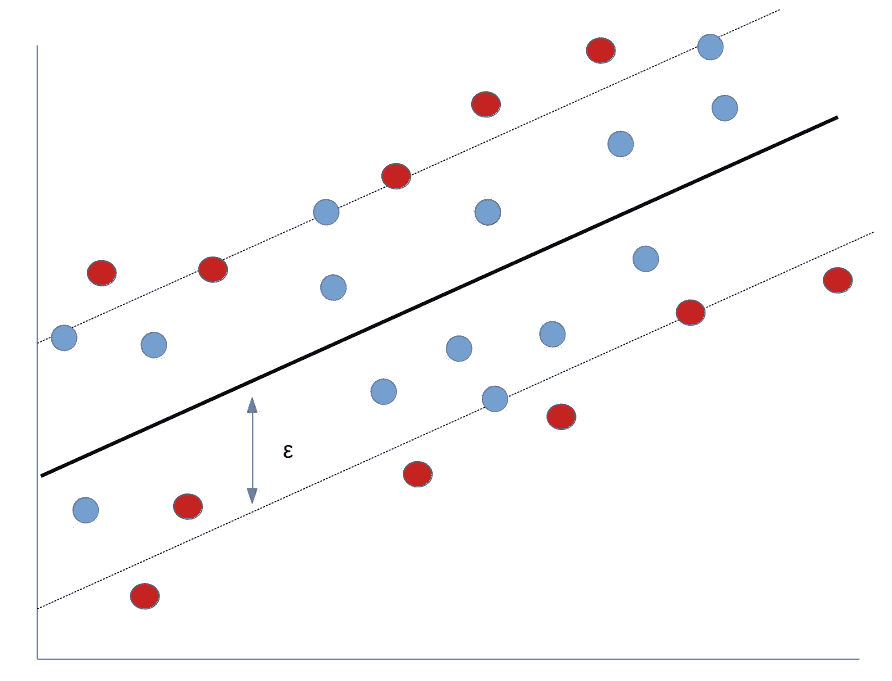

# 支持向量机和回归分析

> 原文：<https://towardsdatascience.com/support-vector-machines-and-regression-analysis-ad5d94ac857f?source=collection_archive---------22----------------------->

## 如何在回归问题中使用支持向量机



来源:图片由作者创建—基于 Aurélien Géron 的“使用 Scikit-Learn 和 TensorFlow 进行机器学习”中的视觉模板

一个常见的误解是，支持向量机只在解决分类问题时有用。

使用支持向量机解决回归问题的目的是定义一个如上图所示的超平面，并在该超平面内尽可能多地拟合实例，同时限制边界违规。

以这种方式，以这种方式使用的 SVM 不同于分类任务，在分类任务中，目标是在两个单独的类之间拟合最大可能的超平面(同时还限制边界违反)。

事实上，支持向量机可以非常有效地处理回归建模。我们以酒店预订为例。

# 预测酒店顾客的平均每日房价

假设我们正在构建一个回归模型来预测酒店预订的平均每日价格(或客户平均每日支付的价格)。模型由以下特征构成:

*   取消(无论客户是否取消预订)
*   原产国
*   细分市场
*   存款类型
*   客户类型
*   所需的停车位
*   抵达周

请注意，还会为取消预订的客户填充 ADR 值—本例中的响应变量反映了如果客户继续预订将支付的 ADR。

Antonio、Almeida 和 Nunes (2016)的原始研究可从下面的参考资料部分获得。

# 模型结构

使用如上所述的特征，在训练集(H1)上训练和验证 SVM 模型，将预测与测试集(H2)上的实际 ADR 值进行比较。

该模型被训练如下:

```
>>> from sklearn.svm import LinearSVR
>>> svm_reg = LinearSVR(epsilon=1.5)
>>> svm_reg.fit(X_train, y_train)LinearSVR(C=1.0, dual=True, epsilon=1.5, fit_intercept=True,
          intercept_scaling=1.0, loss='epsilon_insensitive', max_iter=1000,
          random_state=None, tol=0.0001, verbose=0)>>> predictions = svm_reg.predict(X_val)
>>> predictionsarray([100.75090575, 109.08222631,  79.81544167, ...,  94.50700112,
        55.65495607,  65.5248653 ])
```

现在，对测试集中的特征使用相同的模型来生成预测的 ADR 值:

```
bpred = svm_reg.predict(atest)
bpred
```

让我们在平均绝对误差(MAE)和均方根误差(RMSE)的基础上比较预测 ADR 和实际 ADR。

```
>>> mean_absolute_error(btest, bpred)
29.50931462735928>>> print('mse (sklearn): ', mean_squared_error(btest,bpred))
>>> math.sqrt(mean_squared_error(btest, bpred))
44.60420935095296
```

注意，SVM 对额外训练实例的敏感度由**ε(ϵ)**参数设置，即参数越高，额外训练实例对模型结果的影响越大。

在这种情况下，使用了大幅度的 **1.5** 。以下是使用 **0.5** 裕量时的模型性能。

```
>>> mean_absolute_error(btest, bpred)29.622491512816826>>> print('mse (sklearn): ', mean_squared_error(btest,bpred))
>>> math.sqrt(mean_squared_error(btest, bpred))44.7963000500928
```

我们可以看到，通过修改 **ϵ** 参数，MAE 或 RMSE 参数实际上没有变化。

也就是说，我们希望确保 SVM 模型不会过度拟合。具体来说，如果我们发现当 **ϵ = 0，**时达到最佳拟合，那么这可能是模型过度拟合的迹象。

这是我们设置ϵ = 0 时的结果。

*   美:31.86
*   RMSE:47.65 英镑

鉴于当ϵ = 0 时，我们没有看到更高的精度，似乎没有任何证据表明过度拟合是我们模型中的一个问题——至少从这个角度看不是。

# SVM 的性能与神经网络相比如何？

当使用相同的功能时，SVM 的性能精度与神经网络相比如何？

考虑以下神经网络配置:

```
>>> model = Sequential()
>>> model.add(Dense(8, input_dim=8, kernel_initializer='normal', activation='elu'))
>>> model.add(Dense(1669, activation='elu'))
>>> model.add(Dense(1, activation='linear'))
>>> model.summary()Model: "sequential"
_________________________________________________________________
Layer (type)                 Output Shape              Param #   
=================================================================
dense (Dense)                (None, 8)                 72        
_________________________________________________________________
dense_1 (Dense)              (None, 1669)              15021     
_________________________________________________________________
dense_2 (Dense)              (None, 1)                 1670      
=================================================================
Total params: 16,763
Trainable params: 16,763
Non-trainable params: 0
_________________________________________________________________
```

模型被训练跨越 **30** 个时期，批量大小为 **150** :

```
>>> model.compile(loss='mse', optimizer='adam', metrics=['mse','mae'])
>>> history=model.fit(X_train, y_train, epochs=30, batch_size=150,  verbose=1, validation_split=0.2)
>>> predictions = model.predict(X_test)
```

在测试集上获得了以下 MAE 和 RMSE:

*   **梅:** 29.89
*   RMSE:43.91 美元

我们观察到，当 SVM 模型的ϵ 设置为 **1.5** 时，MAE 和 RMSE 分别为 29.5 和 44.6。在这点上，SVM 在测试集上的预测精度与神经网络相当。

# 结论

一个常见的误解是，支持向量机只适合处理分类数据。

然而，我们在这个例子中已经看到，SVM 模型在预测神经网络的 ADR 值方面非常有效。

非常感谢您的阅读，并感谢任何问题或反馈。

本例的 Jupyter 笔记本和数据集可在 [MGCodesandStats GitHub 存储库](https://github.com/MGCodesandStats/hotel-cancellations)获得。其他相关参考资料如下。

*免责声明:本文是在“原样”的基础上编写的，没有任何担保。本文旨在提供数据科学概念的概述，不应以任何方式解释为专业建议。*

# 参考

*   [安东尼奥、阿尔梅达、努内斯。酒店预订需求数据集](https://www.sciencedirect.com/science/article/pii/S2352340918315191)
*   Aurélien Géron:使用 Scikit-Learn 和 TensorFlow 进行机器学习
*   [ResearchGate:支持向量回归的回归问题中ε= 0 有什么问题？](https://www.researchgate.net/post/What_is_the_problem_with_epsilon0_in_regression_problems_with_Support_Vector_Regression2)
*   [走向数据科学:基于回归的神经网络——预测酒店的平均日房价](/regression-based-neural-networks-with-tensorflow-v2-0-predicting-average-daily-rates-e20fffa7ac9a)