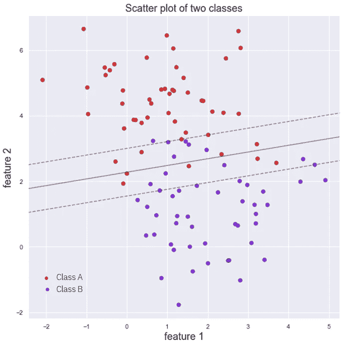

# 支持向量机解释

> 原文：<https://towardsdatascience.com/support-vector-machines-explained-25a685e4d228?source=collection_archive---------39----------------------->

来自[像素](https://www.pexels.com/es-es/foto/al-aire-libre-amanecer-arboles-asfalto-531321/)的图像。

## 了解关于支持向量机的一切

*在本帖中，我们将* ***揭开发生在 SVM*******身上的所有魔法，并讲述它们的一点历史*** *，并阐明它们何时该用，何时不该用。**

****我们将浏览支持向量机的理论和直觉*** *，看到理解万物如何工作所必需的最少的数学量，而不深入细节。**

****言归正传！****

# ***1。简介***

***支持向量机**或 SVMs 是一个广泛使用的机器学习模型家族，它**可以解决许多 ML 问题**，如线性或非线性分类、回归，甚至异常值检测。*

*话虽如此，**最好的应用**是在**应用于小型**或中型**复杂数据集**的分类时。贯穿本文，将会清楚为什么。*

*为了理解支持向量机是如何工作的，我们最好先研究一下线性支持向量机、硬边界和软边界分类。*

# *2.线性 SVM 分类*

*假设我们有以下一组数据，只有两个特征(*特征 1 和特征 2* ，代表两个不同的类别(*A 类*和*B 类)*)。*

**

*我们数据的散点图*

*一个正常的线性分类器会试图画一条线，完美地分开我们的两类数据。但是，从下图可以看出，有很多行可以做到这一点。**我们该选哪个？***

**

*使用线性分类器分离两类*

***之前的**决策边界**将训练数据**完全分离，**然而**它们如此接近训练实例(红色和紫色的点，周围有黑色圆圈)，以至于**它们可能会对新数据**(图中的*新样本*)进行非常糟糕的概括。*

## *硬边界和软边界分类器*

*支持向量机分类器试图通过对模型拟合一条线来解决这个问题，该线试图**最大化到最近训练实例**(称为*支持向量*)的距离，以便平行于决策边界线的余量尽可能宽。*

*将决策边界想象成乡村道路的中心，将数据想象成树，道路的每一侧都有不同类型的树。支持向量机试图做的是找到尽可能宽的道路来分隔我们的两种树，这样我们就可以安全地开车穿过它，同时感到安全。它通过试图最大化利润来做到这一点。*

**

*来自 [Flaticon 的支持向量机图标背后的直觉。](https://www.flaticon.com/free-icon/tree_489969)*

*如果我们现在考虑之前的数据集，对其拟合线性支持向量分类器(线性 SVC ),并绘制决策边界及其余量，我们会得到下图:*

**

*线性 SVC 的判定边界*

*在这种类型的 SVC 中，**没有点被允许越过边界**:我们正在谈论一个 ***硬边界分类器*** 。当一些点被允许穿过边缘线，允许我们适应更宽的街道时，我们谈论的是一个*软边缘分类器*。*

*有趣的是，对于这个*硬边界分类器*，**来说，拟合只取决于*支持向量*** 的位置:向我们的训练数据添加不接触街道(但在正确的一侧)的点，将使决策边界和边界保持不变。*

*边界由这些关键*支持向量*点完全定义或*支持*，给它们和算法命名。 ***硬边界分类器*** 然而，只有当数据以线性方式完全可分时才起作用，并且对异常值也非常敏感。*

*为了解决这个问题，我们进入了 ***软边界分类器*** ，这是一种更加灵活的模型，它**允许一些点穿过边界**，这使我们在街道有多宽以及有多少*边界违规*(位于街道内部或决策边界错误一侧的点)之间达成妥协。下图显示了一个线性软边距分类器。*

**

*软边界分类器*

*在大多数 SVC 实现中，**我们用模型**(Scikit-Learn 中的 C)的超参数来控制它。此参数的值越低，意味着我们的利润越大，违反利润的情况也越多，因此模型更加灵活，可以更好地概括。通过减少 C，我们可以调整我们的模型，如果我们认为它可能是过度拟合。*

***增加 C 的值将我们引向硬边界分类器。下图显示了这种行为:随着 C 值的减小，街道变宽了，但是我们有更多的点穿过它。***

**

*当我们减小 c 的值时，SVC 分类器的裕量发生变化。*

# *非线性 SVM 分类器*

*然而，大多数时候，数据集并不是线性可分的，软化我们的利润并不完全奏效。*

*使非线性可分离数据集成为可分离数据集的一种方法是**包括从原始数据集**中得到的附加特征，例如使用**多项式特征**或相似性特征技术，如 ***径向基函数*** (RBF)。*

*下图显示了如何使用**二次多项式**将只有 1 个要素的数据集转换为 2 个要素的数据集，从而线性分离两个现有的类。*

**

*将一个非线性可分离的数据集转换成一个可以用二次多项式线性分离的数据集*

*这里的问题是，随着要素数量的增加，计算高次多项式要素的**计算成本**急剧增加，使得模型运行缓慢。*

***另一种使数据集可线性分离的方式****是前面提到的*****径向基函数*** 。下面的例子显示了我们如何将一个非线性可分的数据集转换成一个可以使用 RBF 轻松划分的数据集:*

**

*具有两个特征的两个不可分离类的散点图。*

*现在，如果在前面图像所示的数据集上，**我们使用以原点**为中心的径向基函数计算第三个特征、**，并且我们将这个新特征与前两个特征一起绘制，我们的数据集被转换成下面的数据集，它可以被新特征*r*上高度为 0.7 的水平面线性分隔。***

**

*先前数据的表示，带有使用 RBF 计算的附加特征*

*然而，在前面的例子中，我们**选择了一个点**来集中我们的 RBF，这给了我们很好的结果，在大多数情况下**这不是一件小事**。大多数情况下**所做的是**使用原始特征计算从数据集中的每个点**到所有其他数据点的径向基函数，并使用这些径向基函数计算的距离作为新特征。***

*这里的问题是，**如果我们有一个大的训练集**，计算所有这些特征是非常**计算昂贵的**。当试图使用线性 SVC 来分离非线性数据时，我们再次遇到问题。*

*在这些问题的解决方案中，支持向量机的真正力量在于:**内核。***

# *内核技巧*

*在前面的两个例子中，为了能够分离我们的数据，我们需要计算一个变换(一个多项式变换，和一个 RBF 相似性函数)，正如我们所看到的，这是一个计算量非常大的过程。*

***机器学习中的内核是一个数学函数**，它允许我们计算两个向量的变换的点积，而实际上不必计算变换本身。*

*下面的公式说明了内核背后的思想。*

**

*公式 1:向量 a 和 b 的核*

*前面公式中的 *K(a，b)* 代表向量的**核 *a* 和 *b*** (一个随机核，后面我们会看到有很多不同的)。我们可以看到，这个内核等于 *ϕ(a)* 和 *ϕ(b)* *，*的**点积，其中 ***ϕ* 表示作为参数提供给它的向量的特定变换**(可以是多项式，也可以是 RBF 变换)。***

*为了理解这如何极大地简化了我们的问题，并且通过使用核，我们可以使用支持向量机来对非线性可分数据集进行分类，我们最好先看看**支持向量机是如何被训练的**。*

# *训练 SVM:另一个优化问题*

*最后，**训练一个 SVM 分类器，归结为解决一个优化问题**，称为*对偶问题*。SVM 像任何其他分类器一样进行预测:它获取输入向量 *x* ，将其乘以某个权重向量 *w* ，并添加一个偏差项 *b* ，如以下公式所示。*

**

*公式 2:预测方程。*

*如果这个操作给出的结果大于某个阈值(在我们的例子中是 0)，那么这个样本被分类为阳性实例(1)。如果它产生的结果低于阈值，那么它被归类为负实例(0)。*

***为了获得权重和偏差向量，我们必须解决一个优化问题**，该问题试图最大化我们谈到的街道的利润，同时限制利润违规。从数学上来说，这被转化为找到满足某个模糊条件或*松弛*(多少次以及有多严重的余量可以被越过)的权重向量的最小值。*

*这个优化问题可以使用普通的 QP 求解器来解决，因为它是一个凸二次问题。这个问题解决的最终方程如下*

**

*公式 3:优化。*

*然而，公式 3 并不完全正确。 ***α*** 应该是**大于或等于 0** ，对于每个不是支持向量的数据点取这个最后的值。*

*不要在意 *t(i)* 或 *t(j)* ，关于这个方程有两件重要的事情:一旦我们求解它并得到 ***α*** 的值，我们就可以计算权重和偏置向量。另一件要注意的事情是橙色虚线内的术语:**两个训练实例的点积**，我们必须对所有训练集重复这个术语。*

***这就是我们之前谈到的内核技巧派上用场的地方:**如果我们使用任何类型的转换来转换我们的训练实例，使它们可以分离，我们将不得不计算每个训练实例上的转换，做点积……从计算的角度来看，这将是非常昂贵的。这显示在下面的公式中。*

**

*公式 4:对我们的数据计算变换，并用它们代替内核。*

***如果**像上面一样，**我们使用一个内核**，那么**我们不需要实际计算变换**。酷吧？让我们看看一些最流行的内核:*

**

*一些最流行的内核。*

*请注意，对于我们应用了 d 次多项式变换的两个向量的点积，理论上我们会增加数据的 n 个特征，从而增加复杂性，我们可以使用内核来避免计算该变换，只需计算 ***(γaTb+r)d.****

*这就是支持向量机的魅力所在。我们可以训练它们并做出预测，这有利于对我们的数据进行运算，而不需要实际计算这些运算。*

*现在让我们结束吧，看看这些预测是如何做出的。*

## *用 SVM 进行预测:支持向量*

*正如我们之前看到的，为了进行预测，我们必须计算权重向量和新数据点 *x(n)* 的点积，并添加一个偏差项。为此，如果我们将通过求解优化问题获得的 *w* 的值代入公式 2 的方程，我们得到:*

**

*公式 5:用 SVM 预测*

*现在，还记得我们怎么说 ***α*** *对于所有不是* ***支持向量的数据点都是 0 吗？*** 这意味着，为了进行预测，我们只需计算支持向量的核和我们的新数据点，并添加偏差项。**牛逼吧？***

*内核和支持向量机再次展示了它们的魔力。最后，这里有一些使用支持向量机的实用技巧和诀窍。*

# *其他提示和技巧:*

*   ***在拟合 SVM 之前标准化或规范化数据。**在训练 SVM 之前，应用某种缩放技术是很重要的。如果我们的特征具有非常不同的比例，我们的‘街道’将看起来非常怪异，并且我们的算法将不会很好地工作。*
*   *根据经验，**在拟合 SVM 时，首先使用线性核**，尤其是当训练集非常大或者它具有大量特征时。如果你对结果不满意，**试试 RBF 核**；它往往工作得很好。然后，如果你有稀疏的时间和计算能力，尝试另一种交叉验证的内核。*
*   *支持向量机也可用于**回归和异常值检测。***
*   *然而，它们的**最佳结果**出现在用于复杂但较小数据集的**分类任务时。***

# *结论*

**仅此而已！我们已经了解了支持向量机背后的直觉，以及它们如何工作的一些数学知识。**

**关于机器学习和数据科学的更多资源，请查看以下资源库:* [***如何学习机器学习***](https://howtolearnmachinelearning.com/books/machine-learning-books/) *！有关职业资源(工作、事件、技能测试)，请访问*[***AIgents.co——一个面向数据科学家的职业社区&机器学习工程师***](https://aigents.co/) *。**

*保重，享受人工智能！*

**感谢阅读！**