# 用 Python 例子解释支持向量机

> 原文：<https://towardsdatascience.com/support-vector-machines-explained-with-python-examples-cb65e8172c85?source=collection_archive---------3----------------------->

## 如何在分类问题中使用支持向量机？


支持向量机(SVM)是一种有监督的机器学习技术。而且，即使它主要用于分类，它也可以应用于回归问题。

支持向量机定义了一个决策边界和一个最大间隔，将几乎所有的点分成两类。同时也为错误分类留下了空间。

支持向量机是对最大间隔算法的改进。它最大的优点是可以通过使用核函数来定义线性或非线性的决策边界。这使得它更适合于现实世界的问题，在现实世界中，数据并不总是可以用一条直线完全分离的。

# 分离超平面

SVM 的主要目标是定义一个超平面，将点分成两个不同的类。超平面也称为分离超平面或决策边界。

所以让我们从超平面开始。可视化超平面最简单的方法是考虑一个二维数据集。

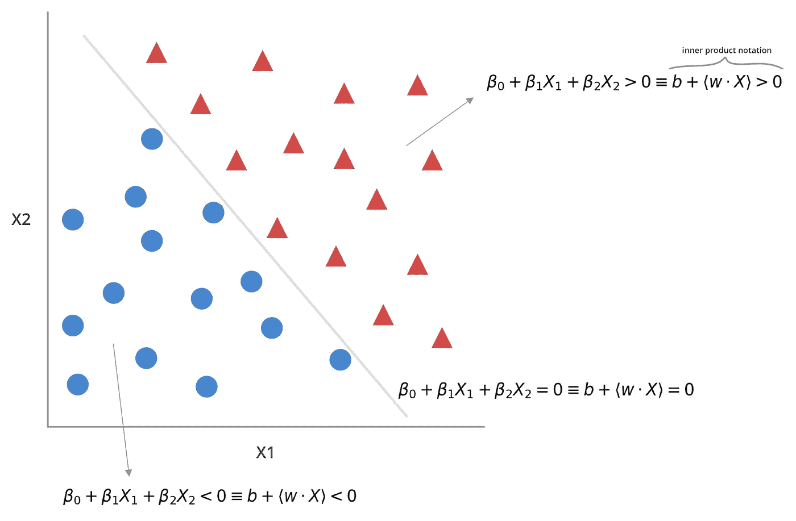

将点完全分成两个不同类的超平面。

将会有无限数量的超平面将点分成两类。但是，由于我们在二维空间中工作，我们定义的任何超平面将总是具有(2–1)= 1 维。所以，我们可以用一条简单的回归线来表示超平面。

定义了决策边界后，我们现在可以根据点相对于决策边界的位置对点进行分类。

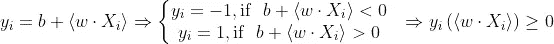

基于向量相对于决策边界的位置进行分类。

如果你在处理两个以上的维度，比如，你的特征向量 X 有两个以上的特征，你在分类向量，而不是点。

因此，概括地说，所有低于决策边界的向量都属于第 1 类，如果它们高于决策边界，则属于第 1 类。

# 使用余量增加预测可信度

我们使用训练数据来定义决策边界。但是测试集的预测质量如何呢？

如果一个向量远离决策边界，我们可以确信它的类别，即使模型有一些误差。但是，当我们对一个向量进行分类并且它非常接近决策边界时，会发生什么呢？我们如何确定分配哪个类？

为了解决这个问题，支持向量机还在决策边界周围画了一个边界。这个余量的目标是尽可能地将向量与决策边界分开。其背后的直觉是，一个保证金给我们更多的信心，我们的预测。因为向量距离决策边界至少有边缘的长度，所以分类过程中的模糊性更小。

使用最接近决策边界的向量来定义边缘的位置。这就是为什么位于页边空白顶部的向量是*支持向量。*

有了边缘作为缓冲，我们可以根据它们相对于边缘的位置对向量进行分类。其中 M 是页边距的宽度。

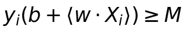

基于向量相对于边距的位置的分类。

# 一些错误分类的空间

边缘的增加提高了测试集中预测的质量，但是它假设类是完全可分的。

但是，在大多数现实世界的问题中，数据是杂乱的，并且通常不是完全可分的。

这就是为什么 SVM 和它之前的算法——支持向量分类器——有一个重要的共同特征。它允许算法出错，并将错误的类分配给一些向量。


支持向量分类器的决策边界和余量，以及相应的支持向量。

因此，SMV 没有试图将向量完全分成两类，而是进行了权衡。它允许一些向量落在边缘之内，并落在决策边界的*错误*侧。

> 支持向量机在学习过程中允许一些错误分类。因此，它们可以更好地对测试集中的大多数向量进行分类。

除了利润，我们的模型现在还包括松弛变量，这将告诉我们两件事:

*   如果测试观察分类错误，
*   其中观察相对于决策边界和裕度。

时差变量可能有三个值:

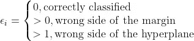

并且误分类向量的数量受参数 c 的限制

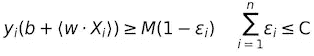

基于向量相对于边际的位置的分类，包括松弛变量。

我们可以看到这个模型捕捉到了更多的细微差别。但是它仍然建立在最大间隔分类器之上。例如，如果您将参数 C 设置为零，这意味着它允许零松弛变量，它会退回到最大间隔分类器。因此，你有一个线性的决策边界，一个尽可能大的边界，在它里面不允许有任何向量。

松弛变量的数量越多，允许的错误分类向量的数量就越多。这会影响边距的宽度，因为选择了不同的支持向量。它还控制模型的[偏差-方差权衡](/bias-variance-tradeoff-in-machine-learning-models-a-practical-example-cf02fb95b15d)。

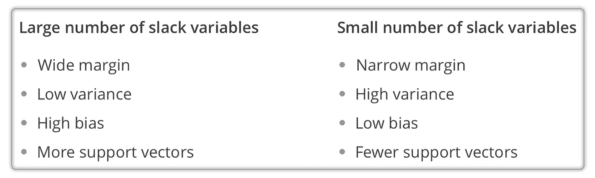

松弛变量的数量如何控制偏差-方差权衡。

有一些错误分类的空间使得 SMVs 更加灵活，但是它只适用于有限的问题集。

在大多数现实世界的问题中，很难用线性决策边界将数据分成两类。即使有出错的余地。

# 支持向量机

支持向量机共享它之前的边缘分类器的特征。它们的独特之处在于它们如何定义线性和非线性决策边界。

为了支持非线性决策边界，SMV 使用函数将原始特征空间变换到新的空间，可以表示那些非线性关系。

例如，假设您用其特征的平方来增加原始特征空间。在这种情况下，您对原始要素集应用了二次函数来创建这些要素的平方。现在你有了你的原始特征和它们的二次版本，在这个扩充的空间里。因此，隐含地，有一个映射这两个特征空间的函数。

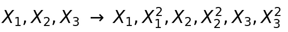

用原始特征的二次版本扩充特征空间。

如果你试图在原始特征空间中画出判定边界，它具有二次形状。但是如果你在增强的特征空间中训练你的模型，你会发现一个线性的决策边界来区分这两个类。因为它是一种变换，所以原始特征空间中的二次边界对应于扩充特征空间中的线性边界。

定义这些转换的函数被称为**内核**。它们作为训练集和测试集中观察值之间的相似性函数。

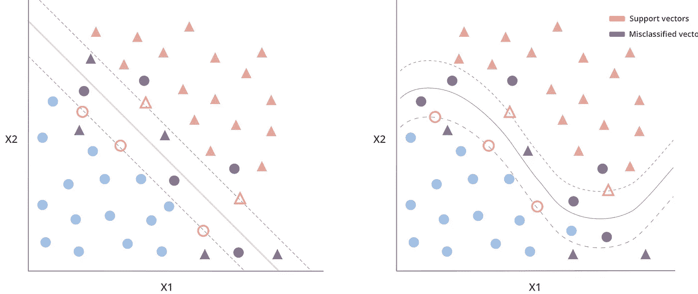

使用线性核(右)和多项式核(左)确定 SVM 的边界和余量，以及相应的支持向量。

只要你有一个用内积表示的模型，你就可以插入一个内核函数。例如，线性核与对特征空间应用线性变换是一样的。在这种情况下，它与支持向量分类器相同，因为决策边界是线性的。

使用多项式核，您可以将原始特征空间投影到多项式特征空间中。因此，用高阶多项式来定义分隔类别的判定边界。

核的使用是支持向量分类器区别于支持向量机的地方。它们为解决更复杂的问题提供了可能性。但是增加特征空间可能意味着额外的计算需求。因为，对于足够大的特征空间，拟合一个模型在时间和资源方面都可能是昂贵的。

尽管增加了特征空间，内核还是带来了显著的优势。支持向量机实际上并不计算每个观察值到扩充空间的变换。他们使用一个技巧，而不是在增广空间中计算观察值的内积，这在计算上要便宜得多。这就是所谓的*内核把戏*。

最后，支持向量机做出两个重要假设:

*   数据是线性可分的。即使线性边界在扩充的特征空间中。
*   该模型使用内积表示，因此可以使用内核。

# 让我们看几个例子

为了查看支持向量机的运行情况，我生成了一个随机数据集，并将其分成两个不同的类。下面是生成和绘制数据的代码片段。

```
import random
import numpy as np
import pandas as pd
import matplotlib.pyplot as pltdef generate_random_dataset(size):
    *""" Generate a random dataset and that follows a quadratic  distribution
    """
*    x = []
    y = []
    target = [] for i in range(size):
        # class zero
        x.append(np.round(random.uniform(0, 2.5), 1))
        y.append(np.round(random.uniform(0, 20), 1))
        target.append(0) # class one
        x.append(np.round(random.uniform(1, 5), 2))
        y.append(np.round(random.uniform(20, 25), 2))
        target.append(1) x.append(np.round(random.uniform(3, 5), 2))
        y.append(np.round(random.uniform(5, 25), 2))
        target.append(1) df_x = pd.DataFrame(data=x)
    df_y = pd.DataFrame(data=y)
    df_target = pd.DataFrame(data=target) data_frame = pd.concat([df_x, df_y], ignore_index=True, axis=1)
    data_frame = pd.concat([data_frame, df_target], ignore_index=True, axis=1) data_frame.columns = ['x', 'y', 'target']
    return data_frame # Generate dataset
size = 100
dataset = generate_random_dataset(size)
features = dataset[['x', 'y']]
label = dataset['target']# Hold out 20% of the dataset for training
test_size = int(np.round(size * 0.2, 0))# Split dataset into training and testing sets
x_train = features[:-test_size].values
y_train = label[:-test_size].valuesx_test = features[-test_size:].values
y_test = label[-test_size:].values# Plotting the training set
fig, ax = plt.subplots(figsize=(12, 7))# removing to and right border
ax.spines['top'].set_visible(False)
ax.spines['left'].set_visible(False)
ax.spines['right'].set_visible(False)# adding major gridlines
ax.grid(color='grey', linestyle='-', linewidth=0.25, alpha=0.5)
ax.scatter(features[:-test_size]['x'], features[:-test_size]['y'], color="#8C7298")plt.show()
```

在进行任何分类之前，训练集是这样的。

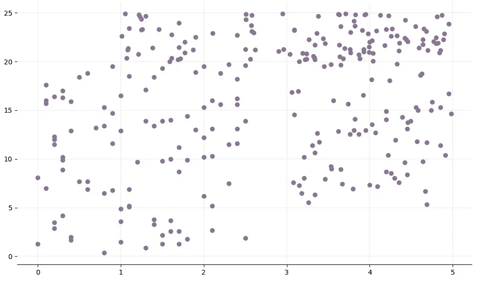

随机训练集。

两组数据点之间有一点空隙。但是越靠近中心，越不清楚哪个数据点属于哪个类。

二次曲线可能是分离这些类的一个很好的候选。因此，让我们用二次多项式核来拟合 SVM。

```
from sklearn import svm
model = svm.SVC(kernel='poly', degree=2)
model.fit(x_train, y_train)
```

要查看拟合该模型的结果，我们可以绘制决策边界和边界以及数据集。

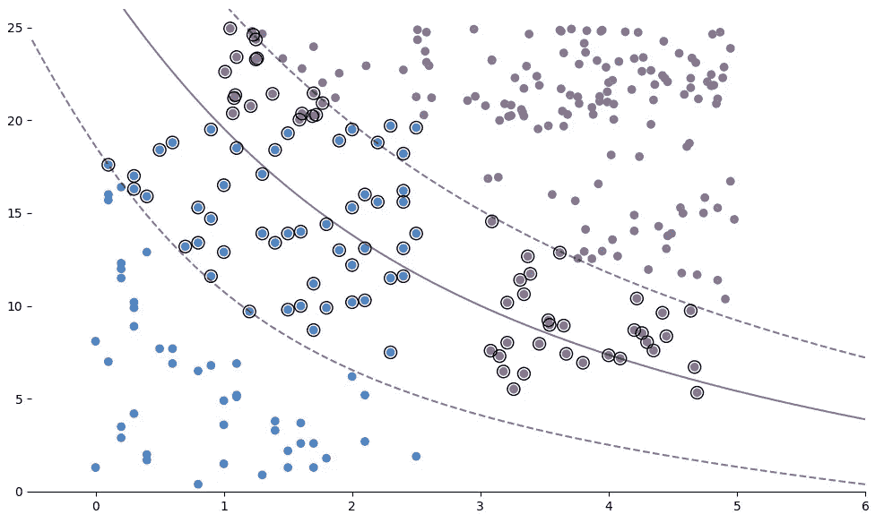

分类后的数据集，用圆圈标记决策边界(实线)、边界(虚线)和支持向量。

下面是绘制决策边界和边距的代码。

```
fig, ax = plt.subplots(figsize=(12, 7))# Removing to and right border
ax.spines['top'].set_visible(False)
ax.spines['left'].set_visible(False)
ax.spines['right'].set_visible(False)# Create grid to evaluate model
xx = np.linspace(-1, max(features['x']) + 1, len(x_train))
yy = np.linspace(0, max(features['y']) + 1, len(y_train))
YY, XX = np.meshgrid(yy, xx)
xy = np.vstack([XX.ravel(), YY.ravel()]).Ttrain_size = len(features[:-test_size]['x'])# Assigning different colors to the classes
colors = y_train
colors = np.where(colors == 1, '#8C7298', '#4786D1')# Plot the dataset
ax.scatter(features[:-test_size]['x'], features[:-test_size]['y'], c=colors)# Get the separating hyperplane
Z = model.decision_function(xy).reshape(XX.shape)
# Draw the decision boundary and margins
ax.contour(XX, YY, Z, colors='k', levels=[-1, 0, 1], alpha=0.5, linestyles=['--', '-', '--'])# Highlight support vectors with a circle around them
ax.scatter(model.support_vectors_[:, 0], model.support_vectors_[:, 1], s=100, linewidth=1, facecolors='none', edgecolors='k')plt.show()
```

如果我们根据测试集计算这个模型的准确性，我们会得到一个很好的结果，假设数据集非常小并且是随机生成的。

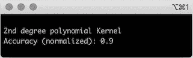

具有二次多项式核的 SVM 模型的精度。

```
from sklearn.metrics import accuracy_score
predictions_poly = model.predict(x_test)
accuracy_poly = accuracy_score(y_test, predictions_poly)print("2nd degree polynomial Kernel\nAccuracy (normalized): " + str(accuracy_poly))
```

精确度不错，但是让我们看看更简单的方法是否能解决我们的问题。为了用线性核来拟合 SVM，我们只需要更新核参数。

```
model = svm.SVC(kernel='linear')
model.fit(x_train, y_train)
```

用我们之前的方法画出决策边界。

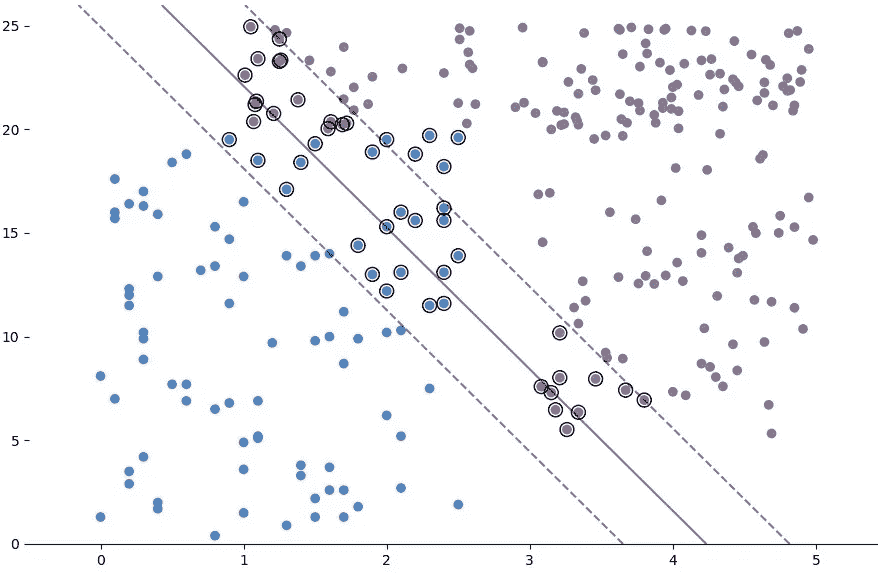

分类后的数据集，用圆圈标记决策边界(实线)、边界(虚线)和支持向量。

现在看起来页边空白内的点更少了，错误分类的点也更少了。计算该模型的精度，它比多项式核模型的精度略高。

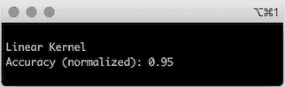

线性核 SVM 模型的精度。

因此，对于这个问题，一个更简单的模型，一个线性核的 SVM，是最好的解决方案。

希望你喜欢这些例子，并且你对支持向量机有了更好的理解，以及它们可以应用于什么样的问题。

*感谢阅读！*