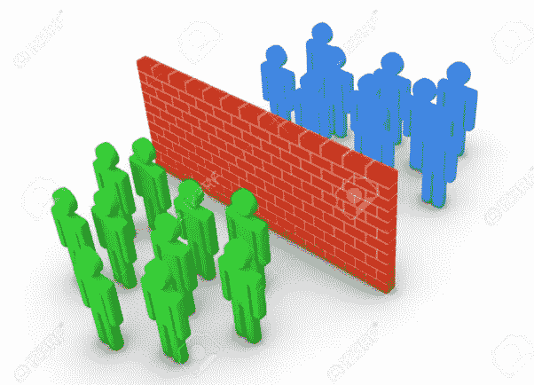
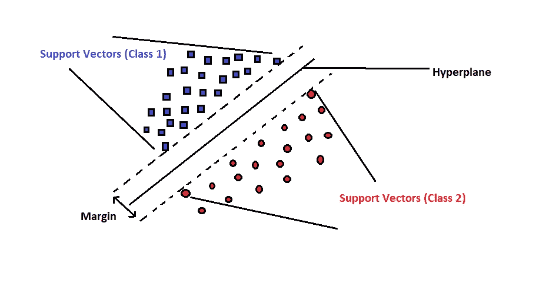
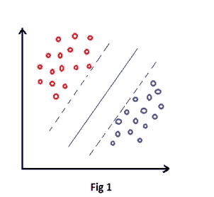
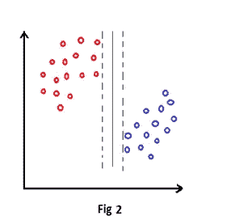
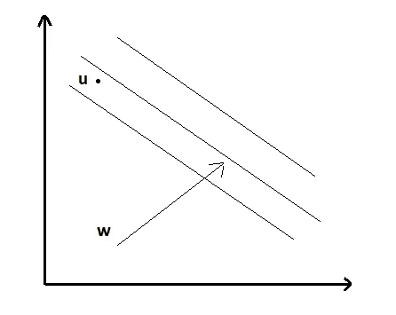
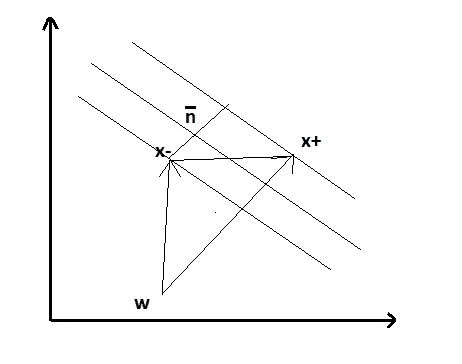
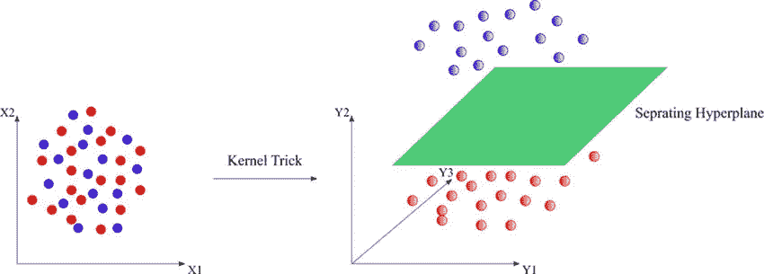
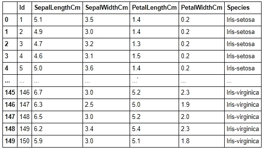
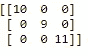
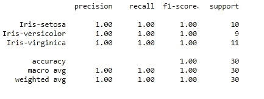

# 支持向量机

> 原文：<https://towardsdatascience.com/support-vector-machines-svm-c469d831a8b6?source=collection_archive---------49----------------------->

## 分离，但支持

图片由 [123rf](https://previews.123rf.com/images/viktor88/viktor881204/viktor88120400117/13097493-separation.jpg) 的[维克多·邦达](https://www.123rf.com/profile_viktor88)拍摄

## **历史**

这篇文章是关于支持向量机的介绍，理解数学直觉，正则化，在代码中实现概念，然后了解它的应用领域。好吧，那就系紧安全带，让我们进入这个美丽的概念支持向量机(SVM)的仙境。机器学习领域的先驱之一 Vladimir Vapnik 在 20 世纪 60 年代初发现了支持向量机。但他无法从计算上证明这种算法的魔力，因为他在 20 世纪 60 年代缺乏所需的资源。正是在 20 世纪 90 年代初，贝尔实验室邀请他前来美国进行相关的研究工作。早在 1993 年，在字符数字识别领域就有一项快速跟踪研究。Vapnik 打赌，他的支持向量机工作在数字识别方面可以比神经网络做得更好。因此，我的一位同事尝试应用 SVM，结果出乎意料地创造了奇迹。最后，这项在 20 世纪 60 年代发现的工作在 20 世纪 90 年代得到了认可，当时它实际上被实施以给出更好的计算结果。

## **简介**

支持向量机是一种用于分类和回归建模的监督机器学习算法。支持向量机的目的是识别空间中的样本，并根据类别对其进行分离。例如，如果我给你一个水果图片列表，那么算法会将输入的图片分类为苹果或草莓。记住，在上面的例子中，分类是基于类很容易分离的假设。如果图像的分布方式使得很难通过画直线来划分类别，那会怎么样呢？在我们朝这个方向分析之前，我们需要熟悉一些基础知识。

让我们进一步了解几个技术术语:

**超平面:**分隔在给定空间中分布的正负类的平面。

**Margin:** 在超平面的两边平行画出的一条分隔线，将正负类分开。

**支持向量:**距离位于超平面任一侧的边缘最近的正负点。

作者图片

## **棘手的部分！！**

我确信你的脑海中可能会出现一个问题，为什么我们不能在任何其他方向上找到一个分离的超平面和边缘。是的，这是可能的，但是我们必须确保我们选择超平面的方式使得超出边界的点的距离是最大的。为什么必须是最大值？？只是为了避免该区域中的点的错误分类。分离边缘越宽，将获得更准确的分类。下图 1 显示了边距之间有足够的间隔，以避免新点的错误分类，并正确地将它们分配到各自的类中。图 2 示出了在这种方向上的超平面可能导致边缘之间的间隙不足，并最终导致错误分类的点。

作者图片

作者图片

## **最大化利润—数学直觉**

作者图片

考虑一个向量 **ŵ** 在垂直于超平面的方向，如图所示。假设我们有一个未知点 **u** 位于超平面中。**。**由于我们有一个垂直于超平面的向量，我们可以考虑 **ŵ** 和 **c.** 任何未知点的内积，该点的存在是未知的，即，对于我们的数学假设，它是正点还是负点，我们认为它的点积至少大于常数 **c.**

**ŵ∙u>= c**

假设常数 **— c = b**

**ŵ∙u—c>= 0**

**ŵ∙u+b>= 0—(1)**

等式 1 是我们的**决策规则**，我们将在后面的阶段利用它。

假设平面右边的点是正的，表示为+1。

平面左侧的点为负，表示为-1。

因此，使用等式 1 中的判定规则，我们有以下两个等式，分别表示正负点。

**ŵ∙(x+)+b>= 1—(2)**

**ŵ∙(x-)+b<=-1—(3)**

现在为了数学上的方便，我们引入一个特征变量 **y** ,它满足上面的方程

**ŵ∙(x+时 y = 1)+b>=+1—(4)**

**ŵ∙(x-时 y =-1)+b<=-1—(5)**

从上面两个等式我们可以得出结论:将 **Y** 乘以等式(2)和(3) 任意点被正确分类的必要条件是下面给出的。

**y *(ŵ∙x+b)>= 1—(6)**

重新排列上面的等式，并考虑到该点仍然未知，我们可以将其等于零，得到如下

**y *(ŵ∙x+b)—1 = 0—(7)**

现在我们想要最大化两个边缘之间的距离，因此我们画出正点和负点边缘的正交向量 **ŵ** 。我们在边际上的支持向量可以认为是 **X+** 和 **X-** 。我们的目标是计算边距上两个支持向量之间的最大距离。然而，我们绘制了一个范数为 **w** 的范数，这样距离( **X+) — (X** -)可以通过在范数 w 上描绘距离来计算。因此，将 w 的单位向量与距离相乘实际上不会改变值。

**边距宽度=(x+)—(x-)=[(x+)—(x-)]*(ŵ/| |ŵ| |)**

作者图片

现在从方程(7)可以计算出 **X+** 和 **X-** 的值。

通过将 X+的 Y = 1，我们得到 X+的值如下

**1 *(ŵ∙(x+)+b)—1 = 0**

**(x+)=(1—b)/ŵ—(8)**

对于 X，Y = 1，我们得到 X 的值如下

**(-1)*(ŵ∙(x-)+b)—1 = 0**

**(x-)=(-1—b)/ŵ—(9)**

将等式(8)和(9)代入页边距宽度计算:

**边距宽度= (X+) — (X-)**

**=[(x+)—(x-)]*(ŵ/| |ŵ| |)**

**=(1-b+1+b)*(1/ŵ)*(ŵ/| |ŵ|)**

**= 2 *(1/| |ŵ|)**

**我们的目标是最大化边距宽度= max(2 *(1/| |ŵ|)**

**以 y *(ŵ∙x+b)—1 = 0 为条件**

好了，我们终于得出了页边距宽度的公式。

结束了吗？？不，不是真的！！！

我们在这里优化公式，使其一般化。为了优化公式，我们必须确保它达到凸性！！如果你不知道最优化的凸性，那也没关系。现在，如果没有数学上的便利，我们就无法实现最优化。

因此，我们将页边距宽度的等式重新定义为

**min()*(| |ŵ| | ^2)**

**以 y *(ŵ∙x+b)—1 = 0 为条件**

## **使用拉格朗日乘数优化**

现在我们知道，当我们有一个目标函数和约束，然后我们可以利用拉格朗日乘数法，找到变量的拉格朗日依赖关系。所以利用目标函数和约束条件，我们可以构造拉格朗日函数。

**l**=**()* | |ŵ| | 2—∑αI *[易*(ŵ∙x+b)—1]—--(1)**

现在根据拉格朗日函数

**∂L / ∂ŵ = 0**

**∂L / ∂b = 0**

在我们的主函数(1)中应用同样的方法，我们得到

∂L / ∂ŵ = 0

**ŵ — ∑ αi *易* xi = 0**

**ŵ = ∑ αi *易* Xi—--(2)**

∂L / ∂b = 0

**∑αI * yi = 0——-(3)**

应用(1)中的(2)和(3)

**L = *(∑αI * yi * Xi)*(∑αj * yj * XJ)—(∑αI * yi * Xi)*(∑αj * yj * XJ)—b *∑αI * yi+∑αI**

**L =∑αI—∑αI *αj * yj * yj * Xi * XJ**

***所以我们最后得出结论，边距宽度的优化因子取决于任意两个样本或点 x.***

## **线性可分与否？**

回到我们的第一幅图，可以看到，通过画一条直线，积极的和消极的类别被如此干净利落地分开了。这种类型的分离被称为线性可分离变量。有没有可能一直通过画一条直线把两个类分开？如果我们在试图画一条直线时有大量错误分类的点，该怎么办？考虑下图，我们可以看到这些点是不容易分开的。在这种情况下，我们使用内核。核的作用是将任何给定维度空间中的点转换到更高维度的空间。例如，在下图中，我们有 2-D 中的点，通过应用内核，我们看到它们被转换为 3-D。令我们惊讶的是，我们看到现在通过绘制一条线，这些点可以线性分离。

图片由[阿拉什·赛义德·普尔](https://www.researchgate.net/profile/Arash_Saeidpour)在[研究之门](https://www.researchgate.net/profile/Arash_Saeidpour/publication/303469788/figure/fig4/AS:668456450019348@1536383845662/SVM-classification-for-non-linearly-separable-data-points.jpg)上拍摄

## **正规化**

想象一下这样一种情况，边距宽度变得最大，但同时出现了点的两个错误分类。在这种情况下我们会怎么做？我们会尝试重新排列超平面以避免错误分类吗？如果你仔细考虑，答案必须是否定的，因为我们在这里优化和概括的情况。虽然我们可能会错误地分类一些点，但我们不能每次都通过改变超平面来折衷边缘宽度。在这种情况下，我们将应用正则化的概念。这里，我们将在超平面的对齐和不允许错误或错误分类之间找到惊人的平衡，同时尝试最大化余量。我们包括两个变量误差, **c** 给我们错误分类的总点数和**ɛ**给我们错误分类的每个误差的值。这有助于我们实现规则化效果，即告诉 SVM 不要调整或包含异常值，也有助于我们计算 **c** 的值，从而在使模型免受某些错误分类的影响和同时确保边距宽度最大化之间找到一个惊人的平衡。

**正则化= min()*(| |ŵ| | ^2)+∑ɛi**

## 代码实现

使用 SVM 的虹膜分类是理解 SVM 分类器概念的最好例子之一。鸢尾是一种大约有 250-300 种的花。在我们的例子中，我们有一个由花的细节组成的数据集，例如萼片宽度、萼片长度、花瓣宽度、花瓣长度。我们的目标是使用 SVM 分类器，基于数据集中可用的细节，将花分类为正确的种类。

作者图片

我们使用 sklearn 库中可用的方法将数据分成训练和测试数据。此外，我们从 sklearn 库中导入 SVC 分类器模型，并在训练数据上训练一个模型。

在集合上训练模型之后，我们然后将预测方法应用于测试数据集。使用各种准确性度量标准，我们然后使用混淆矩阵和分类报告检查并验证模型输出。

混乱矩阵作者的图片

作者图片

## **SVM 的应用**

字符电子识别

生物信息学

图像分类

人脸检测

感谢您花时间阅读这篇文章！！