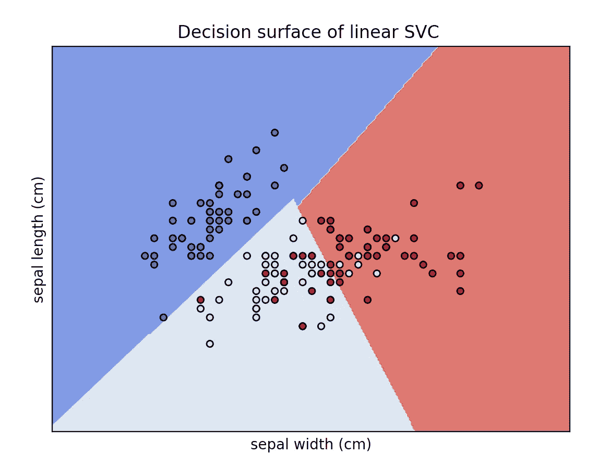

# 支持向量机(SVM)清楚地解释:一个 python 教程的分类问题与三维绘图

> 原文：<https://towardsdatascience.com/support-vector-machines-svm-clearly-explained-a-python-tutorial-for-classification-problems-29c539f3ad8?source=collection_archive---------2----------------------->

## 在这篇文章中，我解释了支持向量机的核心，为什么以及如何使用它们。此外，我还展示了如何在 2D 和 3D 中绘制支持向量和决策边界。


**手工制作**草图**作者**。SVM 插图。

# 介绍

每个人都听说过著名且广泛使用的**支持向量机** (SVMs)。最初的 SVM 算法是由 Vladimir N. Vapnik 和 Alexey Ya 发明的。1963 年的切尔沃嫩基斯。

**支持向量机**是**监督的**机器学习模型，通常用于**分类** ( **SVC** —支持向量分类)或**回归** ( **SVR** —支持向量回归)问题。根据目标变量(我们希望预测的)的特征，如果我们有一个**离散目标变量**(例如分类标签)，我们的问题将是一个分类任务，或者如果我们有一个**连续目标变量**(例如房价)，我们的问题将是一个回归任务。

支持向量机更常用于分类问题，因此，在本文中，我将只关注支持向量机模型。

# 方法的核心

在本文中，我不打算详细介绍算法的每一步(因为有大量的在线资源),而是解释关于支持向量机的最重要的概念和术语。

## 1.决策边界(分隔**超平面)**

SVCs 的目标是找到**最佳** **超平面**(也称为**决策** **边界**)使得**最佳** **将**(分裂)一个数据集分成两个类/组(二元分类问题)。

**根据输入特征**/变量的数量，**决策** **边界**可以是一条**线**(如果我们只有 2 个特征)或一个**超平面**(如果我们的数据集中有 2 个以上的特征)。

为了获得主要思想，考虑如下:每个观察(或样本/数据点)被绘制在一个 N 维空间**中，其中`**N**`是我们数据集中特征/变量的数量。在那个空间中，分离** **超平面**的**是一个 **(N-1)维子空间**。**

> **超平面**是 **N** - **维**-**空间**的一个( **N-1** )- **维**-**子空间**。

所以，如前所述，对于一个**二维空间**，**决策**，**边界**将只是一条**线**，如下图所示。


**手工制作**草图由**作者**制作。使用只有两个特征(即 x1 和 x2)的数据集来说明 SVM 分类模型(SVC)的决策边界。决策边界是一条线。

**数学上**，我们可以定义**决定**边界**为:**


作者写的渲染 latex 代码。

如果你想在交互式路线图和活跃的学习社区的支持下自学数据科学，看看这个资源:[https://aigents.co/learn](https://aigents.co/learn)

## 2.支持向量

**支持** **向量**就是距离**分离** **超平面**最近**的样本(数据点)。如果这些样本被移除，它们将改变分离超平面的位置。由此可见，这些就是**最重要的** **最重要的** **样本**即**定义****位置和方位的**最佳** **决定** **边界**。****

****

****手工制作**草图**作者**。在这个玩具二维 SVM 问题中，用紫色圈起来的点代表支持向量。**

## **3.硬边缘:SVM 如何找到最佳超平面？**

**几条不同的线(或者一般来说，不同的决策边界)可以分隔我们的类。但是哪一个是最好的呢？**

****

****手工制作**草图由**作者**制作。此图显示了分隔两个类别的 3 个候选决策边界。**

**超平面与最近的数据点(样本)之间的**距离**称为******余量**。目标是在**超平面**和任何**支持** **向量之间选择一个具有最大**可能** **余量**的超平面。** SVM 算法寻找最佳决策边界，如边际最大化。这里最好的线是黄线，如下图所示。******

****

****手工制作**草图**作者**。最佳分隔线是最大化边距(绿色距离)的黄色分隔线。**

**在**摘要**中，支持向量机选择**最大化**到**支持向量**的**距离**的决策边界。以最大化**到支持向量的距离**的方式绘制**决策** **边界**。如果决策边界太靠近支持向量，那么它将对噪声敏感并且不能很好地概括。**

## **4.关于软边界和 C 参数的一个注记**

**有时，我们可能想要(故意)允许一些**误差**(错误分类)。这就是“**软** **边距**”背后的主旨。软边界实现允许一些样本被错误分类或者位于决策边界的错误一侧，从而允许高度一般化的模型。**

**一个**软**余量**SVM**解决了下面的优化问题:**

*   ****增加**决策边界的**距离**到**支持向量** s(即余量)并且**
*   ****最大化**训练集中**正确** **分类**的点数。**

**很明显，这两个优化目标之间有一个**的权衡。这种权衡由著名的 **C** 参数控制。简而言之，如果 **C** 为**小**，则误分类数据点的罚分为**低**，因此选择具有**大** **裕量**的**决策** **边界**，代价是更大数量的误分类。如果 **C** 是**大**， **SVM** 试图**最小化**误分类**样本的数量，并导致**判定** **边界**具有**较小** **余量**。******

## 5.当没有清晰的分离超平面(核 SVM)时会发生什么？

如果我们有一个数据集是线性可分的，那么支持向量机的工作通常很容易。然而，在现实生活中，在大多数情况下，我们手头都有一个线性不可分的数据集，这正是**内核技巧**提供一些魔力的时候。

**内核** **技巧**将原始数据点投影到一个更高维的空间中，以便使它们可以线性分离(在那个更高维的空间中)。

> 因此，通过使用核技巧，我们可以使我们的非线性可分的数据，在一个更高维的空间中线性可分。

内核技巧是基于一些**内核** **函数**来测量样本的相似性。这个技巧实际上并没有将数据点转换到一个新的高维特征空间，显式地**。核 SVM 根据高维特征空间中的相似性度量来计算决策边界，而不实际进行投影。一些著名的核函数包括线性、多项式、径向基函数(RBF)和 sigmoid 核。**

****

****手工制作**草图**作者**。内核技巧。在原始空间中，数据不是线性可分的，但是在投影到更高维空间后，它们是线性可分的。**

# **在 scikit-learn 中使用 Iris 数据集和线性 SVC 模型的 Python 工作示例**

**提醒:虹膜数据集由 150 个花样本组成，每个样本具有 4 个特征/变量(即萼片宽度/长度和花瓣宽度/长度)。**

# **2D**

****让我们在 2D 绘制决策边界(我们将只使用数据集的 2 个特征):****

```
from sklearn.svm import SVC
import numpy as np
import matplotlib.pyplot as plt
from sklearn import svm, datasetsiris = datasets.load_iris()# Select 2 features / variables
X = iris.data[:, :2] # we only take the first two features.
y = iris.target
feature_names = iris.feature_names[:2]
classes = iris.target_namesdef make_meshgrid(x, y, h=.02):
    x_min, x_max = x.min() — 1, x.max() + 1
    y_min, y_max = y.min() — 1, y.max() + 1
    xx, yy = np.meshgrid(np.arange(x_min, x_max, h), np.arange(y_min, y_max, h))
    return xx, yydef plot_contours(ax, clf, xx, yy, **params):
    Z = clf.predict(np.c_[xx.ravel(), yy.ravel()])
    Z = Z.reshape(xx.shape)
    out = ax.contourf(xx, yy, Z, **params)
    return out# The classification SVC model
model = svm.SVC(kernel="linear")
clf = model.fit(X, y)fig, ax = plt.subplots()# title for the plots
title = (‘Decision surface of linear SVC ‘)
# Set-up grid for plotting.
X0, X1 = X[:, 0], X[:, 1]
xx, yy = make_meshgrid(X0, X1)plot_contours(ax, clf, xx, yy, cmap=plt.cm.coolwarm, alpha=0.8)
ax.scatter(X0, X1, c=y, cmap=plt.cm.coolwarm, s=20, edgecolors="k")
ax.set_ylabel("{}".format(feature_names[0]))
ax.set_xlabel("{}".format(feature_names[1]))
ax.set_xticks(())
ax.set_yticks(())
ax.set_title(title)
plt.show()
```

****

**以上 python 代码的输出。作者创作的赋格曲。**

**在虹膜数据集中，我们有 3 类花和 4 个特征。这里，我们仅使用 2 个特征(因此我们有一个 2 维特征空间)T1，并且我们绘制了线性 SVC 模型的决策边界。点的颜色对应于类别/组。**

# **三维（three dimension 的缩写）**

****让我们在 3D 中绘制决策边界(我们将只使用数据集的 3 个特征):****

```
from sklearn.svm import SVC
import numpy as np
import matplotlib.pyplot as plt
from sklearn import svm, datasets
from mpl_toolkits.mplot3d import Axes3Diris = datasets.load_iris()
X = iris.data[:, :3] # we only take the first three features.
Y = iris.target#make it binary classification problem
X = X[np.logical_or(Y==0,Y==1)]
Y = Y[np.logical_or(Y==0,Y==1)]model = svm.SVC(kernel='linear')
clf = model.fit(X, Y)# The equation of the separating plane is given by all x so that np.dot(svc.coef_[0], x) + b = 0.# Solve for w3 (z)
z = lambda x,y: (-clf.intercept_[0]-clf.coef_[0][0]*x -clf.coef_[0][1]*y) / clf.coef_[0][2]
tmp = np.linspace(-5,5,30)
x,y = np.meshgrid(tmp,tmp)fig = plt.figure()
ax = fig.add_subplot(111, projection='3d')
ax.plot3D(X[Y==0,0], X[Y==0,1], X[Y==0,2],'ob')
ax.plot3D(X[Y==1,0], X[Y==1,1], X[Y==1,2],'sr')
ax.plot_surface(x, y, z(x,y))
ax.view_init(30, 60)
plt.show()
```

****

**以上 python 代码的输出。图由作者生成。**

**在虹膜数据集中，我们有 3 类花和 4 个特征。这里我们只使用了 3 个特征(所以我们有一个**三维特征空间**)和**只有 2 个类**(二进制分类问题)。然后，我们绘制了线性 SVC 模型的决策边界。点的颜色对应于 2 个类别/组。**

# ****绘制支持向量****

```
import numpy as np
import matplotlib.pyplot as plt
from sklearn import svm
np.random.seed(2)# we create 40 linearly separable points
X = np.r_[np.random.randn(20, 2) — [2, 2], np.random.randn(20, 2) + [2, 2]]
Y = [0] * 20 + [1] * 20# fit the model
clf = svm.SVC(kernel=’linear’, C=1)
clf.fit(X, Y)# get the separating hyperplane
w = clf.coef_[0]
a = -w[0] / w[1]
xx = np.linspace(-5, 5)
yy = a * xx — (clf.intercept_[0]) / w[1]margin = 1 / np.sqrt(np.sum(clf.coef_ ** 2))
yy_down = yy — np.sqrt(1 + a ** 2) * margin
yy_up = yy + np.sqrt(1 + a ** 2) * marginplt.figure(1, figsize=(4, 3))
plt.clf()
plt.plot(xx, yy, "k-")
plt.plot(xx, yy_down, "k-")
plt.plot(xx, yy_up, "k-")plt.scatter(clf.support_vectors_[:, 0], clf.support_vectors_[:, 1], s=80,
 facecolors="none", zorder=10, edgecolors="k")
plt.scatter(X[:, 0], X[:, 1], c=Y, zorder=10, cmap=plt.cm.Paired,
 edgecolors="k")
plt.xlabel("x1")
plt.ylabel("x2")
plt.show()
```

****

**以上 python 代码的输出。图由作者生成。**

****双** - **圆圈** **点**代表**支持** **向量**。**

# **最新帖子**

**[](/time-series-forecasting-predicting-stock-prices-using-facebooks-prophet-model-9ee1657132b5) [## 时间序列预测:用脸书的先知模型预测股票价格

### 使用可从《先知脸书》公开获得的预测模型预测股票价格

towardsdatascience.com](/time-series-forecasting-predicting-stock-prices-using-facebooks-prophet-model-9ee1657132b5) [](/roc-curve-explained-using-a-covid-19-hypothetical-example-binary-multi-class-classification-bab188ea869c) [## 用新冠肺炎假设的例子解释 ROC 曲线:二分类和多分类…

### 在这篇文章中，我清楚地解释了什么是 ROC 曲线以及如何阅读它。我用一个新冠肺炎的例子来说明我的观点，我…

towardsdatascience.com](/roc-curve-explained-using-a-covid-19-hypothetical-example-binary-multi-class-classification-bab188ea869c) [](/pca-clearly-explained-how-when-why-to-use-it-and-feature-importance-a-guide-in-python-7c274582c37e) [## PCA 清楚地解释了——如何、何时、为什么使用它以及特性的重要性:Python 指南

### 在这篇文章中，我解释了什么是 PCA，何时以及为什么使用它，以及如何使用 scikit-learn 在 Python 中实现它。还有…

towardsdatascience.com](/pca-clearly-explained-how-when-why-to-use-it-and-feature-importance-a-guide-in-python-7c274582c37e) [](/everything-you-need-to-know-about-min-max-normalization-in-python-b79592732b79) [## 关于 Python 中的最小-最大规范化，您需要知道的一切

### 在这篇文章中，我将解释什么是最小-最大缩放，什么时候使用它，以及如何使用 scikit 在 Python 中实现它

towardsdatascience.com](/everything-you-need-to-know-about-min-max-normalization-in-python-b79592732b79) [](/how-and-why-to-standardize-your-data-996926c2c832) [## Scikit-Learn 的标准定标器如何工作

### 在这篇文章中，我将解释为什么以及如何使用 scikit-learn 应用标准化

towardsdatascience.com](/how-and-why-to-standardize-your-data-996926c2c832) 

# 敬请关注并支持这一努力

如果你喜欢并发现这篇文章有用，请关注我！

有问题吗？把它们作为评论贴出来，我会尽快回复。

# 参考

[1][https://www.nature.com/articles/nbt1206-1565](https://www.nature.com/articles/nbt1206-1565)

[https://en.wikipedia.org/wiki/Support_vector_machine](https://en.wikipedia.org/wiki/Support_vector_machine)

[2][https://sci kit-learn . org/stable/modules/generated/sk learn . SVM . SVC . html](https://scikit-learn.org/stable/modules/generated/sklearn.svm.SVC.html)

# 和我联系

*   **领英**:【https://www.linkedin.com/in/serafeim-loukas/】T4
*   **研究之门**:[https://www.researchgate.net/profile/Serafeim_Loukas](https://www.researchgate.net/profile/Serafeim_Loukas)
*   **https://people.epfl.ch/serafeim.loukas**EPFL**简介** : [美国](https://people.epfl.ch/serafeim.loukas)
*   **堆栈** **溢出**:[https://stackoverflow.com/users/5025009/seralouk](https://stackoverflow.com/users/5025009/seralouk)**