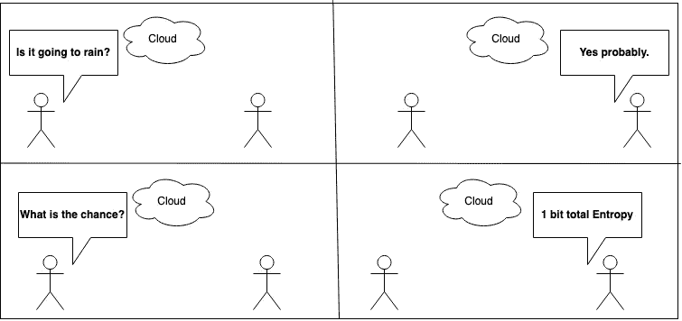
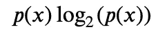
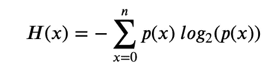

# 惊奇和熵的故事

> 原文：<https://towardsdatascience.com/surprise-and-the-tale-of-entropy-c127da84937a?source=collection_archive---------57----------------------->



今天，我从一个有趣的问题开始我的小文章。假设有一天，外面正下着雨，你走出家门，发现你的露天庭院完全干涸了。你的第一反应会是什么？

惊喜！

为什么？

因为，当外面下雨时，你已经知道你的院子会是湿的。如果你已经看到了这一点，那么你就不会“收到”任何新的信息，因此就不会有惊讶的成分。但是既然你发现它没有湿，你就“接收”了一些信息。这让人感到意外。

现在，我们可以试着在这种情况下更正式一点。假设你已经知道庭院有 0.1%的可能是干的，0.9%的可能是湿的。*(你注意到价值观的选择了吗？我选择它们的方式是，如果你把它们加起来，值就是 1.0。你能解释一下吗？)*所以，在这个设置中，我们有两个变量。

1.  x(庭院干燥的可能性)
2.  y(庭院潮湿的可能性)

现在，让我问这个问题(即使你没有完全理解它的意思，请耐心听我说)变量 X 的“熵”是什么？

在我们做数学之前，让我告诉你熵是变量不确定性的度量。越不确定，熵越高。那么基于这种直觉，你认为变量的熵会是多少？在这里停下来想一想。

好的。现在，让我们做数学。(如果对 Claude Shannon 的原论文感兴趣，可以查看一下[这里](http://people.math.harvard.edu/~ctm/home/text/others/shannon/entropy/entropy.pdf)我们说一个变量的总熵等于——



其中 p(x)代表事件的概率。

下面来一点 Python:)

我们知道 X 的概率是 0.1 所以，

```
In [1]: import mathIn [2]: (0.1) * round(math.log2(0.1), 2)
Out[2]: -0.332
```

根据同样的定律，Y 的熵是—

```
In [3]: (0.9) * round(math.log2(0.9), 2)
Out[3]: -0.135
```

正如所料，X 的熵大于 Y 的熵(如果我们暂时忽略负号的话)。所以，我们可以从这个例子中看到，一个事件发生的可能性越小，这个事件的熵就越大。

如果我们愿意，我们也可以从这个角度来考虑——我们对一个事件的信息越少，也就是说，它越令人惊讶，这个事件的熵就越高。

现在，我们要问另一个问题。系统的总熵是多少？其实很简单。我们是这样衡量的—



系统的总熵

所以，基本上我们要把 X 和 Y 的值加起来，然后取反。

```
In [4]: - (-0.332 + (-0.135))
Out[4]: 0.467
```

我们用称为“比特”的单位来表示这个量。所以我们可以说这个系统有 0.467 比特的熵。因此，你可以从这个系统接收那么多的信息。

为了完成这篇文章，我们要测量一次公平抛硬币的熵。它有多少比特的熵？

在公平抛硬币的情况下，我们可以像下面这样列出正面和反面的概率

1.  P(H) = 0.5
2.  P(T) = 0.5

所以，应用上面的方法，我们可以计算熵。它将是 1 比特。

```
In [5]: - ( (0.5 * math.log2(0.5)) + (0.5 * math.log2(0.5)))
Out[5]: 1.0
```

这并不奇怪！

希望你喜欢这个关于熵和信息论的小介绍。这个小等式支撑着我们现在的整个通信系统。有个想法是好事。

如果你喜欢，请按拍手图标多次。这会鼓励我写更多。此外，你可以在这里关注我的未来文章，撰写关于信息论、复杂性理论、机器学习、算法、离散数学等方面的文章。

有关更多信息(！)和进一步的阅读—

1.  [信息论:教程介绍](https://arxiv.org/pdf/1802.05968.pdf)
2.  [智能人的信息论](http://tuvalu.santafe.edu/~simon/it.pdf)