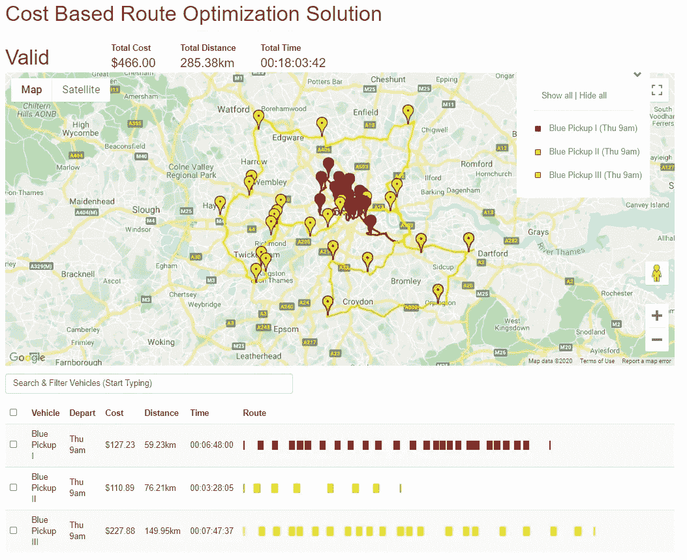

# 基于成本的路线优化结果令人惊讶

> 原文：<https://towardsdatascience.com/surprising-cost-based-route-optimization-results-513438fbeda7?source=collection_archive---------44----------------------->

基于真实世界成本的路线优化。图片由 [Free-Photos](https://pixabay.com/users/free-photos-242387/) 发自 [Pixabay](https://pixabay.com) 。

*基于成本的路线优化*不同于仅考虑距离或时间的路线优化。

> 基于成本的路线优化在现实世界中很有用，因为它符合任何试图降低成本和提高效率的公司的业务目标。

相比之下，仅考虑距离的路线优化提供了一个有吸引力的假设结果-地图上看起来不错的路线。但仅此而已。

这很容易用几个例子来演示。

# 仅基于距离成本的路线优化

考虑以下 3 辆车和 50 个地点的交付时间表，该时间表需要针对伦敦周边的当天交付进行优化。

3 辆车，50 站距离成本仅路线优化由 [Optergon](https://optergon.com) 提供

车辆成本用 *F/D/T* ( *固定，距离&时间*)表示。每辆车的基于时间的成本被设置为 0，这意味着时间不会影响系统的总成本(*这显然不适用于现实世界中的送货公司*)。距离成本为 1 美元/公里。

优化该交货计划(*可能包括任何类型的交货和提货*)会产生以下结果。

3 辆车，50 站距离成本唯一路线优化解决方案由 [Optergon](https://optergon.com) 提供

这看起来是一个相当不错的结果。的确如此。因为它只有基于距离的成本数据可以处理。

基于仅距离路线优化来优化其车队和交付时间表的公司永远不会怀疑他们没有利用最有效的路线优化解决方案。

> 从本质上说，他们把钱留在桌子上而不知道，因为没有办法通过简单地看结果来判断是否有更低成本的解决方案。

# 基于距离和时间成本的路线优化

让我们稍微改变一下场景，为每辆车在路上花费的时间赋值。毕竟，司机的工资是按小时支付的，在运输、物流和配送公司的总成本中占很大一部分。

3 辆车，50 站距离和时间成本路线优化由 [Optergon](https://optergon.com) 提供

每辆车都有相同的基于时间的成本，每小时 10 美元。在优化该时间表之后(*除了基于时间的成本*的变化之外是相同的)，我们获得了以下结果。

由 [Optergon](https://optergon.com) 提供的 3 辆车、50 站距离和时间成本路线优化解决方案

长得很像。事实上，鉴于每辆车基于时间的成本是相同的，这正是我们所期望的，对吗？毕竟，如果每辆车的成本完全相同，就不应该有变化。

除了，这里有一个微妙的区别。

返回到仅*距离*基于成本的路线优化解决方案，并查看总时间(显示在地图上方的*)。现在将它与基于距离和时间的优化解决方案的总时间进行比较。*

花的时间更少。大约少了 4 分钟。

> 最优路线被稍微改动了一下，以减少总的时间为代价，以少量的距离为代价，使优化的总成本最小化。

这里或那里的几分钟可能看起来不多，但这是一个非常小的优化，只有微小的差异。即使是现在，随着时间的推移，成本的降低也会累积起来，从而带来显著的节约。

如果我们远离这个简单的例子，即我们小型车队中的所有车辆都产生相同的成本，那么考虑基于时间和距离的成本的重要性就变得更加明显。

# 基于可变时间和距离成本的路径优化

让我们假设我们的一辆车需要一名司机**和一名合作伙伴**来完成一些交付——基本上是那辆车基于时间的成本的两倍。

由 [Optergon](https://optergon.com) 提供的 3 辆车、50 个停车距离和可变时间成本路线优化

*蓝色皮卡 III* 现在的时间成本是每小时 20 美元，是其他两辆车的两倍。在此交货计划的所有其他方面保持不变的情况下，这是优化的结果。

由 [Optergon](https://optergon.com) 提供的 3 辆车、50 站距离和可变时间成本路线优化解决方案

同样，这看起来是合理的。仔细观察，您会注意到*蓝色皮卡 III* ，这款基于时间的运营成本翻了一番的车辆最终只使用了很短的时间。

这听起来可能很合理，因为我们凭直觉理解业务目标是降低车队的总体成本。

对于任何只考虑基于距离的成本的系统来说，这种类型的解决方案是完全不可能的。只有距离成本的系统仍然会返回类似于我们的初始路径优化解决方案的东西，该解决方案是时间成本不可知的。

# 基于真实世界时间和距离成本的路线优化

现代公司运营着拥有许多不同车辆类型的多样化车队。这些不仅有不同的运载能力，他们也有不同的相关成本每距离。

让我们假设*蓝色皮卡 I* 是一辆稍微旧一点的车，不太省油。

3 辆车，50 站真实世界成本路线优化由 [Optergon](https://optergon.com) 提供

*蓝色皮卡 I* 的行驶距离成本为 1.20 美元——相比之下，两款较新的车型每公里成本仅为 1 美元。

结果非常有趣，可能不是你第一眼看到的那样。

3 辆车，50 站现实世界成本路线优化解决方案由 [Optergon](https://optergon.com) 提供

*蓝色皮卡 I* 实际上花了很长的*时间*送货。事实上，只比日程限制规定的 8 小时少了 10 分钟——几乎与最便宜的汽车*蓝色皮卡 II* 花费的时间相同。

然而，他们的优化路线有很大的不同。

仔细观察每个人走过的距离。*蓝色皮卡 I* 行驶了 68 公里多一点，而*蓝色皮卡 II* 行驶了两倍多，才刚刚超过 162 公里。

> 仅使用时间(或仅使用距离)进行交付规划的路线优化没有必要的数据来确保每辆车的行为方式**降低车队的总体成本**。

在这种情况下，前两辆皮卡不得不花很长时间停车，以防止昂贵的时基车(*蓝色皮卡 III* )抬高成本。

与此同时，第一辆皮卡需要尽可能少地行驶，以防止其膨胀的距离成本推高车队的整体成本。

> 这突出了不考虑基于时间和距离的成本之间复杂相互作用的路线优化的假设交付计划与降低现实世界中发生的总成本的优化解决方案之间的差异。

你可以在 Optergon 使用一个月的[免费路线优化](https://optergon.com/user/register)来尝试为自己的车队制定基于成本的交付计划。

*最初发表于*[*https://optergon.com*](https://optergon.com/blog/surprising-cost-based-route-optimization-results)*。*