# 用 Python 命名匹配的惊人有效的方法

> 原文：<https://towardsdatascience.com/surprisingly-effective-way-to-name-matching-in-python-1a67328e670e?source=collection_archive---------1----------------------->

## 数据匹配、模糊匹配、重复数据删除

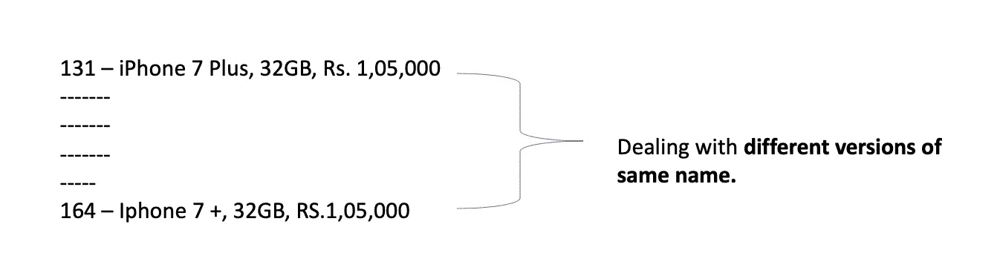

姓名匹配问题先睹为快，*图片作者*。

R 最近我偶然发现了这个数据集，在这里我需要分析数码产品的销售记录。我得到的数据集差不多有 572000 行和 12 列。我非常兴奋能够处理如此大的数据。我兴致勃勃地快速查看数据，发现同一个名字重复走不同的行。(啊！数据清理时间太长了！).

在一些产品栏上，它包含 iphone，而在另一个栏上，它写着 Iphone，或 iphone 7 +和 iphone 7 Plus，对于一些常规客户列表，有些有 Pushpa Yadav，而在其他 Pushpa Yadav(名称是伪的)。

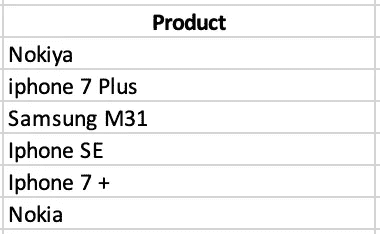

先睹为快的问题视图(不是来自原始数据集)，作者的*图片。*

这些是相同的产品名称和客户名称，但采取了不同的形式，即**处理相同名称**的不同版本。这类问题是数据科学家在数据分析过程中要处理的常见场景。这个场景有一个名字叫做**数据匹配**或**模糊匹配**(概率数据匹配)或简称为**重复数据删除**或**字符串/名称匹配**。

## 为什么会有“不同但相似的数据”？

常见的原因可能是:

*   数据输入时出现打字错误。
*   缩写用法。
*   系统数据输入没有被很好地验证以检查这种错误。
*   其他人。

无论如何，作为数据科学家或分析师，我们有责任匹配这些数据，以创建主记录供进一步分析。

所以，我草草记下了解决问题的行动:

1.手动检查并解决。

2.寻找有用的库/资源，这些库/资源是由社区的精英们分享的。

对于这样一个扩展的数据集(572000* 12)来说，第一个选择确实很麻烦，所以我开始查看不同的库，并用模糊匹配器(conda 现在没有)尝试了这些方法，fuzzywuzzy 在核心上使用了 [Levenshtein distance](https://en.wikipedia.org/wiki/Levenshtein_distance) 和 [difflib](https://docs.python.org/3/library/difflib.html) 。

> 然而，在使用它们的过程中，我发现对于这样的大数据，这是非常耗时的。因此，我需要寻找一种更快更有效的方法。

经历了许多天的挫折后，我终于知道了克里斯·范登贝格分享的解决方案。

## **我们将介绍**

*   ngram
*   …向量化…
*   TF-IDF
*   余弦相似度与稀疏点 topn:领先果汁
*   工作演示(代码工作)

因为我们的目标不仅仅是匹配字符串，而且是以更快的方式匹配。因此，ngram 的概念，具有余弦相似性的 TF-IDF 开始发挥作用。

在进入工作演示(代码工作)之前，让我们了解一下基础知识。

## N-grams

n 元语法广泛用于文本挖掘和自然语言处理，它是给定句子或(单词文件)中一组共现的单词。为了找到 n-gram，我们向前移动一个单词(可以根据需要移动任何一步)。

例如，对于房型*“标准房海景威基基塔”*

如果 N=3(称为三元组)，那么 N 元组(三元组)将是:

*   标准客房海洋
*   海景客房
*   怀基基海滩海景
*   观看怀基基塔

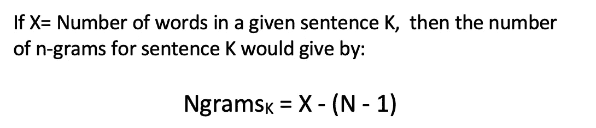

公式为 Ngrams，*图片作者*。

从[研究论文](https://ieeexplore.ieee.org/abstract/document/4470313/)中探索更多关于 ngrams 的信息

**为什么 n=3？**

可能会产生一个问题，为什么 n = 3 可以被看作 n= 1(一元)或 n=2(二元)。

这里的直觉是，与单个词相比，双词和三词可以捕捉上下文信息。例如，当独立观察时，“房间海景”比仅仅“房间”、“海洋”和“景色”有更多的含义。

## TF-IDF

TF-IDF 代表术语频率-逆文档频率，而 TF-IDF 权重是信息检索和文本挖掘中经常使用的两个主要关注的权重。

1.用于评估一个单词对集合中的文档有多重要

2.重要性随着单词出现的次数成比例增加

**TF-IDF 背后的两个想法**

词频(TF)，又名。一个单词在文档中出现的次数除以该文档中的总单词数，即它衡量一个术语在文档中出现的频率。

逆文档频率(IDF)，计算为语料库中文档数量的对数除以特定术语出现的文档数量，即，它衡量术语的重要性。

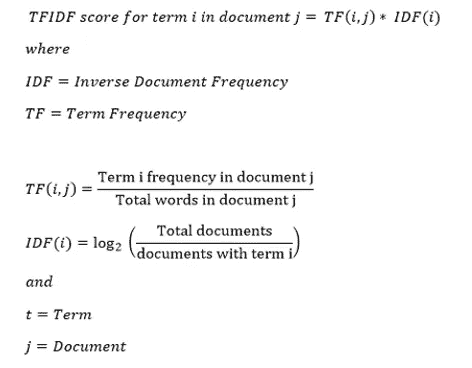

TF-IDF 的公式。

在计算 TF 时，所有项都被认为是同等重要的。然而，众所周知，特定的词，如“是”、“的”和“那个”，可能会出现很多次，但没有什么重要性。

## …向量化…

将每个单词拆分后，需要将这些单词(词条)转换为 SciKit 学习算法模型可以使用的向量，因为这些算法只理解数字特征的概念，而不考虑其底层类型(文本、图像和数字等)。)允许我们对不同类型的数据执行复杂的机器学习任务。

**Scikit-learn 的 tfidf 矢量器**旨在将一组原始文档转换为 TF-IDF 特征矩阵，它可以一次性计算字数、IDF 和 TF-IDF 值。


*图片作者。*

这样，我们就生成了 tf_idf_matrix，这是一个稀疏矩阵。与 Tfidfvectorizer 一样，我们将原始文本转换为单词和 n 元语法的数字向量表示。正如已经说过的，这使得直接使用变得容易；算法只理解数字特征的概念，而不管其基本类型(文本、图像、数字等)。).

## 余弦相似性

两个文本文档在它们的上下文(表面接近度)和意义(即，词汇相似度和语义相似度)方面如何彼此接近被称为文本相似度，并且有各种方法来计算文本相似度，例如**余弦相似度、欧几里德距离、雅克卡系数和骰子。**

余弦相似性度量两个文档之间的文本相似性，而不考虑它们的大小。数学上，余弦相似性度量测量在多维空间中投影的两个 n 维向量之间的角度的余弦，并且取值范围从 0 到 1，

在哪里，

*   1 表示更相似
*   0 表示相似度较低。

数学上:

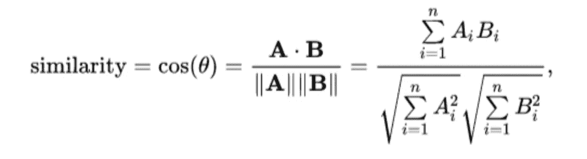

余弦相似性公式。

然而， [ING 批发银行高级分析](https://medium.com/wbaa/what-does-ing-wb-advanced-analytics-do-707a09175530)团队的数据科学家发现余弦相似度有一些缺点:

*   sklearn 版本做了大量的类型检查和错误处理。
*   sklearn 版本一次性计算并存储所有相似度，而我们只对最相似的感兴趣。

因此两者都会导致**使用更多的内存消耗和时间。**

> 为了优化这些缺点，他们创建了他们的库，该库仅存储每行中前 N 个最高匹配，并且仅存储阈值以上的相似性。

获取更多关于库:**s**[**parse _ dot _ topn**](https://github.com/ing-bank/sparse_dot_topn)

> 他们自豪地声称，这种方法提高了大约 40%的速度，并减少了内存消耗。

有了这些基本的基础知识，我们开始我们的代码工作。

我假设你熟悉 Jupyter 笔记本和下载库。如果没有，请查看我之前的[帖子](https://medium.com/analytics-vidhya/exploratory-data-analysis-for-beginner-7488d587f1ec)，在那里我已经分享了探索性数据分析的初学者指南。

**工作环境:** [来自 Anaconda 的 Jupyter 笔记本](https://docs.anaconda.com/ae-notebooks/user-guide/basic-tasks/apps/jupyter/)

**数据集:** [房间类型](https://github.com/maladeep/Name-Matching-In-Python/blob/master/room_type.csv)

**数据集快照**

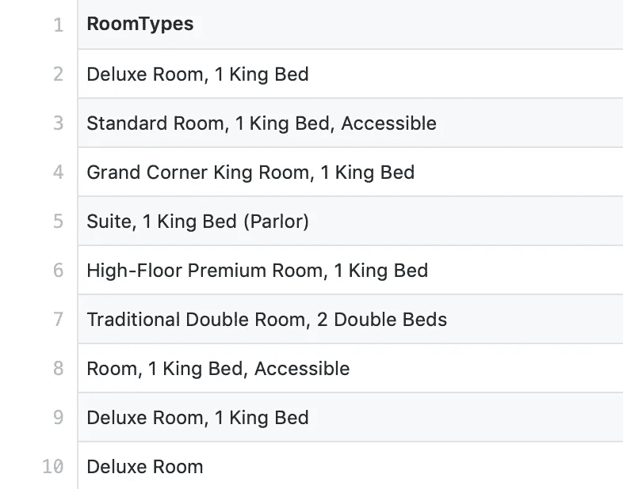

数据集的快照。

现在让我们导入所需的库/方法，读取我们的数据集并将其保存到“df”中，只要快速查看数据集，就可以将“df”命名为任何名称。

```
#  Importing libraries and module and some setting for notebookimport pandas as pd 
import re
from sklearn.feature_extraction.text import TfidfVectorizer
import numpy as np
from scipy.sparse import csr_matrix
import sparse_dot_topn.sparse_dot_topn as ct  # Leading Juice for us
import time
pd.set_option('display.max_colwidth', -1)# reading dataset as dfdf =  pd.read_csv('room_type.csv')# printing first five rowsdf.head(5)
```

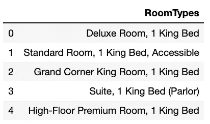

快速查看 5 行数据集。

## ngrams

这里，我们取 n = 3，因此 3-gram 或三元组，因为大多数房间类型包含两个或三个单词，并且我们将句子分成标记，去除所有特殊字符、标点符号和单个字符(，-。/).收集那 3 克。

```
def ngrams(string, n=3):string = re.sub(r'[,-./]|\sBD',r'', string)
    ngrams = zip(*[string[i:] for i in range(n)])
    return [''.join(ngram) for ngram in ngrams] # Testing ngrams work for verificationprint('All 3-grams in "Deluxroom":')
ngrams('Deluxroom')
```

为了验证，我们测试了“Deluxroom”的 3-gram 结果，输出如下:

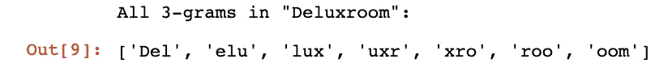

“豪华客房”的 3 克结果。

看起来不错！

现在，在拆分每个单词(标记或词条(n-gram 生成的项目) )之后，我们需要对使用 Scikit-Learn 库提供的 [Tfidfvectorizer](https://scikit-learn.org/stable/modules/generated/sklearn.feature_extraction.text.TfidfVectorizer.html) 的每个文档中出现的单词进行计数，并将一组原始材料转换为 TF-IDF 特征矩阵。

```
room_types = df['RoomTypes']
vectorizer = TfidfVectorizer(min_df=1, analyzer=ngrams)
tf_idf_matrix = vectorizer.fit_transform(room_types)
```

让我们查看生成的稀疏 CSR 矩阵。

```
print(tf_idf_matrix[0])
```

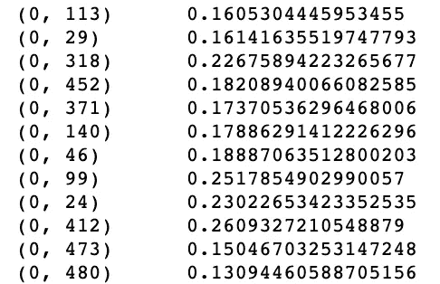

稀疏 CSR 矩阵。

看起来不错！

## 余弦相似度与稀疏点 topn:领先果汁

我们正在用**sparse _ dot _ topn**库处理一个 CSR 矩阵。****

```
**def awesome_cossim_top(A, B, ntop, lower_bound=0):
    # force A and B as a CSR matrix.
    # If they have already been CSR, there is no overhead
    A = A.tocsr()
    B = B.tocsr()
    M, _ = A.shape
    _, N = B.shape

    idx_dtype = np.int32

    nnz_max = M*ntop

    indptr = np.zeros(M+1, dtype=idx_dtype)
    indices = np.zeros(nnz_max, dtype=idx_dtype)
    data = np.zeros(nnz_max, dtype=A.dtype)ct.sparse_dot_topn(
        M, N, np.asarray(A.indptr, dtype=idx_dtype),
        np.asarray(A.indices, dtype=idx_dtype),
        A.data,
        np.asarray(B.indptr, dtype=idx_dtype),
        np.asarray(B.indices, dtype=idx_dtype),
        B.data,
        ntop,
        lower_bound,
        indptr, indices, data)return csr_matrix((data,indices,indptr),shape=(M,N))**
```

****我们存储前 10 个最相似的项目，并且只存储相似度高于 0.8 的项目，并显示模型所用的时间。****

```
**#  Top 10 with similarity above 0.8t1 = time.time()
matches = awesome_cossim_top(tf_idf_matrix, tf_idf_matrix.transpose(), 10, 0.8)
t = time.time()-t1
print("SELFTIMED:", t)**
```

****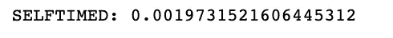****

****Selftime 0.0019，快！****

****然后，我们解包得到的稀疏矩阵；****

```
**# unpacks the resulting sparse matrixdef get_matches_df(sparse_matrix, name_vector, top=100):
    non_zeros = sparse_matrix.nonzero()

    sparserows = non_zeros[0]
    sparsecols = non_zeros[1]

    if top:
        nr_matches = top
    else:
        nr_matches = sparsecols.size

    left_side = np.empty([nr_matches], dtype=object)
    right_side = np.empty([nr_matches], dtype=object)
    similairity = np.zeros(nr_matches)

    for index in range(0, nr_matches):
        left_side[index] = name_vector[sparserows[index]]
        right_side[index] = name_vector[sparsecols[index]]
        similairity[index] = sparse_matrix.data[index]

    return pd.DataFrame({'left_side': left_side,
                          'right_side': right_side,
                           'similairity': similairity})**
```

****我们观看比赛。****

```
**# store the  matches into new dataframe called matched_df and 
# printing 10 samplesmatches_df = get_matches_df(matches, room_types, top=200)
matches_df = matches_df[matches_df['similairity'] < 0.99999] # For removing all exact matches
matches_df.sample(10)**
```

****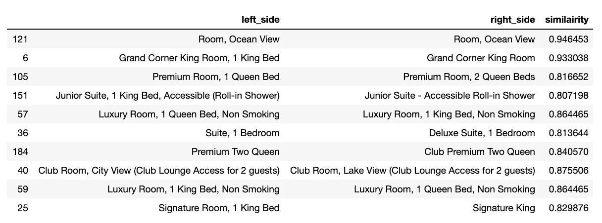****

****火柴看起来相当令人满意！****

******套房**、 **1 居室**和**豪华套房，1 居室**很可能不是同一个房型，我们得到的相似度为 0.81。看起来不错！****

****按照排序的顺序，我们查看我们的匹配。****

```
**# printing the matches in sorted ordermatches_df.sort_values(['similairity'], ascending=False).head(10)**
```

****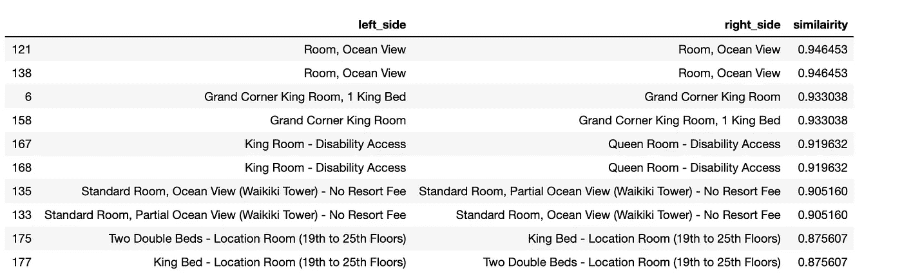****

****排序匹配。****

****比赛看起来相当令人满意！余弦相似性给出了两种房间类型之间相似性的良好指示。**大转角大床房 1 特大床**和**大转角大床房**大概是同一个房型，我们得到的**相似度为 0.93。******

> ****因此，正确的视觉评估和用这种策略进行的匹配是非常令人满意的。****

****因此，通过使用 ngram 进行标记化，使用 TF-IDF 进行向量矩阵，使用 TfidfVectorizer 对每个文档中出现的单词进行计数，并使用与 sparse_dot_topn 的余弦相似性，我们甚至可以最快地匹配大型数据集的字符串(使用 572000*12 获得了良好的结果)。****

****在我的 [GitHub](https://github.com/maladeep/Name-Matching-In-Python) 中获取整个工作 Jupyter 笔记本。****

> ****喜欢这篇文章吗？成为一个中等会员继续学习，没有限制。如果您使用 [*以下链接*](/@maladeep.upadhaya/membership) *，我将收取您一部分会员费，无需您支付额外费用。*****
> 
> ****如果你对这篇文章有任何疑问，或者想在你的下一个数据科学项目中合作，请在 LinkedIn 上 ping 我。****

*****敬请关注下一篇与数据科学相关的帖子。*****

## ****推荐读物****

*   ****[使用 TF-IDF 从噪声中识别信号](https://mungingdata.wordpress.com/2017/11/25/episode-1-using-tf-idf-to-identify-the-signal-from-the-noise/)****
*   ****[促进大规模数据集中最相似实体的选择](https://medium.com/wbaa/https-medium-com-ingwbaa-boosting-selection-of-the-most-similar-entities-in-large-scale-datasets-450b3242e618)****
*   ****[余弦相似度——文本相似度度量](https://studymachinelearning.com/cosine-similarity-text-similarity-metric/)****
*   ****N-gram 简介:它们是什么，我们为什么需要它们？****
*   ****[快速探索性数据分析:熊猫概况](https://medium.com/analytics-vidhya/quick-exploratory-data-analysis-pandas-profiling-421cd3ec5a50)****