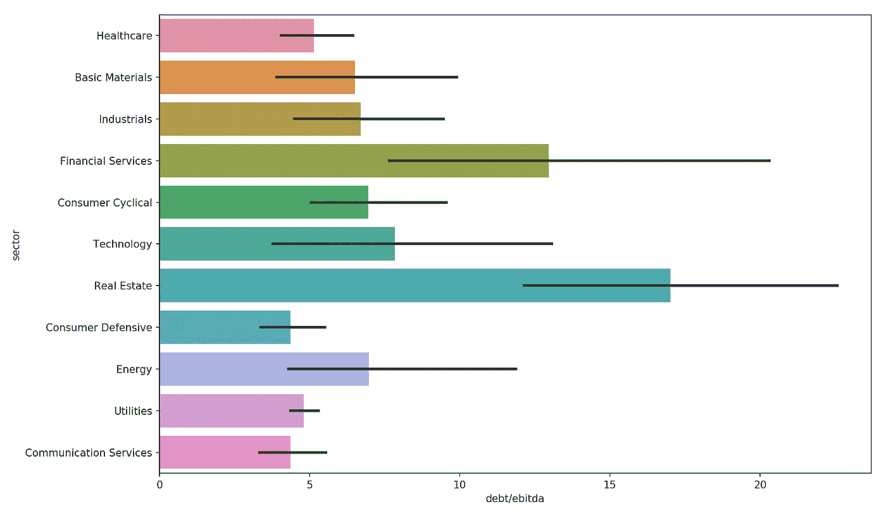
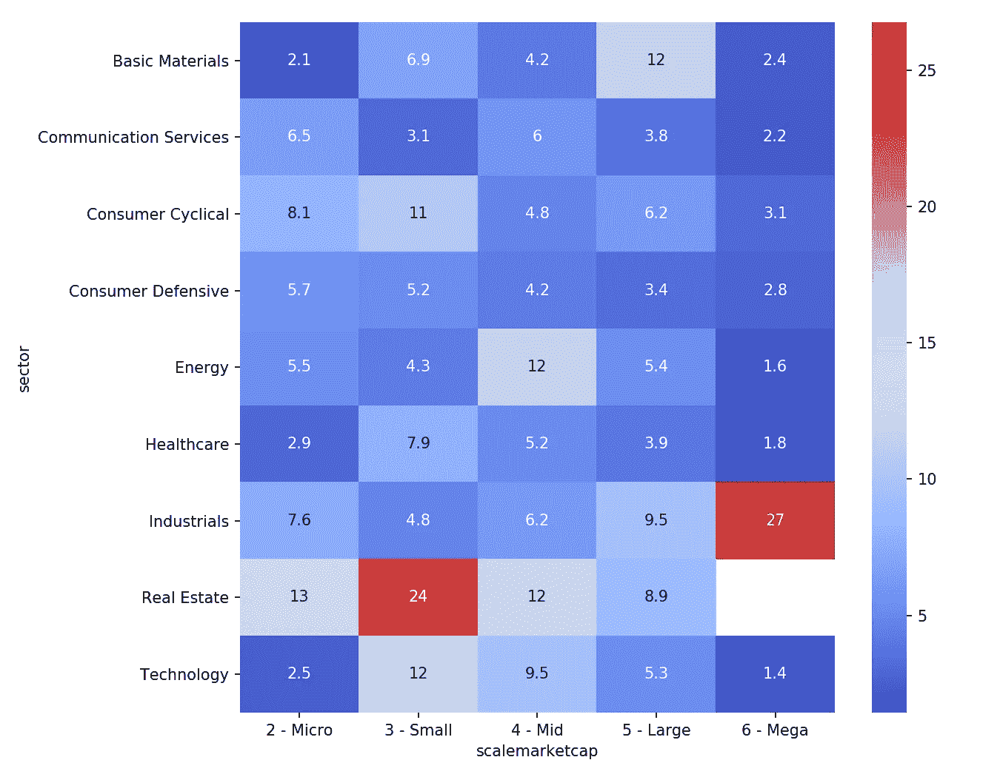
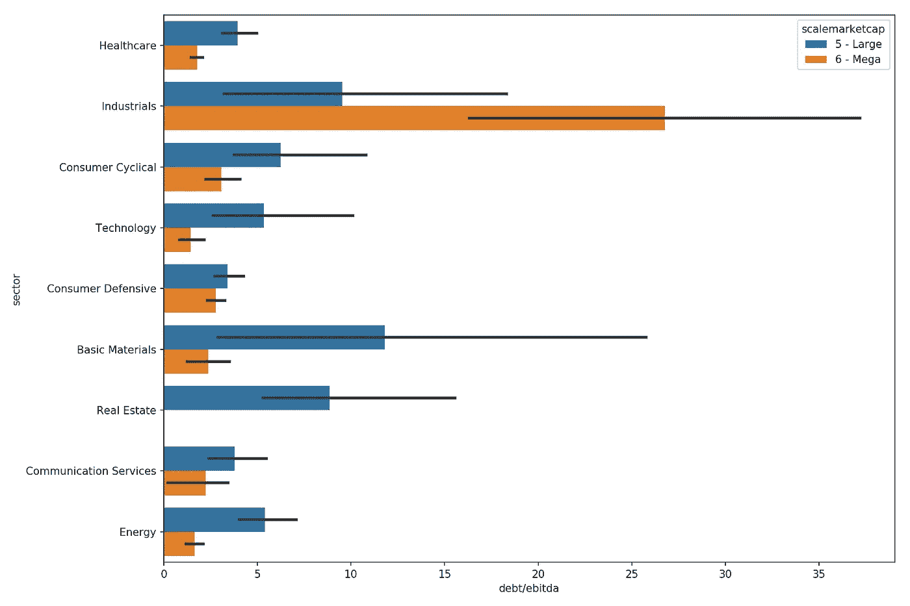
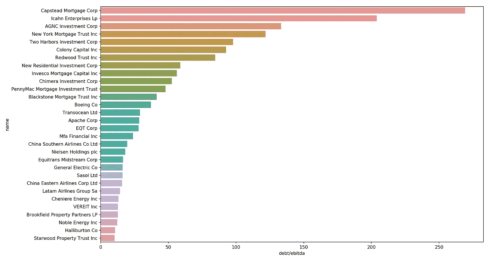
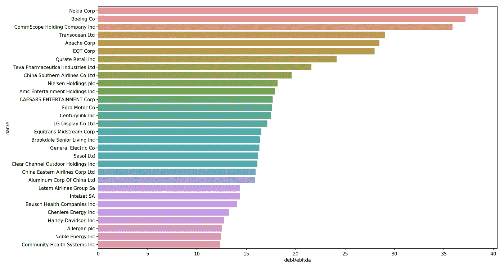

# 调查美国公司的债务

> 原文：<https://towardsdatascience.com/surveying-corporate-americas-debt-d5dea58450f3?source=collection_archive---------69----------------------->

费利克斯·米特迈尔在 [Unsplash](https://unsplash.com?utm_source=medium&utm_medium=referral) 上的照片

## 我们用数据来评估美国公司的财务健康状况

*(如果你想用我的代码，* [*你可以在我的 GitHub*](https://github.com/yiuhyuk/LSTM_stocks/blob/master/stock_DNA_project.ipynb) *这里找到。抱歉，还没清理/评论。此外，你需要订阅 Sharadar 美国基础和一个 Quandl API 密钥来运行它)*

典型的美国公司有多健康？这是一个非常相关的问题。虽然有理由对新冠肺炎局势的改善保持谨慎乐观，但这只是第一步。接下来的事情(重新开放和恢复经济)将会同样困难或者更加困难。

当我们最终走出这条经济隧道的另一边时，许多大大小小的企业都将不复存在。今天，我们将研究潜在的财务数据，以了解美国企业的债务状况，以及是否存在任何明显的问题点。

# 为什么企业会违约

公司破产最常见的原因是高昂的固定成本——换句话说，当收入骤降时，无法降低成本。公司有固定成本有多种原因:

*   为了正常运转，企业需要在工厂等高成本资产上进行大量前期投资。如果一家公司刚建完新工厂，销售额就暴跌，这对公司的底线来说是灾难性的——它付出了现金，却没有办法赚回来。职能型的高固定成本在金融术语中被称为经营杠杆。
*   固定成本高的另一个原因是债务。任何一家公司，无论其成本结构如何，都可以通过负债在繁荣时期增加回报。这有点像用经纪人提供的保证金购买股票。如果股票价格持续上涨，很好，你赚了更多的钱，因为债务允许你购买更多的股票。如果股市崩盘，那你就有大麻烦了。你不仅损失了大部分投资，还需要偿还经纪人你所借的原始金额。大量借贷的公司面临同样的风险——如果企业倒闭，现金流枯竭，那么他们可能无法偿还债务。
*   这两者的混合是隐性债务，如被锁定在**长期租赁或租赁合同**(如租赁飞机或租赁大量商业房地产)。

今天，我们将重点探讨等式中的债务部分，因为**巨额债务通常也是高运营杠杆的标志**(除非一家公司像苹果一样拥有大量现金流，否则它通常需要借款才能支付前期基础设施投资)。

# 谁持有所有的债务？

我们先来看看哪些行业负债最多。竞争动态(利润率、基础设施需求等。)不同行业的公司差异很大，因此我们应该预计债务的用途也会有所不同。我在下面按部门绘制了总资产负债表债务(包括长期和短期)。一些观察结果:

*   金融服务部门(银行等。)雇佣了最多的债务。不过，这并不一定意味着它们的违约风险最大。银行将债务作为赚钱的工具(或原始投入)。在高层次上，它们将通过存款(如支票和储蓄账户)借入的资金转化为产生现金的贷款——因此它们基本上是用来在经济中输送资金的。只要这些贷款产生的利息收入(而不是全体违约)高于银行为其存款支付的利息支出，银行就会赚钱。对银行的财务分析应该更多地关注他们的股本缓冲(总资产减去总负债)和贷款的风险。在评估一家银行时，与其说它借入了多少美元，不如说它把借来的钱投资到了哪里。由于这些原因，在接下来的一些情节和分析中，我将省略金融服务公司。
*   借入大量资金的行业通常是那些前期投资需求较高的行业，如通信服务(康卡斯特，美国电话电报公司)、能源(埃克森美孚)、公用事业和房地产。

截至 2019 年底的行业负债情况(来源:Sharadar 美国基本面)

**总债务水平很有趣，但更重要的是看相对于收入的债务水平，这是公司偿债能力的一个因素。**我们可以通过将债务除以 EBITDA 并按行业绘制平均债务/EBITDA(如下)来实现。EBITDA 代表未计利息、税项、折旧和摊销前的收益。EBITDA 是一家公司手头用于偿债的现金流的合理指标。

*   虽然通信服务行业发行了大量债务(在我们之前的情节中，仅次于金融服务)，但它也产生了大量利润，因为它包括谷歌和脸书等利润丰厚的公司(因此，从债务/EBITDA 角度来看，它看起来相当健康，这还不包括他们的巨额现金储备)。康卡斯特和美国电话电报公司也因其在家庭互联网上的寡头垄断而获得了丰厚的利润。
*   在这个情节中，真正跳出来的是房地产。该行业的平均收入并不多，但却借了很多钱(每 1 美元的 EBITDA 就有 17 美元的债务)。恕我直言，我不确定这一领域的商业地产风险是多少(远程办公趋势和向在线零售的持续转移对写字楼和购物中心的所有者来说不是好兆头)。但看看这个领域的大型公司(按市值计算)，有像 American Tower 和 Crown Castle 这样拥有和租赁蜂窝塔的公司，还有 Equinix，它在数据中心方面也做同样的事情——今天已经是必不可少的服务，也许明天在家工作会更是如此。因此，尽管随着经济形势的恶化，相对于收入的高负债将被证明是一个挑战，但这些公司并不像乍看上去那样受到 COVID 的影响。

2019 年底按行业划分的债务/EBITDA(来源:Sharadar 美国基本面)

# 按行业和市值分类

让我们稍微集中一下我们的镜头，把市值也包括在我们的分析中。我们可以使用热图来直观显示按行业和市值划分的平均债务/EBITDA 水平(市值是公司规模的一个不错的代表)。

按行业和市值划分的债务/EBITDA(来源:Sharadar 美国基本面)

在我们深入研究这些数字之前，请注意，对于一家公司的债务/EBITDA 比率应该是多少，并没有正确的答案。这取决于管理层管理流动性的能力、债务的利率、现金流的周期性(如果你的公司在衰退中现金流骤降，那么它应该注意它借了多少钱)，以及用这些债务融资的项目的回报。显然，这些变量因公司而异。它们还会根据经济状况或特定行业状况而变化——你可以打赌，如果衰退加深，EBITDA 将严重下降，以前看起来可控的债务将成为巨大的负担。

认识到债务不一定是坏事是很重要的。如果一家公司有大量且稳定的现金流，能够以低利率获得债务(由于今天的超低利率环境)，并能够从债务中获得超过所支付利息的回报，那么它至少应该借一点点。只要管理层不高估现金流的规模和稳定性，像谷歌、苹果和伯克希尔哈撒韦这样的公司的超低利率债务几乎等同于免费资金。

好，回到我们的热图。总的来说，我注意到以下几点:

*   相对于收入而言，小型房地产公司和大型工业公司负债累累。我们绝对应该看一看这两个桶里的公司。
*   正如我们之前观察到的，一般来说，房地产公司的债务相对于他们的支付能力来说是很高的。我们还发现，该行业中负债最重的是规模较小的公司(房地产投资组合不太多样化)。
*   中型能源公司([我想知道那里有多少压裂设备](https://medium.com/datadriveninvestor/a-recent-investment-history-of-oil-d06c073e901c))和大型基础材料公司相对于他们的同行来说看起来负债过高。**负债累累的大宗商品公司让我感到紧张——它们对所售商品的价格没有任何控制权，因此只要价格一跌，它们就可能被彻底摧毁。**

我注意到的另一件事是，除了工业类股，**大型公司的平均负债水平高于同行业的大型公司**(见下图)。我猜想，这是因为大型公司主导着各自的行业，享有规模竞争优势，因此利润率更高。因此，尽管以绝对美元为基础，相对于收入，他们可能会借更多的钱(由于他们更高的盈利能力)，但大型公司实际上看起来负债更少。不过，我很惊讶地看到，在基础材料等大宗商品领域，债务存在如此明显的差异。

大盘股比超级大盘股负债更多(来源:Sharadar 美国基本面)

# 负债累累的个别公司

下面是能源、房地产和工业部门负债最多的 30 家公司的图表 ***(我只包括负债至少 50 亿美元的公司，因为我想把重点放在鲸鱼上)*** 。

看看前几名，他们主要是抵押贷款房地产投资信托基金(如卡普斯泰德和 AGNC)。与银行类似，这些公司借款是为了投资抵押债券组合(因此债务或多或少是他们业务的基本投入)。因此，高水平的债务是可以预期的，并不一定是一件坏事——只要抵押贷款房地产投资信托基金敏锐地管理其投资组合中的违约风险(在整个商业周期内)，并恰当地匹配其资产和负债的期限(又称债务)。因此，我们应该越过房地产公司，专注于能源和工业(Brookfield Property Partners 是一个例外，它管理着办公楼、酒店、购物中心等。并可能在未来几个月陷入困境)。

抵押贷款房地产投资信托基金之后，你会看到财务管理不善的公司，如波音(太多的股票回购)和通用电气，以及能源公司，如越洋公司和阿帕奇公司。越洋公司是一个有趣的公司。2014 年前，当油价仍徘徊在 100 美元左右时，Transocean 的海上钻井船和钻机船队需求巨大。每艘船(或钻机)成本很高，但赚得更多——所以只要油价居高不下，借钱投资更大的船队是明智的。显然，随着石油价格跌至 20 年来的最低点，以及[陆上页岩油产量的激增](https://medium.com/datadriveninvestor/a-recent-investment-history-of-oil-d06c073e901c)，Transocean 公司昂贵的船队在过去 5 年里已经成为一个巨大的财务拖累。

30 家负债最多的能源、房地产和工业公司

以下是除金融服务和房地产 ***(仅指负债至少 50 亿美元的公司)*** 之外的所有行业。这不是一个漂亮的列表。下面的大多数公司都受到了疫情的严重影响，即使经济重新开始，他们也会继续感受到痛苦:

*   波音和拉美航空集团受到航空旅行急剧下降的沉重打击。
*   Transocean、Apache、Cheniere Energy 和 Noble Energy 将发现在当前的油价下几乎不可能赚钱。
*   凯撒娱乐公司(Caesars Entertainment)和 AMC 娱乐公司(AMC Entertainment)将很难分别吸引人们回到赌场和影院(当它们重新开业时，将不得不承担执行严格的社交距离和容量规则的成本)。
*   福特和 Clear Channel Outdoor Holdings(广告牌)将在未来几年受到远程工作加速趋势的沉重打击。更少的司机意味着更少的汽车销售和更少的通勤者观看户外广告。

请记住，企业业绩往往并不等同于股票表现，尤其是在短期内。**股票表现完全取决于实际发生的情况和预期发生的情况。正如即使是伟大公司的股票也会在市场低迷时大幅抛售一样，管理不善和缺乏竞争力的公司的股票也能在牛市中表现出色，因为牛市中充满了动物精神。**

30 负债最多的行业，除了金融服务和房地产(来源:Sharadar 美国基本面)

# 结论

这只是洋葱的第一层。我计划在不久的将来深入研究债务结构、商业模式以及公司财务报表的其他领域。

最后，在我们开始之前，让我们检查一下总体债务水平在过去 5 年中是否增加了。他们有！除了基本材料，其他所有行业的债务都有所增加。当然，这是长期经济繁荣(刚刚结束)的副产品——随着公司的销售、利润和资产增长，他们能够借更多的钱，也确实借了。但这种行为也增加了经济低迷时期的违约风险——债务水平创下历史新高，而经济状况的恶化降低了利润和支付能力。

过去 5 年，几乎所有行业的债务水平都有所上升(来源:Sharadar 美国基本面)

希望这是有见地的。当我开始分析这些数据时，我脑子里并没有一个故事，只是想看看我能找到什么。我仍在分析，所以会有更多的来。干杯，保持安全，投资愉快！