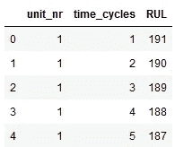
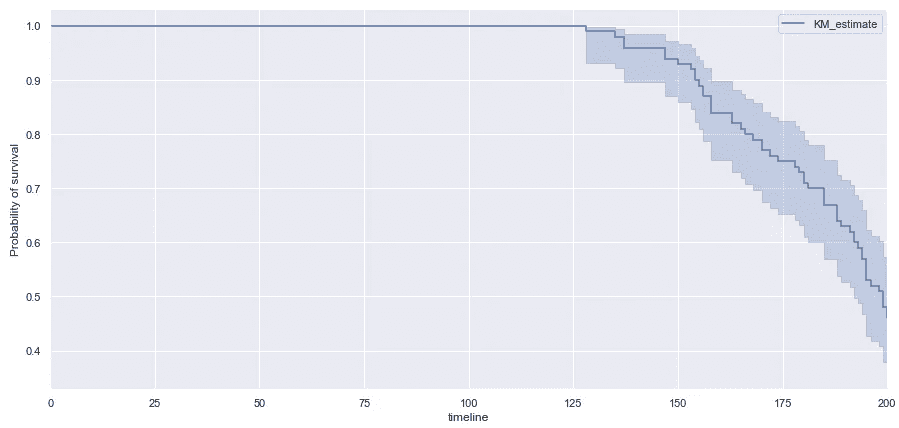
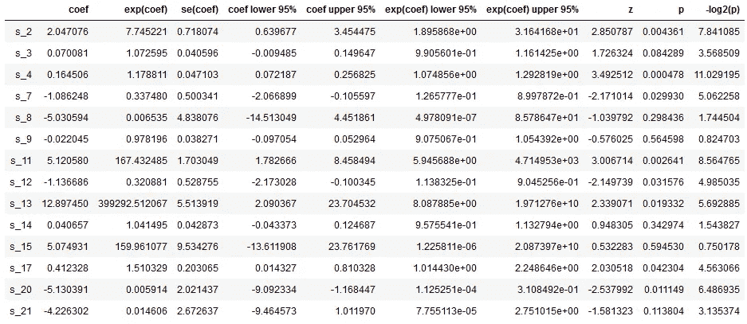
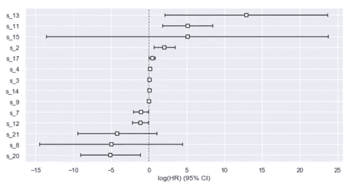
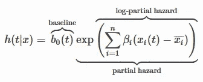
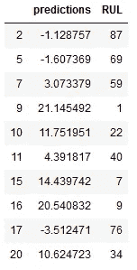
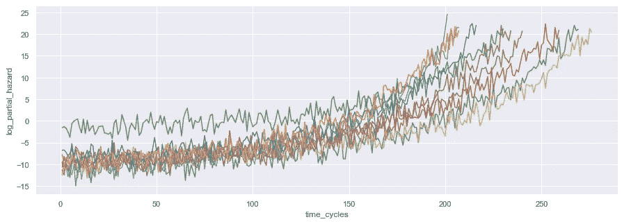
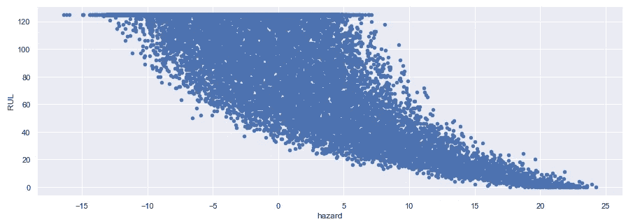
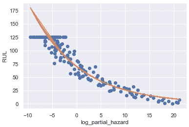

# 涡扇发动机预测维修的生存分析

> 原文：<https://towardsdatascience.com/survival-analysis-for-predictive-maintenance-of-turbofan-engines-7e2e9b82dc0e?source=collection_archive---------6----------------------->


弗拉季斯拉夫·切尔卡先科在 [Unsplash](https://unsplash.com?utm_source=medium&utm_medium=referral) 上的照片

## [探索美国宇航局的涡轮风扇数据集](https://towardsdatascience.com/tagged/exploring-nasa-turbofan)

## 解释危险和示例实施

*<免责声明:我的目的是展示模型开发过程中不同方法和选择的效果。这些影响经常使用测试集来显示，这被认为是(非常)不好的做法，但有助于教育目的。>*

欢迎来到“探索 NASA 的涡轮风扇数据集”系列的另一部分。这将是对第一个数据集(FD001)的第四次也是最后一次分析，其中所有发动机在相同的操作条件下运行，并产生相同的故障。

在我的[上一篇文章](/time-series-analysis-for-predictive-maintenance-of-turbofan-engines-1b3864991da4?source=friends_link&sk=a62dbeb8230f6b29123b692ac08dad59)中，我们深入研究了时间序列分析，并探索了用于预测性维护的分布式滞后模型。最终模型表现相当好，RMSE 为 20.85。今天我们将探讨生存分析。这是一种我渴望尝试的技术，因为我已经多次听说和阅读过这种技术，它可能是一种适用于预测性维护的方法。然而，我从未遇到过满足我好奇心的示例实现。首先，生存分析到底是什么？

# 生存分析入门

生存分析起源于医学领域，用来回答关于特定人群寿命的问题。如果你知道某人的年龄，可以预测某人的一生，你也可以估计那个人还能活多少时间。例如，这种技术应用于流行病学或疾病治疗研究。然而，它也可以应用于数据由持续时间和基于时间的事件组成的许多其他情况，例如流失预测和预测性维护。下面我快速总结了生存分析中使用的几个关键概念[1，2]:

*事件*:一个有趣现象的发生，在我们的例子中是发动机故障。
*持续时间*:持续时间是指开始观察到事件发生的时间或者观察停止的时间
*删截*:删截发生在观察已经停止但感兴趣的对象还没有他们的‘事件’的时候。
*生存函数*:生存函数返回在/过去时间 t 的生存概率
*危险函数*:危险函数返回事件在时间 t 发生的概率，假设事件直到时间 t 还没有发生

对我来说，生存分析的一个吸引人的方面是在还没有事件的模型中包括主体(或者在我们的例子中是机器)的可能性。在更传统的机器学习中，你会从数据集中丢弃“不完整的”或经过审查的主题，这可能会使结果有偏差[3]。解释了一些基础知识后，是时候开始了！

# 加载数据

我们将读取数据并计算剩余使用寿命(RUL ),就像我们现在习惯的那样。


train.head()的结果



正如在以前的帖子中所讨论的，我们将剪裁任何高于 125 的 RUL 值，因为这将极大地提高模型性能。此外，从先前的探索性数据分析中得出的非信息特征被丢弃。

# 数据准备

我们稍后将使用的模型需要一个事件列。因此，让我们添加一个细分列，指示引擎是发生故障(1)还是仍在运行(0)。

接下来，我们需要指出每个观察的开始和停止时间。由于数据集在多个时间周期内具有连续的测量值，因此每个观测值只是一个周期。我们可以使用 time_cycles 列来指示观察的结束，我们将添加一个等于`time_cycles — 1`的 start 列来指示观察的开始。


train.tail()的结果

注意时间周期、RUL、分解和开始列值，以检查我们所做的数据准备是否符合我们的预期，看起来不错！

在列车组中，每台发动机都出现故障，因此没有任何经过审查的观察结果。我们将通过忽略 200 个时间周期后的任何记录，人为地对我们的数据集进行右审查。这使得我们可以在一个更真实的环境中处理数据，混合使用已经发生和还没有发生故障的引擎。

# 卡普兰迈耶曲线

所有的数据准备工作都完成了，是时候深入了解引擎的生存时间和概率了。我们可以使用卡普兰迈耶曲线来实现这一点，它所需要的是表明持续时间(时间周期)和事件(故障或功能)的最后一次观察



卡普兰迈耶曲线

这种方法已经为我们提供了一种粗略的工具，来估计来自相同群体的发动机在过去的时间 t 内存活的概率。例如，发动机有 100%的概率在第一个 128 个时间周期中存活。在这之后，第一个发动机开始出现故障，但是仍然有 46%的可能性发动机能够存活超过 200 个时间周期。请注意，这种方法仅表示超过某一点后的生存概率，但不能超出给定的数据进行推断。

# Cox 比例风险模型

提供更多信息的常见模型是 Cox 比例风险模型。它计算危险比率，例如指示故障风险，例如在特定设置下运行的发动机发生故障的可能性是在不同设置下运行的发动机的 1.85 倍。

python lifelines 包的 CoxPH 实现还附带了漂亮的“predict_expectation”方法，为您提供了一种估计事件发生时间的直接方法。由于这种 predict_expectation 方法，我尽了最大努力将 CoxPH 模型应用于我们的数据集。为了利用发动机随时间的退化，我使用“cluster_col”来表示发动机的 unit_nr，试图让模型考虑每个发动机的多个观察值。不幸的是，结果相当糟糕。下定决心要成功，我联系了《生命线》的作者卡梅伦·戴维森-皮隆。在这里，我了解到“cluster_col”并不是指与时间相关的样本，而是指具有与时间无关的观察值的组。例如，指示不同的处理组，或在不同操作设置下运行的发动机组。

为了利用数据集的时间序列特性，您必须使用时变模型。然而，这个模型的缺点是它没有一个方法来估计事件发生的时间。它预测了部分危险，解释起来不太直观，你会在下面看到。

# CoxTimeVaryingFitter

训练模型非常简单，您实例化模型并调用 fit 方法，传递数据集、id_col 以指示唯一的引擎、event_col 以指示是否发生故障以及 start 和 stop 列，以便模型可以解释观察的持续时间。

```
# returns
# Iteration 8: norm_delta = 0.00000, step_size = 1.00000, ll = -63.86010, newton_decrement = 0.00000, seconds_since_start = 0.1
# Convergence completed after 8 iterations.# <lifelines.CoxTimeVaryingFitter: fitted with 18627 periods, 100 subjects, 54 events>
```

接下来，我们将检查模型。

```
# returns
# <lifelines.CoxTimeVaryingFitter: fitted with 18627 periods, 100 subjects, 54 events>
#          event col = 'breakdown'
# number of subjects = 100
#  number of periods = 18627
#   number of events = 54
#     log-likelihood = -63.86
#   time fit was run = 2020-09-02 15:26:11 UTC
```



CoxTimeVaryingFitter 摘要



CoxTimeVaryingFitter 系数图

查看模型摘要，我们对对数似然、p 值和指数(coef)感兴趣。对数似然给出了拟合优度的指示，但仅在与包含较少特征的其他类似模型相比较时。更接近 0 的对数似然性被认为是更好的(不要与对数似然比相混淆！).当查看 p 值时，传感器 9 和 15 的值相当大，p > 0.50。然而，移除传感器 9 和 15 得到的对数似然值为-64.20，因此没有提高拟合优度[4，5]。

exp(coef)显示了结垢危害风险。例如，传感器 11 的传感器值增加 1 个单位，击穿的风险增加 167.43 倍[6]。该图本质上显示了特征的系数和置信区间。

# 预测和评估

训练好模型后，就该开始评估了。故障(或危险)的风险取决于基线危险和部分危险(见下面的公式)。



来源:生命线时变生存回归[7]

因为我们的发动机来自统一的群体(例如，所有发动机都在相同的运行条件下运行)，所以它们的基准危害是相同的。因此，我们只需检查部分或对数部分危险，就可以得到故障风险的指示。部分危险只有在与同一人群的其他部分危险相关时才有意义。部分危险为 2e⁶的发动机发生故障的可能性是部分危险为 1e⁶.的发动机的两倍因为部分危险值相当大，所以显示部分危险的日志更容易。然而，测井局部风险降低了可解释性。一台发动机相对于另一台发动机的对数局部危险每增加 1 个单位，故障概率就增加 2.718(或 *e* )倍。

为了开始我们的评估，我们只需要还没有坏的引擎，它们的 log_partial_hazard 和计算的 RUL。



预测结果. head(10)

当将 log_partial_hazard 与计算的 RUL 进行比较时，您可以看到它通常很好地告知了即将发生的故障(此处显示了前 10 个)。对于更有故障风险的发动机，返回更高的 log_partial_hazards。然而，它并不总是准确的，例如，发动机 16 的危险比发动机 15 的危险高得多，尽管发动机 15 会更快损坏。

将所有 log_partial_hazards 与计算出的 RUL 相对照，会生成下图，其中有清晰可见的趋势。


log_partial_hazard 与 RUL 的关系图

由于我们处理的是时间序列数据，我们还可以预测 log_partial_hazard 随时间的变化，并观察它的表现。



一段时间内 log_partial_hazard 的图表

**注意**:这里要做的实际事情是为 log_partial_hazard 设置一个阈值，在此阈值之后应该执行维护。然而，如前所述，这并不能真正让你了解 RUL。您可以开发一个时间序列模型来预测何时达到该阈值，以获得更多的“事件发生时间”预测。

在现实环境中，我建议使用上面建议的两个选项中的一个。然而，由于之前的模型都预测了 RUL，我将尝试将对数部分风险值与计算出的 RUL 关联起来进行比较。

# 回归对数-RUL 的部分风险

首先，我们将预测截尾训练集中每个观察值的 log_partial_hazard，并检查它的散点图



RUL 与对数部分风险的散点图

你可以清楚地看到我们的 RUL 削波器在图表顶部附近的影响，但是如果没有削波，扩散会更大。散点图中的关系是非线性的，可能是指数关系。有相当多的传播，使得很难根据 log_partial_hazard 精确定位 RUL，但让我们看看我们会如何进展。

我们将使用 scipy 的曲线拟合[8]拟合一个指数模型来从 log_partial_hazard 推断 RUL。推断出 RUL 后，我们将针对训练集和测试集的计算 RUL 对其进行评估，以了解其准确性。



拟合的思路:对数部分风险的指数模型对单位 nr 1 的 RUL。

首先，我们定义评估函数。

接下来，使用 scipy 的曲线拟合来定义和拟合指数模型。

z 是数据，a 和 b 是模型系数。

```
# returns
# array([8.85954699e+01, 4.35302167e-02])
```

最后，准备测试集，并评估训练和测试预测。

```
# returns
# train set RMSE:26.302858422243872, R2:0.5487597218187095
# test set RMSE:27.135244169256758, R2:0.5736091039386049
```

27.13 的 RMSE 已经比我们的基准模型提高了 15%，基准模型的 RMSE 为 31.95。现在，让我们在完整的数据集上进行训练，看看模型的表现如何。

## 在整个数据集上重复

```
# returns
# Iteration 8: norm_delta = 0.00000, step_size = 1.00000, ll = -114.77106, newton_decrement = 0.00000, seconds_since_start = 0.2 
# Convergence completed after 8 iterations.# <lifelines.CoxTimeVaryingFitter: fitted with 20631 periods, 100 subjects, 100 events># train set RMSE:26.226364780597272, R2:0.6039289060308352
# test set RMSE:26.580988808221285, R2:0.5908498441209542
```

最终的 RMSE 是 26.58，比我们的基线提高了 16.8%，但还没有接近支持向量回归(RMSE = 20.54)或时间序列分析(RMSE = 20.85)的解决方案。部分不准确性可以通过在预测的 log_partial_hazard 上拟合另一个模型来解释，这导致错误上的错误(因为没有模型是完美的)。

我坚信，当你放弃我们一直使用的 RUL 范式，为 log_partial_hazard 设置一个阈值时，这种方法将非常适合于定义何时需要维护。

此外，您不会经常遇到在数据集中有这么多故障示例的真实用例。更少的故障使得准确预测 RUL 变得更加困难。在这种情况下，预测崩溃的可能性并让企业决定什么样的崩溃风险是可接受的，可能会产生更好的结果。

总而言之，我认为这项技术非常有趣，多学一点也无妨！

我要特别感谢 lifelines 的作者 Cameron Davidson-Pilon，他花时间为我提供了一些关于如何最好地利用 lifelines 包来处理手头数据集的指导。此外，我要感谢 Wisse Smit 和 Maikel Grobbe 为我的文章提供的意见和评论。你可以在我的 github 页面[这里](https://github.com/kpeters/exploring-nasas-turbofan-dataset)找到完整的笔记本。

我们对 FD001 的分析到此结束。[下一次](/random-forest-for-predictive-maintenance-of-turbofan-engines-5260597e7e8f?sk=382ff22c4b40acf3b5d12928a9b25b93)我们将深入研究*的第三个*数据集(没错，阅读文章找出原因)，其中发动机出现了两个故障中的一个。一如既往，请在下面的评论中留下你的问题和评论。

参考资料:
【1】[https://life lines . readthedocs . io/en/latest/Survival % 20 analysis % 20 intro . html](https://lifelines.readthedocs.io/en/latest/Survival%20Analysis%20intro.html)
【2】[https://en.wikipedia.org/wiki/Survival_analysis](https://en.wikipedia.org/wiki/Survival_analysis)
【3】[https://life lines . readthedocs . io/en/latest/Survival % 20 analysis % 20 intro . html #审查](https://lifelines.readthedocs.io/en/latest/Survival%20Analysis%20intro.html#censoring)
【4】[https://stats . idre . UCLA](https://stats.idre.ucla.edu/other/mult-pkg/faq/general/faqhow-are-the-likelihood-ratio-wald-and-lagrange-multiplier-score-tests-different-andor-similar/)