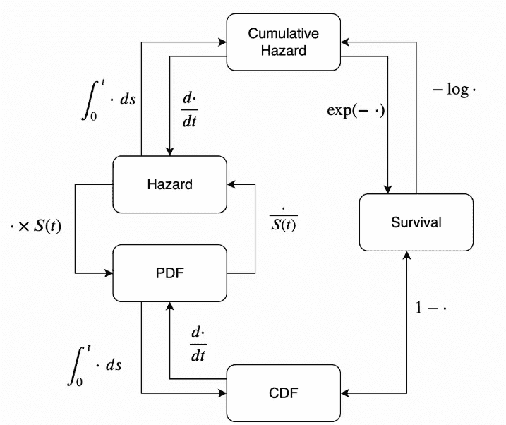
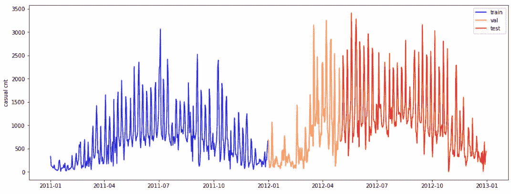
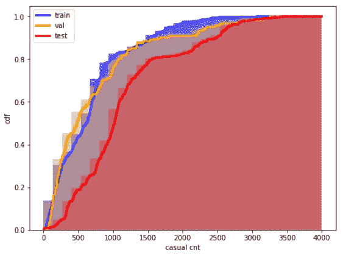
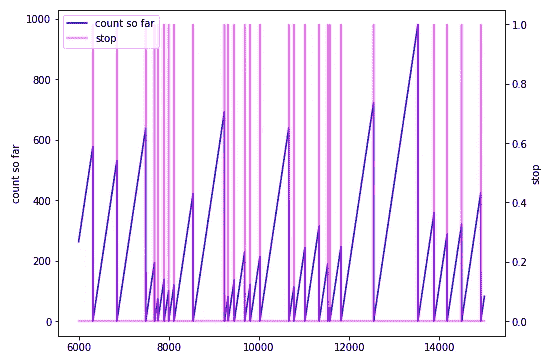
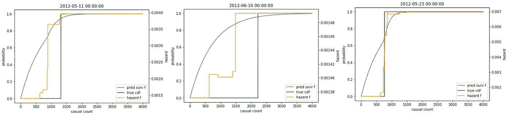
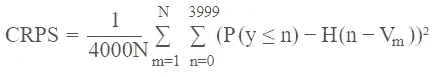

# 基于 LightGBM 加泊松回归的生存分析

> 原文：<https://towardsdatascience.com/survival-analysis-with-lightgbm-plus-poisson-regression-6b3cc897af82?source=collection_archive---------22----------------------->

## 应用生存方法估计概率密度函数

在 [Unsplash](https://unsplash.com?utm_source=medium&utm_medium=referral) 上由 [Philippe D.](https://unsplash.com/@filip42?utm_source=medium&utm_medium=referral) 拍摄的照片

生存分析经常被用来解决诸如“T4”这样的问题，一个特定的事件还要多久才会发生？’。**事件**和**时间**是这种方法的关键变量。这些事件被认为是每时每刻都可能发生的极端情况:典型的例子是搅动、死亡、故障等等。时间的定义很简单，但是有点抽象。我们认为时间是持续时间；从这个意义上说，很明显，并非所有的“极端事件”都已经发生。由于一些外部环境，我们无法查看所有的生命历史，这意味着将持续时间视为相对的，即开始可能发生在不同的时间。

传统上，生存分析被用来衡量个体的寿命。该分析不仅可以进一步应用于传统的出生和死亡，还可以应用于任何持续时间等……我们如何通过生存建模来处理分类/回归问题令人惊讶。我们需要定义的只是**事件**和**时间**。

在这篇文章中，我们开发了一个解决方案来预测*在某种时间和天气条件下*每天有多少自行车租赁被注册。任务是回归问题的形式，我们必须预测计数，这也可以提醒我们泊松回归问题，我们必须模拟离散变量。考虑到**时间**是逐渐“到达目前为止”的租赁次数，而**事件**是一天结束时记录的最终计数，我们的附加价值是将观点转换为生存方法。为了模拟这种现象，我们将使用一个经过调整的 LightGBM 估计器。

# 从倒退到生存

当时间和事件被定义时(即，我们分别有观察和目标)，我们必须思考如何才能达到我们的最终范围:估计一个**生存函数**。

所有战略量化时间；它是一个非负的连续随机变量，其分布由概率密度函数 **(PDF)** 或累积分布函数 **(CDF)** 表征。

**生存函数**是时间的函数，它定义了死亡事件在时间 t 尚未发生的概率，或者等价地，给出了事件发生时间值大于 t 的人口比例。数学上，它是 1-CDF。**危险函数** **(H)** 是事件发生的速率。给定一个固定的时间间隔，这是一个风险度量:危险越大，失败的风险越大。数学上，它是-log(S)。

生存函数估计中涉及的所有元素的直观映射。来源:[生命线](https://lifelines.readthedocs.io/en/latest/Survival%20Analysis%20intro.html)

有各种方法来拟合生存模型。具体来说，我们对所谓的*半参数方法*感兴趣，在该方法中，我们试图用一种非常优雅和简单的技巧来学习风险函数:我们假设可以将时间细分为合理的小区间，即我们在每个区间中考虑我们的基线风险常数。在这种格式中，分段比例风险模型相当于某个泊松回归模型。**生存函数**可以从**风险函数**中导出，反之亦然，这一事实特别有用，因为它允许我们根据自己的兴趣轻松切换目标。

# 数据

我们使用的数据集与华盛顿特区首都自行车共享系统 2011 年和 2012 年的两年历史数据相关，这些数据以每日和每小时的格式在此[公开提供。目前，我们认为每日数据将我们的注意力集中在预测一天结束时临时用户的数量上。各种预测器可用于生成预报，如时间或天气回归。](https://www.kaggle.com/marklvl/bike-sharing-dataset)

请记住，我们将**时间**变量定义为“到达目前为止”的租金，将**事件**定义为登记的最终计数，因此一个好的起点是绘制**时间**的 CDF。

在固定的最大可达数量(4000)下，很明显我们的 train-test 分区的 CDF 非常不同。

# 泊松回归下的生存光 GBM

利用 LGBM 回归器，应用*半参数指数法*学习风险函数相当容易。这是可能的(如上所述),因为生存问题的负对数似然性与泊松回归的负对数似然性是一对一映射的，这在 LGBM 库中是默认初始化的。

我们需要做的就是为此目的整理我们的数据。特别地，数据集必须首先被扩展:每一行被复制成多行，从 0 到偶然计数登记，这是我们的死亡事件。然后生成两个新列:

*   *到目前为止的计数*:从 0 到随机计数取值登记；
*   *停止*:除了到目前为止*计数的行* = *随机计数*外，其他地方都等于 0

生成的新变量示例

有了扩展的数据集，我们就可以开始训练了。拟合的计算一如既往:我们的目标由*分数*(一个 0-1 变量)表示，我们的回归变量是所有可用的外部变量加上迄今为止的*计数*，之前由我们自己生成。所有的魔法都是由我们的假设和泊松损失造成的。在预测阶段，我们必须像以前一样操作我们的测试数据，通过创建迄今为止的*计数*变量来扩展输入数据(*得分*未知)。为了使我们的生存函数有一个统一的形状并便于分数评估，一个好的做法是将目前为止的*计数与其他预测因子一起扩展到一个预先设定的极限，对我们来说是 4000。还记得 LGBM 预测风险函数，为了获得相应的生存函数，我们必须操作这个简单的后处理转换:1-exp(cumsum(H))。*

让我们用图表来检查一些预测:

如您所见，从风险函数中导出的预测生存函数试图复制从一天结束时临时用户的总数中构建的真实 CDF。我们预测总用户数的累积概率分布。换句话说，我们预测的每个值都表明了一天结束时最终计数小于或等于该数字的概率。

对我们结果的评估是根据这类任务的标准分数进行的。连续排序概率得分(CRPS)将 MAE 推广到概率预测的情况。

CRPS 对我们任务的提法

CPRS 是概率预测中使用最广泛的精确度指标之一。它需要评估所涉及的整个概率函数，因此需要估计每个每日样本的整个生存曲线。最后，我们可以在测试上达到 0.283 CRPS，这比基于测试生存函数的哑估计的简单模型更好，其中 CDF 来自于训练(0.291 CRPS)。

# 摘要

在这篇文章中，我们开发了一个生存 LGBM，它能够在给定一些外部预测和一些简单假设的情况下估计生存函数。我们解决了一个非经典的生存问题，在这个问题中，我们不需要估计在过去的时间中幸存的概率，但是我们估计了在一天结束时特定事件发生的概率。这是一个简单的例子，但它显示了如何应用生存建模技术，在一个不常见的场景中，我们的职责是估计概率密度函数。

[**查看我的 GITHUB 回购**](https://github.com/cerlymarco/MEDIUM_NoteBook)

保持联系: [Linkedin](https://www.linkedin.com/in/marco-cerliani-b0bba714b/)

**参考文献**

Kaggle: [NFL 大数据碗](https://www.kaggle.com/c/nfl-big-data-bowl-2020/discussion/119433)

生命线:[生存分析介绍](https://lifelines.readthedocs.io/en/latest/Survival%20Analysis%20intro.html#hazard-function)

普林斯顿大学:[广义线性模型，第七章，生存模型](https://data.princeton.edu/wws509/notes/c7.pdf)