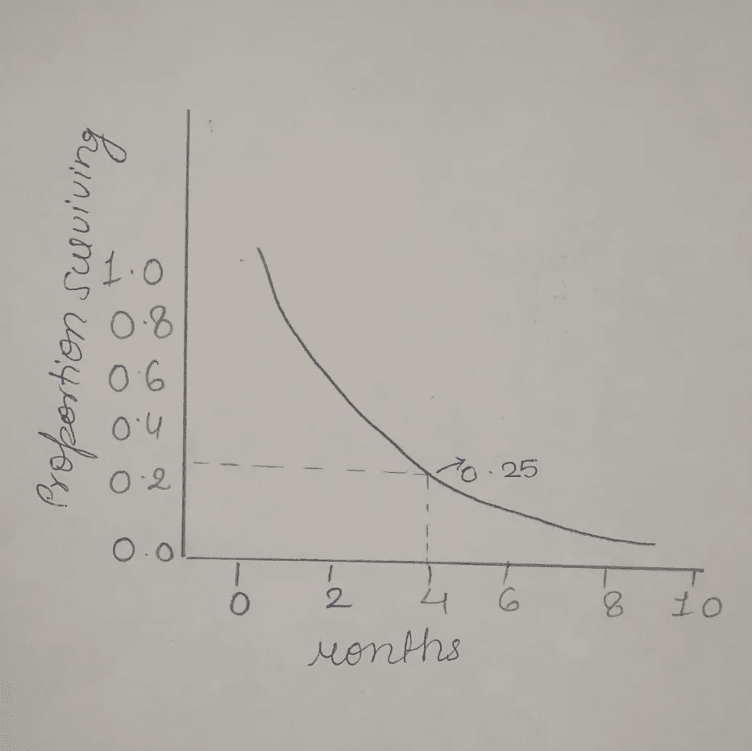
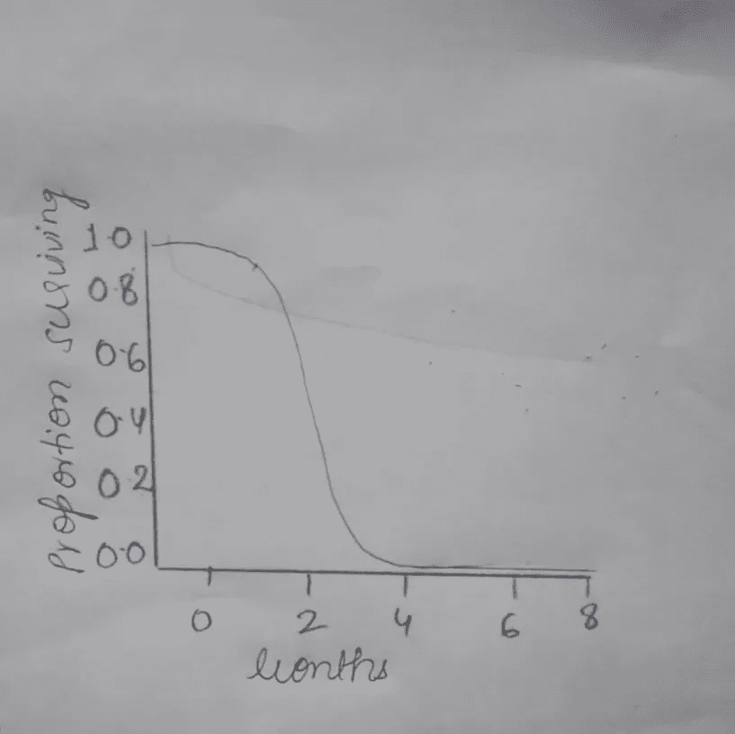
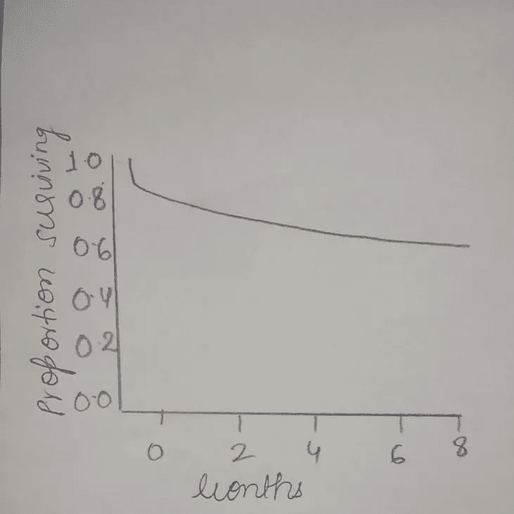

# 生存功能 101

> 原文：<https://towardsdatascience.com/survival-functions-101-bd57fb8be888?source=collection_archive---------31----------------------->

## 生存分析核心部分之一的介绍。

斯蒂芬·道森在 [Unsplash](/s/photos/survival-analysis?utm_source=unsplash&utm_medium=referral&utm_content=creditCopyText) 上拍摄的照片

在继续写这篇文章之前，我强烈建议你了解生存分析，因为这篇文章的主要焦点是生存函数，尽管已经提供了生存分析的简要介绍。

# **什么是生存分析？**

生存分析是一种建模技术，用于模拟事件发生的时间。它用于了解一个事件发生需要多长时间。这些事件可能是心脏病发作后的死亡时间、毕业后找工作的时间、一对夫妇保持婚姻的时间或机器正常工作的时间等。

生存分析包括三个部分:

1.  收集和处理生存数据
2.  选择生存函数
3.  通过不同的方法进行分析

# **什么是生存功能**

这个函数可以帮助我们知道，一个感兴趣的物体，是否会在特定的时间后继续存在。这个感兴趣的对象可以是病人、机器或任何其他东西。

从数学上讲，生存函数用 S 表示，它显然是时间的函数。生存函数也可以解释为某个感兴趣的对象在超过某个时间 t 后生存的概率。

所以可以表示为:

s(**T**)=**P**(**T**T)

这里 T 是随机寿命，取自必须进行生存分析的群体，因此它不为零

该函数的值介于 0 和 1 之间(包括 0 和 1 ),并且是一个非递增函数。

存活函数有时也被称为**存活函数**或**可靠性函数。**

生存函数 S(t)也可以通过以下方式与累积分布函数 F(t)相关联:

**S(t) = 1 - F(t)**

因此它也被称为**互补累积分布函数**。

# **如何解读一个生存函数？**

让我们看一个任意的例子，看看我们如何解释一个给定的生存函数。

任意生存函数

在观察了上面的生存函数之后，我们可以说，被观察的总人口中只有 25%存活超过 4 个月。

我们可以做出更多的预测，比如有百分之多少的人能活过 6 个月，大约是 17%，等等。

**注意:**这不是解释生存函数的唯一方式，根据分析师的需要，还可以进行其他解释，如中位生存。

# 生存函数的类型:

生存函数主要分为两类:参数生存函数和非参数生存函数。这种区分基于可以是平均值、标准偏差、中间值等的参数。

让我们来看看一些参数生存函数:

## 1.指数生存函数

在这种函数中，无论感兴趣对象的年龄是多少，失败的概率在每个时间区间都是相同的，所以对象的年龄不影响概率。

指数生存函数

## 2.威布尔生存函数；

该函数实际上扩展了指数生存函数，以允许恒定的、递增的或递减的危险率，其中**危险率**是对物品失效或死亡倾向的度量，取决于其达到的年龄。

威布尔生存函数

## 3.其他不同的生存功能

我们可以选择其他生存函数，如正态、对数正态、对数逻辑和伽玛，这取决于数据集的分布情况。对数逻辑生存函数如下所示:

对数逻辑生存函数

**注:**第二类生存函数是非参数生存函数，这里没有讨论，它通常使用著名的 Kaplan-Meier 估计量建模，这本身就是一个广泛的话题。要了解卡普兰-迈耶估计量，请访问 [Pratik Kumar](https://towardsdatascience.com/@pratikbaitha04) 的 [**了解卡普兰-迈耶估计量**](/understanding-kaplan-meier-estimator-68258e26a3e4) 。

## 结论

存活函数构成了存活分析的主要部分，并帮助分析者获得与直到时间事件相关的有价值的知识。如果生存函数得到明智的解释，许多重要的问题都可以得到解答。

这篇文章是作为[学生守则的一部分写的——在 2020 年](https://scodein.tech/)。

学生代码是一个全球性项目，旨在向大学/大学预科学生介绍开源软件开发。

# 参考

1.  [https://lifelines.readthedocs.io/en/latest/Quickstart.html](https://lifelines.readthedocs.io/en/latest/Quickstart.html)
2.  [https://www.youtube.com/watch?v=MdmWdIV5k-I](https://www.youtube.com/watch?v=MdmWdIV5k-I)
3.  [https://en . Wikipedia . org/wiki/Survival _ function #:~:text = The % 20 Survival % 20 function % 20 is % 20a，survivor % 20 function % 20 or % 20 reliability % 20 function。](https://en.wikipedia.org/wiki/Survival_function#:~:text=The%20survival%20function%20is%20a,survivor%20function%20or%20reliability%20function.)
4.  https://www.youtube.com/watch?v=XQfxndJH4UA
5.  生存分析:大卫·克莱恩鲍姆和米切尔·克莱因的自学文本。