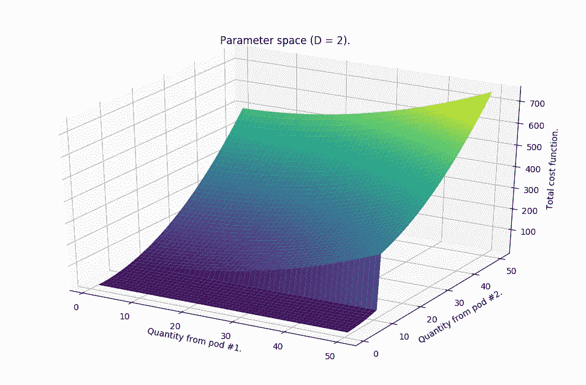
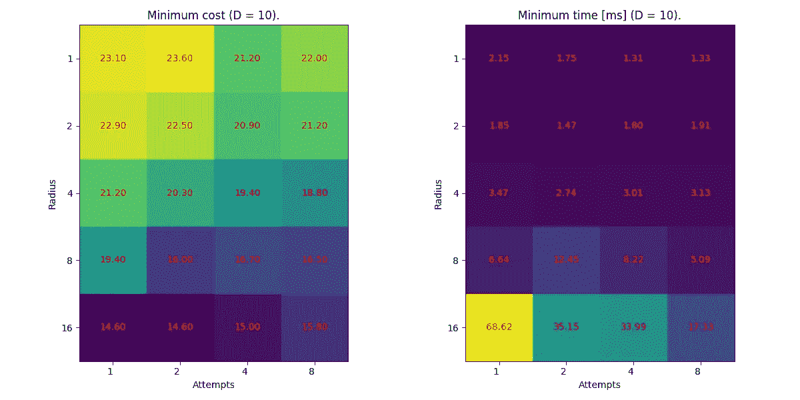

# 用随机搜索算法幸存僵尸启示录

> 原文：<https://towardsdatascience.com/surviving-zombie-apocalypse-with-random-search-algorithm-b50c584e8066?source=collection_archive---------40----------------------->


2019 年波兰北部的日落。私图。

# 介绍

想象一个典型的好莱坞僵尸启示录场景…

一群绝望的人，在一个魅力四射的英雄的带领下，在某个建筑里设置路障，试图坚持到电影结束。大量的嗜血生物敲着每一扇门和每一扇窗户想要进去。人们试图用他们能使用的任何东西来击退他们，但是由于他们的弹药越来越少，英雄需要派人去取更多的炮弹。

必须做出决定——权衡失去一名队员的风险和弹药耗尽的风险。听起来不像是一个**优化问题吗？**

虽然它肯定可以用这种方式来表达，但我们会看到，并不总是可以应用*标准梯度下降算法* (SGD)。相反，我们将使用一种简单的替代方法，称为**随机搜索**。为了说明它的简单性，我们将用纯 python 实现它(参见:[代码](https://gist.github.com/OlegZero13/3eae5d02cd8d2c931e0aa1877d219b9f))。

## 我们的生存场景

为了便于讨论，让我们假设我们的魅力英雄有一台装有文本编辑器(例如 vim，如果他是一个真正的英雄)和 python3 的笔记本电脑——足以快速运行模拟并找出该做什么。

情况呈现如下:

*   有危险的日子，在这期间他们必须挺过去。
*   第***(N+1)***天一到，军方就会来营救幸存者。
*   在那之前，团队每天消耗 ***一*** 箱弹药，完全耗尽等于不可避免的死亡。
*   此外，弹药每天都在失去抗僵尸的能力，使得它在 ***E*** 天后无法使用。
*   小组从 ***X*** 箱弹药开始。
*   在指定的日子里 ***D = {d_1，d_2，…，d_K}*** ，空军会投放额外的装有弹药箱的吊舱来支援正在挣扎的士兵，这些日子提前就知道了。
*   不幸的是，从分离舱中回收箱子是有风险的。在[0，1] 中表示为 ***p，代表失去一个组成员的概率。***
*   此外，每从一个箱子中取出一个箱子，风险就会随着箱子数量的增加而增加*。*
*   最后，没有必要在“零日”之后积累任何弹药，因为军方会迅速将其全部带走。
*   现在的挑战是确保团队永远不会耗尽弹药，同时尽量减少潜在的人类牺牲。

# 建立模型

情况看起来相当复杂，所以我们的第一步是建立一个模型。我们将使用它来模拟不同的场景，这将有助于我们找到答案。这一步在某种程度上相当于 SGD 中的正向传递。

我们知道系统完全是用 ***N，E，X*** 和成对的 ***(d_k，p_k)*** 来描述的。因此，将我们的模型实现为一个类并公开方法`run`来执行我们的正向传递是很方便的。

让我们从构造函数开始。

```
E = 30 # expiry of anti-zombie serum
X = 10 # initial ammo supply

class Survival:
    def __init__(self, total_days, pods, supplies_init=[E]*X):
        self.total_days = total_days
        self.pods = pods
        self.supplies = supplies_init
```

`pods`是一个元组列表，代表具有相关回收风险的输入弹药舱(例如`[(10, 0.1), (20, 0.2)]`)。由于供应品耗尽，我们将其表示为“剩余天数”列表。一旦列表变空——就完了！

接下来，考虑到供应减少，我们定义以下受保护的方法:

```
def _consume(self):
        self.supplies.remove(min(self.supplies))
        self.supplies = list(map(lambda x: x - 1, self.supplies))
        self.supplies = list(filter(lambda x: x != 0,     self.supplies))
```

每天消耗一箱弹药(第 3 行)，然后所有的补给离到期日又近了一天(第 4 行)，最后，过期的从列表中移除(第 5 行)。

另一件事发生在新的补给被收回的时候。

```
def _retrieve(self, risk, quantity):
        new_ammo = [E] * quantity
        cost = quantity**2 * risk
        return new_ammo, cost
```

在每一种情况下，当我们产生更多的弹药，我们也增加了分数风险，这与我们选择从吊舱中取回多少箱子成正比。(如果成本> 1，我们可以将 is 视为损失一个以上人员的概率)。

为了便于向前传递，让我们再定义一个函数:

```
def _get_risk(self, day):
        pod = list(filter(lambda x: x[0] == day, self.pods))
        if len(pod) > 0:
            return pod[0][1]
        return None
```

该函数只是选择与为给定日期安排的 pod 相关联的风险(如果已安排)。

最后，向前传球的本质:

```
def run(self, retrieval_plan):
        total_risk = 0
        retrieval_idx = 0
        for day in range(1, self.total_days + 1):
            risk_involved = self._get_risk(day)
            if risk_involved:
                new_ammo, partial_risk = self._retrieve(
                    risk_involved,
                    retrieval_plan[retrieval_idx])

                self.supplies += new_ammo
                total_risk += partial_risk
                retrieval_idx += 1
            if len(self.supplies) == 0:
                return 0, total_risk, day
            else:
                self._consume()
        return len(self.supplies), total_risk, day
```

该过程从一些`retrieval_plan`(稍后将详细介绍)开始，总风险为零。然后，随着我们一天一天的移动，将会有“机会”获得弹药。如果在某一天有这样的机会，我们会根据回收计划尝试回收一定数量的弹药。每当涉及到风险点时，我们都会将它们添加到总体风险计数中。

然后，不管我们是否有更多的弹药，我们检查我们的供应状况。如果我们到达终点，今晚将是这个团队的最后一晚。该函数返回 0 弹药剩余，总牺牲和纪念日。如果没有，这个团队会在英勇保卫他们的要塞时消耗弹药，这个函数会返回相应的值。

这就是我们向前传球所需要的。现在，让我们看看优化。

# 解决办法



图一。两个 pod 的成本函数与参数空间(z)的关系示例。较低楼层区域与违反约束相关联。

在涉及标准梯度下降的典型情况下，我们现在将设计反向传播通道，并讨论如何正确实施梯度。然而，这里没有梯度！描述风险累积的函数更像是一个过程。它是不可微的。(也没有僵尸参与……)

正因为如此，也因为我们之前提到的诸多限制，我们需要想出另一种方法来降低风险。这就是随机搜索算法的由来。

基本原则如下:

1.  我们定义了一个成本函数，这是一种衡量解决方案有多“差”的方法。(在我们的示例中，它是团队成员流失的总风险)。
2.  我们在搜索空间中随机初始化系统( ***z*** )。
3.  我们从( ***z*** )的邻域内对我们的搜索空间中的新位置(***z’***)进行采样。
4.  我们评估成本，如果更低，我们移动到那个点(***z’->z***)。

我们重复 3 遍。第四。只要需要改进，我们就可以应用硬停，例如，如果成本不再下降，时间用完，等等。

当然，这种方法并不能保证我们找到最好的解决方案，但是 SGD 也不能做到这一点。然而，凭直觉，我们可以认为，如果我们继续质疑“现状”并做出小的改进，我们应该会找到一个可能更好的解决方案。

我们来看一下实现。首先，初始化:

```
def initialize_retrieval_plan(pods, total_days):
    a = list(map(lambda x: x[0], pods))
    a.append(total_days)
    return [a[x + 1] - a[x] for x in range(len(a) - 1)]
```

该函数接受 pod 的时间表(列表***【d _ k，p_k}*** )和生存天数，并返回一个可能的计划，该计划描述了团队在每个机会可以取回多少弹药——这是一个整数列表。

也许你已经注意到这里没有涉及到随机数。没错，我们不会随机初始化它。在没有从哪里开始的偏好的情况下，随机初始化工作得很好。由于我们的僵尸危机充满了约束，我们可以从至少一个约束可以很容易满足的位置开始。因此，我们从一个保证生存的计划开始，给人们足够的子弹来完成它。

从此，我们可以优化。

```
def calculate_plan(total_days, pods, 
    epochs=300, 
    supplies=[E]*X,
    attempts=12, 
    radius=4):
  ...
```

函数`calculate_plan`是反向传播步骤的替代方法。我们可以将`epochs`、`attempts`和`radius`视为超参数，其中`epochs`是搜索步骤的数量，`attempts`是我们在每个步骤下采样的点的数量，`radius`表示( ***z*** )的邻域的“伸展”。

因为理论上计算需要一些时间，我们要做的第一件事是检查条件是否不合适，或者计划是否不会让他们死。例如，如果第一个豆荚的日期是在团队耗尽补给之后，就没有机会再补给，死亡是不可避免的。在这种情况下，我们可以停止计算，开始祈祷。

```
plan = initialize_retrieval_plan(pods, total_days) 
    if is_illegal(plan):
        print("This retrieval plan cannot make them survive.")
        return
    S = Survival(total_days, pods, supplies.copy())
    supplies_size, cost, day = S.run(plan)
    if day < total_days:
        return
```

`is_illegal`函数是一个简单的检查，如果计划中没有元素是负的(`def is_illegal(plan): return (True in [c < 0 for c in plan])`)。

检查了可行性之后，我们终于可以开始为最小风险进行优化了。我们的参数空间的维数等于吊舱的数量(等于`plan`的长度)。该空间的采样意味着随机选取`plan`的一个元素，看看如果我们从 pod 中移除一些箱子会发生什么。然而，为了防止违反团队不得耗尽弹药的条件，我们也选择了`plan`的另一个元素来给这个数量。这创建了一个新的计划，我们使用`S.run(plan)`验证该计划以获得新的结果。

```
plan_range = range(len(plan))
    cost_history = [9999999] # initializing cost history for early stopping
    last_plan = plan.copy()
    epoch = 1
    while epoch < epochs:
        cache = {}
        for attempt in range(attempts):
            i1 = random.choice(plan_range)
            i2 = random.choice(plan_range)

            plan = last_plan.copy()
            qty = random.choice(range(1, radius + 1))
            plan[i1] -= qty
            plan[i2] += qty

            S = Survival(total_days, pods, supplies.copy())
            supplies_size, cost, day = S.run(plan)
```

然后一系列的`if-else`语句检查剩余的约束，但是如果新的计划是可行的，我们将它添加到`cache`中，该计划包含具有相关成本函数的步骤的所有备选计划。然后，如果存在成本函数更低的替代方案，我们选择该方案用于下一次迭代(***z’->z***)。

```
 if supplies_size < 0: # ran out of ammo
                continue
            elif day < total_days: # ran out of days
                continue
            elif is_illegal(plan): # attempt to sell ammo
                continue
            else:                  # solution found
                key = '-'.join([str(x) for x in plan]) 
                cache[key] = cost

        last_plan, cost = get_minimum(cache)
        print (f"{epoch}, cost: {cost}, plan: {last_plan}")
        epoch += 1
        cost_history.append(cost)
        if cost_history[epoch - 1] == cost_history[epoch - 2]:
            break
```

在某一点上，对某一步骤将没有进一步的计划。当这种情况发生时，我们依靠最后一个可行的计划作为解决方案。

```
 if len(cache) == 0:
        print ("No solution for this case. They must die.")
        return
    else:
        print (f"Solution found, but it'll cost = {cost}.")
        return last_plan
```

`get_minumum`功能是我们定制的`arg min`版本:

```
def get_minimum(cache):
    min_risk = min(cache.values())
    key = list(cache.keys())[list(cache.values()).index(min_risk)]
    return [int(x) for x in key.split('-')], min_risk
```

潜在的问题和替代方案就是这样！例如，跑步:

```
if  __name__ == '__main__':
    pods = [(10, 0.2), (15, 0.1), (35, 0.5), (50, 0.3)]
    total_days = 70

    plan = calculate_plan(total_days, pods)
    print(plan)
```

我们可以看到在寻找更好的计划和成本价值下降的进展。



图二。N = 100 和 10 个 pod 的随机搜索算法的最小成本(左)和最小时间(右)，对“尝试”和“半径”的每个组合检查 10 次。获得了成本函数与回收箱子数量的线性相关性的结果。

不幸的是，如果我们多次执行这种优化，我们将很快发现最“最优”的计划会发生变化，并且成本值有时会高于其他计划。这是因为我们的算法是“盲的”。如果没有梯度，我们在每次迭代中只给它几次机会(`attempts`)来寻找更好的计划，而且我们是随机进行的。因此，算法到达一个地方 ***(z`)*** 就有一个很大的威胁，它不能再前进了——类似于局部最小值。

为了克服这个问题，我们可以自然地增加`attempts`的数量以给它更多的机会，或者增加`radius`以允许更多的选择来找到更好的*。*

*在极端情况下，我们可以选择循环遍历距离为`radius`的所有 ***(z，z’)***对。这种方法相当于强制梯度，大大增加了我们达到全局最小值的机会。另一方面，这是要付出代价的。仅用`radius == 1`，组合数 ***(z，z’)***与`K ** 2`成正比，其中`K = len(plan)`。计算可能需要更长时间。*

# *结论*

*防御不死族的囤积的确是一个巨大的挑战。除了僵尸之外，在本文中，我们给出了一个简单的随机搜索算法的裸 python 实现。每当我们可以定义一个代价函数，但是我们不能保证它的可微性时，这个算法可以是 SGD 的一个可行的替代方案。此外，如果问题充满了约束，像这样，这里提出的方法可以应用。最后，我们还讨论了算法本身的计算复杂性，如果确实存在重大僵尸危机，这可能会影响下一个英雄的决策。*

# *还会有更多…*

*我计划把文章带到下一个层次，并提供简短的视频教程。*

*如果您想了解关于视频和未来文章的更新，请订阅我的 [**简讯**](https://landing.mailerlite.com/webforms/landing/j5y2q1) **。你也可以通过填写[表格](https://forms.gle/bNpf9aqZJGLgaU589)让我知道你的期望。回头见！***