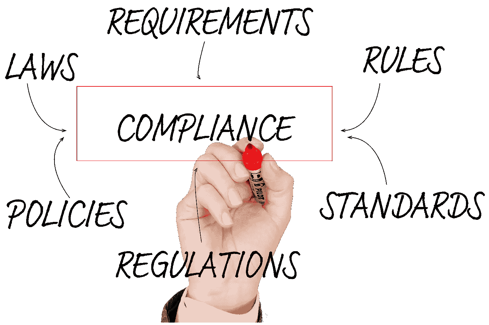

# 可持续的隐私合规要求严格的数据管理

> 原文：<https://towardsdatascience.com/sustainable-privacy-compliance-requires-disciplined-data-management-24ae12056bb9?source=collection_archive---------63----------------------->

照片由 [xdfolio](https://pixabay.com/users/xdfolio-14429816/) 通过 [pixabay](https://pixabay.com/en/rabbit-palm-hand-snatch-redheaded-373691/) (CC0)拍摄

自从 20 世纪 80 年代数据仓库时代开始以来，数据管理，包括元数据管理、数据治理、主数据管理，一直被提倡。然而，它很难实施或执行。没有它，企业仍然可以通过他们的数据仓库项目生存。然而，项目和组织的筒仓会引入数据重复、效率低下和没有明显的事实来源，这一直是许多组织头疼的问题，尤其是那些拥有多个系统的大量数据的组织。

随着最近数据隐私问题的增加以及几项法规的出台，这给每个组织敲响了警钟，要求他们优先实施严格的数据管理。它不仅适用于现有数据资产，还能确保在获取、收集、处理、使用和存储新数据时的法规遵从性。

两个先锋隐私法规是欧盟的 GDPR ( [通用数据保护法规](https://eur-lex.europa.eu/eli/reg/2016/679/oj)，于 2018 年 5 月 25 日生效)和 CCPA ( [加州消费者隐私法案](https://leginfo.legislature.ca.gov/faces/billTextClient.xhtml?bill_id=201720180AB375)，于 2020 年 1 月 1 日生效)。这两项法规都旨在增强消费者的隐私权，以保护企业收集、使用或出售的个人信息。尽管受监管公司的规模、罚款金额以及消费者行使权利的方式有所不同，但这两项法规都规定了消费者的以下权利:

*   知情权:了解企业已经收集或正在收集客户的哪些个人数据。
*   访问权:访问客户个人信息的权利。
*   被遗忘权:要求商家删除消费者的任何个人信息。
*   有权反对出于营销、销售或与服务无关的目的处理个人信息(GDPR)，或选择不出售消费者数据(CCPA)。对于后者，CCPA 要求企业在网站上提供一个按钮或链接，明确允许消费者请求“不要出售我的个人信息”

CCPA 将个人信息定义为“识别、涉及、描述、能够与特定消费者或家庭直接或间接相关联或可以合理链接的信息”GDPR 将个人数据定义为“与已识别或可识别的自然人(数据主体)直接或间接相关的任何信息，特别是通过提及标识符。”因此，CCPA 和 GDPR 之间的一个显著区别是，CCPA 的个人信息包括家庭，而 GDPR 的个人信息只包括个人。

对于一家公司来说，确保遵守一项法规已经是一项挑战，更不用说遵守两项或更多法规了。隐私法规将直接影响企业的大规模数据收集、使用和存储。对于没有工具和治理流程来精确定位包含个人信息的数据所在的位置、谁可以访问这些数据以及这些数据是如何被使用的组织来说，这可能是非常耗费资源和时间的。另一方面，如果一家公司在以下领域实施了有效的数据管理，实现法规遵从性应该是简单的。

1.  **精心设计的数据架构**

设计良好的数据架构是成功数据管理的重要促成因素。数据架构和数据管理是不可分的。好的数据架构有清晰的文档，从业务需求、业务到数据的映射、业务术语表、命名约定和标准开始。它还应该在设计中考虑数据隐私和安全性。数据架构给出了每个数据对象到数据元素级别的清晰度、透明度和标准，包括收集、使用和存储个人信息的位置。这将带来清晰的设计、高效的实施和最佳的结果，因为 CCPA 和 GDPR 要求消费者遵守访问、遗忘和不出售其个人信息的权利。

**2。元数据管理和数据治理**

首先，用准确的分类和数据谱系对所有数据对象和数据元素进行编目将是实现隐私遵从性的一个极好的能力。一个很好的类比是图书目录。对于一个图书馆或多个图书馆中的大量书籍，图书馆目录在过去几十年中已经得到发展，以系统地跟踪书名、作者、位置、流派、出版日期等。不管一个图书馆有多少本书，目录允许用户搜索任何书，而不需要实际阅读它们。随着后来的数字技术的发展，用户也可以先阅读几页样本，然后再决定是借阅还是购买这本书。公司数据资产的数据目录应以同样的方式建立，以便快速搜索可以找出哪些系统中的哪些数据资产包含个人信息，它们是何时创建的，以及它们是如何使用的。

因为公司中的任何职能或部门都可以拥有数据，所以通常需要一个由这些部门的数据管理员参与的数据治理计划，以确保数据目录拥有正确和完整的信息。数据治理也是一个在整个企业中实施标准和策略的平台，以维持组织的法规遵从性。

**3。清除数据保留策略**

明确的数据保留政策对于公司的隐私合规性也至关重要。如果数据不再对组织有用，或者数据已经按照 GDPR 或 CCPA 等法规的要求保留了一段时间，则应将其删除。例如，GDPR 要求个人资料的保存时间必须"不超过处理个人资料的目的所必需的时间"(第 5(1)条)。随着当今数据科学和分析的快速发展，以多种方式利用数据，使用数据的用户可能会在不经意间创建许多包含敏感信息的数据对象。保留这些数据的时间超过法律要求或使用所需的时间可能会产生各种后果，例如增加数据泄露的风险以及违反与数据访问和数据隐私相关的合规性流程的风险。

**4。具有安全性的集中客户信息**

出于安全和隐私信息的考虑，公司的客户信息应该存储在尽可能少的地方。应该使用最佳的安全和隐私措施对其进行仔细管理。主数据管理最初旨在提供一个具有有保证的数据质量的真实来源。同时，它还实现了隐私合规性的最佳设计。有了集中的主数据即服务，组织中就不应该有其他地方来永久存储个人信息。对于主数据系统之外的任何操作，它应该到那里检索客户信息作为黄金记录，而不需要担心存储或处理它。另一方面，主数据管理将提供隐私信息的数据接收流程、处理的基本业务规则以及数据访问的仔细控制的清晰性和强制性。综上所述，主数据是公司保护其客户信息并确保完全隐私合规性的最佳设计。

**5。自动检测潜在违规的强大数据控制**

公司对隐私法规的遵守需要具有高度的可持续性。构建强大的数据控制流程并自动检测不合规情况是组织的重要组成部分。此流程旨在实施业务规则和程序，以便在任何个人信息被添加或填充到不应该添加或填充的位置时发出警报，或者发出任何其他潜在违规风险的警报。

# **结论**

GDPR 和 CCPA 等隐私法规标志着隐私法规在全球的兴起。我们预计很快会有更多的规则出现，每个规则都有其独特性，同时与其他规则有一些共性。这给企业带来了挑战，尤其是那些在多个洲和州拥有客户的企业，他们需要处理各种各样的合规流程。然而，通过精心设计的数据架构、集中且维护良好的元数据管理、数据治理、清晰的数据保留政策、主数据即服务以及强大的数据控制和自动化审计流程，公司将能够快速提出解决方案，并确保以经济高效的方式遵守所有隐私法规，从而获得最佳结果。