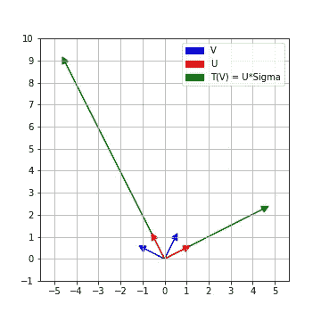

# 奇异值分解——一种几何观点

> 原文：<https://towardsdatascience.com/svd-a-geometric-view-point-cfc0c689bdc0?source=collection_archive---------19----------------------->

## 对通过奇异值分解编码的视觉信息进行解包


(图片由作者提供)寻求在矩阵作用后保持垂直的垂直轴！

# 教科书中的奇异值分解

*奇异值分解*实矩阵的奇异值分解通常在线性代数的第一门课结束时讲授。通俗地说，实矩阵的奇异值分解无非是**将矩阵表示为三个*更好的*矩阵**的乘积。

说得更确切些，但仍然平淡无奇，实际结果如下:

设 *A* 为 *n×m* 实矩阵。然后是 a=uσvᵀ

*   u 是一个 n×n 正交矩阵
*   v 是一个 m×m 正交矩阵
*   σ是 n×m 矩阵，其中除了前 r 个对角线元素之外的每个元素都是零，其中 r 是 a 的秩。
*   此外，σ的非零对角元素正是以降序排列的 A 的所谓的*奇异值*。

如果那样..看起来有点平淡无奇，让我们借助一个例子来尝试理解这个结果的威力和效用。

# 由矩阵编码的信息

这是一个非常实际的 2×2 矩阵


(图片由作者提供)A 是矩阵[[6，2]，[-7，6]]

它实际上代表了一个相对于标准基准 e₁=(1,0 和 e₂=(0,1).的线性图线性地图 t 发送通常的基本元素 e₁⇝(6,−7 和 e₂⇝(2,6).现在，我们不仅知道 t 如何作用于 e₁和 e₂，我们实际上还知道它如何作用于任何(a，b)。例如


(图片由作者提供)求 T(2，3)是什么

让我们想象一下我们的线性变换 T 是如何作用于标准坐标轴的。我们可以看到，e₁，e₂的垂直轴被扭曲了，{T(e₁),T( e₂)}的图像不再垂直。


(图片由作者提供)T 在常用轴上的作用

# 寻找保持垂直的垂直轴

因为使用垂直轴总是更容易，所以我们希望找到我们定义域的垂直轴(或者沿着这些轴的单位向量),即使在应用 t 之后，这些轴仍然保持垂直。显然，e₂}的{e₁不是一个好的选择。有好的选择吗？如果有，怎么找？

由彼此成对垂直的单位向量组成的向量空间的基被称为向量空间的*标准正交基*。因此，我们在更广泛的背景下的问题可以表述如下:

> 给定一个线性映射 *T:R* ᵐ *→R* ⁿ(相对于标准基用一个 *n×m* 矩阵 *A* 表示)，我们能找到**rt39】ᵐ的一个正交基 *{v_1，v_2，…，v_m}* 使得 *{T(v_1)，T(v_2***

# 输入 SVD！

A 的奇异值分解恰恰回答了上面的问题！

> 设 a 的奇异值分解为 a=uσvᵀ



(图片由作者提供)寻找 T 作用后保持垂直的轴

回忆一下 A 的 SVD 中的 V 是一个 m×m 正交矩阵。因此，v 的列形成了 **R** ᵐ.的标准正交基{ v1，v2，…，v_m}

类似地，u 是正交 n×n 矩阵，所以 u 的列形成了 **R** ⁿ的正交基{u_1，u_2，…u_n}

*但是* U *和* V *有什么关系呢？*

将方程 a=uσvᵀ乘以 v，得到

> *av =(*uσvᵀ)*v =*uσ(vᵀ*v)= uσ*

所以 uσ的列正好是{t(v_1),t(v_2),…t(v_m)}⊂**r**ⁿ

此外，由于σ是 n×m 矩阵，如果有的话，仅沿着对角线元素(σI，I)具有非零元素，所以 Uσ的列只是由σ的相应对角线元素缩放的 U 的前 m 列


(图片由作者提供)uσ长什么样

因此 T(v _ I)=(σI，i)u_i，它们相互垂直。由于 u_i 是单位向量，所以 T(v_i)的长度正好是对角线项σI，I。

# 摘要

给定一个线性映射 T: **R** ᵐ → **R** ⁿ(用一个 n×m 的矩阵 a 相对于标准基来表示)，设 a=uσvᵀ是 a 的奇异值分解.那么 v 的列构成了 **R** ᵐ.的一个正交基此外，在ⁿ.中{T(v_i)}仍然保持相互垂直

向量{T(vi)}的长度由σ的对角线项编码。沿着{T(vi)}的单位向量可以完备化为ⁿ的标准正交基，这由 u 的列精确地给出

所以，你看矩阵的奇异值分解给了我们很多非常有用的信息！

# 奇异值分解的唯一性

由于σ的非零对角线元素恰好是 A 的降序的*奇异值*，所以σ对于给定的矩阵 A 是唯一的。

然而，V(以及 U)的列不是唯一的。首先，V 的列可以变化到符号(由于 T(v_i)只是 u_i 乘以一个常数，u_i 的符号也会改变)。为了理解为什么 U，V 不一定是唯一的，也不一定只有符号，考虑一下旋转矩阵 a 的奇异值分解是什么。

# 奇异值分解计算代码

当然，人们可以(也应该知道如何)手动计算 SVD。但那是以后的事了。现在，我们将使用 numpy 中的 SVD 实现。

```
import numpy **as** np
A **=** np.array([[6,2], [**-**7,6]])
U,s,VT **=** np.linalg.svd(A)
**print**(U)
**print**(s)
**print**(VT)
```

上述代码给出了

```
>>>U
array([[-0.4472136 ,  0.89442719],
       [ 0.89442719,  0.4472136 ]])
>>> s
array([10.,  5.])
>>> VT
array([[-0.89442719,  0.4472136 ],
       [ 0.4472136 ,  0.89442719]])
```

# 总结这个例子


(图片由作者提供)使用 numpy 代码的 SVD

你可以检查 100，25 是 AᵀA 的特征值，因此 10，5 是 a 的奇异值

如果你真的用手算出奇异值分解，你会发现这相当于


(图片由作者提供)手写的奇异值分解

**脚注**

1.  方阵 x 是正交的当且仅当 XᵀX = XXᵀ是单位矩阵
2.  n×m 矩阵 a 的*奇异值*是 AᵀA 的特征值的平方根，列出了它们的代数重数。
3.  根据定义，零矢量 **0** 垂直于每个矢量