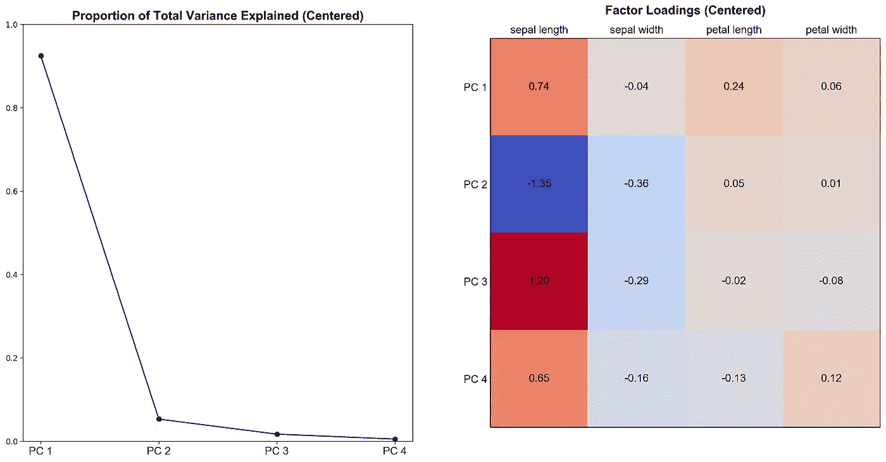

# 机器学习中的奇异值分解:PCA

> 原文：<https://towardsdatascience.com/svd-in-machine-learning-pca-f25cf9b837ae?source=collection_archive---------15----------------------->

## 理解什么是主成分分析，我们如何通过 EVD 和奇异值分解实现主成分分析，以及为什么奇异值分解实现更好。

来源:[安迪 _ 贝](https://pixabay.com/users/Andy_Bay-1006510/?utm_source=link-attribution&amp;utm_medium=referral&amp;utm_campaign=image&amp;utm_content=1740973)来自[皮克斯贝](https://pixabay.com/)

本文讨论什么是[主成分分析](https://www.wikiwand.com/en/Principal_component_analysis) (PCA)，我们如何使用[特征值分解](https://www.wikiwand.com/en/Eigendecomposition_of_a_matrix) (EVD)或[奇异值分解](https://www.wikiwand.com/en/Singular_value_decomposition) (SVD)，以及为什么 SVD 实现更好。

# 主成分分析

**直观地说**，PCA 是一种转换过程，它将具有可能相关特征的数据矩阵转换成一组线性不相关的变量，称为**主成分**。每一个主成分都是原始特征的线性组合( *PCᵢ* = *Xϕᵢ* ，这里 *PCᵢ* 代表第 I 个主成分)，并且在与前面的成分**正交**时占最大可能方差(如*I*≦*j，pcᵢ*⋅*pcⱼ*=*0*)。

给定形状为 *n* × *p* 的特征矩阵 ***X*** ，即**居中**，即列均值已被减去，现在等于零*，*PCA 的典型用例包括:

*   **降维:**找到形状 *n* × *k* (其中 *k* 远小于 *p* )的一个更低维的近似值，同时保持大部分方差，作为分类或可视化的预处理步骤。
*   **特征工程:**用 *p* 线性不相关的特征创建一个 *X* 的新表示。
*   **无监督学习:**提取 *k* 主成分(其中 *k* 往往比 *p* 小很多)。通过查看原始要素如何影响这些因素来理解数据集。

从概念上讲，重要的是要记住，主成分分析是一种多变量数据分析的方法，EVD 和奇异值分解都是数值方法。

# 通过特征值分解的 PCA

传统上，PCA 是基于样本协方差矩阵 ***C*** 上的 EVD。假设 *X* 居中:

*C* 形状为 *p× p* 。它是对称的，因此总是可对角化的。我们可以应用特征值分解:

***Q*** 是一个正交矩阵，它的列是 *C* 的**特征向量**(*q*=[*q₁*， *q₂* ，…， *qₚ* )。 **∧** 是对角线上特征值**按降序排列的对角矩阵(*λ₁*≥*λ₂*≥…*λₚ*≥0):**

****

**这里 *qᵢ* 是 *Q* 的第 I 列，也称为第 I 个**主方向**。 *λᵢ* 是∧的第 I 个对角元素。主成分是原始特征矩阵在主方向上的投影，可以通过 *XQ* 获得。第 I 个主成分解释的总方差比例为 *λᵢ / (λ₁ + λ₂ +..*+λₚ)。**

**下面是通过 Python 中的 EVD 实现的 PCA:**

# **通过奇异值分解的 PCA**

**对于矩阵 *X，t* 这里总是存在矩阵 ***U*** ， ***，*** ， ***V*** 这样:**

****

***U* 和 *V* 都是正交的，*σ*是对角的。*σ*的对角元素称为**奇异值**(*σ₁*≥*σ₂*≥…≥*σₚ*≥0)。考虑协方差矩阵 *C* :**

****

**对比上面我们知道 *V* 的列是主方向，第 I 个特征值 *λᵢ = σᵢ /(n-1)* 。主成分可以通过*XV = uσ*得到。**

****这比 EVD 实现好多少？****

*   ****计算效率:**对于高维数据( *p > > n* )，用协方差矩阵 *C* 执行计算可能效率低下。**
*   ****数值精度:**形成协方差矩阵 C 会导致精度损失。**
*   ****数值稳定性:**大多数 SVD 实现采用分而治之的方法，而 EVD 的实现使用不太稳定的 **QR 算法**。**

**下面是在 Python 中通过 SVD 实现的 PCA:**

# **无监督学习的主成分分析**

**我们将使用[鸢尾花数据集](https://www.wikiwand.com/en/Iris_flower_data_set)来说明 PCA 如何作为无监督学习工具来帮助理解数据。**

**我们将从 *scikit-learn* 加载虹膜数据集。特征矩阵包含跨越 4 个属性的 150 个观察值。每行包含鸢尾花的萼片和花瓣的长度和宽度(以厘米为单位)。目标是花的类型(3 个中的 1 个)，但是我们将只使用它来进行可视化。**

**加载数据集，执行数据预处理，并应用 SVD。准备 PCA 的一个基本问题是**是否在中心化之上标准化数据集**(即确保每列的标准偏差为 1)。从我的角度来看，如果特征是相同规模的，标准化是没有必要的。因此，我们将下面的特征矩阵居中。**

**计算并可视化由四个主成分和**因子载荷**解释的总方差的比例。因子负载是原始特征在主成分中的权重，通过用相应特征值的平方根缩放特征向量来获得。它们帮助我们将每个主成分解释为原始特征的加权和。**

****

**我们可以看到，第一主成分解释了总方差的 90%以上，它严重依赖于萼片和花瓣的长度。这意味着我们数据中的大多数变化可以用这两个特征的线性组合来解释。**

**使用 PCA 作为降维或特征工程工具通常会损害结果的可解释性。当特征的数量非常多时，每个主成分通常是太多不同的原始特征的线性组合，因此难以定义。**

**要查看标准化的效果，请转换特征矩阵，使每一列都有一个标准差，然后重复可视化。**

****

**我们可以看到结果变化很大。现在，第一个主成分只能解释总方差的近 75%，而第二个主成分可以解释近 95%。萼片宽度变得更加重要，尤其是对 PC 2。因此，对于我们是否应该对协方差或相关矩阵执行 PCA 的问题，没有普遍的答案。“最佳”方法是基于主观选择、仔细思考和一些经验。**

**这篇文章是何坤宇写的。Kunyu 目前是芝加哥大学计算分析专业的硕士生。他发现理解统计建模和机器学习技术、将它们应用于真实世界的数据并帮助创建金融服务行业的端到端解决方案是一件有趣的事情。在 LinkedIn 上联系昆玉！🐷**

** [## 昆玉何-即将上任的全球量化策略非周期分析师-美银美林…

### 芝加哥大学正在接受理学硕士计算分析项目培训的数据科学家。对…充满热情

www.linkedin.com](https://www.linkedin.com/in/kunyuhe/)**