# SVM:一个最优化问题

> 原文：<https://towardsdatascience.com/svm-an-optimization-problem-242cbb8d96a8?source=collection_archive---------13----------------------->

## 用拉格朗日画线

# 1.概观

这个博客将探索支持向量机的机制。首先，让我们对这篇文章[进行一个 100 英里每小时的概述(强烈建议你在阅读这篇文章之前浏览一下)。基本上，我们给定了 n 维空间中的一些点，其中每个点都有一个二进制标签，并希望用一个超平面来分隔它们。用 x 表示这个空间中的任何一点，那么，任何超平面都可以表示为:w^T x +b=0。让我们列出一些术语。](/support-vector-machines-22a51baba064)

1.  x^i:上面提到的 d 维空间中的第 I 个点。所以，它是一个长度为 d 的向量，它的所有元素都是实数(x ∈ R^d).
2.  t^i:这第 I 点的二进制标号。它可以是 1 或 0。
3.  w:对于将空间分成两个区域的超平面，x 向量的系数。
4.  b:对于把空间分成两个区域的超平面，常数项。

在[之前的博客](/support-vector-machines-22a51baba064)中，我们导出了优化问题，如果解决了这个问题，我们就可以得到描述分离平面的 w 和 b(我们将从那里继续我们的方程编号，γ是一个虚拟变量),它最大化了“余量”或离平面最近点的距离。请注意，每个数据点有一个不等式约束。

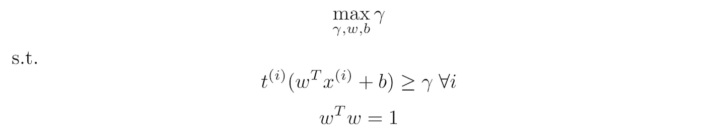

等式(4): SVM 最优化问题

然后，我们做了一些忍术来消除γ，并简化为以下优化问题:

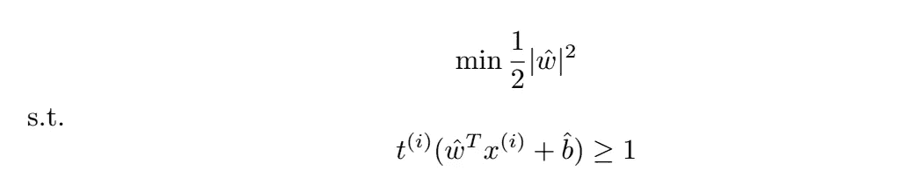

等式(7):简化的 SVM 优化问题

在这篇博客中，让我们来看看[拉格朗日乘子](/lagrange-multipliers-with-pictures-and-code-ace8018dac5e)的方法对于解决像这样的约束优化问题可以提供什么样的支持向量机的见解。

# 2.使用拉格朗日乘数的解决方案

在本系列的[前一篇博客中，我们获得了两个约束优化问题(上面的等式(4)和(7 )),它们可用于获得最大化余量的平面。有一种求解带约束优化问题的通用方法(拉格朗日乘子法)。为了保持重点，我们将在这里陈述配方，并使用它来挖掘关于 SVM 问题的见解。至于这个方法为什么有效，请阅读这篇博客](/support-vector-machines-22a51baba064)[其中详细介绍了拉格朗日乘数。如果我们有一个一般性的优化问题，](/lagrange-multipliers-with-pictures-and-code-ace8018dac5e)

等式(8)一般约束优化问题。

步骤 1:定义拉格朗日函数:

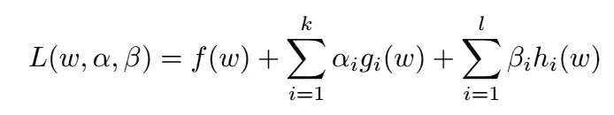

方程式(9)拉格朗日函数

其中α_i 和β_i 是称为“拉格朗日乘数”的附加变量。不等式α_i 对应的乘数必须≥0，而等式β_i 对应的乘数可以是任意实数。这里再次提供了一些直观的原因。那么，为了使 w 成为最佳值，必须满足的条件(称为 KKT 条件)是:

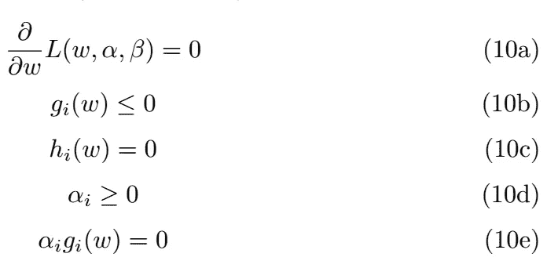

等式(10):找到约束最优化问题的解的 KKT 条件。

方程 10-e 称为互补条件，它保证如果一个不等式约束不是“紧的”(g_i(w)>0 且不等于 0)，那么对应于该约束的拉格朗日乘数必须等于零。事实证明，这是因为拉格朗日乘数可以被解释为指定不等式约束在最优点上被“推动”的力度。如果约束甚至不是严格的(有效的)，我们在解中根本没有推动它，因此，相应的拉格朗日乘数，α_i=0。等式 10b 和 10c 非常简单，因为它们简单地陈述了原始优化问题的约束应该在最优点处得到满足(几乎是一个重言式)。

## 2.1.关于 SVM 的观察

让我们回到支持向量机。在等式(4)和(7)中，我们根据每个点到分隔线的垂直距离(边距)为每个点指定了一个不等式约束。与线(边距)距离最小的点将是约束条件相等的点。如果有多个共享该最小距离的点，则它们的约束将根据等式(4)或(7)变成等式。这样的点被称为“支持向量”，因为它们“支持”它们之间的线(正如我们将看到的)。从问题的几何结构中，很容易看出必须有至少两个支持向量(与直线共享最小距离的点，因此具有“紧”约束)，一个具有正标签，一个具有负标签。假设不是这种情况，并且只有一个具有最小距离 d 的点。在不失一般性的情况下，我们可以假设该点具有正标签。然后，在距离为 d+δd 的线的另一侧有另一个带有负标签的点。可以沿着 w 向量向负点移动δd/2 的距离，并增加相同距离的最小边距(现在，最近的正点和最近的负点都成为支持向量)。这意味着我们开始的另一行是一个假先知；不可能是真正的最佳利润线，因为我们很容易提高利润。

但是，这完全依赖于问题的几何解释。如果我们只得到最优化问题(4)或(7)(我们假设我们知道如何从一个问题得到另一个问题)，我们会得到同样的结论吗？对于方程(4)中的问题，方程(9)中定义的拉格朗日量变成:

对γ求导，我们得到，

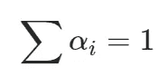

等式(11)

对 b 求导，

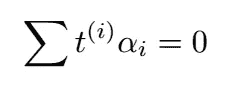

如果我们认为{I}是正标签的集合而{J}是负标签的集合，我们可以重写上面的等式:

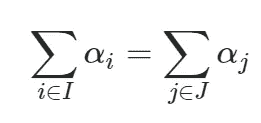

等式(12)

等式(11)和(12)以及所有α都≥0 的事实意味着在每个正类和负类中至少有一个非零α_i。并且由于α_i 表示对应于第 I 个点的约束有多“紧”(0 表示一点也不紧)，*这意味着两个类中的每一个都必须有至少两个点，约束是活动的，因此拥有最小余量(跨越点)*。

# 2.2“支持向量”到底是什么意思？

在上一节中，我们用公式表示了方程(4)中给出的系统的拉格朗日函数，并对γ求导。现在，让我们为等式(10)给出的公式形成拉格朗日量，因为这要简单得多:

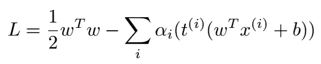

等式(13):等式(7)的拉格朗日量

根据 10-a 对 w 求导，并设为零，我们得到:

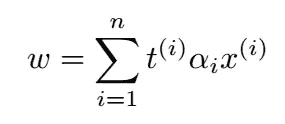

等式(14):最优 w。

与之前一样，每个点都有一个与之对应的不等式约束，拉格朗日乘数α_i 也是如此。此外，除了与分隔线具有最小可能距离的点(等式(4)或(7)中的约束是有效的)，所有其他点的α_i 都等于零(因为约束是无效的)。

从方程(14)中，我们看到这些点(α_ I = 0)对拉格朗日量没有贡献，因此对最佳线的 w 也没有贡献。同样容易看出，它们也不影响最优线的 b。因此，在定义直线时，只有最接近直线的点(因此它们的不等式约束变成了等式)才是重要的。这就是为什么这些点被称为“支持向量”。通常只有少数几个，但它们支持它们之间的分离面。

# 3.最简单分类问题

在这一节中，我们将考虑一个非常简单的分类问题，它能够抓住优化行为的本质。所以我们可以把正在发生的事情可视化，我们把特征空间做成二维的。让我们在上面放两个点，并像这样标记它们(绿色表示正标签，红色表示负标签):

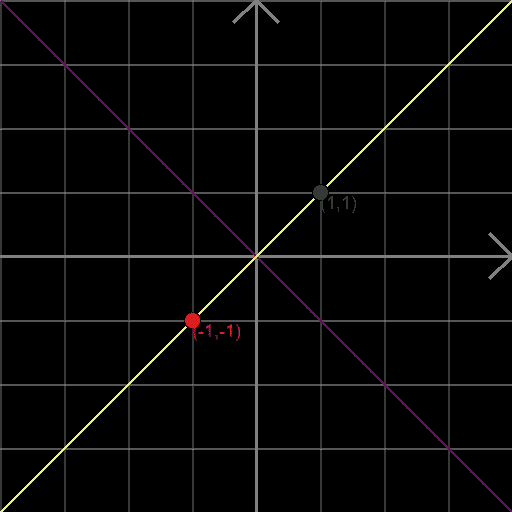

很明显，分隔这两点的最佳位置是由 x+y=0 给出的紫色线。

现在让我们看看我们到目前为止学习的数学是如何告诉我们关于这个问题我们已经知道了什么。为什么要这么做？以便明天它能告诉我们一些我们不知道的事情。

由于我们有 t⁰=1 和 t =-1，我们从方程(12)得到，α_0 = α_1 = α。将此代入方程(14)(这是一个向量方程)，我们得到 w_0=w_1=2 α。因此，我们立即得到，对于 x 和 y，该线必须具有相等的系数。我们还知道，因为只有两个点，所以对应于它们的拉格朗日乘数必须> 0，并且对应于它们的不等式约束必须变得“紧密”(等式；见第 2.1 节最后一行)。这意味着，

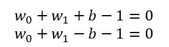

减去这两个方程，我们得到 b=0。所以，分离平面，在这种情况下，是直线:x+y=0，正如所料。

# 3.1.添加第三个浮点

为了使问题更有趣，并涵盖一系列可能的 SVM 行为，让我们添加第三个浮点。因为(1，1)和(-1，-1)位于 y-x=0 的直线上，所以让第三点也位于这条直线上。让我们把它放在 x=y=u，同样，让我们给这个点一个正的标签(就像绿色的(1，1)点一样)。

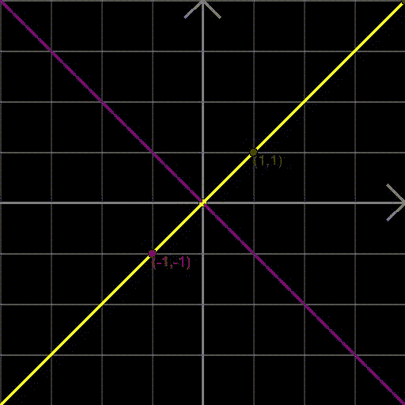

只要 u>1，平面通过原点。但是当 u <1, the (u,u) point becomes the support vector and drives the separating purple plane downward.

Now, the intuition about support vectors tells us:

1.  If u> 1 时，最佳 SVM 线不会改变，因为支持向量仍然是(1，1)和(-1，-1)。
2.  如果 u∈ (-1，1)，SVM 线随着 u 移动，因为支持向量现在从点(1，1)切换到(u，u)。
3.  如果 u

Let’s see how the Lagrange multipliers can help us reach this same conclusion. From equation (14),

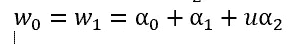

Eq (15)

Also, taking derivative of equation (13) with respect to b and setting to zero we get:

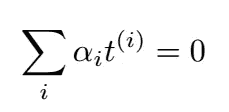

And for our problem, this translates to: α_0-α_1+α_2=0 (because the first and third points — (1,1) and (u,u) belong to the positive class and the second point — (-1,-1) belongs to the negative class).

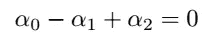

Eq (16)

Next, equations 10-b imply simply that the inequalities should be satisfied. For our problem, we get three inequalities (one per data point). All specified by (per equation (7)):

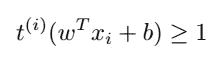

for our three data points we get:

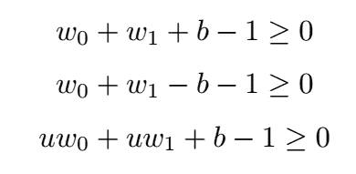

But from equation (15) we know that w_0=w_1\. Further, the second point is the only one in the negative class. So, the inequality corresponding to it must be an equality. Using this and introducing new slack variables, k_0 and k_2 to convert the above inequalities into equalities (the squares ensure the three inequalities above are still ≥0):

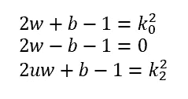

Eq (17)

And finally, we have the complementarity conditions:

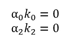

Eq (18)

From equation (17) we get: b=2w-1\. Further, since we require α_0> 0，α_2>0，我们用α_0，α_2 来代替。从等式(15)和(16)我们得到:

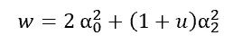

等式(19)

将 b=2w-1 代入等式(17)的第一个，

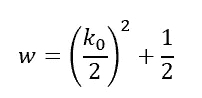

等式(20)

并进入等式(17)的第三个，

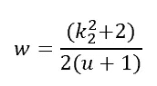

等式(21)

现在，方程(18)到(21)很难手工求解。幸运的是，有一个用于求解多项式方程组的通用框架，称为“Buchberger 算法”,上面描述的方程基本上是一个多项式方程组。我在这里写了一篇关于 Buchberger 求解多项式方程组的算法的详细博客。它可以用来根据我们感兴趣的变量简化方程组(简化的形式称为“Groebner 基”)。该算法在 python 库 sympy 中实现。让我们看看它是如何工作的。

等式(18)至(21)及其 Groebner 基，其中 k2 是第一个要消除的变量，k0 是第二个。由于只有五个方程，但有六个变量，所以 Groebner 基的最后一个方程将只用 k0 和 k2 来表示。

上面代码中变量的顺序很重要，因为它告诉 sympy 它们的“重要性”。它试图让 Groebner 基末尾的方程，用末尾的变量来表示。在这种情况下，我们有六个变量，但只有五个方程。并且由于 k_0 和 k_2 是最后两个变量，所以基的最后一个方程将仅用它们来表示(如果有六个方程，则最后一个方程将仅用 k2 来表示)。我们得到:

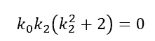

这意味着 k0k 2 = 0，因此，它们中至少有一个是零。然而，我们知道它们不可能都为零(一般来说)，因为这意味着对应于(1，1)和(u，u)的约束都是紧的；这意味着它们都在离直线的最小距离处，这只有在 u=1 时才有可能。一个或另一个必须为 0 的事实是有意义的，因为(1，1)或(u，u)中恰好有一个必须最接近分隔线，使得相应的 k =0。

做一个类似的练习，但是用 u 和 k_0 表示的最后一个等式，我们得到:

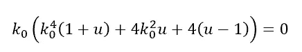

这意味着要么 0 = 0，要么

类似地，根据 k_2 和 u 提取方程，我们得到:

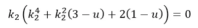

这又意味着要么 k_2=0，要么

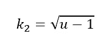

这意味着，如果 u>1，那么我们必须有 0 = 0，因为另一种可能性会使它成为虚数。因此，k_2 不可能是 0，而会变成(u-1)^.5.换句话说，对应于(1，1)的方程将变成等式，对应于(u，u)的方程将是“lose”(严格不等式)。这是有意义的，因为如果 u>1，(1，1)将是更接近超平面的点。

类似地，如果 u<1，k_2 将被迫变为 0，因此，k_0 将被迫取正值。我们看到了两点:(u，u)和(1，1)在 u 从小于 1 转变到大于 1 时切换作为支持向量的角色。另一方面，如果 u<0，则不可能找到均为非零实数的 k_0 和 k_2，因此方程没有实数解。