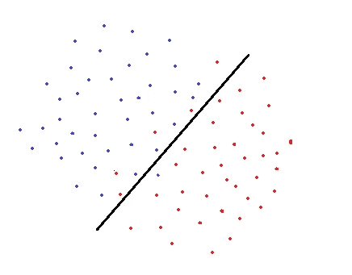
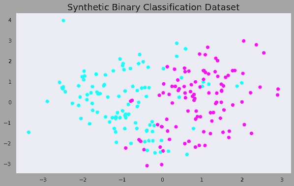
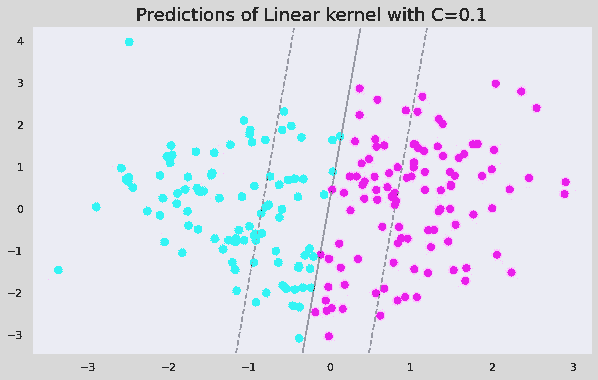
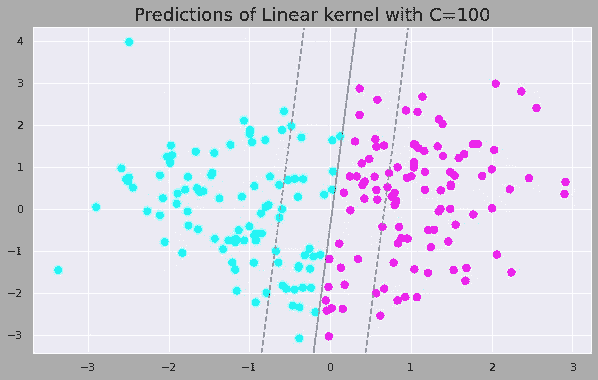
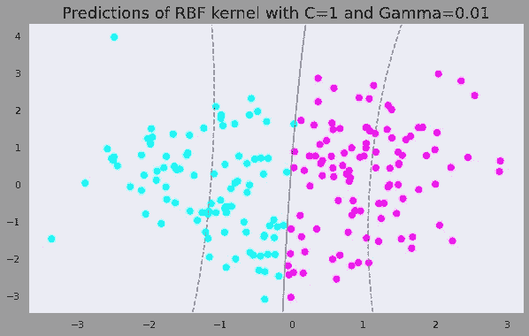
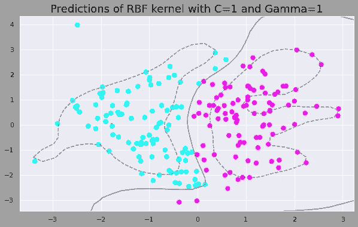
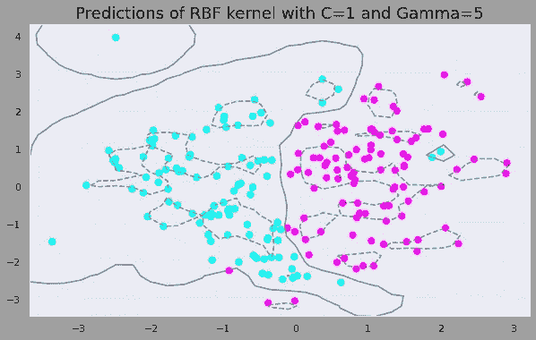

# 可视化解释 SVM 超参数

> 原文：<https://towardsdatascience.com/svm-hyperparameters-explained-with-visualizations-143e48cb701b?source=collection_archive---------10----------------------->

## C 和γ是用来做什么的


照片由 [Unsplash](https://unsplash.com/s/photos/balance?utm_source=unsplash&utm_medium=referral&utm_content=creditCopyText) 上的 [Aziz Acharki](https://unsplash.com/@acharki95?utm_source=unsplash&utm_medium=referral&utm_content=creditCopyText) 拍摄

支持向量机(SVM)是一种广泛使用的监督机器学习算法。它主要用于分类任务，但也适用于回归任务。

在这篇文章中，我们深入探讨了支持向量机的两个重要的超参数， **C** 和**γ，**并用可视化的方法解释了它们的作用。所以我假设你对算法有一个基本的了解，并关注这些超参数。

SVM 使用决策边界来分离属于不同类别的数据点。当确定决策边界时，软边界 SVM(软边界意味着允许一些数据点被错误分类)试图解决具有以下目标的优化问题:

*   增加决策边界到类别(或支持向量)的距离
*   最大化训练集中正确分类的点数



软边界 SVM 的决策边界(图片由作者提供)

很明显，这两个目标之间有一个折衷，它由 **C** 控制，对每个错误分类的数据点增加一个惩罚。

如果 C 很小，则对误分类点的惩罚也很低，因此以更大数量的误分类为代价选择了具有大余量的决策边界。

如果 C 很大，SVM 会尽量减少错误分类的例子，因为高惩罚会导致决策边界具有较小的余量。对于所有分类错误的例子，惩罚是不一样的。它与到决策边界的距离成正比。

举例之后会更清楚。让我们首先导入库并创建一个合成数据集。

```
import numpy as np
import pandas as pdimport matplotlib.pyplot as plt
%matplotlib inlinefrom sklearn.svm import SVC
from sklearn.datasets import make_classificationX, y = make_classification(n_samples=200, n_features=2,
n_informative=2, n_redundant=0, n_repeated=0, n_classes=2,random_state=42)plt.figure(figsize=(10,6))
plt.title("Synthetic Binary Classification Dataset", fontsize=18)
plt.scatter(X[:,0], X[:,1], c=y, cmap='cool')
```



(图片由作者提供)

我们将首先训练一个只需要调整 c 的线性 SVM，然后我们将实现一个具有 RBF 核的 SVM，并调整伽马参数。

为了绘制决策边界，我们将使用 Jake VanderPlas 的 [Python 数据科学手册](https://jakevdp.github.io/PythonDataScienceHandbook/)的 [SVM 章节](https://jakevdp.github.io/PythonDataScienceHandbook/05.07-support-vector-machines.html)中的函数。

我们现在可以创建两个具有不同 C 值的线性 SVM 分类器。

```
clf = SVC(C=0.1, kernel='linear').fit(X, y)plt.figure(figsize=(10,6))
plt.title("Linear kernel with C=0.1", fontsize=18)
plt.scatter(X[:, 0], X[:, 1], c=y, s=50, cmap='cool')
plot_svc_decision_function(clf)
```



(图片由作者提供)

只需将 C 值更改为 100，即可生成如下图。



(图片由作者提供)

当我们增加 C 值时，边距变小。因此，具有低 C 值的模型倾向于更一般化。随着数据集越来越大，这种差异变得越来越明显。

超参数的影响仅在线性核的情况下达到一定程度。对于非线性核，超参数的影响变得更加明显。

伽马是与非线性 SVM 一起使用的超参数。最常用的非线性核之一是径向基函数(RBF)。RBF 的 Gamma 参数控制单个训练点的影响距离。

低 gamma 值表示较大的相似性半径，这将导致更多的点被组合在一起。对于高 gamma 值，这些点需要彼此非常接近，才能被视为在同一组(或类)中。因此，gamma 值非常大的模型往往会过度拟合。

让我们用不同的伽马值绘制三个支持向量机的预测。

```
clf = SVC(C=1, kernel='rbf', gamma=0.01).fit(X, y)
y_pred = clf.predict(X)plt.figure(figsize=(10,6))
plt.title("Predictions of RBF kernel with C=1 and Gamma=0.01", fontsize=18)
plt.scatter(X[:, 0], X[:, 1], c=y_pred, s=50, cmap='cool')
plot_svc_decision_function(clf)
```



(图片由作者提供)

只需改变伽马值，以产生以下图形。



(图片由作者提供)



(图片由作者提供)

随着 gamma 值的增加，模型变得过拟合。数据点需要非常接近才能分组在一起，因为相似性半径随着灰度值的增加而减小。

伽马值为 0.01、1 和 5 的数据集上的 RBF 核的精度分别为 0.89、0.92 和 0.93。这些值表明随着 gamma 值的增加，模型过度适应训练集。

# 伽马与 C 参数

对于线性核，我们只需要优化 c 参数。然而，如果我们想使用 RBF 核，c 和 gamma 参数需要同时优化。如果γ很大，c 的影响可以忽略不计。如果 gamma 很小，c 会像影响线性模型一样影响模型。c 和γ的典型值如下。然而，根据应用可能存在特定的最佳值:

0.0001 < gamma < 10

0.1 < c < 100

# **参考值**

*   [https://jakevdp . github . io/python datascience handbook/05.07-support-vector-machines . html](https://jakevdp.github.io/PythonDataScienceHandbook/05.07-support-vector-machines.html)