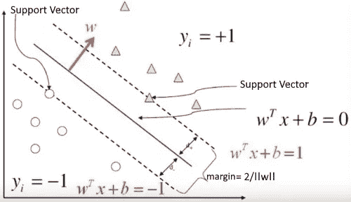
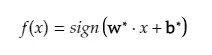
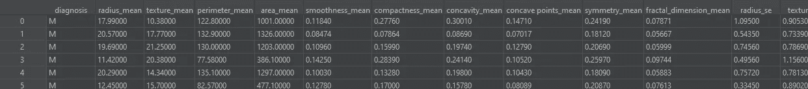
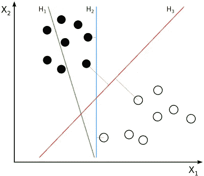
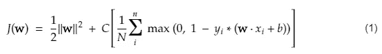
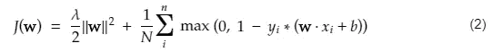
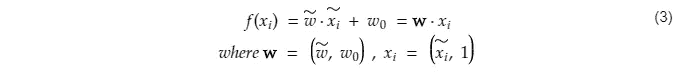
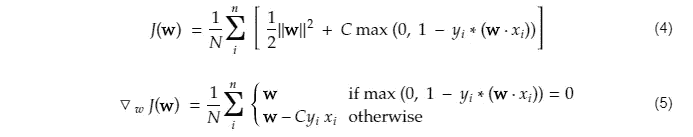
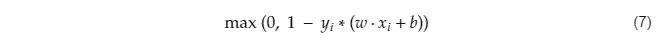

# 从零开始的 SVM——Python

> 原文：<https://towardsdatascience.com/svm-implementation-from-scratch-python-2db2fc52e5c2?source=collection_archive---------0----------------------->

## 重要概念总结


如果你明白了，干杯😉

## 本博客将涵盖的内容:

1. [SVM 简介](#c22e)T2 2。[读取数据集](#d7d8)
3。[特色工程](#9b54)
4。[拆分数据集](#1001)
5。[成本函数](#66a2)
6。[成本函数的梯度](#72a3)
7。[列车型号使用 SGD](#163f)8。[停机判据为 SGD](#80a3)9
。[测试型号](#b46d)
10。[具有相关性的特征选择& P 值](#6a0c)
11。给我代码

在深入代码或技术细节之前，我想提一下，虽然有许多库/框架可用于实现 SVM(支持向量机)算法，而无需编写大量代码，但我决定用尽可能少的高级库来编写代码，以便您和我可以很好地掌握训练 SVM 模型(准确率为 99%，召回率为 0.98%，精确度为 0.98%)所涉及的重要组件。如果你正在寻找 SVM 的快速实现，那么你最好使用像 [scikit-learn](https://scikit-learn.org/) 、 [cvxopt](https://cvxopt.org/) 等这样的包。要不，我们开始吧！

# SVM 简介



**图 1:** SVM 用一张图表概括— [Ireneli.eu](http://ireneli.eu)

**SVM** (支持向量机)是一种**监督的** **机器学习**算法，通常用于**二元分类问题**。它通过输入带有*标签示例的*数据集*来训练(xᵢ，yᵢ).*例如，如果您的示例是电子邮件，而您的问题是垃圾邮件检测，那么:

*   示例电子邮件消息 ***xᵢ*** 被定义为能够在 n 维空间上绘制的 *n 维特征向量*。
*   特征向量，顾名思义，包含特征(如字数、链接数等。)以数字形式显示
*   每个特征向量都标有一个类别
*   *类别*可以是+ve 或-ve(例如，spam=1，而非-spam=-1)**

**使用这个*数据集*，算法*找到一个超平面*(或决策边界)，该超平面理想地应该具有以下属性:**

*   **它以最大的裕度在两个类的示例之间创建了分离**
*   **它的等式 *(w.x + b = 0)* 对于来自+ve 类的例子产生≥ 1 的值，对于来自-ve 类的例子产生≤-1 的值**

****它是怎么找到这个超平面的？**通过找到定义该超平面的最优值 *w*(权重/法线)*和*b ****(截距)*。通过*最小化成本函数找到最佳值。*一旦算法识别出这些最优值，则 *SVM 模型 f(x)* 被定义如下:***

****

**数学表达的 SVM 模型**

**在我们继续之前，让我们导入本教程所需的包，并创建我们程序的框架 *svm.py* :**

```
*****# svm.py***
import numpy as np  *# for handling multi-dimensional array operation*
import pandas as pd  *# for reading data from csv* 
import statsmodels.api as sm  *# for finding the p-value*
from sklearn.preprocessing import MinMaxScaler  *# for normalization*
from sklearn.model_selection import train_test_split as tts
from sklearn.metrics import accuracy_score 
from sklearn.utils import shuffle*# >> FEATURE SELECTION << #*
def remove_correlated_features(X):
def remove_less_significant_features(X, Y):*# >> MODEL TRAINING << #*
def compute_cost(W, X, Y):
def calculate_cost_gradient(W, X_batch, Y_batch):
def sgd(features, outputs):def init():**
```

# **读取数据集**

**我们将使用 [Kaggle](https://www.kaggle.com/uciml/breast-cancer-wisconsin-data) 上的乳腺癌数据集。数据集中的特征是根据乳腺肿块细针抽吸(FNA)的数字化图像计算得出的。它们描述了图像中出现的细胞核的特征。基于这些特征，我们将训练我们的 SVM 模型来检测肿块是良性的 **B** (一般无害)还是恶性的 **M** (癌变)。**

**下载数据集并将 *data.csv* 文件放在与 *svm.py* 相同的文件夹中。然后将这段代码添加到 *init()* 函数中:**

```
****def init():
**    data = pd.read_csv('./data.csv') *# SVM only accepts numerical values. 
    # Therefore, we will transform the categories M and B into
    # values 1 and -1 (or -1 and 1), respectively.*
    diagnosis_map = {'M':1, 'B':-1}
    data['diagnosis'] = data['diagnosis'].map(diagnosis_map) # drop last column (extra column added by pd)
    # and unnecessary first column (id)
    data.drop(data.columns[[-1, 0]], axis=1, inplace=True)**
```

**[*read _ CSV()*](https://pandas.pydata.org/pandas-docs/stable/reference/api/pandas.read_csv.html)Pandas[包的函数从。csv 文件并将其存储在*数据帧*和**中。**把DataFrame 想象成一个数据结构的实现，它看起来像一个带有标记的列和行的表格。下面是从 *data.csv* 中读取的数据在 DataFrame 中的样子:](https://pandas.pydata.org/)**

****

****图 2:** 在 PyCharm IDE 中查看的数据帧中乳腺癌数据集的一部分**

**如您所见，我们的数据集的标签和结构得以保留，这使得 DataFrame 变得直观。**

# **特征工程**

**机器学习算法在一个数据集上操作，该数据集是一个由[特征](https://developers.google.com/machine-learning/crash-course/framing/ml-terminology#features)和[标签](https://developers.google.com/machine-learning/crash-course/framing/ml-terminology#labels)组成的带标签的例子的集合，即在我们的情况下*诊断*是一个标签，【*半径 _ 平均*，*结构 _ 平均*，*纹理 _ 平均……*特征，并且每一行都是一个例子。**

**在大多数情况下，您最初收集的数据可能是原始的；它要么与你的模型不兼容，要么妨碍它的性能。这时**特征工程**来拯救。它包括预处理技术，通过从原始数据中提取特征来编译数据集。这些技术有两个共同的特点:**

*   **准备与模型兼容的数据**
*   **提高机器学习算法的性能**

****标准化**是我们将要使用的众多特征工程技术之一。归一化是将数值范围转换为标准数值范围的过程，通常在区间[1，1]或[0，1]内。这不是一个严格的要求，但它提高了学习的速度(例如，在梯度下降中更快的收敛)并防止数值溢出。在 *init()* 函数中添加以下代码，以规范化您的所有功能:**

```
*****# inside init()*** *# put features & outputs in different DataFrames for convenience* Y = data.loc[:, 'diagnosis']  # all rows of 'diagnosis' 
X = data.iloc[:, 1:]  # all rows of column 1 and ahead (features)*# normalize the features using MinMaxScalar from
# sklearn.preprocessing* X_normalized = MinMaxScaler().fit_transform(X.values)
X = pd.DataFrame(X_normalized)**
```

# **分割数据集**

**我们将使用*sk learn . model _ selection*中的 *train_test_split()* 函数将数据集分成训练集和测试集。我们需要一个单独的数据集来进行测试，因为我们需要看看我们的模型在看不见的观察上表现如何。将此代码添加到 *init()* 中:**

```
*****# inside init()****# first insert 1 in every row for intercept b*
X.insert(loc=len(X.columns), column='intercept', value=1)# test_size is the portion of data that will go into test set
# random_state is the seed used by the random number generator
print("splitting dataset into train and test sets...")
X_train, X_test, y_train, y_test = tts(X, Y, test_size=0.2, random_state=42)**
```

**如果你对我们为什么在每一行加 1 感到困惑，那么不要担心。你会在下一节得到答案。**

# **价值函数**

****

****图 3:** H1 并没有把阶级分开。H2 有，但幅度很小。H3 以最大的差距将他们分开— [维基百科](https://en.wikipedia.org/wiki/Support-vector_machine)**

**也称为目标函数。每个机器学习算法的构建模块之一，它是我们试图*最小化或最大化*以实现我们目标的函数。**

**我们在 SVM 的目标是什么？我们的目标是找到一个超平面，它以最大的裕度分隔+ve 和-ve 示例，同时保持尽可能低的错误分类(见图 3)。**

**我们如何实现这个目标？我们将最小化成本/目标函数，如下所示:**

****

**在训练阶段，较大的 C 导致较窄的裕度(对于无限大的 C，SVM 变成硬裕度)，而较小的 C 导致较宽的裕度。**

**您可能见过另一个版本的成本函数，如下所示:**

****

**较大的λ给出较宽的余量，较小的λ导致较窄的余量(对于无限小的λ，SVM 变成硬余量)。**

**在这个成本函数中，λ基本上等于 *1/C* ，并且具有相反的效果，即较大的λ给出较宽的余量，反之亦然。我们可以使用任何上述成本函数，记住每个正则化参数(C 和λ)的作用，然后相应地调整它们。让我们看看如何计算(1)中给出的总成本，然后我们将继续讨论其梯度，该梯度将用于训练阶段以使其最小化:**

```
****def compute_cost(W, X, Y):**
    # calculate hinge loss
    N = X.shape[0]
    distances = 1 - Y * (np.dot(X, W))
    distances[distances < 0] = 0  # equivalent to max(0, distance)
    hinge_loss = reg_strength * (np.sum(distances) / N)

    # calculate cost
    cost = 1 / 2 * np.dot(W, W) + hinge_loss
    return cost**
```

**您可能已经注意到，截距术语 *b* 不见了。这是因为我们把它推进了重量向量，就像这样:**

****

**将截距项推入权重向量。**

**这就是为什么我们在拆分数据集之前添加了一个全 1 的额外列。在本教程的剩余部分，请记住这一点。**

# **成本函数的梯度**

****

**成本函数的梯度**

**您可能已经注意到，等式(4)中的成本函数有一些变化。不要担心，如果你解析地解决它，它是相同的。现在让我们使用等式(5)实现*calculate _ cost _ gradient()*函数:**

```
**# I haven't tested it but this same function should work for
# vanilla and mini-batch gradient descent as well
**def calculate_cost_gradient(W, X_batch, Y_batch):**
    # if only one example is passed (eg. in case of SGD)
    if type(Y_batch) == np.float64:
        Y_batch = np.array([Y_batch])
        X_batch = np.array([X_batch]) distance = 1 - (Y_batch * np.dot(X_batch, W))
    dw = np.zeros(len(W)) for ind, d in enumerate(distance):
        if max(0, d) == 0:
            di = W
        else:
            di = W - (reg_strength * Y_batch[ind] * X_batch[ind])
        dw += di dw = dw/len(Y_batch)  # average
    return dw**
```

# **使用 SGD 训练模型**

**记得我在上面说过，“为了实现我们的目标，我们试图*最小化或最大化成本函数”*。在 SVM 算法中，我们最小化成本函数。**

****我们为什么要最小化成本函数？因为成本函数本质上是衡量我们的模型在实现目标方面做得有多差的指标。如果你仔细观察 J(w)，为了找到它的最小值，我们必须:****

1.  ***最小化*∣∣w∣∣*t13】哪个*最大化边距* (2/∣∣w∣∣)***
2.  **最小化铰链损耗的总和*，其中*最小化错误分类*。*

**

*铰链损失函数*

*因为我们的两个 SVM 目标都是通过最小化成本函数来实现的，这就是为什么我们要最小化它。*

*我们如何将它最小化？嗯，有多种方法，但我们将使用一种叫做随机梯度下降或 SGD 的方法。在深入 SGD 之前，我首先简单解释一下梯度下降是如何工作的。*

**

***图 4:** 梯度下降*

*梯度下降算法的工作原理如下:*

1.  *找到成本函数的梯度，即∇J(w')*
2.  *以一定的速率向梯度的相反方向移动，即 w' = w' — ∝(∇J(w'))*
3.  *重复步骤 1-3，直到收敛，即我们发现 w '其中 J(w)最小*

*为什么它的运动方向与梯度方向相反？因为梯度是函数增长最快的方向。我们需要向相反的方向移动，使函数 J(w)最小。因此，在梯度下降中使用“下降”一词。*

*在典型的梯度下降(又名普通梯度下降)中，使用所有示例(1…N)计算上述步骤 1。然而，在 SGD 中，一次只使用一个示例。我不会在这里讨论 SGD 的好处，但是你可以在这个博客的末尾找到一些有用的链接。下面是如何用代码实现 SGD:*

```
***def sgd(features, outputs):
**    max_epochs = 5000
    weights = np.zeros(features.shape[1])
    *# stochastic gradient descent*
    for epoch in range(1, max_epochs): 
        *# shuffle to prevent repeating update cycles*
        X, Y = shuffle(features, outputs)
        for ind, x in enumerate(X):
            ascent = calculate_cost_gradient(weights, x, Y[ind])
            weights = weights - (learning_rate * ascent)

    return weights*
```

*让我们通过添加以下代码在 *init()* 函数内部调用它:*

```
****# inside init()****# train the model*
print("training started...")
W = sgd(X_train.to_numpy(), y_train.to_numpy())
print("training finished.")
print("weights are: {}".format(W))*
```

# *SGD 的停止标准*

*在上面的 *sgd()* 实现中，我们运行了 5000 次循环(可能是任何次数)。每次迭代都花费我们时间和额外的计算。我们不需要完成所有的迭代。当满足中断标准时，我们可以终止循环。*

***停工标准应该是什么？**有多个选项，但我们将使用最简单的一个。与之前的成本相比，当当前的成本没有降低很多时，我们将停止培训。下面是我们如何用停止标准定义 *sgd()* :*

```
***def sgd(features, outputs):**
    max_epochs = 5000
    weights = np.zeros(features.shape[1])
    nth = 0
    prev_cost = float("inf")
    cost_threshold = 0.01  # in percent
    # stochastic gradient descent
    for epoch in range(1, max_epochs):
        # shuffle to prevent repeating update cycles
        X, Y = shuffle(features, outputs)
        for ind, x in enumerate(X):
            ascent = calculate_cost_gradient(weights, x, Y[ind])
            weights = weights - (learning_rate * ascent) # convergence check on 2^nth epoch
        if epoch == 2 ** nth or epoch == max_epochs - 1:
            cost = compute_cost(weights, features, outputs)
            print("Epoch is:{} and Cost is: {}".format(epoch, cost))
            # stoppage criterion
            if abs(prev_cost - cost) < cost_threshold * prev_cost:
                return weights
            prev_cost = cost
            nth += 1
    return weights*
```

# *测试模型*

*在使用 SGD 训练模型之后，我们最终获得了最优权重 **w*** ，其定义了分离两个类的最佳可能超平面。让我们用这个超平面来测试我们的模型。将此代码添加到 *init()* 函数中:*

```
****# inside init()****# testing the model on test set*
y_test_predicted = np.array([])
for i in range(X_test.shape[0]):
    yp = np.sign(np.dot(W, X_test.to_numpy()[i])) #model
    y_test_predicted = np.append(y_test_predicted, yp)print("accuracy on test dataset: {}".format(accuracy_score(y_test.to_numpy(), y_test_predicted)))
print("recall on test dataset: {}".format(recall_score(y_test.to_numpy(), y_test_predicted)))
print("precision on test dataset: {}".format(recall_score(y_test.to_numpy(), y_test_predicted)))*
```

*现在让我们调用 *init()* 函数:*

```
**# set hyper-parameters and call init
# hyper-parameters are normally tuned using cross-validation
# but following work good enough*
reg_strength = 10000 # regularization strength
learning_rate = 0.000001
init()*
```

*以下是输出结果:*

```
***# OUTPUT**
reading dataset...
applying feature engineering...
splitting dataset into train and test sets...
training started...
Epoch is: 1 and Cost is: 5333.266133501857
Epoch is: 2 and Cost is: 3421.9128432834573
Epoch is: 4 and Cost is: 2437.2790231100216
Epoch is: 8 and Cost is: 1880.2998267933792
Epoch is: 16 and Cost is: 1519.5578612139725
Epoch is: 32 and Cost is: 1234.642324549297
Epoch is: 64 and Cost is: 977.3285621274708
Epoch is: 128 and Cost is: 804.8893546235923
Epoch is: 256 and Cost is: 703.407799431284
Epoch is: 512 and Cost is: 645.8275191300031
Epoch is: 1024 and Cost is: 631.6024252740094
Epoch is: 2048 and Cost is: 615.8378582171482
Epoch is: 4096 and Cost is: 605.0990964730645
Epoch is: 4999 and Cost is: 606.8186618758745
training finished.
weights are: [ 1.32516553  0.83500639  1.12489803  2.16072054 -1.24845441 -3.24246498
  3.27876342  6.83028706 -0.46562238  0.10063844  5.68881254 -1.93421932
  3.27394523  3.77331751  1.67333278 -2.43170464 -1.7683188   0.84065607
 -1.9612766  -1.84996828  2.69876618  5.32541102  1.0380137   3.0787769
  2.2140083  -0.61998182  2.66514199  0.02348447  4.64797917  2.17249278
 -9.27401088]
testing the model...
accuracy on test dataset: 0.9736842105263158
recall on test dataset: 0.9534883720930233
precision on test dataset: 0.9534883720930233*
```

*请注意模型的准确性、召回率和精确度分数，以及完成模型所需的时期。现在让我们尝试使用特征选择来改进它。*

# *具有相关性和 P 值的特征选择*

*特征选择包括帮助过滤不相关或冗余特征的统计技术。相关性和 p 值就是这些统计技术中的一种。使用它们，我们将从我们的原始特征集中选择一个相关和重要的特征子集*

***什么是相关性？**相关性是两个变量之间线性依赖(或线性关系)的程度。如果一个特征的值可以用第二个特征的某种线性关系来解释，则称两个特征相关。这种关系的程度由**相关系数**(或“r”)给出。范围从-1.0 到+1.0。r 越接近+1 或-1，这两个变量的关系就越密切。*

*为什么我们要删除其中一个相关特征？有多种原因，但最简单的原因是相关特征对因变量的影响几乎相同。此外，相关特征不会改善我们的模型，而且很可能会恶化它，因此我们最好只使用其中的一个。毕竟特征越少，学习速度越快，模型越简单(特征越少的模型)。*

***什么是 p 值？**这个博客涉及的范围太广了。但是，在特征选择的背景下，p 值帮助我们*找到在解释因变量(y)* 的变化中最重要的特征。*

*在解释这种变化时，p 值低的要素意义更大，而 p 值高的要素意义较小。通常，我们设置一个**显著性水平 SL** (阈值)，如果一个特征的 p 值高于这个水平，它将被丢弃。我会在这篇博客的最后留下一些链接，对 p 值进行深入研究。*

***为什么我们要移除高 p 值的特征？因为它们不能说明因变量的行为。因此，当它们不能帮助我们预测结果时，为什么要保留它们，并不必要地增加我们模型的复杂性。***

*我们有两个名为*remove _ correlated _ features()remove _ less _ significant _ features()*的函数，分别用于移除高度相关的特征和不太重要的特征(使用 p 值和[向后消除](https://www.javatpoint.com/backward-elimination-in-machine-learning)):*

```
*# >> FEATURE SELECTION << #
**def remove_correlated_features(X):**
    corr_threshold = 0.9
    corr = X.corr()
    drop_columns = np.full(corr.shape[0], False, dtype=bool)
    for i in range(corr.shape[0]):
        for j in range(i + 1, corr.shape[0]):
            if corr.iloc[i, j] >= corr_threshold:
                drop_columns[j] = True
    columns_dropped = X.columns[drop_columns]
    X.drop(columns_dropped, axis=1, inplace=True)
    return columns_dropped**def remove_less_significant_features(X, Y):**
    sl = 0.05
    regression_ols = None
    columns_dropped = np.array([])
    for itr in range(0, len(X.columns)):
        regression_ols = sm.OLS(Y, X).fit()
        max_col = regression_ols.pvalues.idxmax()
        max_val = regression_ols.pvalues.max()
        if max_val > sl:
            X.drop(max_col, axis='columns', inplace=True)
            columns_dropped = np.append(columns_dropped, [max_col])
        else:
            break
    regression_ols.summary()
    return columns_dropped*
```

*在应用*规范化*之前，让我们在 *init()* 中调用这些函数:*

```
****# inside init()***# filter features
remove_correlated_features(X)
remove_less_significant_features(X, Y)*
```

*重新运行代码并检查输出:*

```
***# OUTPUT WITH FEATURE SELECTION** reading dataset...
applying feature engineering...
splitting dataset into train and test sets...
training started...
Epoch is: 1 and Cost is: 7198.889722245353
Epoch is: 2 and Cost is: 6546.424590270085
Epoch is: 4 and Cost is: 5448.724593530262
Epoch is: 8 and Cost is: 3839.8660601754004
Epoch is: 16 and Cost is: 2643.2493061396613
Epoch is: 32 and Cost is: 2003.9830891013514
Epoch is: 64 and Cost is: 1595.2499320295813
Epoch is: 128 and Cost is: 1325.7502330505054
Epoch is: 256 and Cost is: 1159.7928936478063
Epoch is: 512 and Cost is: 1077.5846940303365
Epoch is: 1024 and Cost is: 1047.208390340501
Epoch is: 2048 and Cost is: 1040.2241600540974
training finished.
weights are: [ 3.53520254 11.03169318 -2.31444264 -7.89186867 10.14516174 -1.28905488
 -6.4397589   2.26113987 -3.87318997  3.23075732  4.94607957  4.81819288
 -4.72111236]
testing the model...
accuracy on test dataset: 0.9912280701754386
recall on test dataset: 0.9767441860465116
precision on test dataset: 0.9767441860465116*
```

*可以看到*准确率(99%)* ，*精度(0.98)* ，以及*召回(0.98)* 的分数都有所提高。而且，新币收敛得更快；训练在 2048 个纪元内结束，这与之前的一次(5000 个纪元)相比要少得多*

# *完全码*

*您可以在这个 Github 资源库中获得完整的代码:*

*[](https://github.com/qandeelabbassi/python-svm-sgd) [## qandeelabbassi/python-svm-sgd

### SVM 随机次梯度下降算法的 Python 实现- qandeelabbassi/python-svm-sgd

github.com](https://github.com/qandeelabbassi/python-svm-sgd)* 

***有用链接***

*   *[SGD 为什么会起作用？](/https-towardsdatascience-com-why-stochastic-gradient-descent-works-9af5b9de09b8)*
*   *[新币的好处](https://stats.stackexchange.com/questions/49528/batch-gradient-descent-versus-stochastic-gradient-descent)*
*   *[数据科学家解释的 P 值](/p-values-explained-by-data-scientist-f40a746cfc8)*
*   *[线性回归和 p 值](https://www.youtube.com/watch?v=nk2CQITm_eo)*
*   *[落后淘汰](https://www.javatpoint.com/backward-elimination-in-machine-learning)*