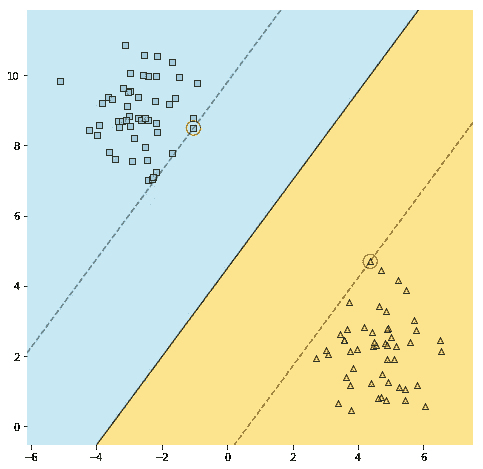
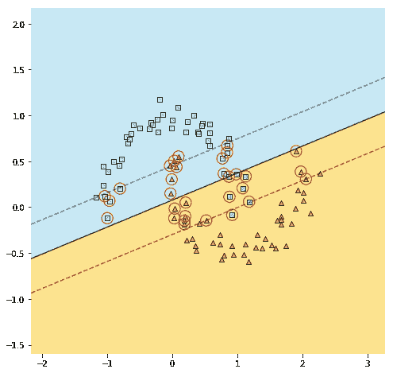
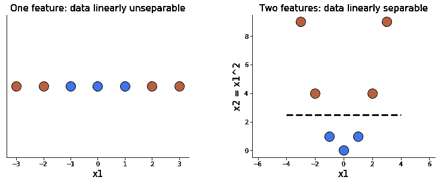
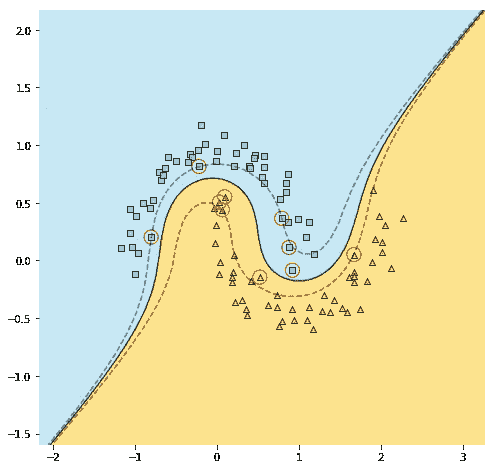
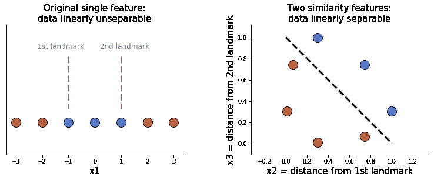
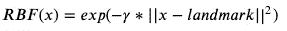
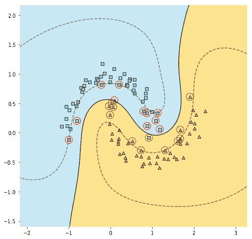
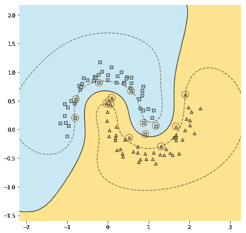

# SVM 内核:他们实际上做什么？

> 原文：<https://towardsdatascience.com/svm-kernels-what-do-they-actually-do-56ce36f4f7b8?source=collection_archive---------5----------------------->

## 直观的视觉解释

由[凯利·西克玛](https://unsplash.com/@kellysikkema?utm_source=medium&utm_medium=referral)在 [Unsplash](https://unsplash.com?utm_source=medium&utm_medium=referral) 上拍摄的照片

你可能听说过所谓的核技巧，这是一种允许支持向量机(SVM)很好地处理非线性数据的策略。这个想法是将数据映射到一个高维空间，在这个空间中数据变成线性的，然后应用一个简单的线性 SVM。听起来很复杂，在某种程度上确实如此。然而，尽管可能很难理解内核是如何工作的，但理解它们试图实现的目标是相当容易的。请继续阅读，自己去看看吧！

## 当数据是线性可分的:线性 SVM

首先:香草 SVM 是如何工作的？我们可以将支持向量机用于分类和回归任务，但是在本文中，我们将关注前者。让我们首先考虑具有线性可分的两个类的数据。我们将创建两个独立的点，并使用 scikit-learn 为它们拟合一个线性 SVM。请注意，我们在拟合模型之前对数据进行了归一化，因为支持向量机对特征的尺度很敏感。

自定义的`plot_svm()`函数，你可以在下面看到它的输出，由相当多的 matplotlib 代码组成——如果你好奇，可以在[this**jupyter notebook**](https://github.com/MichalOleszak/KnowledgeBank/blob/master/blog_posts/svm_kernels/svm_kernels.ipynb)**中查看。**

****

**具有线性可分数据的线性 SVM 效果很好。**

**有许多线条完美地分隔了这两个阶级，确切地说是无限多。由 SVM 拟合的线是特殊的，因为它是用虚线标记的波段的中线，并且该波段是可以在两个类别之间挤压的最宽的波段。这样，SVM 决策线(标记为黑色实线)尽可能远离这两个类，确保模型能够很好地推广到新的示例。**

**用红色圈出的波段边界上的观察值称为支持向量，因为它们支持或确定波段的位置。如果我们增加一些波段外的观察，它不会改变位置。**

**作为一个旁注:这是一个硬边界分类的例子，这意味着不允许任何观察值进入波段。或者，我们可以做一个软边界分类:允许对波段进行一些观察，但不要太多，同时使波段更宽。这将对异常值更加鲁棒，并且可以通过`LinearSVC()`中的参数 C 来控制:我们已经将其设置为 1，但是例如将其降低到 0.1，将会产生更宽的波段，但是其中会有一些观察值。不管怎样，这和我们的故事没多大关系。**

**大多数现实生活中的数据集不是漂亮的、线性可分的斑点。让我们看看线性 SVM 如何处理月亮形状的数据。**

****

**具有线性不可分数据的线性 SVM 根本不起作用。**

**这看起来不太好，是吗？让我们看看我们能做些什么。**

****

## **映射到更高维度**

**在我们讨论内核和它们做什么之前，让我们先来看看它们利用的一个强大的思想:在高维空间中，数据有更大的机会变成线性可分的。**

**下面的一对图清楚地说明了这一点。当我们只有一个特征时， *x1* ，我们不能用一行来分隔数据。添加另一个特征， *x2，*等于 *x1* 的平方，使得区分这两个类变得容易。**

****

**添加另一个特征使得数据可以线性分离。**

****

## **内核到底是什么？**

**那么，内核的诀窍是什么呢？内核只是向数据添加更多特征的一种聪明方式，希望使数据线性分离。聪明，因为它们不是实际添加它们，这会使模型变慢，而是利用一些神奇的数学属性(这超出了本文的范围)，使我们能够获得与我们实际添加这些特性完全相同的结果**，而不会使模型变慢。****

**两个流行的内核是**多项式内核**和**高斯径向基函数，或 RBF，内核**。它们的不同之处在于它们(假装)添加的功能类型。让我们看看他们是怎么做的！**

****

## **具有多项式核的多项式特征**

**创建更多特征的一种方法是在一定程度上使用它们的多项式组合。例如，对于两个特征 A 和 B，2 次多项式将产生 6 个特征:1(任何 0 次幂的特征)、A、B、A、B 和 AB。我们可以使用 scikit-learn 的`PolynomialFeatures()`轻松地手动添加这些功能:**

**或者我们可以简单地使用多项式核:**

**您可以自己验证两种实现产生大致相同的图，有点像这样:**

****

**具有多项式核的决策边界。**

**使用内核化版本的优点是，您可以指定较大的程度，从而增加数据在这个高维空间中线性分离的机会，而不会降低模型的速度。**

**对于我们的月球数据示例，从散点图可以清楚地看出，3 次多项式就足够了。然而，对于更复杂的数据集，您可能需要使用更高的度数。这就是内核技巧的威力被释放出来的时候。**

****

## **高斯 RBF 核的相似性特征**

**向数据添加更多特征的另一种方法是使用所谓的相似性特征。相似性特征测量现有特征的值与地标的距离。让我们实际一点:我们有一个具有单一特征的数据集， *x1* 。我们想要创建两个相似性特征，因此我们选择两个界标，即来自我们的单个特征的参考值。让我们以-1 和 1 为例。然后，对于 *x1，*的每个值，我们计算它离第一个地标有多远(继续阅读，看看如何定义‘远’)。这是我们新的相似性特征， *x2* 。然后我们做同样的事情，将 *x1* 的值与第二个界标进行比较，以获得 *x3* 。现在我们甚至不需要原来的功能 *x1* ！这两个新的相似性特征使我们的数据很容易分离。**

****

**相似性特征使得数据可以线性分离。**

**那么，我们如何计算每次观测到地标的距离呢？一个流行的选择是使用高斯径向基函数，或 RBF。它被定义为:**

****

**其中 *x* 是我们的原始特征，γ是一个参数，我将其设置为 0.3。**

**例如，在我们唯一的原创特性上，第一个观察得分为-3。我们计算出 *x2* 为 exp(-0.3 * (-3-(-1)) )≈0.30，而 *x3* 为 exp(-0.3 * (-3-(1)) )≈0.01。这是右边图上最底部的点。**

**在上面的例子中，我们幸运地选择了两个工作正常的地标。在实践中，可能需要大量的界标，这转化为许多新的相似性特征。这将大大降低 SVM 的速度——除非我们使用内核技巧！与多项式核类似，RBF 核允许我们获得完全相同的结果，就好像我们在原始要素的每个值处添加了一个界标，而不需要实际这样做。让我们用我们的月亮形状的数据来试试吧。**

****

**具有 RBF 核的决策边界，γ=0.3。**

**决策边界看起来相当不错，但是您可能已经注意到一些错误分类的例子。我们可以通过调整γ参数来修复它。它作为一个正则化因子，它越小，决策边界越平滑，从而防止过度拟合。然而，在这种情况下，我们似乎实际上欠拟合，所以让我们将γ增加到 0.5。**

****

**具有 RBF 核的决策边界，γ=0.5。**

**现在所有的例子都被正确分类了！**

****

## **摘要**

*   **支持向量机通过寻找尽可能远离数据的线性决策边界来执行分类。对于线性可分的数据，它们工作得很好，但在其他情况下却很糟糕。**
*   **为了使非线性数据线性可分(从而便于支持向量机)，我们可以向数据添加更多特征，因为在更高维度的空间中，数据线性可分的概率增加。**
*   **要添加的两种常见类型的新特征是现有特征的多项式组合(多项式特征)和与地标的观察距离，即一些参考值(相似性特征)。**
*   **实际上，添加它们可能会使模型变慢到无用的程度。**
*   **内核技巧是一个聪明的策略，它利用了一些数学属性，以提供相同的结果，就好像我们添加了额外的功能，但实际上并没有添加。**
*   **多项式和 RBF 核(假装)分别增加了多项式和相似性特征。**

****

## **来源**

*   **Geron A .，2019，第二版，使用 Scikit-Learn 和 TensorFlow 进行机器学习:构建智能系统的概念、工具和技术**

****

**感谢阅读！**

**如果你喜欢这篇文章，为什么不在我的新文章上 [**订阅电子邮件更新**](https://michaloleszak.medium.com/subscribe) ？通过 [**成为媒介会员**](https://michaloleszak.medium.com/membership) ，你可以支持我的写作，并无限制地访问其他作者和我自己的所有故事。**

**需要咨询？你可以问我任何事情，也可以在这里 预定我 1:1 [**。**](http://hiretheauthor.com/michal)**

**也可以试试 [**我的其他文章**](https://michaloleszak.github.io/blog/) 中的一篇。不能选择？从这些中选择一个:**

** [## 校准分类器

### 你确定你的模型返回概率吗？🎲

towardsdatascience.com](/calibrating-classifiers-559abc30711a)  [## 线性回归中收缩法和选择法的比较

### 详细介绍 7 种流行的收缩和选择方法。

towardsdatascience.com](/a-comparison-of-shrinkage-and-selection-methods-for-linear-regression-ee4dd3a71f16)  [## 非线性回归:基础扩展、多项式和样条

### 如何用多项式和样条捕捉非线性关系？

towardsdatascience.com](/non-linear-regression-basis-expansion-polynomials-splines-2d7adb2cc226)**