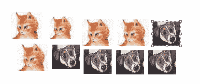
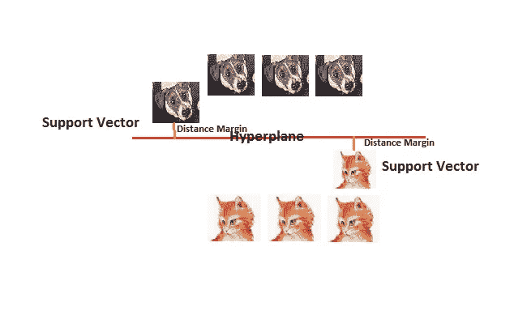
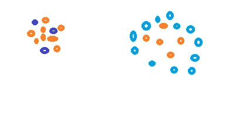
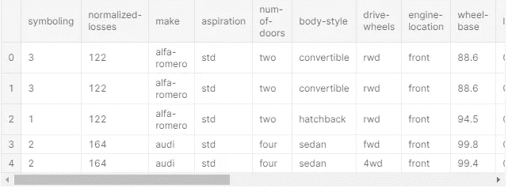
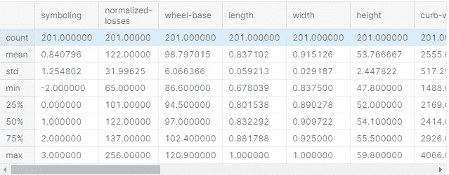
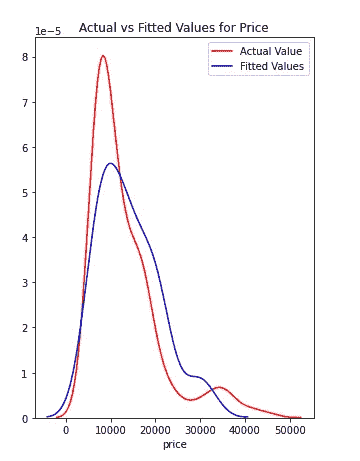
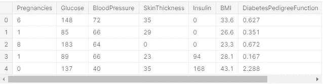
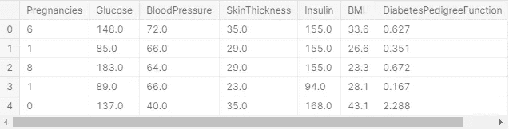
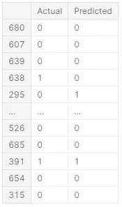

# SVM(支持向量机)用于分类

> 原文：<https://towardsdatascience.com/svm-support-vector-machine-for-classification-710a009f6873?source=collection_archive---------7----------------------->

## SVM 用于分类和回归

SVM:支持向量机是一种监督分类算法，我们在两个不同的类别之间画一条线来区分它们。SVM 也被称为支持向量网络。

考虑一个例子，我们有猫和狗在一起。



狗和猫(作者图片)

我们希望我们的模型能够区分猫和狗。



SVM 术语(图片来自作者)

在许多情况下，区分并不像上面显示的那样简单。在这种情况下，超平面维数需要从 1 维变为第 n 维。这叫内核。更简单地说，这是两个观测值之间的函数关系。这将为数据增加更多的维度，因此我们可以很容易地区分它们。

我们有三种类型的内核。

1.  线性核
2.  多项式核
3.  径向基函数核

在实际生活中，很难得到一个直的超平面。考虑下图中混合在一起的点。您不能使用直线 2d 超平面来分离这些点。



作者图片

SVM 的一些使用案例:

1.  人脸检测
2.  笔迹检测
3.  图像分类
4.  文本和超文本分类

让我们看看 SVM 是如何进行回归的。

```
import pandas as pd
import numpy as np
import matplotlib.pyplot as plt
%matplotlib inline
path = 'https://s3-api.us-geo.objectstorage.softlayer.net/cf-courses-data/CognitiveClass/DA0101EN/automobileEDA.csv'
df = pd.read_csv(path)
df.head()
```



作者图片

df.head()将给出每一列的前 5 行的详细信息。我们可以使用 df.tail()获得最后 5 行，类似地，使用 df.head(10)获得前 10 行。

这些数据是关于汽车的，我们需要使用上面的数据来预测汽车的价格

我们将使用决策树来获得汽车的价格。

```
df.dtypessymboling              int64
normalized-losses      int64
make                  object
aspiration            object
num-of-doors          object
body-style            object
drive-wheels          object
engine-location       object
wheel-base           float64
length               float64
width                float64
height               float64
curb-weight            int64
engine-type           object
num-of-cylinders      object
engine-size            int64
fuel-system           object
bore                 float64
stroke               float64
compression-ratio    float64
horsepower           float64
peak-rpm             float64
city-mpg               int64
highway-mpg            int64
price                float64
city-L/100km         float64
horsepower-binned     object
diesel                 int64
gas                    int64
dtype: object
```

dtypes 给出列的数据类型

```
df.describe()
```



作者图片

在上面的数据框中，一些列不是数字。因此，我们将只考虑那些数值为数字的列，并使所有的数字都浮动。

```
df.dtypes
for x **in** df:
    if df[x].dtypes == "int64":
        df[x] = df[x].astype(float)
        print (df[x].dtypes)
```

出局:

```
float64
float64
float64
float64
float64
float64
float64
float64
```

准备数据与分类任务一样，在本节中，我们将把数据划分为属性和标签，从而划分为训练集和测试集。我们将创建 2 个数据集，一个用于价格，另一个用于(df-price)。由于我们的数据框包含各种对象格式的数据，因此在本次分析中，我们将删除所有对象类型的列，对于所有 NaN 值，我们将删除该行。

```
df = df.select_dtypes(exclude=['object'])
df=df.fillna(df.mean())
X = df.drop('price',axis=1)
y = df['price']
```

这里，X 变量包含数据集中的所有列，除了标签“价格”列。y 变量包含“价格”列中的值，这意味着 X 变量包含属性集，y 变量包含相应的标签。

```
from sklearn.model_selection import train_test_split
X_train, X_test, y_train, y_test = train_test_split(X, y, test_size=0.2, random_state=0)
```

训练 SVM

```
from sklearn.svm import SVR
```

我们将使用函数 SVM 创建一个对象 svr。我们将使用内核作为线性。

```
svr = SVR(kernel = 'linear',C = 1000)
```

为了高效工作，我们将对数据进行标准化。SVM 的工作地点相距很远，所以我们所有的数据都必须采用相同的标准。

```
from sklearn.preprocessing import StandardScalerX_train_std = sc.transform(X_train)
X_test_std = sc.transform(X_test)
X_test_std
sc= StandardScaler().fit(X_train)
```

出局:

```
array([[ 0.17453157, -0.7473421 , -0.70428107, -1.4995245 , -1.05619832,
        -0.67877552, -1.30249126, -0.87278899, -1.15396095, -0.47648372,
        -0.09140157, -0.90774727,  0.59090608,  2.00340082,  1.79022864,
        -1.50033307, -0.29738086,  0.29738086],
       [-1.42118568, -1.74885637,  0.63398001,  0.14076744,  0.30739662,
         0.50614488, -0.1142863 , -0.38613195, -0.24348674,  0.32881569,
         3.4734668 , -0.82496629, -1.30634872,  0.73955013,  0.31375141,
        -0.82735207,  3.36269123, -3.36269123],
       [-0.62332705, -0.01896807,  2.63290164,  2.08080815,  1.2007864 ,
         2.05879919,  1.74841125,  0.63584784,  1.38777956,  0.89923611,
         3.05894722, -0.2179058 , -2.04417004, -0.05035655, -0.86743037,
        -0.18802012,  3.36269123, -3.36269123],
       [-0.62332705,  0.16312543,  0.29517974,  0.64867509,  0.30739662,
         0.58786352,  1.09156527,  1.34150055,  0.36349607,  0.06038255,
        -0.2572094 ,  1.35493275,  0.16929391, -1.31420724, -1.31037354,
         1.61715245, -0.29738086,  0.29738086],
       [-1.42118568, -0.01896807,  0.9897203 ,  1.15658275,  0.30739662,
         0.17927028,  1.20136639,  0.85484351, -0.24348674,  0.32881569,
        -0.20194012,  1.46530738,  0.16929391, -0.99824457, -1.0150781 ,
         1.02334568, -0.29738086,  0.29738086],
       [ 0.9723902 , -0.86873777, -0.22996069, -0.18396041, -0.16280853,
         0.83301947, -0.51623682, -0.4104648 , -0.54697814,  0.4965864 ,
        -0.2572094 , -0.49384238,  0.27469695,  0.26560612,  0.46139913,
        -0.47216765, -0.29738086,  0.29738086],
       [ 0.9723902 , -0.01896807,  0.19353966,  0.28231547,  0.21335559,
        -0.22932296, -0.06134647,  0.24652221, -0.54697814,  0.4965864 ,
        -0.39538259,  0.19599908,  0.80171217, -0.99824457, -0.86743037,
         1.02334568, -0.29738086,  0.29738086],
       [ 0.17453157, -1.08118019, -0.50100091, -1.26638656, -1.05619832,
         0.34270758, -1.08484976, -0.82412328, -1.07808809, -0.74491686,
        -0.2572094 , -1.12849654, -0.67393045,  1.52945681,  1.19963775,
        -1.28401775, -0.29738086,  0.29738086],
       [-0.62332705,  1.98406049,  0.43069985,  0.2406837 , -0.49195214,
         0.26098893,  0.44452297,  0.92784206, -0.09174103, -0.20805059,
        -0.2572094 ,  0.49952933, -1.83336395, -0.6822819 , -0.4244872 ,
         0.54264497, -0.29738086,  0.29738086],
       [-0.62332705, -0.95978452, -0.50100091, -0.63358358, -0.6800342 ,
        -0.27018228, -0.89661927, -0.67812617, -0.54697814, -0.74491686,
        -0.2572094 , -0.90774727, -0.67393045,  0.73955013,  0.9043423 ,
        -0.82735207, -0.29738086,  0.29738086],
       [-0.62332705, -0.2314105 ,  0.02413952,  0.32394725,  0.30739662,
         0.75130082, -0.22212668, -0.09413772,  0.21175037,  0.46303226,
        -0.36774795, -0.52143604, -0.67393045,  0.10762479,  0.16610369,
        -0.33555826, -0.29738086,  0.29738086],
       [ 1.77024883, -0.01896807, -1.55128176, -0.41709835, -0.39791111,
        -0.84221282,  0.51314867,  1.65782762,  1.53952526, -1.18112071,
        -0.11903621,  2.87258398,  1.64493653, -1.31420724, -0.86743037,
         1.61715245, -0.29738086,  0.29738086],
       [ 0.9723902 , -0.86873777, -0.22996069, -0.18396041, -0.16280853,
         0.83301947, -0.5378049 , -0.70245902, -1.2298338 ,  0.4965864 ,
         3.61163999, -1.40443312, -0.67393045,  1.84541948,  2.23317181,
        -1.43212554,  3.36269123, -3.36269123],
       [-0.62332705, -0.95978452, -0.50100091, -0.63358358, -0.6800342 ,
        -0.27018228, -0.51623682, -0.38613195, -0.24348674,  0.32881569,
         3.4734668 , -1.29405849, -1.30634872,  1.37147547,  0.75669458,
        -1.20342969,  3.36269123, -3.36269123],
       [ 1.77024883, -0.01896807, -0.46712088, -0.05906508,  0.21335559,
        -1.41424335,  0.75039751,  0.73317925,  0.97047888,  2.04007695,
        -0.80990217,  1.16177714, -0.25231827, -0.99824457, -1.0150781 ,
         1.02334568, -0.29738086,  0.29738086],
       [ 0.17453157, -0.01896807,  1.20994048,  1.56457414,  2.61140185,
         0.83301947,  0.81510174,  0.24652221, -0.54697814,  0.4965864 ,
        -0.39538259,  0.19599908,  0.80171217, -0.99824457, -0.86743037,
         1.02334568, -0.29738086,  0.29738086],
       [ 0.17453157, -0.65629534, -0.83980118, -1.99077944, -0.86811626,
        -0.43361958, -1.14171105, -0.82412328, -1.60919805,  0.53014054,
        -0.20194012, -0.74218531,  1.85574262,  0.73955013,  0.46139913,
        -0.82735207, -0.29738086,  0.29738086],
       [ 1.77024883,  0.83080162,  0.07495956,  1.05666649,  0.30739662,
         0.99645676,  0.33080038, -0.11847057, -3.01284579, -3.96611452,
        -0.17430548,  0.19599908,  0.27469695, -0.6822819 , -0.4244872 ,
         0.54264497, -0.29738086,  0.29738086],
       [-0.62332705, -0.50455075, -0.3654808 , -0.53366732, -0.30387008,
        -0.14760431, -0.48878654, -0.38613195, -0.69872384,  1.10056096,
        -0.2572094 , -0.46624873,  1.43413044,  0.26560612,  0.31375141,
        -0.47216765, -0.29738086,  0.29738086],
       [ 0.9723902 ,  1.16463971, -0.83980118, -1.38295553, -0.6800342 ,
        -1.16908741, -1.16523986, -0.82412328, -1.3815795 , -0.07383402,
        -0.14667084, -0.96293458,  0.80171217,  0.89753147,  1.05199003,
        -0.93047013, -0.29738086,  0.29738086],
       [ 0.9723902 , -0.86873777, -0.22996069, -0.18396041, -0.16280853,
         0.83301947, -0.42996451, -0.70245902, -1.2298338 ,  0.4965864 ,
         3.61163999, -0.96293458, -1.30634872,  1.84541948,  1.64258092,
        -1.43212554,  3.36269123, -3.36269123],
       [-0.62332705, -1.14187802, -0.29772074, -0.02575966, -0.20982905,
         0.50614488,  0.21903853, -0.43479765,  1.08428815, -2.05352841,
        -0.6164597 ,  0.22359274, -0.67393045, -0.36631922, -1.16272582,
         0.14554438, -0.29738086,  0.29738086],
       [-0.62332705, -0.01896807,  2.42962147,  2.13909264,  1.76503258,
        -0.35190093,  2.99543824,  3.21513015,  1.12222458,  3.08025536,
        -0.50592114,  2.01718056, -0.7793335 , -1.63016991, -1.75331671,
         2.36930768, -0.29738086,  0.29738086],
       [ 0.17453157,  1.37708213, -0.70428107, -0.43375106, -0.86811626,
        -0.43361958, -0.72407465, -0.67812617, -0.54697814, -0.74491686,
        -0.2572094 , -0.90774727, -0.67393045,  0.58156879,  0.46139913,
        -0.71712242, -0.29738086,  0.29738086],
       [-0.62332705, -0.01896807,  0.02413952,  0.32394725,  0.30739662,
         0.75130082, -0.18683347, -0.09413772,  0.21175037,  0.46303226,
         3.52873607, -1.07330922, -0.99013959,  1.68743815,  1.64258092,
        -1.3601287 ,  3.36269123, -3.36269123],
       [ 1.77024883, -0.01896807, -1.55128176, -0.41709835, -0.39791111,
        -0.84221282,  0.42687636,  1.65782762,  1.53952526, -1.18112071,
        -0.11903621,  2.87258398,  1.64493653, -1.31420724, -0.86743037,
         1.61715245, -0.29738086,  0.29738086],
       [ 0.9723902 , -0.01896807, -0.22996069, -0.18396041, -0.16280853,
         0.83301947, -0.64564528, -0.4104648 , -0.54697814,  0.4965864 ,
        -0.2572094 , -0.49384238,  0.27469695,  0.26560612,  0.46139913,
        -0.47216765, -0.29738086,  0.29738086],
       [ 1.77024883, -0.01896807, -0.70428107, -1.21642843, -0.77407523,
         0.79216014, -0.55741224, -0.4104648 , -0.54697814,  0.4965864 ,
        -0.39538259, -0.35587409,  0.80171217, -0.20833789, -0.27683948,
        -0.02818713, -0.29738086,  0.29738086],
       [ 1.77024883,  1.92336265, -0.70428107, -0.41709835,  1.15376589,
        -1.41424335,  0.47001251,  0.61151499,  2.29825376, -0.47648372,
        -0.11903621,  1.10658982,  0.80171217, -0.99824457, -0.57213493,
         1.02334568, -0.29738086,  0.29738086],
       [-0.62332705,  0.67905703,  2.42962147,  2.13909264,  1.76503258,
        -0.35190093,  2.99543824,  3.21513015,  1.12222458,  3.08025536,
        -0.50592114,  2.01718056, -0.7793335 , -1.63016991, -1.75331671,
         2.36930768, -0.29738086,  0.29738086],
       [-0.62332705, -0.01896807,  1.92142106,  1.92260741,  2.37629928,
         1.07817541,  1.89546632,  2.0228204 ,  1.08428815,  0.46303226,
        -0.53355578,  2.18274251,  0.59090608, -1.63016991, -1.60566899,
         2.36930768, -0.29738086,  0.29738086],
       [ 1.77024883,  0.83080162, -0.56876096, -0.40877199, -0.0687675 ,
        -1.6593993 , -0.07507161, -1.11611751, -0.01681188,  0.01643855,
        -0.14667084,  0.88584055,  1.85574262, -1.47218858, -1.16272582,
         1.96972521, -0.29738086,  0.29738086],
       [-0.62332705, -1.26327369, -0.50100091, -0.35048751, -1.05619832,
         2.22223648, -0.48682581, -0.82412328, -1.07808809, -0.74491686,
        -0.2572094 , -1.12849654, -0.67393045,  0.26560612,  0.16610369,
        -0.47216765, -0.29738086,  0.29738086],
       [-0.62332705, -0.01896807,  2.63290164,  2.08080815,  1.2007864 ,
         2.05879919,  1.85625163,  0.63584784,  1.38777956,  0.89923611,
         3.05894722, -0.2179058 , -2.04417004, -0.05035655, -0.86743037,
        -0.18802012,  3.36269123, -3.36269123],
       [ 0.17453157, -0.14036374, -0.83980118, -1.38295553, -0.96215729,
        -1.16908741, -0.80446476, -0.67812617, -1.15396095,  0.46303226,
        -0.64409434, -0.02475019,  0.80171217, -0.20833789, -0.12919176,
        -0.02818713, -0.29738086,  0.29738086],
       [-0.62332705, -0.01896807,  0.29517974,  0.76524406,  0.49547868,
         0.58786352,  0.04845465, -0.4104648 , -0.54697814,  0.4965864 ,
        -0.2572094 , -0.41106141,  0.80171217, -0.05035655,  0.01845597,
        -0.18802012, -0.29738086,  0.29738086],
       [ 0.9723902 , -0.56524859,  0.07495956,  1.05666649,  0.30739662,
         0.99645676,  0.30727157, -0.11847057,  0.78079675, -0.61070029,
        -0.17430548,  0.19599908,  0.27469695, -0.6822819 , -0.4244872 ,
         0.54264497, -0.29738086,  0.29738086],
       [ 0.9723902 ,  1.25568646,  0.1257796 ,  0.22403099,  0.2603761 ,
         0.26098893,  0.56020629,  0.24652221, -0.54697814,  0.4965864 ,
        -0.53355578,  0.33396738,  0.80171217, -1.1562259 , -1.31037354,
         1.30375443, -0.29738086,  0.29738086],
       [ 0.17453157,  0.07207868, -0.39936082, -0.12567592, -0.20982905,
        -0.84221282, -0.26134137, -0.09413772,  0.06000467,  0.69791126,
        -0.39538259, -0.41106141, -0.25231827, -0.05035655,  0.16610369,
        -0.18802012, -0.29738086,  0.29738086],
       [-0.62332705, -0.01896807,  2.63290164,  2.08080815,  1.2007864 ,
         2.05879919,  1.3562644 , -0.14280343,  0.47730535, -0.20805059,
        -0.42301723, -0.16271848, -0.25231827, -0.99824457, -1.0150781 ,
         1.02334568, -0.29738086,  0.29738086],
       [ 0.9723902 , -1.20257586, -0.83980118, -1.41626095, -1.15023935,
         0.01583299, -0.95740203, -0.70245902,  1.08428815, -2.99304439,
        -0.2572094 , -0.93534092, -0.46312436,  0.89753147,  0.75669458,
        -0.93047013, -0.29738086,  0.29738086]])
```

我们的数据已经标准化了。

```
svr.fit(X_train_std,y_train)
y_test_pred = svr.predict(X_test_std)
y_train_pred = svr.predict(X_train_std)
```

检查我们的预测值

```
y_test_pred
```

出局:

```
array([ 5957.14966842, 14468.92070095, 20448.68298715, 21478.92571603,
       20124.68107731,  9079.70352739, 15827.33391626,  6005.66841863,
       16069.42347072,  7254.92359917,  9776.48212662, 20670.10877046,
       12433.67581456, 11143.00652033, 13539.9142024 , 19226.71716277,
        6548.30452181, 20166.24495046,  8818.8454487 ,  6470.62142339,
       12170.16325257, 10461.81392719, 30525.17977575,  6766.09198268,
       13432.63305394, 20616.74081099,  8883.9869784 ,  8581.12259715,
       14982.54291298, 30430.16956057, 28911.77849742, 13980.97058004,
        7824.82285653, 20515.39293649,  8003.99866007, 11357.89548277,
       13718.79721617, 16467.89155357,  9304.60919156, 18705.27852977,
        6421.02399024]
```

检查模态性能的时间到了。

```
from sklearn.metrics import r2_score
r2_score(y_train,y_train_pred)
```

出局:

```
0.8510467833352241r2_score(y_test,y_test_pred)
```

出局:

```
0.720783662521954
```

我们对测试数据的 R sqrt 得分是 0.72，对训练数据的 R sqrt 得分是 0.85，这是一个很好的值。

```
import seaborn as sns
plt.figure(figsize=(5, 7)) ax = sns.distplot(y, hist=False, color="r", label="Actual Value")
sns.distplot(y_test_pred, hist=False, color="b", label="Fitted Values" , ax=ax) plt.title('Actual vs Fitted Values for Price') plt.show()
plt.close()
```



实际值与拟合值

以上是实际值和预测值之间的曲线图。

**SVM 进行分类**

在这里，我们将使用我在之前关于 KNN 的故事中使用的糖尿病数据。[https://towards data science . com/KNN-algorithm-what-when-why-how-41405 c 16 c 36 f](/knn-algorithm-what-when-why-how-41405c16c36f)

让我们使用 SVM 进行分类来预测相同的数据集结果。

```
import pandas as pd
import numpy as np
import seaborn as sns
import matplotlib.pyplot as pltdata = pd.read_csv("../input/diabetes.csv")
data.head()
```



数据集的数据。

我们将通过 pd.read.csv 读取 CSV 文件，通过 head()我们可以看到前 5 行。有些因素的值不能为零。例如，人的葡萄糖值不能为 0。同样，人类的血压、皮肤厚度、胰岛素和身体质量指数也不可能为零。

```
non_zero = ['Glucose','BloodPressure','SkinThickness','Insulin','BMI']
for coloumn **in** non_zero:
    data[coloumn] = data[coloumn].replace(0,np.NaN)
    mean = int(data[coloumn].mean(skipna = True))
    data[coloumn] = data[coloumn].replace(np.NaN,mean)
    print(data[coloumn])from sklearn.model_selection import train_test_split
X =data.iloc[:,0:8]
y =data.iloc[:,8]
X_train,X_test,y_train,y_test = train_test_split(X,y,test_size=0.2,random_state=0, stratify=y)
X.head()
```



作者图片

对于数据 X，我们取范围从 0 到 7 的所有行和列。类似地，对于 y，我们取第 8 列的所有行。

我们有在程序开始时导入的 train_test_split，我们将测试大小定义为 0.2，这意味着所有数据中的 20%将被保留，以便在稍后阶段测试数据。

```
from sklearn.preprocessing import StandardScaler
sc_X = StandardScaler()
X_train = sc_X.fit_transform(X_train)
X_test = sc_X.transform(X_test)from sklearn import svm
svm1 = svm.SVC(kernel='linear', C = 0.01)
svm1.fit(X_test,y_test)SVC(C=0.01, kernel='linear')y_train_pred = svm1.predict(X_train)
y_test_pred = svm1.predict(X_test)
y_test_pred
```

出局:

```
array([0, 0, 0, 0, 1, 0, 1, 0, 0, 0, 0, 0, 0, 0, 0, 0, 0, 0, 0, 1, 0, 0,
       1, 0, 0, 0, 1, 0, 0, 0, 0, 0, 1, 0, 1, 0, 1, 0, 0, 0, 0, 0, 1, 0,
       1, 1, 0, 0, 0, 0, 0, 0, 0, 1, 0, 1, 0, 0, 0, 0, 0, 0, 1, 0, 0, 0,
       0, 0, 0, 0, 0, 1, 0, 0, 0, 0, 0, 0, 0, 1, 0, 0, 1, 0, 1, 1, 0, 0,
       1, 0, 0, 0, 0, 1, 1, 0, 1, 1, 0, 0, 1, 0, 0, 0, 0, 0, 0, 1, 0, 0,
       0, 0, 0, 1, 0, 0, 0, 0, 0, 0, 0, 0, 1, 0, 0, 0, 0, 1, 0, 0, 0, 0,
       0, 1, 0, 1, 1, 0, 0, 1, 0, 0, 1, 0, 0, 0, 0, 0, 1, 0, 0, 1, 0, 0])
```

我们有一组数据，但我们需要评估我们的模型，以检查准确性。让我们从混淆矩阵开始

```
from sklearn.metrics import accuracy_score,confusion_matrix
```

让我们检查一下混淆矩阵

```
confusion_matrix(y_test,y_test_pred)
```

出局:

```
array([[92,  8],
       [26, 28]])
```

我们有混淆矩阵，其中对角线 118 和 36 显示正确的值，0，0 显示我们错过的预测。

我们将检查准确度分数

```
accuracy_score(y_test,y_test_pred)
```

出局:

```
0.7792207792207793
```

我们的准确率是 0.78

让我们算出实际值和预测值之间的差异。

```
df=pd.DataFrame({'Actual':y_test, 'Predicted':y_test_pred})
df
```



实际与预测

我们创建了 C 为 0.01 的线性模型。但是如何确保它的最佳价值。一种选择是改为手动。我们可以分配不同的值，然后逐个运行代码。但是这个过程非常漫长和耗时。

我们将使用网格搜索，其中我们将分配不同的 C 值，并且从该值的字典中，我们的模型将告诉用户根据模型哪一个是 C 的最佳值。为此，我们需要导入 GridsearchCV

```
from sklearn.model_selection import GridSearchCVparam = {'C':(0,0.01,0.5,0.1,1,2,5,10,50,100,500,1000)}
```

这里我们为 c 定义了 10 个不同的值。

```
svm1 = svm.SVC(kernel = 'linear')svm.grid = GridSearchCV(svm1,param,n_jobs=1,cv=10,verbose=1,scoring='accuracy')
```

cv 代表交叉验证。verbose 为 1:表示布尔值，将创建消息。

```
svm.grid.fit(X_train,y_train)[Parallel(n_jobs=1)]: Done 120 out of 120 | elapsed:   43.8s finished
```

出局:

```
GridSearchCV(cv=10, estimator=SVC(kernel='linear'), n_jobs=1,
             param_grid={'C': (0, 0.01, 0.5, 0.1, 1, 2, 5, 10, 50, 100, 500,
                               1000)},
             scoring='accuracy', verbose=1)svm.grid.best_params_
```

出局:

```
{'C': 0.1}
```

这将为我们提供模型的最佳 C 值的结果

```
linsvm_clf = svm.grid.best_estimator_accuracy_score(y_test,linsvm_clf.predict(X_test))
```

出局:

```
0.7597402597402597
```

这是我们能从上述 C 值中得到的最佳精度。

以类似的方式，我们可以尝试 Kernel ='poly '。但是对于“rbf ”,我们也需要定义 gaama 值。param = {'C':(0，0.01，0.5，0.1，1，2，5，10，50，100，500，1000)}，' gamma':(0，0.1，0.2，2，10)并且用正常的一个值 C 从 sklearn 导入 svm svm1 = svm。SVC(kernel='rbf '，gamma=0.5，C = 0.01) svm1.fit(X_test，y_test)。

以上代码可在 https://www.kaggle.com/adityakumar529/svm-claasifier 的[查看。](https://www.kaggle.com/adityakumar529/svm-claasifier)

你可以检查我的代码

 [## Aditya Kumar | Kaggle

### Kaggle 是世界上最大的数据科学社区，拥有强大的工具和资源来帮助您实现您的数据…

www.kaggle.com](https://www.kaggle.com/adityakumar529) [](https://github.com/adityakumar529/Coursera_Capstone) [## adityakumar 529/Coursera _ Capstone

### Coursera_Capstone。在 GitHub 上创建一个帐户，为 adityakumar 529/Coursera _ Capstone 开发做贡献。

github.com](https://github.com/adityakumar529/Coursera_Capstone)