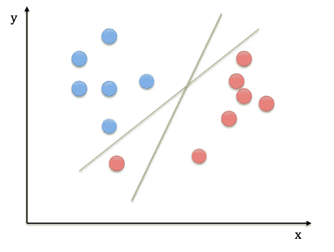
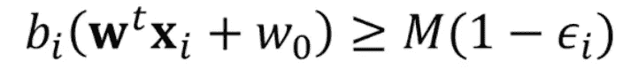
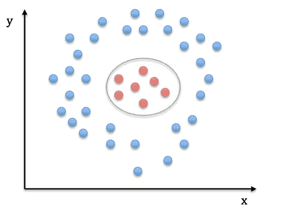
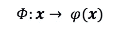

# 支持向量机——万金油？

> 原文：<https://towardsdatascience.com/svms-jack-of-all-trades-fd6fe3b49580?source=collection_archive---------45----------------------->

## 线性和非线性数据集的 SVM 解释

以下解释假设您对监督机器学习以及线性判别函数有基本的了解。

然而，如果你和我一样，拥有金鱼般的记忆力，让我们提醒自己以下几点:

[**监督机器学习**](https://en.wikipedia.org/wiki/Supervised_learning) 需要创建一种算法，该算法能够基于示例输入-输出对将输入映射到输出。换句话说，输入神经网络的数据已经预先分类，实际上是在“监督”这个过程。

在监督机器学习中，对我们的输入数据进行分类的一种原始而有效的方法是线性分类器，如 [**线性判别函数**](http://vision.psych.umn.edu/users/schrater/schrater_lab/courses/PattRecog09/Lec7PattRec09.pdf) 。这些函数通过超平面决策表面有效地划分了我们的特征空间，该超平面决策表面有助于对存在于两侧的数据进行分类。

*听着耳熟？让我们开始吧！*

# 支持向量机(SVM)

## **简介**

作为线性判别函数的子集，SVM 也用 N 维超平面对每个预定义类别的标记训练数据进行分类。n 是所考虑的属性的数量。

让我们考虑下面的红蓝圈数据集。在这种情况下，只有两个属性，x 和 y，导致超平面成为二维线。

多种可能的超平面方向

从图中可以清楚地看出，对于分隔两个类别的绿色超平面，存在多个可能的方向，这影响了模型的方差和偏差。

因此，SVM 试图解决这样一个问题:哪一个超平面是最优选择？

# 边缘和支持向量

为此，边缘被定义为超平面表面和数据集中最近点之间的距离，称为**支持向量**。事实上，根据所选的支持向量，边距的宽度和方向可能会有所不同。因此，相应地选择它们以最大化分类的裕度。

位于边缘两侧的数据点被归类为属于相应的数据集。

# 边距选择

线性判别函数的基本形式如下，

其中 **w** 是与数据点 x 相关联的权重向量，w0 是偏差或阈值权重。

在超平面 g(x) = 0 上，然后根据 g(x)>0 还是 g(x) <0, points are classified accordingly. If we plot g(x) for our dataset, we expect the final outcome to look as follows,

Now, let us define the vector b, which consists of -1s and 1s depending on which side of the hyperplane each data point x, is situated.

If we multiply g(x) with b(x), we expect all the data points to be translated on the right-hand side of the previous diagram, as all g(x)<0 points will be multiplied by -1.

As a result, the distance M, between g(x) =0 and the leftmost data point is defined as the margin.

However, if a support vector happens to be an outlier, an erroneous point in the dataset, it can result in poor classification as it skews the hyperplane.

As evident from the diagram, the rightmost red data point skews the hyperplane as it overfits to compensate for the anomaly. In fact, the optimum hyperplane remains the one positioned at a steeper gradient located equally between the two datasets.

*如果有一种方法可以使 SVM 对支持向量不那么敏感，从而得到一个更一般化的结果呢？*

# **软边缘分类器**

我们可以定义一个软度值 C，它定义了数据点可以超过边界准则的程度，从而错误的支持向量不会危及我们的模型的准确性。C 的值可以从交叉验证技术中选择。

如果 C 的值太大，我们允许许多点超出确定的边界。然而，如果 C 的值太小，我们就定义了一个硬边界，并冒着过度拟合数据的风险。

随后，可以用新定义的与软度 C 相关的参数ε来更新余量最大化方程，如下所示，

*   如果ε = 0
    ，则数据点位于页边距的正确一侧
*   如果ε > 0
    ，数据点位于页边距的错误一侧
*   如果ε>1
    数据点位于超平面的错误一侧

# **非线性映射**

在某些情况下，不可能线性分离数据集，相反，非线性映射能够将数据集分类到更准确的程度。常见的例子包括 XOR 数据集或循环数据集。

循环数据集

因此，需要非线性映射，将数据集放入可以确定合适分离超平面的高阶空间。该映射由变换函数φ执行，并且线性支持向量点积现在可以用φ(x)重新表示。

也许一个例子会使这更直观，

考虑上面的循环数据集。有可能用下面的变换函数将数据点从不可分的二维空间映射到可分的三维空间，

利用前述的φ(x ),判别函数更新如下，

此外，可以[示出](https://www.youtube.com/watch?v=JiM_LXpAtLc)的是， **w** 总是 x(或φ(x ),如果在变换空间中操作的话)的线性组合，

结果，为了确定 SVM 判定边界，需要确定以下更高维度的点积[1]，

尽管解决了问题，但是这种方法具有更高数量的计算操作。有 3×2 个操作来转换到 3 维空间，另外还有 3 个操作来执行点积。另外，计算复杂度为 O(n)。

# 核

为了简化过程，降低计算复杂度和成本，存在被称为**内核**的函数。

> 内核将线性不可分的数据转换为线性可分的数据，而无需将数据转换到更高维的空间并计算点积。

因此，可以使用如下内核来解决前面的示例，

与前面的方法相比，核方法使用 2 次计算操作，计算复杂度为 O(n)。

以下是线性内核的示例，其他常见内核包括:

***多项式内核***

其中 c 和 d 表示多项式次数，由用户定义，以优化分类。

线性分类器有 c=0 和 d=1。

**径向内核**

其中 d 是多项式次数，γ定义所选支持向量的接近度。高伽玛值选择最近的支持向量，而低伽玛值选择更远的支持向量。

更多内核类型可以在[这里](https://data-flair.training/blogs/svm-kernel-functions/)找到。

# 结论

# 参考

[1] [内核和内核技巧:讲座(犹他大学)](https://svivek.com/teaching/lectures/slides/svm/kernels.pdf)