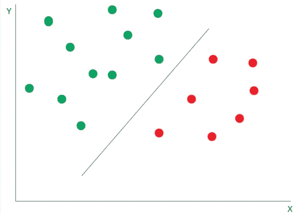

# 不平衡类:用支持向量机预测酒店取消

> 原文：<https://towardsdatascience.com/svms-random-forests-and-unbalanced-datasets-predicting-hotel-cancellations-2b983c2c5731?source=collection_archive---------17----------------------->

## 当试图构建分类算法时，人们必须经常应对不平衡数据集的问题。

**不平衡数据集**是指类别之间的样本大小不相等，这会导致分类器的预测出现重大偏差。


来源:照片由 [Antranias](https://pixabay.com/users/antranias-50356/) 从 [Pixabay](https://pixabay.com/photos/see-saw-swing-swing-device-rock-240650/) 拍摄。

在这个特定的例子中(可从下面的参考资料部分获得)，支持向量机(SVM)分类模型用于根据取消风险对酒店预订客户进行分类，即如果模型预测客户将取消预订，则为 **1** ，如果客户将坚持预订，则为 **0** 。

H1 数据集用于训练和验证模型，而来自结果模型的预测则使用 H2 数据进行测试。

在这个特定的数据集中，非抵消类(0)的样本大小明显大于抵消类(1)。在前面的例子中，这是通过删除大量的 **0** 条目来处理的，以便在两个类之间具有相等的样本大小。但是，这不一定是最佳方法，因为在此过程中会丢弃许多数据点。

相反，SVM 模型可以被修改，以惩罚对小类的错误预测。让我们看看这是如何影响分析的。

使用树外分类器和向前向后特征选择方法进行分析时，所识别的特征如下:

*   研制周期
*   原产国
*   细分市场
*   存款类型
*   客户类型
*   所需的停车位
*   到达日期:年
*   抵达日期:月
*   到达日期:周数
*   到达日期:当月的某一天

# 什么是 SVM？

SVM 是一种监督学习模型，可用于分类和回归任务。

当定义两个类之间的决策限制时，SVM 模型提供了对每个训练点的重要性的评估。



来源:图片由作者创建

位于两个类别之间的决策边界上的少数训练点被称为支持向量。

# 精确度与召回率和 f1 分数

当比较准确度分数时，我们看到在每个混淆矩阵中都提供了大量的读数。

然而，在**精度**和**召回**之间存在一个特别重要的区别。

```
Precision = ((True Positive)/(True Positive + False Positive))Recall = ((True Positive)/(True Positive + False Negative))
```

这两个读数经常相互矛盾，也就是说，通常不可能在不降低召回率的情况下提高精确度，反之亦然。

对理想指标的评估很大程度上取决于所分析的具体数据。例如，癌症检测筛查出现假阴性(即表明患者没有患癌症，而事实上他们患有癌症)是一大禁忌。在这种情况下，召回是理想的衡量标准。

然而，对于电子邮件，人们可能更喜欢避免误报，例如，将一封重要的电子邮件发送到垃圾邮件文件夹，而实际上它是合法的。

f1 分数在设计一个更通用的分数时考虑了精确度和召回率。

哪个因素对预测酒店取消更重要？

从酒店的角度来看，他们可能希望更准确地识别出最终会取消预订的客户，这使得酒店能够更好地分配房间和资源。确定不打算取消预订的客户不一定会增加酒店分析的价值，因为酒店知道，无论如何，很大一部分客户最终都会坚持预订。

# SVM 和不平衡数据集

上面概述的相关特征包括在内，用于确定客户是否将取消他们的预订。

```
y1 = y
x1 = np.column_stack((leadtime,countrycat,marketsegmentcat,deposittypecat,customertypecat,rcps,arrivaldateyear,arrivaldatemonthcat,arrivaldateweekno,arrivaldatedayofmonth))
x1 = sm.add_constant(x1, prepend=True)
```

然后，数据被分为训练数据和验证数据:

```
x1_train, x1_val, y1_train, y1_val = train_test_split(x1, y1, random_state=0)
```

可以将“平衡的”类别权重添加到 SVM 配置中，这对于次要类别(在这种情况下，取消类别)上的错误分类增加了更大的惩罚。

```
from sklearn import svm
clf = svm.SVC(gamma='scale', 
            class_weight='balanced')
clf.fit(x1_train, y1_train)  
prclf = clf.predict(x1_val)
prclf
```

以下是该模型在验证集上的分类性能:

```
[[5142 2124]
 [ 865 1884]]
              precision    recall  f1-score   support 0       0.86      0.71      0.77      7266
           1       0.47      0.69      0.56      2749 accuracy                           0.70     10015
   macro avg       0.66      0.70      0.67     10015
weighted avg       0.75      0.70      0.72     10015
```

第一类的回忆率为 69%，而 f1 分数的准确率为 70%。现在，让我们在 H2(测试集)上测试预测性能。

```
[[25217 21011]
 [ 8436 24666]]
              precision    recall  f1-score   support 0       0.75      0.55      0.63     46228
           1       0.54      0.75      0.63     33102 accuracy                           0.63     79330
   macro avg       0.64      0.65      0.63     79330
weighted avg       0.66      0.63      0.63     79330
```

我们看到，1 类的召回率现在达到了 75%，而 f1 分数的准确率达到了 63%。值得注意的是，我们可以看到测试集上的 f1 分数较低，但召回率现在高于验证集。

在这方面，如果假设在这种情况下假阳性比假阴性更可容忍，那么人们可以认为该模型在此基础上表现得相当好。

# 结论

在这个例子中，我们看到了如何使用支持向量机来处理不平衡的数据集，以及如何解释混淆矩阵以提高分类的准确性。

您可以在这里找到原始文章[，以及本例中所示的数据集和笔记本的相关存储库的链接。](https://www.michael-grogan.com/articles/hotel-cancellations-svm)

*免责声明:本文是在“原样”的基础上编写的，没有担保。本文旨在提供数据科学概念的概述，不应以任何方式解释为专业建议。*

# 参考

*   [安东尼奥、阿尔梅迪亚和努内斯(2019)。酒店预订需求数据集](https://www.sciencedirect.com/science/article/pii/S2352340918315191)
*   [精英数据科学:如何处理机器学习中的不平衡类](https://elitedatascience.com/imbalanced-classes)