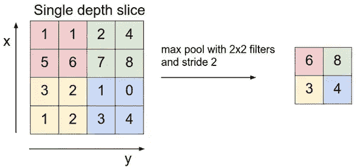
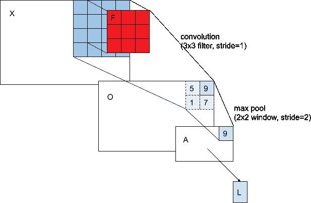
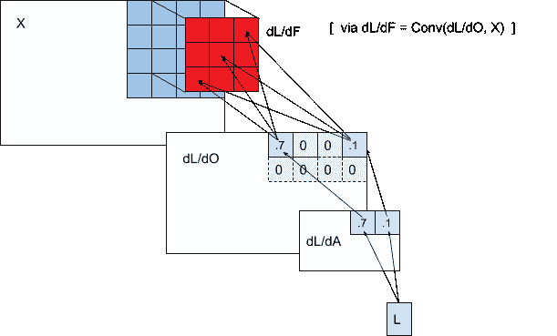
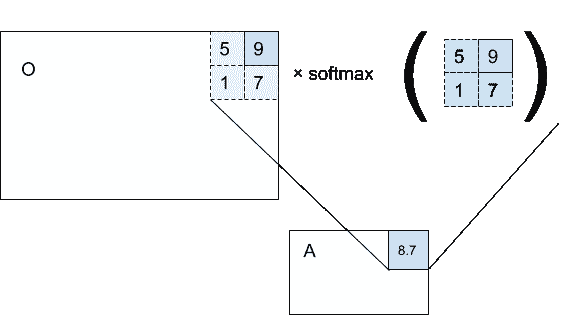
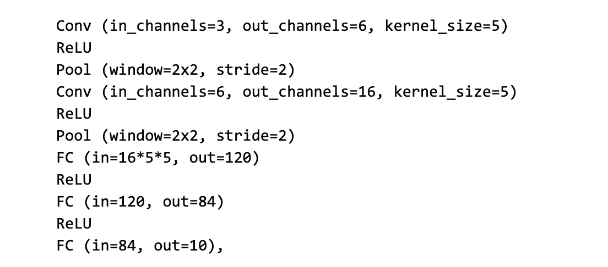
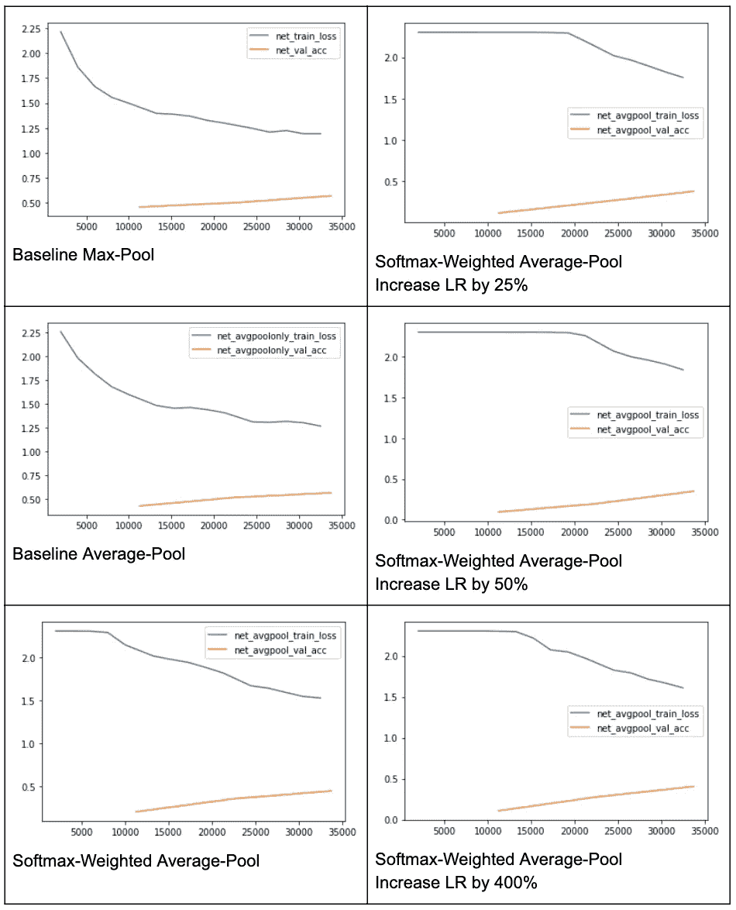

# SWAP:soft max-加权平均池

> 原文：<https://towardsdatascience.com/swap-softmax-weighted-average-pooling-70977a69791b?source=collection_archive---------30----------------------->

## 提高梯度精度的探讨

[*布莱克伊利亚*](http://blakeelias.name) *是新英格兰复杂系统研究所* [*的研究员。*](https://necsi.edu/)[*肖恩·贾恩*](http://github.com/darkmatter08) *是微软研究院* *的一名 AI 常驻者。*

> 我们的方法 softmax-加权平均池(SWAP)应用平均池，但是通过每个窗口的 soft max 对输入重新加权。

我们提出了一种卷积神经网络的池化方法，作为最大池化或平均池化的替代方法。我们的方法 softmax-加权平均池(SWAP)应用平均池，但是通过每个窗口的 soft max 对输入重新加权。虽然向前传递的值与最大池化的值几乎相同，但 SWAP 的向后传递具有这样的属性，即窗口中的所有元素都接收渐变更新，而不仅仅是最大值。我们假设这些更丰富、更精确的梯度可以改善学习动力。在这里，我们实例化这个想法，并在 CIFAR-10 数据集上研究学习行为。我们发现交换既不能让我们提高学习速度，也不能提高模型性能。

# **起源**

在观看来自 DeepMind / UCL 深度学习课程的詹姆斯·马腾斯关于优化的讲座时，我们注意到他的观点，即随着学习的进行，你必须降低学习速率或增加批量以确保收敛。这些技术中的任何一种都会导致对梯度的更精确的估计。这让我们开始思考精确梯度的必要性。另外，我们一直在深入研究反向传播如何为所有类型的层计算梯度。在进行卷积和池化的练习时，我们注意到最大池化仅计算相对于窗口中最大值的梯度。这丢弃了信息——我们如何才能做得更好？通过使用所有的信息，我们能得到一个更精确的梯度估计吗？

> Max-pooling 丢弃了梯度信息——我们如何能做得更好？

# **进一步背景**

最大池通常在视觉任务的 CNN 中用作下采样方法。例如，AlexNet 使用 3x3 Max-Pooling。【[引用](https://papers.nips.cc/paper/4824-imagenet-classification-with-deep-convolutional-neural-networks.pdf)

在视觉应用中，max-pooling 将一个特征图作为输入，并输出一个较小的特征图。如果输入影像为 4x4，则步幅为 2(无重叠)的 2x2 最大池操作符将输出 2x2 要素地图。max-pooling 运算符的 2x2 内核在输入要素地图上有 2x2 个不重叠的“位置”。对于每个位置，选择 2x2 窗口中的最大值作为输出特征图中的值。其他值将被丢弃。

图 1:最大池化的结果。来源:斯坦福 CS231n(通过 [quora](https://www.quora.com/What-is-max-pooling-in-convolutional-neural-networks) )。

隐含的假设是“值越大越好”，即，值越大对最终输出越重要。这种建模决策是由我们的直觉推动的，尽管可能不是绝对正确的。[艾德。:也许其他价值观也很重要！在接近平局的情况下，将梯度传播到第二大值可能会使其成为最大值。这可能会改变模型学习的轨迹。也更新第二大值，可能是更好的学习轨迹。]

你可能会想，这是可微的吗？毕竟，深度学习要求模型中的所有操作都是可微分的，以便计算梯度。在纯数学意义上，这不是一个可微的运算。实际上，在向后传递中，对应于最大值的所有位置简单地复制入站梯度；所有非最大值位置简单地将其梯度设置为零。PyTorch 将其实现为一个定制的 CUDA 内核([这个函数](https://github.com/pytorch/pytorch/blob/0257f5d19f0585f9a82bc06e0c4987e2136332c9/aten/src/THCUNN/generic/SpatialMaxPooling.cu)调用[这个函数](https://github.com/pytorch/pytorch/blob/502aaf39cf4a878f9e4f849e5f409573aa598aa9/aten/src/THNN/generic/SpatialDilatedMaxPooling.c))。

换句话说，最大池生成稀疏梯度。而且很管用！从 AlexNet [ [cite](https://papers.nips.cc/paper/4824-imagenet-classification-with-deep-convolutional-neural-networks.pdf) 到 ResNet [ [cite](https://arxiv.org/pdf/1512.03385.pdf) 再到强化学习[[cite](https://arxiv.org/pdf/1312.5602v1.pdf)cite]，应用广泛。

已经开发了许多变体；Average-Pooling 输出窗口中的平均值，而不是最大值。扩大的最大池使窗口不连续；相反，它使用类似棋盘的图案。

图 2:扩大的最大池。来源: [arXiv](https://arxiv.org/pdf/1603.07285.pdf) (通过 [StackOverflow](https://stackoverflow.com/questions/45809486/why-do-dilated-convolutions-preserve-resolution) )。

有争议的是，Geoff Hinton 不喜欢 Max-Pooling:

> 卷积神经网络中使用的池操作是一个很大的错误，它如此有效的事实是一场灾难。
> 
> 如果池不重叠，池将丢失关于事物位置的有价值的信息。我们需要这些信息来检测物体各部分之间的精确关系。的确，如果这些池有足够的重叠，那么特征的位置将通过“粗略编码”得到精确的保留(参见我在 1986 年关于“分布式表示”的论文中对这种效果的解释)。但是我不再相信粗略编码是表示物体相对于观察者的姿态的最佳方式(我所说的姿态是指位置、方向和比例)。
> 
> 【来源:Reddit 上的 Geoff Hinton。]

# **动机**

> 最大池生成稀疏梯度。有了更好的梯度估计，我们能否通过提高学习速率来迈出更大的步伐，从而更快地收敛？

稀疏渐变丢弃了太多信息。有了更好的梯度估计，我们能否通过提高学习速率来迈出更大的步伐，从而更快地收敛？

虽然由最大池生成的出站梯度是稀疏的，但是该操作通常用于 Conv →最大池操作链中。注意，可训练参数(即滤波器值，*)都在 Conv 算子中。还要注意的是:*

****dL/dF = Conv(X，dL/dO)*** ，其中:*

*   ****dL/dF*** 是相对于卷积滤波器的梯度*
*   ****dL/dO*** 是来自 Max-Pool 的出站梯度，并且*
*   ****X*** 是对 Conv 的输入(正向)。*

*因此，卷积滤波器 ***F*** 中的所有位置都获得梯度。然而，这些梯度是从稀疏矩阵 ***dL/dO*** 而不是密集矩阵计算的。(稀疏程度取决于最大池窗口大小。)*

*向前:*

**

*向后:*

**

*图 3:最大池生成稀疏梯度。(作者图片)*

*还要注意的是， ***dL/dF*** 是*而不是*稀疏，因为 ***dL/dO*** 的每个稀疏条目都将一个渐变值发送回所有*条目****dL/dF***。*

*但这就提出了一个问题。虽然 ***dL/dF*** 本身不是稀疏的*，但是它的条目是基于稀疏输入的平均来计算的。如果它的输入(***dL/dO***—Max-Pool 的出站梯度)是密集的，那么 ***dL/dF*** 会是真实梯度的更好估计吗？我们如何使 ***dL/dO*** 密集，同时仍然保留 Max-Pool 的“值越大越好”假设？**

**一种解决办法是平均分摊。在那里，*所有的*激活都向后传递一个梯度，而不仅仅是每个窗口中的最大值。但是，它违反了 MaxPool 的假设“值越大越好”。**

**输入 soft max-加权平均池(SWAP)。正向传递最好解释为伪代码:**

> *****average_pool(O，weights = soft max _ per _ window(O))*****

****

**图 4: SWAP 产生一个与 max-pooling 几乎相同的值——但是将渐变传递回窗口中的所有条目。(作者图片)**

**softmax 运算符将值归一化为概率分布，但是，它更倾向于大值。这给了它一个类似最大池的效果。**

**在向后传递中， ***dL/dO*** 是密集的，因为*中的每个出站激活都依赖于其窗口中的所有激活—而不仅仅是最大值。 ***O*** 中的非最大值现在接收相对较小但非零的渐变。答对了！***

# ****实验设置****

**我们在 [CIFAR10](https://www.cs.toronto.edu/~kriz/cifar.html) 上进行实验。我们的代码可在[这里](https://colab.research.google.com/drive/1zUjtUF9nuMH-tHolXemPBturYX10LdxX#scrollTo=r7u9xW7naK9l)获得。我们将网络架构固定为:**

****

**我们测试了“池”层的三种不同变体:两个基线(最大池和平均池)，以及交换。使用 SGD，LR=1e-3 对模型进行 100 个时期的训练(除非另有说明)。**

**我们还训练了 LR 增加{25，50，400}%的 SWAP。这是为了测试这样一个想法，使用更精确的梯度，我们可以采取更大的步骤，而使用更大的步骤，模型会收敛得更快。**

# ****结果****

****

# ****讨论****

**与两个基准相比，SWAP 的性能更差。我们不明白为什么会这样。LR 的增加没有带来任何好处；一般来说，随着 LR 的增加，观察到的性能比基线更差。我们将 LR 性能提高 400%比提高 50%归因于随机性；我们只测试了一个随机种子，并且只报道了一个试验。对于 400%的增长表现更好的另一个可能的解释是，用更高的 LR“覆盖更多的地面”的能力。**

> **LR 的增加没有带来任何好处；一般来说，随着 LR 的增加，观察到的性能比基线更差。**

# ****未来工作及结论****

**虽然 SWAP 没有显示出改进，但我们仍然想尝试几个实验:**

*   ****重叠池窗口。**一种可能性是使用重叠的池窗口(即步距= 1)，而不是我们这里使用的不相交窗口(步距= 2)。现代卷积架构，如 [AlexNet](https://papers.nips.cc/paper/4824-imagenet-classification-with-deep-convolutional-neural-networks.pdf) 和 [ResNet](https://arxiv.org/pdf/1512.03385.pdf) 都使用重叠池窗口。因此，为了公平的比较，明智的做法是与更接近艺术水平的东西进行比较，而不是我们在这里为了简单而使用的架构。事实上，Hinton 对最大池的批评在非重叠池窗口的情况下是最严格的，理由是这丢弃了空间信息。**
*   ****激活直方图。**我们希望使用完全相同的初始化来尝试 Max-Pool & SWAP，训练两者，并比较梯度的分布。调查梯度的差异可以更好地理解训练行为中的鲜明对比。**

> **提高梯度精度仍然是一个令人兴奋的领域。我们还能如何修改模型或梯度计算来提高梯度精度？**