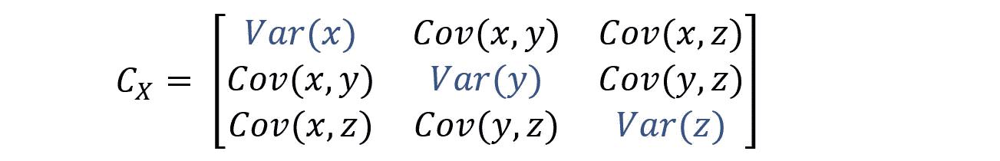
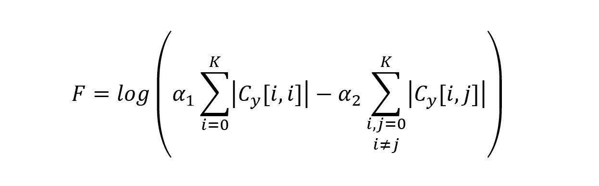
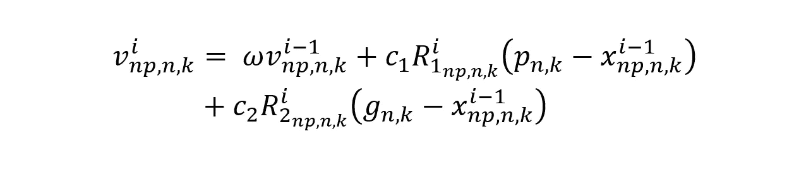
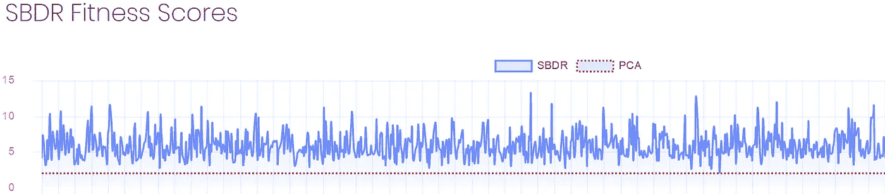
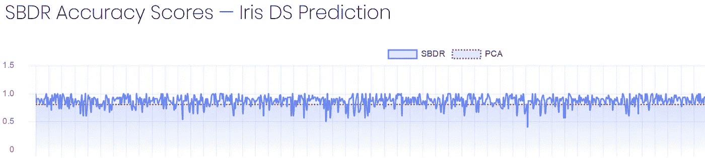

# 群体智能——基于群体的降维

> 原文：<https://towardsdatascience.com/swarm-intelligence-swarm-based-dimensionality-reduction-dfb3cdc55259?source=collection_archive---------24----------------------->

## 利用群体智能优化多元数据

一群椋鸟——由詹姆斯·温斯科特在 Unsplash 上拍摄

A**b**——一种基于群体的降维方法，受群体智能(SI)和主成分分析(PCA)的启发。它使用粒子群优化(PSO)的矢量化实现，以提高计算效率。该模型以标准 PCA 为基准。

## 介绍

这些年来，技术发生了巨大的变化，随着个人和企业越来越能够访问更高的处理和计算能力、更大的内存容量、更智能和更高效的数据存储技术等等，无论是在内部还是在云中，技术访问差距都在逐年缩小。尽管如此，数据量仍呈指数级增长，预计这一趋势在可预见的未来还将继续。因此，降低海量数据集的维度是创建更有效的机器学习模型的最重要的方面之一。

## 降维

目标是产生一个具有较低维度的新数据集，而不丢失其原始特征。与 PCA 一样，我们将使用协方差矩阵来确定方差和协方差。

考虑一个由 *N* 个特征和 *M* 个观察值组成的数据集。可以描述为一系列的 *N* 维向量，表示为一个 *M*N* 矩阵。

其中 *i ∈ {0，…，M}* 和 *j ∈ {0，…，N}* 。X 的协方差矩阵是通过从数据中减去平均值并乘以其转置，然后除以样本数而获得的。这是至关重要的，以便不同尺度的特征被同等地解释。它由下式给出:

如果已经扣除了特征的平均值，协方差矩阵可以写成:

请注意，您可能会遇到略有不同的符号版本 *C_x* ，特别是我们使用行向量来表示数据，而大多数引用将数据表示为列向量，这允许点积元素。尽管如此，使用这两种方法都会得到相同的结果。

我们对协方差矩阵感兴趣的原因是，它描述了数据集内的方差以及元素间的协方差。视觉上，主对角线元素保存方差，而协方差信息跨越非对角线元素。例如，给定一个具有标记为 *{x，y，z}* 的特征的三维数据集，我们得到以下表示:

PCA 的目的是找到一个线性变换，给定 *X* ，生成一个低维数据集 *Y* 。最终，我们会寻找另一个与原始基线性相关的基，它可以更有效地表示数据。这可以表示为:

其中 *P* 是线性变换矩阵。考虑到这一点，主成分分析设定了转换数据的两个主要目标，即:

1.  最大化方差，即所有特征样本的可变性或信号。
2.  最小化协方差，即冗余数据，以进一步压缩数据集。

在实践中，我们需要优化线性变换 *P* ，以便产生的数据集 *Y* 在强调数据信号和抑制噪声或冗余信号方面更有效地表示数据。为此，我们需要最大化主对角元素，最小化对应协方差矩阵 *C_y* 的非对角元素。

现在很清楚，这是一个最大化/最小化问题，非常适合优化算法，其中包括群体智能模型，我们将使用该模型将低维数据集 *Y* 拟合到最佳协方差矩阵 *C_y* 。

## 基于群体的方法

我们将在这里使用与前面描述的相似的符号，稍作修改以适应基于群体和矢量化的计算。我们为低维数据定义了以下符号:

其中 *X* 是一批 *Np* 输入，每个输入的尺寸为 *M*N* ，如前所述。

我们将 *Y* 定义为一批 *Np* 输出，其中每个输出的维数为 M*K，其中 *K∈ R 和 K < N* ，以及 *P* 一批维数为 *N*K* 的 *Np* 变换矩阵。变换矩阵的集合是要被训练并适合解的粒子。

遵循这种模式，并参考 *C_y* 定义，我们得出结论，矢量化协方差矩阵 *C_y* 将具有维度 *Np*K*K* 。

**健身功能**

适应度函数必须反映我们数据集的准确性，尽可能多地保留原始数据特征，并消除冗余或有噪声的数据。我们将提出两种适合度评估的方法，其中一种来自文献，而另一种已被证明在 Iris 数据集上优于它，因此将被使用。

我们可以将适应度定义为信噪比(SNR) [1]:

其中 *σ_signal* 表示方差， *σ_noise* 表示协方差。高 *SNR* (≫ 1)表示高精度数据，而低 SNR 表示受噪声污染的数据。请注意，本文中的适应度是一个真正的正数 *SNR≥0* ，而不是一个百分比或有界数字。为确保信号最大化(方差→+∞)且噪声抵消(协方差→0)，我们将 SNR 定义为:

通过使用上面的 SNR 定义作为我们的适应度函数，该模型将惩罚低方差和高协方差。我们使用对数标度来获得更好的适应性解释能力。

在 Iris 数据集预测上胜过 SNR 度量的另一种方法是通过将适应度函数视为方差和协方差的加权和:

其中 *α_1* 和 *α_2* 是控制各项贡献的加权系数。例如，为了进一步优化惩罚低方差，您可以使用 *α_1=5* 和 *α_2=1* 。

**粒子运动**

一旦评估了适应度，粒子被移动以扫描更好的解决方案，即实现更高适应度分数的解决方案。粒子运动由以下方程控制，该方程将粒子向其个人最佳值 *p* 和全局最佳值 *g* 的方向移动。

其中 *v[i]* 代表第 *np 个* *N*K 个*维质点在 *i* 时段的速度，其中*NP**∈{ 0；Np}* ， *v[i-1]* 前一历元中的速度，*R1*和*R2**Np**N * K*-均匀分布随机数的维矩阵，以及最后 *ω* 控制前一速度对新速度的贡献的加权系数。

上面执行了 *Np* 粒子速度的矢量化计算。之后，我们在知道每个粒子的速度的情况下计算粒子的新值:

一旦粒子被移动，我们可以重新评估适应值，并更新个人最佳值和全局最佳值。这要重复几次，直到满足终止标准。最终的全局最佳解决方案是最佳转换矩阵，在此基础上我们可以检索原始数据集 *X* 的低维表示 *Y* 。

## 绩效基准

我们将通过数据表达能力来评估模型。低维数据集的可表达性将根据加权方差和协方差总和来测量，但也可以根据前面描述的信噪比来测量。

在 Iris 数据集上进行的 1000 次 SBDR 运行的样本测试，每次有 100 个时期和 40 个粒子，获得了 5.87 的平均适应度得分，而标准 PCA 获得了 1.96 的适应度得分。下图显示了 SBDR 的表现，以适应度得分表示，并与标准 PCA 并列显示。

此外，生成的数据集用于在该数据集上训练随机森林模型，并在测试集上进行预测。标准 PCA 实现了 80%的预测准确度，而 SBDR 在 1000 次运行中实现了 86.5%的平均准确度。

## 结束了👋

如果你能走到这一步，谢谢你留下来！

*[1] J. Shlens，2014，《主成分分析教程》*

*[2] J .肯尼迪，r .埃伯哈特，1995，“粒子群优化”*