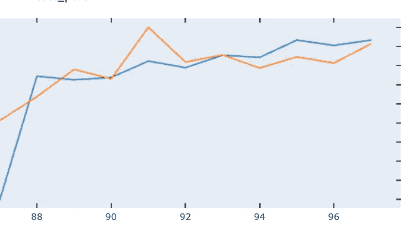
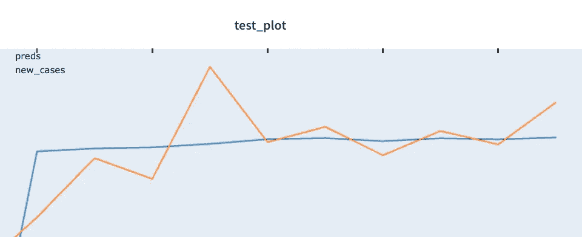

# 迈向更好的冠状病毒预测

> 原文：<https://towardsdatascience.com/sweeping-towards-better-coronavirus-forecasting-cce3b5d9a6f9?source=collection_archive---------55----------------------->

## 利用机器学习的最新进展进行新冠肺炎预报

从 5 月 9 日开始，我们的一个模型在纽约市布朗克斯县的投影图像。实际案例显示为橙色，我们模型的预测显示为蓝色。你可以看到我们的模型准确地预测了总体下降轨迹，但是仍然没有捕捉到所有的日常噪音。

***编者按:*** [*走向数据科学*](http://towardsdatascience.com/) *是一份以数据科学和机器学习研究为主的中型刊物。我们不是健康专家或流行病学家，本文的观点不应被解释为专业建议。想了解更多关于疫情冠状病毒的信息，可以点击* [*这里*](https://www.who.int/emergencies/diseases/novel-coronavirus-2019/situation-reports) *。*

随着新冠肺炎席卷全球，人们(尤其是美国人)急于重返工作岗位，我们现在比以往任何时候都更需要模型来有效预测新冠肺炎的传播。然而，目前许多模型在估计疾病传播和社会距离的整体影响方面表现不佳。在这篇文章中，我将回顾为什么疾病预测模型是有用的，当前模型采用的方法的问题/限制，以及使用深度学习方法的好处和障碍。

## 为什么我们需要更好的预测

在讨论当前新冠肺炎预测模型的问题之前，让我们来看看它们为什么有用:

*   (1)让决策者了解社会距离的影响
*   (2)确定风险最高的具体县/市/镇
*   (3)帮助医院规划人员、床位和设备
*   (4)通知病毒学家和流行病学家研究什么因素

(1)一个好的模型应该有效地告知当选官员和决策者冠状病毒及其对其社区的影响。具体而言，该模型不仅应该提供预测，还应该提供可操作的见解，说明不同的政府政策将如何影响新增病例和死亡人数，以及病毒将如何给医院带来负担。与理想情况相反，该模型还应基于观察值运行。这是一个数据驱动的方法，而不是纯粹的数学方法，有意义的领域。例如，一个将社会距离政策作为输入，然后基于公民遵守该政策假设某种结果的模型，在现实中可能不会表现得很好。相反，模型需要了解政府社交距离政策的因果影响，首先，它们与移动数据的关系，其次，实际的病毒传播。

(2)另一个问题与特定地区的预测有关。虽然在国家层面预测病例和死亡的模型在广泛估计所需的个人防护设备和呼吸机数量方面有一定的效用，但它们没有太多进一步的用途。美国有许多不同的州，每个州都有不同的人口、资源和气候。在某些情况下，即使是州一级的预测也可能过于宽泛。例如，病毒在纽约市的传播方式可能与它在北部各县的传播方式非常不同。同样，病毒在芝加哥的传播方式可能与在卡本代尔的传播方式不同。县或市/镇一级的预报为地方官员提供了最大的价值。这些预测使城市/城镇能够仅根据其风险来计划应对措施。这有可能使更多的领域开放。例如，如果模型预测某个城市/城镇的风险较高，但该州另一边的另一个地区的风险较低，那么关闭后者但允许前者保持开放就没有什么意义了(当然，您也希望确保这些地区之间没有太多的旅行)。

(3)理想情况下，模型还可以预测特定县的入院人数，甚至更好地预测特定城市/城镇每天的入院人数。这将使医院能够规划人员配备、应急响应人员，并以最佳方式获得 PPE。特别是，如果模型提前一两周预测到高峰，那么医院有足够的时间准备应对。此外，预测 ICU 床位利用率对于及时建造野战医院至关重要。

(4)最后，好的模型可以潜在地突出各种促进进一步研究的传输机制。例如，假设说，如果一个模型发现紫外线是传播的一个主要因素，这可能会促进额外的流行病学研究。当然，对于这一点，我们必须非常小心，模型不仅仅是学习噪声。然而，机器学习确实有潜力在寻找包括病毒学在内的各种研究领域的新研究方向方面发挥核心作用。

**当前大多数型号的困难**

Nate Silver 在文章“[为什么做一个好的新冠肺炎模式如此困难”中列举了新冠肺炎建模的许多困难。然而，这些困难中的许多来自于试图构建精确的数学/统计公式来预测新冠肺炎。Silver 讨论了使用无症状率和感染率等变量。这是有问题的，因为在经典 SEIR 模型中，我们必须为这些参数假定某些值。此外，像 IMHE 这样的模型，例如，主要依赖于曲线拟合](https://fivethirtyeight.com/features/why-its-so-freaking-hard-to-make-a-good-covid-19-model/)[。CurveFit 利用各种各样的变量提供给模型。首先，IMHE](https://ihmeuw-msca.github.io/CurveFit/) [利用样条曲线来拟合新冠肺炎曲线](http://www.healthdata.org/covid/updates)，然后依靠一些额外的调整来拟合数据。对于那些不知道的人来说，样条是一个数学多项式公式，用于绘制平滑曲线。这种方法仍然需要大量的手动参数和特征。四月份的一篇 VOX 文章指出了与 [IMHE 模型](https://www.vox.com/future-perfect/2020/5/2/21241261/coronavirus-modeling-us-deaths-ihme-pandemic)相关的许多问题。具体来说，本文讨论了模型的置信区间的变化和更新预测的问题。例如，VOX 指出“该模型假设死亡人数会增加，然后又会下降；“虽然从广义上讲这可能是真的，但在日常层面进行预测时，报告中会有很多噪音和差异。第二，有许多不同的因素可以阻止真实数据有这样的轨迹。模型必须足够稳健，以确定噪声，从而不做一般假设。

其他模型，如日内瓦大学、加州理工学院、麻省理工学院、MOBS 大学、加州大学洛杉矶分校、弗吉尼亚大学和德克萨斯大学，在进行预测时，假设社会距离将继续以目前的形式存在。随着限制的放松，他们的数量可能会因此发生巨大变化。最后，大量模型仅在州和国家层面进行预测。这是深度学习最具潜力的领域，因为它能够学习输入特征之间的许多复杂交互，如季节性、社交距离和地理位置。此外，通过足够的数据扩充技术和迁移学习，该模型应该能够处理分布的变化，如社会距离的结束。然而，正如我们将在下面讨论的那样，使用深度学习来预测新冠肺炎仍然存在许多障碍。

## 我们的方法有何不同

我们的目标是整合深度学习的最新研究，用于时间序列预测，以解决这些问题。尽管许多人对流行病学中的深度学习保持警惕，但使用它有许多优势。例如，与纯统计模型不同，深度学习模型从现有的实际数据中学习。深度学习模型也有可能更好地整合所有复杂的变量，如天气和症状调查。然而，深度学习方法仍然存在许多挑战。使用深度学习最明显的最初挑战围绕着训练数据的缺乏:目前我们仍然只有 110 个时间步骤，对于许多美国县来说。此外，对于大多数县/州，我们有不到 90 个时间步长。另一个问题是时间步骤的不平衡，没有新病例。对于移动性，在疫情开始之前，我们几乎没有数据可以提供给模型。因此，利用迁移学习和数据扩充是取得良好结果的关键。

**在 CoronaWhy 做志愿者并组建跨学科团队**

我们的团队是 CoronaWhy 唯一专注于时间序列预测的团队。CoronaWhy 是一个由 900 多名志愿者组成的全球组织，致力于应用机器学习来更好地了解冠状病毒。大多数其他团队专注于[白宫挑战](https://venturebeat.com/2020/03/16/microsoft-white-house-and-allen-institute-release-coronavirus-data-set-for-medical-and-nlp-researchers/) [和利用 NLP](https://www.coronawhy.org/cord19) 。我们的团队成立于 3 月初，旨在分析与冠状病毒相关的时间数据。从那时起，我们已经吸纳了来自世界各地的 30 多名成员。除了病毒传播预测，我们还有其他计划，如预测医院中的患者预后(不幸的是，由于缺乏 ICU 数据，这一计划受阻)。我们的团队与其他 CoronaWhy 团队密切合作，如 datasets 和 task-geo。

由于我们是一个全球性的志愿者团队，因此很难安排会议，因为我们在世界各地的成员也忙于他们的日常工作。出于这个原因，我们总是记录我们的会议，以便那些无法参加的人可以回放。此外，我们会在一整天的空闲时间积极沟通。虽然分散存在挑战，但也有一些优势。例如，当一些团队成员在睡觉时，其他人可以积极地工作并为项目做出贡献。我们在特雷罗董事会上管理所有问题，并尝试每周计划我们的工作。

对于像 COVID 这样的问题，拥有一个真正的跨学科团队至关重要。这就是为什么从一开始，我们的目标是搭载领域专家。到目前为止，我们有一位流行病学家和一位生物信息学家定期为这个项目做出贡献。拥有领域专家让我们能够以只有机器学习成员的团队无法做到的方式专注于我们的研究。例如，这些专家可以帮助我们了解这种疾病在生物层面上是如何传播的。同样，拥有各种各样的机器学习专家可以启发对模型的讨论。我们有来自更传统的统计背景的个人，NLP 研究人员，计算机视觉专家，和软件工程师。正如我们将在后面讨论的，计算机视觉和 NLP 的许多技术也可以直接应用于时间序列预测。

**用于时间序列预测的元学习/迁移学习**

如上所述，在这种情况下，有限的数据是有效利用机器学习的主要障碍之一。通常在这种情况下，我们会求助于已被证实的少量学习技巧。然而，尽管迁移学习在 NLP 和计算机视觉中取得了广泛的成功，但很少有文献研究它在时间序列预测中的效用。 [TimeNet 使用预训练的 RNN](https://arxiv.org/abs/1706.08838) 进行了测试，发现它提高了临床时间序列预测数据集的性能。然而，除了 TimeNet，只有少数论文研究了这个问题。拉普捷夫，于等。艾尔。，[描述使用重建损失来帮助迁移学习](https://milets18.github.io/papers/milets18_paper_2.pdf)。除了翻译研究之外，一些论文还探讨了其他方法。一篇题为“从多个城市学习:元学习方法”的论文着眼于美国各个城市的元学习出租车和自行车模式。在时间序列预测方面，我们可以考虑利用 NLP 和计算机视觉中的许多其他技术。采用流行的算法，如爬行动物和计算机视觉的 MAML，是另一种可能的途径，可以导致整体更好的少数镜头时间序列预测方法。在我们的一些初始模型迭代中，我们确实在选定的县看到了一些积极的转移(例如纽约市和芝加哥似乎受益于预培训)，但是我们没有严格评估这些结果。这为未来的研究留下了大量的空间。

**垂直合并数据**

可以对各种时间序列预测数据集进行迁移学习。然而，最相似的数据可能导致最积极的转移。因此，我们正在努力从类似的流行病和病毒中收集数据。从 SARs、MERs 和 Zika 等疫情中收集数据可以帮助模型学习。我们也在研究更通用的迁移学习技术。我们还旨在回答几个关键问题:例如，通过通用嵌入层，风能/太阳能数据的预训练能否提高性能？有没有可以从任何时间数据中找到的一般地理空间模式？我们的思维过程是，即使数据完全不相关，它也可以作为迁移学习的有效方法，因为它可以帮助初始层有效地提取时间模式。另一种可能更有效的转移方法是在每个县、州和国家反复训练。这些只是我们垂直整合的数据类型的一些例子。当然，自相矛盾的是，疫情持续的时间越长，我们的模型就应该变得越好。这就是为什么我们正与基础设施和工程团队合作，随着更多数据的可用，创建一个持续改进/重新训练模型的框架。

[对库克县四月份为期十天的迁移学习的预测。MSE 26515.275](https://app.wandb.ai/igodfried/covid-forecast/runs/0v8t50gx/overview?workspace=user-igodfried)

[未进行县调学习的同期预测。最终 MSE 30200.779](https://app.wandb.ai/igodfried/covid-forecast/runs/1zjtdwgp?workspace=user-igodfried)(MSE 越低越好)。虽然转移似乎有助于这种情况下，我们没有进行严格的平衡研究，所以它可能是由于其他原因。此外，值得注意的是，在某些情况下，确诊病例数量的激增可能是由于报告延迟，而不是实际病例数量减少。因此，直接拟合数据的效用是另一个讨论的话题。

**横向合并数据**

我们正在横向集成各种各样的数据源。或许最重要的是，我们正在考虑整合来自谷歌、脸书和其他提供商的移动数据。我们还增加了天气数据，如湿度、温度、紫外线和风。我们仔细监控模型中的每一项添加对整体性能的影响。例如，我们从以前的案例和星期几变量开始。现在，我们正在整合移动数据和天气数据。接下来，我们将考虑纳入一个县的医院数量、到医院的平均距离、平均年龄、人口密度、总人口等人口统计数据。，以更好地预测录取和 COVID 传播。我们也在寻找增加来自 FB 和其他数据源的患者调查的方法。此外，更先进的地理空间数据可能证明是有价值的。

最初，当我们添加关于移动性的数据时，我们注意到与之前的新案例相比，性能有所下降。只有当我们扩展 forecast_history 时，性能才似乎有所提高。这可能是由于新冠肺炎的潜伏期较长。

[接受移动数据+新案例培训的模特](https://app.wandb.ai/covid/covid-forecast/runs/899adif8/overview?workspace=user-igodfried) Emilia Italy。这里我们注意到模型需要更长的预测历史来准确预测未来的情况。这与我们通常认为病毒在患者出现症状前需要几天时间的理解是一致的。特别是，我们发现 10 天或 11 天的回看窗口似乎可以为我们提供移动性数据的一些最佳结果。然而，我们也可以尝试探索更长的范围(15 天以上)

**数据增强**

有几种方法可以生成时间序列数据。TSAug 是一个提供不同方法来扩充 TS 数据的库。在 TSAug 中创建合成数据的一种简单方法是使用裁剪和漂移。还存在其他库和技术，如用于创建合成时间序列数据的 GANs。另一种可能增加数据的方法是创建更多的地理位置。例如，我们可以将邻近的县相加。这将具有为模型提供更多训练数据点的效果。

**混合动力车型**

有一些潜在的混合方法值得探索。例如，我们可以将深度学习与 SEIR 模型或上面提到的曲线拟合方法相结合。混合动力车型很有吸引力；例如，在“M5 预测竞赛”中获胜的模型使用了 RNN 和指数平滑的组合。此外，前面提到的谷友洋模型是一种混合 SEIR/ML 方法。

**为有效转移创建模型**

对时间序列数据使用迁移学习的部分困难在于缺乏统一的维度。不同的多元时间序列数据可能不包含所有相同的特征。寨卡数据包含感染信息，但没有相同的伴随移动数据。SARs 和 MERs 是最相似的病毒，但是官员们没有对它们进行广泛的追踪。因此，我们的模型需要处理可变数量的“特征”时间序列。处理这个问题的一个方法是实际交换“上层”在大多数迁移学习任务中，我们通常交换较低的层。然而，如果我们想要将多元时间序列数据映射到一个公共的嵌入维度，这里我们至少需要一个可交换的“上层”。

**超参数**

我们方法的另一个“缺点”是参数数量太多。因此，我们利用参数扫描来帮助我们搜索最有效的组合。为此，我们使用 Wandb 扫描工具，并可视化结果/参数重要性:

使用变压器模型时的参数扫描；在这里，我们查看编码器层数和 sequence_len 等参数如何影响整体 MSE。

安特卫普参数重要性图表示例。绿色表示较大的值导致较高的 MSE 损失(坏),而红色表示较大的值导致较低的 MSE 损失。

**交代**

将深度学习用于 COVID 的另一个障碍与解释和解释研究结果有关。许多统计模型因缺乏透明度而招致负面报道。这个问题可能会因 DL 模型而恶化，因为它有着充当黑箱的负面名声。然而，这个问题有潜在的补救措施，尤其是在使用变压器和其他变体时。例如，我们可以很容易地用变形金刚查看热图中模型的特征。类似地，各种方法，如利用卷积热图或交叉维度关注输入特征，可以帮助我们理解模型是如何学习的。最后，利用贝叶斯学习等方法可以帮助模型衡量自身的不确定性并生成区间。我们最近成功地将置信区间添加到我们的模型输出中，并计划将它们包含在所有未来的结果中。

**评测**

即使有各种各样的数据可用，评估一个模型也是复杂的。不幸的是，对于 COVID，我们的时态数据非常有限。因此，评估最多限于 40 个左右的时间步。最初，我们仅在 4 月份的一周时间内评估模型，但是我们很快发现我们的超参数搜索超过了一周的测试集。因此，我们最近在 5 月份将评估时间延长至两周。然而，这仍然有过度适应的可能。我们目前计划添加代码来自动评估测试集中每两周的排列。虽然不完美，但这确实提供了更多的评估数据点，并减少了仅将超参数调整到一个两周周期的机会。随着越来越多的数据在更大范围的季节、疫情的阶段和地点变得可用，我们希望开发出更强大的评估方法，包括在滚动的基础上评估数据。

选择合适的评估指标是另一个困难的决定。在我们的例子中，现在我们使用均方差(MSE)。然而，MSE 确实有一个基本问题，即它不是规模不可知的。因此，虽然比较特定县的模型很容易，但跨县的模型并不好。这就是标准化 MSE 或平均绝对百分比误差等指标发挥作用的地方。此外，[平均绝对平方误差](https://stats.stackexchange.com/questions/124365/interpretation-of-mean-absolute-scaled-error-mase)或 MASE 可能是另一种选择。

**工作流程**

从技术角度来看，我们如何训练和评估模型与权重和偏见密切相关。我们使用权重和偏差来有效地跟踪我们所有的实验。其次，Wandb 用于记录模型的各种性能结果，并在发布时将其导出到 Latex。我们还使用其他技术，如协同实验室、人工智能笔记本(当需要更多计算能力时)、GCS 以及 Travis-CI。然而，我们所有的关键代码都存储在一个中央存储库中，并通过单元测试进行跟踪。我们只使用笔记本来定义配置文件和从中央存储库导入功能/模型。然后将这些配置文件记录到 W&B，供以后分析。砝码和自动 UUID 一起自动存储在 GC 上，以识别它们的配置文件/结果。用于创建我们的组合数据集(即移动数据、新病例、天气、症状调查等)的代码。)存储在我们的存储库中。目前，这个代码必须手动运行，但我们正在努力建立数据管道与工具，如气流运行在日常基础上。我们正在积极努力的另一个领域是与我们的数据集团队一起改进整体数据架构。具体来说，我们正在考虑如何在成本方面最好地利用我们的资源，并使我们的架构能够在任何云环境中工作。

一个我们用来预测冠状病毒的配置的例子。您可以在这里看到，我们包括了各种各样的参数。这些参数中的一些权重和偏差在其扫描中进行优化，而一些是静态的。排除的层是不在原始配置文件中的层

更完整的例子请见[这一要点](https://gist.github.com/isaacmg/e43413d2e15b139f674d80704e20a01d)

**透明度**

不像其他项目有封闭的源代码模型和/或不解释他们的决定，我们致力于尽可能的透明。我们的大部分代码都是开源的，在 GitHub 上(我们计划在接下来的几周内开源更多的部分)。我们所有的[会议和讨论都发布在我们的 GitHub 页面](https://github.com/CoronaWhy/task-ts/wiki/Meeting-Recordings)上，因此任何人都可以观看。关于数据，大多数数据来源都是公开的，并将定期上传(仍在最后确定中)到 Dataverse。不幸的是，由于患者隐私，我们的一些数据必须保持隐私，但我们确实计划彻底概述人们如何申请访问这些数据源。[此外，我们所有的结果都被记录到](https://app.wandb.ai/covid)关于权重和偏差的公共项目中，这样任何人都可以分析我们所有的实验结果。无论背景或专业知识如何，来自外部社区的反馈总是受欢迎的。

## 结论

深度学习有可能帮助创建更好的 COVID 预测模型，进而帮助公共政策规划。然而，有效使用 COVID 数据仍然存在许多障碍。这就是为什么我们目前正在加大努力，利用机器学习领域的前沿技术来克服这些挑战。如果你有兴趣志愿参加这项任务，请直接联系我或 CoronaWhy。我们对获得更多病毒学和流行病学领域的专家和合作者特别感兴趣。我们还希望获得更多的公共政策专家来思考我们的模型如何产生最积极的影响。最后，一如既往，我们继续寻找迁移学习、元学习、时间序列预测和数据工程方面的专家来充实我们的团队。

**更多资源**

除了上面列出的资源，您还可以在其他地方找到关于我们项目和其他工作的信息:

[CoronaWhy](https://www.coronawhy.org)

[谈时间序列预测的注意事项](https://www.youtube.com/watch?v=zteRgsiWcxI)

[IMHE 模式](http://www.healthdata.org/)

[酉阳谷模式分析](https://twitter.com/CT_Bergstrom/status/1255343846445195266)

[游阳谷模型](https://en.wikipedia.org/wiki/Youyang_Gu_COVID_model)

[洛斯阿拉莫斯模型](https://covid-19.bsvgateway.org/#uncertainty)

[内特·西尔弗关于我们前进方向的博客文章](https://projects.fivethirtyeight.com/covid-forecasts/)(5 月 1 日发表)

[疾控中心官方预测网站](https://www.cdc.gov/coronavirus/2019-ncov/covid-data/forecasting-us.html)