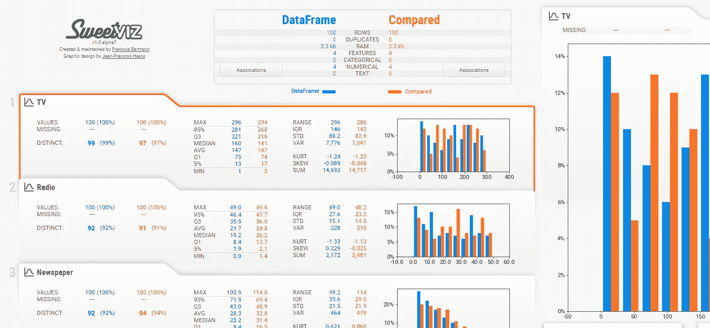
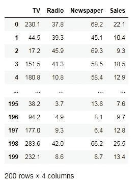
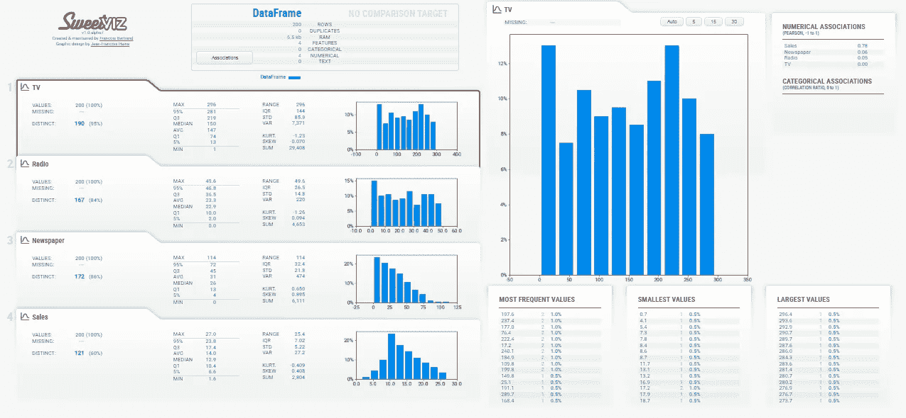
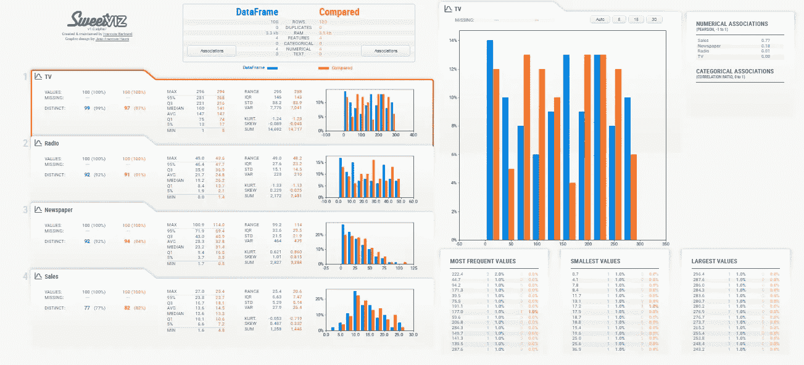

# sweet viz:Python 中的自动化 EDA

> 原文：<https://towardsdatascience.com/sweetviz-automated-eda-in-python-a97e4cabacde?source=collection_archive---------5----------------------->

## 使用 Sweetviz python 库进行探索性数据分析



探索性数据分析是一个过程，在这个过程中，我们往往使用可视化方法来分析数据集并总结数据集的主要特征。EDA 真的很重要，因为如果你不熟悉你正在处理的数据集，那么你将无法从这些数据中推断出一些东西。但是，EDA 一般需要很多时间。

但是，如果我告诉你 python 可以在一些库的帮助下自动化 EDA 的过程呢？不会让你的工作更轻松吗？那么让我们开始学习自动化 EDA 吧。

在本文中，我们将使用 **Sweetviz** 致力于自动化 EDA。它是一个 python 库，可以生成漂亮、高密度的可视化效果来启动您的 EDA。让我们详细探索一下 Sweetviz。

# 安装 Sweetviz

像任何其他 python 库一样，我们可以使用下面给出的 pip install 命令来安装 Sweetviz。

```
pip install sweetviz
```

# 分析数据集

在本文中，我使用了一个包含 4 个属性和 200 行的广告数据集。首先，我们需要加载正在使用的熊猫。

```
import pandas as  pd
df = pd.read_csv('Advertising.csv')
```



广告数据集。

Sweetviz 有一个名为 Analyze()的函数，它分析整个数据集并提供详细的可视化报告。

让我们使用下面给出的命令来分析我们的数据集。

```
# importing sweetviz
import sweetviz as sv#analyzing the dataset
advert_report = sv.analyze(df)#display the report
advert_report.show_html('Advertising.html')
```



EDA 报告

我们开始了，正如您在上面看到的，我们的 EDA 报告已经准备好，包含了所有属性的大量信息。它很容易理解，只用 3 行代码就准备好了。

除此之外，Sweetviz 还可用于可视化测试和训练数据的比较。为了进行比较，让我们将此数据分为两部分，前 100 行用于训练数据集，其余 100 行用于测试数据集。

Sweetviz 的 Compare()函数用于数据集的比较。下面给出的命令将创建和比较我们的测试和训练数据集。

```
df1 = sv.compare(df[100:], df[:100])
df1.show_html('Compare.html')
```



使用 sweetviz 进行对比分析

除此之外，Sweetviz 还提供了更多功能，您可以通过 [**进行操作。**](https://pypi.org/project/sweetviz/)

你觉得这个漂亮的图书馆怎么样？继续尝试，并在回复部分提及你的经历。

还有其他一些自动化 EDA 过程的库，其中之一是 Pandas Profiling，我在下面的一篇文章中已经解释过了。

[](/creating-dataset-using-faker-and-use-it-for-pandas-profiling-6fe26e1b9557) [## 使用 Faker 创建数据集并将其用于熊猫概况分析

### 创建您自己的数据并对其执行操作。

towardsdatascience.com](/creating-dataset-using-faker-and-use-it-for-pandas-profiling-6fe26e1b9557) [](/understanding-data-analysis-step-by-step-48e604cb882) [## 逐步了解数据分析

### 对数据集应用数据分析以获得关于数据的见解。

towardsdatascience.com](/understanding-data-analysis-step-by-step-48e604cb882) 

# 在你走之前

***感谢*** *的阅读！如果你想与我取得联系，请随时通过 hmix13@gmail.com 联系我或我的* [***LinkedIn 个人资料*** *。*](https://www.linkedin.com/in/himanshusharmads/) *您也可以在我的**[***Github****中查看我在这里使用的代码和数据。*](https://github.com/hmix13/Sweetviz)*