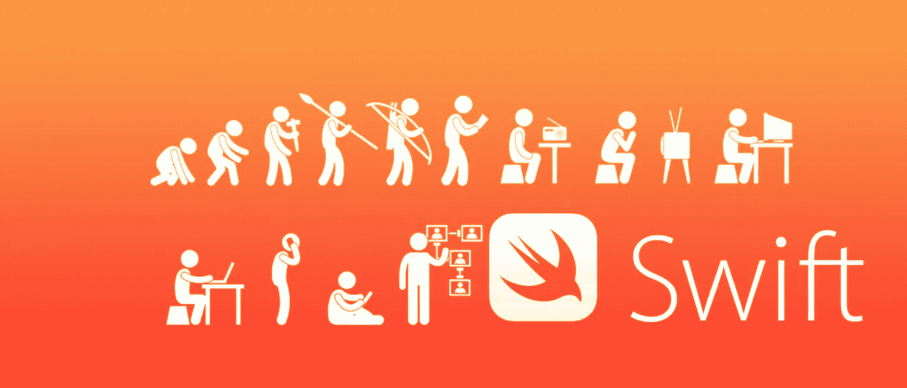
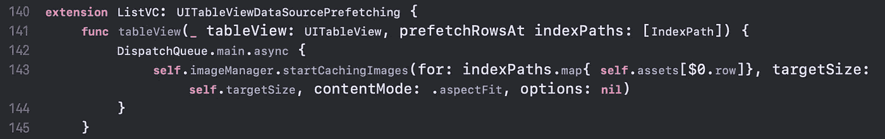
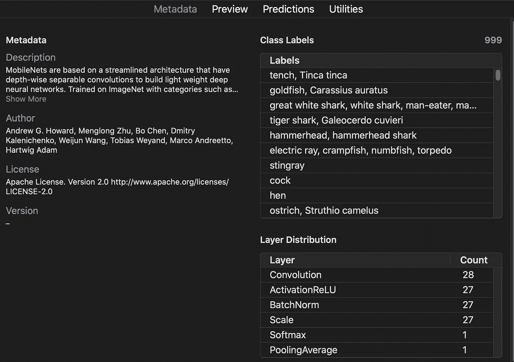
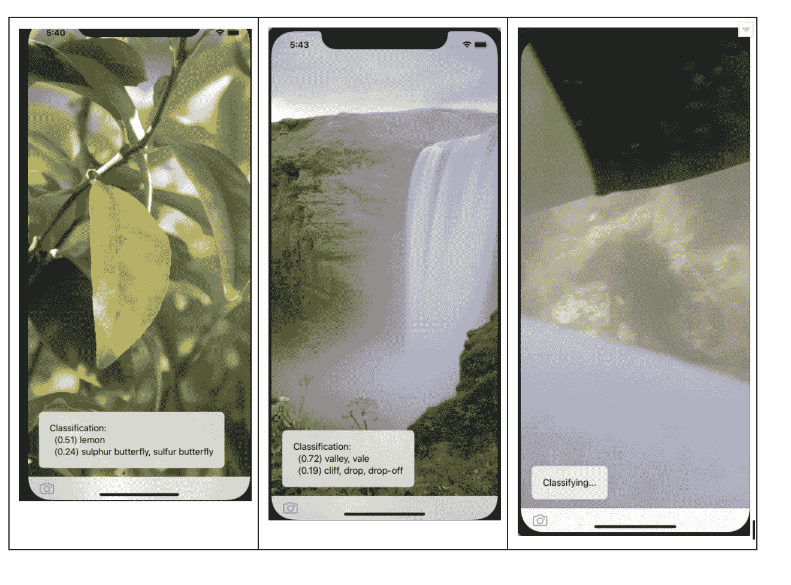
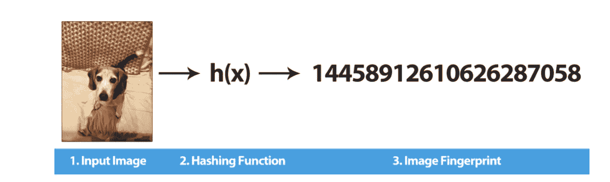
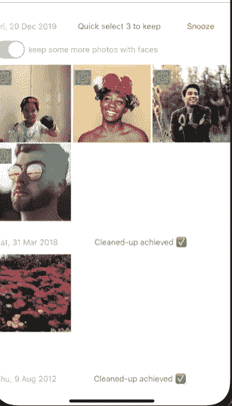

# Swift 符合照片框架和 CoreML:智能整理应用背后的技术细节

> 原文：<https://towardsdatascience.com/swift-meets-photos-framework-and-coreml-tech-details-behind-a-smart-tidying-up-app-38e1d4b9e842?source=collection_archive---------41----------------------->

## 使用 Photos/Vision framework 和 CoreML 的图像整理应用程序背后的技术分享


卡尔·帕夫洛维奇在 [Unsplash](https://unsplash.com?utm_source=medium&utm_medium=referral) 的照片

在上一篇文章中，我分享了我的应用程序的[产品创意，它使用智能建议来帮助整理手机上的照片，紧密基于](https://medium.com/the-innovation/the-marie-kondo-for-photos-app-introduction-29886fb37101)[KonMarie](https://konmari.com/)组织策略。

在这一部分，我分享了一些我开始 iOS 开发之旅的技术笔记和思考，重点是 AI/ML 和图像技术。我还讨论了在设备上构建个性化的 ML 模型*。希望它能为未来的企业家或开始应用程序开发的人提供一些实用的技巧。*

# 开始

## **学习 Swift**



来源:[Mindfire Solutions 的 Swift](https://medium.com/@mindfiresolutions.usa/the-evolution-of-swift-29e7a89f1a0c) 发展

我是带着这个项目开始第一次学习 Swift 的。接触一些类似的编程语言确实大大加快了我的学习过程。

我对 Swift 的主要看法是:

*   Swift 是一种现代、简洁的编程语言，它拥有来自其他编程语言的许多范例，如委托和生命周期方法(类似于 React 中的那些)，作为第一类的功能，强类型安全和[空安全](https://brightdigit.com/blog/2018/01/04/understanding-optionals-in-swift/)(在安全方面，代码的便利性和可靠性之间有一个权衡)。
*   Swift 本身是一个多语种者——覆盖广泛的用例，从前端开发到深度 NeuralNets 模型的脚本批量训练。我发现它在每个角色中都表现得很好。
*   我发现 Swift 功能强大，是一种精心设计的语言，但学习曲线有点陡。事后看来，**投资学习基本概念**(如委托、异步处理、异常处理、包装和解包等)确实是值得的，因为随着学习的进展，这将加速后面的阶段。

就我个人而言，斯威夫特给人的感觉是一个聪明、老练的角色，这需要时间来熟悉，不像 Python 或 Ruby 那样友好、务实。

## **Xcode**

大多数时候，VS 代码是我首选的 ide。然而，对于 iOS 开发，我认为使用 Xcode 是更合适的选择。

Xcode 有助于调试、分析、运行模拟、所见即所得编辑器、管理构建和发布应用程序。它对于检查和管理 CoreML 格式的 ML 模型也很有用。它与 Xcode 服务器集成，用于 CI/CD 管道。

总的来说，良好集成的工具的重要性胜过其他问题，这让我免去了在多种工具之间切换的麻烦。

# 更先进的图像处理技术

## **图像处理**

我很兴奋地用我的 iPhone 尝试一些神奇的照片。我对此并不失望，因为苹果确实提供了很好的库支持，用[照片框架](https://developer.apple.com/documentation/photokit)来处理图像。

**最重要的是，使用照片框架确保了 iOS 用户一致且熟悉的 UX**。例如，删除的照片将在“最近删除的”照片中保留 30 天，与通过默认相册应用程序删除的行为相同。

照片框架是现代和成熟的。作为另一个例子，它负责对共享照片资源的同步共享访问。这对于保持用户相册的一致状态非常重要，因为可能会有许多应用程序同时访问它们。下面是几行代码的例子。

```
PHPhotoLibrary.shared().performChanges({PHAssetChangeRequest.deleteAssets(delShotsAsset)}, completionHandler: {(success, error)**in****var** msg = String()**if** success {msg = "Successfully deleted."
```

## **图像缓存**

照片框架也很好地支持缓存。我错误地了解了这件事。在最初的几次尝试中，如果没有缓存，渲染速度会非常慢。无论图像是来自 web 服务器还是本地存储，渲染大量照片(每张照片的大小都有几兆字节)都是一个很大的瓶颈。

就清理照片而言，浏览图像是一个核心功能，我希望它是正确的。

在这里，懒惰装载来拯救。Photos 框架支持预取，它可以在用户滚动时预测并缓存传入的图像，并适当地使缓存失效。可以按照下面的代码片段来完成。



结果是更流畅的渲染体验。


# 将机器学习引入 iOS 应用

## **核心毫升**

人工智能/人工智能技术正在迅速成为移动世界的一种规范，尤其是在 iOS 生态系统中。[神经引擎](https://en.wikipedia.org/wiki/Apple_A11)(基本上是神经网络的加速硬件，像 Edge TPU)现在默认内置于最新的 iPhones 中。每个单元每秒能够执行万亿次矩阵运算，而不会损害手机的电池或计算资源。

Core ML 提供了一系列选项来将 ML 模型集成到 iOS 应用程序中，从面向消费者的“拖放”方式使用 [CreateML](https://developer.apple.com/documentation/createml) 来训练 ML，到使用 Swift 的脚本方法(完全可定制)来训练定制的 ML 模型。

在下面的例子中，我正在制作一个模型来识别照片中的主体。基于这些信息，应用程序可以了解应该推荐保留什么。

## 将 ML 模型添加到 iOS 应用程序

CoreML 提供了许多现成的模型。mlmodel 格式。有用于图像识别、语音、声音和文本识别的 dnn。还有一些转换器可以将其他 DNN 模型格式(如 Tensorflow 或 tf-lite)转换成 CoreML 格式。

[预先构建的模型](https://developer.apple.com/machine-learning/models/)，如 MobileNetV2、YOLO 或 SqueezeNet，针对移动推理进行了量化，并针对小型移动设备的使用进行了优化。它们可以按原样使用，也可以在分类/预测层进行微调，以用于后续的任务。

在检测照片中的主题的例子中，MobileV2 Net 可以通过几行代码来使用

```
**lazy** **var** classificationRequest: VNCoreMLRequest = {**do** {
**let** model = **try** VNCoreMLModel(for: MobileNet().model)
**let** request = VNCoreMLRequest(model: model, completionHandler: { [**weak** **self**] request, error **in
self**?.processClassifications(for: request, error: error)
})request.imageCropAndScaleOption = .centerCrop
**return** request
} 
```

Xcode 提供了方便的集成工具来检查模型的层，理解它的元数据，或者探测它的预测结果来动态地检测模型。



使用 MobileNet ML 模型识别的主题示例。有些模糊的照片无法分类或接近决策边界。

## 设备上的个性化机器学习模型

iOS 支持设备上的在线分布式培训，这使得为*的每个*用户建立真正个性化的 ML 成为可能。

(为了澄清，在某种意义上，正常的 ML 模型也可以被认为是*个性化的*，因为它们是用长尾数据训练的，并且在推理时，它们基于个人用户输入进行预测。然而，底层模型仍然在用户之间共享。这一特性不仅如此，还使得在每个设备上定制一个模型成为可能。

考虑这样一个场景，我想要一个 ML 模型来建议(二元决策)是否保留一个图像。理想情况下，该应用通过持续使用收集用户通常保留哪些照片的反馈。它是[相关反馈](https://en.wikipedia.org/wiki/Relevance_feedback)的一种形式。

例如，如果我是一名敏捷教练，我可能想保存更多的便利贴照片，或者，如果我是一名家长，我可能想保存更多的孩子照片。

基于我的设备上的这种特定数据(这捕获了我的偏好)，CoreML 可以通过 MLUpdate 任务更新“通用”模型。所得到的重新训练的模型可以被保存在设备上，换句话说，每个用户将拥有他们自己的个性化 ML。下面是一个[代码示例](https://www.raywenderlich.com/7960296-core-ml-and-vision-tutorial-on-device-training-on-ios):

```
do {
    let updateTask = try MLUpdateTask(
      forModelAt: url,
      trainingData: trainingData,
      configuration: nil,
      completionHandler: completionHandler)
    updateTask.resume()
  } catch {
    print("Couldn't create an MLUpdateTask.")
  }
```

这篇文章没有详细讨论 CoreML 的实现，我将在另一篇文章中讨论。我希望分享更多关于不同 CoreML 模型的优缺点，Core ML 从训练、微调到推理和监控的生命周期。

## **高价值低挂水果特色**

虽然 CoreML 是构建智能建议的一个强大选项，但有时，非 ML 替代方案也足够了。有时候，关注问题(不管是什么能解决问题)*比关注解决方案更好。*

就清理而言，我认为以下问题最适合应用 ML:

*   识别主题或图像类别
*   推荐最佳保留照片
*   预测某种“质量”指标
*   了解用户的偏好

另一方面，还有其他一些唾手可得的功能，这些功能易于实现，对日常用户同样有效:

*   识别重复项
*   识别照片中的人脸(最重要的质量指标之一)

## **使用哈希值识别重复项**

这是一个 ML 解决方案听起来很诱人的例子，但是有一个更简单的算法也可以完成这项工作，而且更快，更容易实现和测试。

这个想法很简单——将图像转换成哈希——相似的图像应该产生相似的哈希数，这样就可以比较接近程度。[汉明距离](https://www.pyimagesearch.com/2017/11/27/image-hashing-opencv-python)就是为此而存在的。一些散列算法(查看相邻像素中的差异)是合适的。



资料来源:pyimagesearch.com

## **使用苹果 iOS 的内置人脸检测功能识别人脸**

我利用的另一个东西是[视觉框架](https://developer.apple.com/documentation/vision)，它内置了人脸检测功能，可以异步请求。它像用于 FaceID 一样工作稳定，并且很容易解决人脸识别的问题。下面是照片中人脸识别的一些例子的截图。



人脸识别示例

事后看来，拥有有效且准确的 ML 模型是很好的，但这不是我面临的最困难的挑战，也不是最有影响力的挑战。最大的问题是如何以有用、有价值和直观的方式将这些模型集成到应用程序中。

# **其他技术说明**

## **异步很重要**

许多前端开发人员已经证实了处理异步事件和非阻塞 I/O 的重要性。Swift 提供了充分的支持，如 DispatchQueue /后台队列，以处理从用户交互到 ML 推理请求的事件，同时保持应用程序平稳运行。

## **可扩展建筑**

随着时间的推移，代码库只会变得更加复杂和混乱。我发现对[组织原则](https://www.swiftbysundell.com/articles/structuring-swift-code/)进行一些思考是很重要的，以确保项目可以持续迭代。

一些有用的提示包括:

*   利用扩展分解复杂的 Swift 类
*   利用 Swift 惯例和模式，如生命周期方法
*   遵循视图/控制器命名模式

# **最终反射**

为了成功启动 iOS 开发热潮，经过思考，我发现最重要的事情是:

*   拥抱并尊重 Swift 的学习曲线——它在开始时感觉有点臃肿，但它是一种强大且得到良好支持的语言。
*   注意关键的移动开发和性能问题，包括处理异步、使用委托和生命周期方法，或者缓存等等。
*   从一开始就建立一个可扩展的代码架构。
*   使用 CoreML——在构建更复杂的 ML 模型之前，有一些轻量级的方法可以开始。
*   最后，利用 iOS 框架和 Xcode 集成工具——对 ML 开发的调试、剖析有很大的支持。

这就是我的博客。我期待着在接下来的帖子中分享更多关于 CoreML、产品和设计思维的内容，这些都是我在应用开发中的经验。