# 嗖嗖:从激活功能王座引导 ReLU

> 原文：<https://towardsdatascience.com/swish-booting-relu-from-the-activation-function-throne-78f87e5ab6eb?source=collection_archive---------10----------------------->

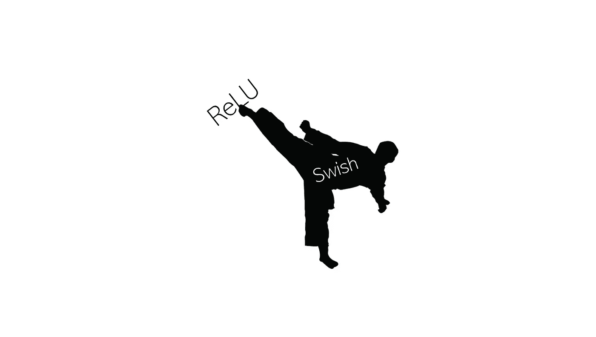

未修改的[来源](https://www.buzzle.com/images/drawings/ninja-costume/martial-arts-kick.jpg)，图片免费分享。

## Swish 如何在深度学习激活函数竞赛中击败 ReLU

答激活函数长期以来一直是神经网络的兴趣焦点——它们反复归纳输入，是神经网络成功的关键。长期以来，ReLU 一直被默认为深度学习社区中最好的激活函数，但现在有一个新的激活函数——Swish——来夺取这一宝座。

激活函数有着悠久的历史。首先，选择 sigmoid 函数是因为它容易求导，范围在 0 到 1 之间，并且具有平滑的概率形状。tanh 函数也被认为是 sigmoid 函数的替代函数，适合于-1 和 1 之间的范围，但是这些经典的激活函数已经被 ReLU 代替。整流线性单元(ReLU)是目前最流行的激活函数，因为当 ReLU 函数的输入为正时，梯度可以流动。它的简单性和有效性推动了 ReLU 和分支方法，如漏 ReLU 和参数化 ReLU，超越了 sigmoid 和 tanh 单元。

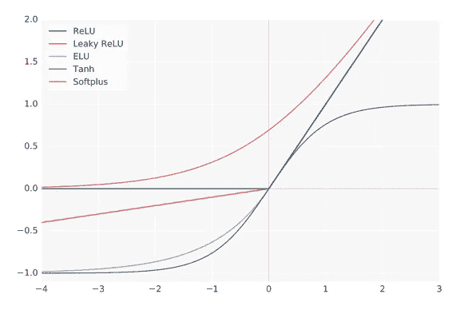

各种激活函数图示。来源:Swish Paper。

Prajit Ramachandran、Barret Zoph 和 Quoc V. Le 在他们的论文中提出了一个新的激活函数(底部的链接)，他们称之为 Swish。Swish 很简单——它是 sigmoid 函数的 *x* 倍。

论文作者的研究表明，简单地用 Swish 单元替换 ReLU 单元可以将 ImageNet 上的最佳分类精度提高 0.9%，对于 Mobile NASNet-A 和 Inception-ResNet-v2 分别提高 0.6%。

# **什么是 Swish 激活功能？**

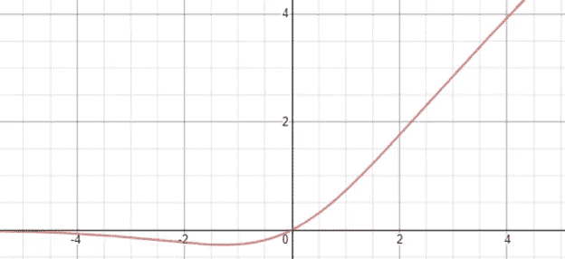

Swish 激活功能。上面画着德斯莫斯。

正式来说，Swish 激活功能是…

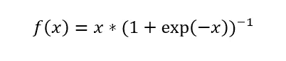

像 ReLU 一样，Swish 在下面是有界的(意味着当 *x* 接近负无穷大， *y* 接近某个常数值)，但是在上面是无界的(意味着当 *x* 接近正无穷大， *y* 接近无穷大)。然而，与 ReLU 不同，Swish 是*平滑的*(它没有运动或顶点的突然变化):

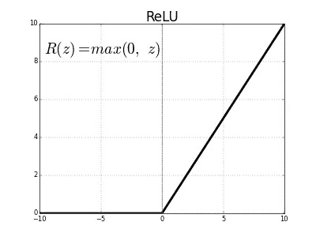

[来源](http://csci431.artifice.cc/images/relu.png)

此外，Swish 是*非单调的*，这意味着在整个函数中并不总是有一个奇异且连续的正(或负)导数。(重申一下，Swish 函数在某些点上具有负导数，在其他点上具有正导数，而不是像 Softplus 或 Sigmoid 那样在所有点上都只有正导数。

Swish 函数的导数是…

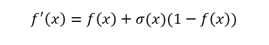

Swish 的一阶和二阶导数，标绘:

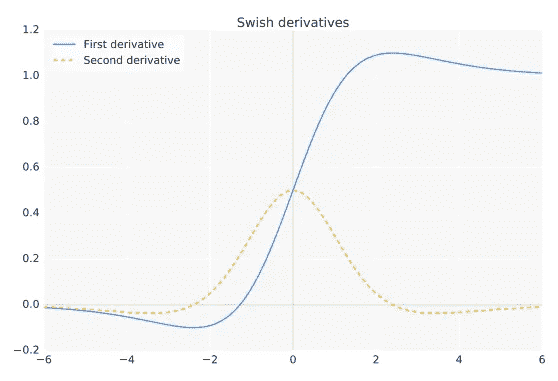

来源:Swish paper

对于小于约 1.25 的输入，导数的大小小于 1。

# **Swish 的属性**

对于激活函数来说，无界是可取的，因为它避免了在近零梯度期间的缓慢训练时间 sigmoid 或 tanh 等函数上下有界，因此网络需要仔细初始化，以保持在这些函数的限制范围内。

ReLU 函数是对 tanh 的改进，因为它是上界的——这个属性非常重要，以至于 ReLU 之后的每个成功的激活函数都是上界的。

由于强正则化，在下面有界可能是有利的-在负无穷大的极限中接近零的函数在正则化方面很好，因为大的负输入被丢弃。这在训练开始时很重要，因为大量的负面激活输入是常见的。

这些界限由 Softplus、ReLU 和 Swish 满足，但 Swish 的非单调性增加了输入的“表现力”并改善了梯度流。

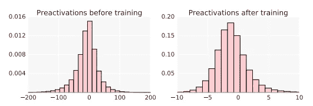

输入，在通过 Swish 之前和之后。来源:Swish paper

此外，平滑度有助于优化和推广神经网络。在下面的输出景观中，显而易见的是，ReLU 的输出景观由于其不平滑的性质而显得尖锐和不和谐，而 Swish 网络景观则平滑得多。

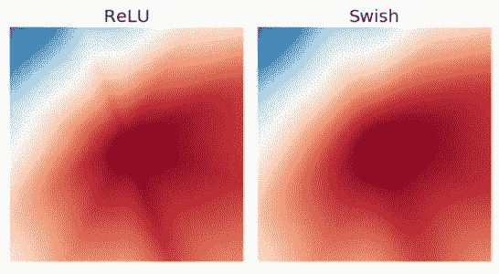

来源:Swish paper

输出景观平滑度与误差景观直接相关。更平滑的误差空间更容易遍历和找到最小值，就像走在喜马拉雅山脉不和谐的高度范围内，而不是走在英国乡村平滑起伏的山丘上。


你更愿意走在哪个上面？[左图像源](https://www.awesomestories.com/images/user/4ae0e8b631.jpg)、[右图像源](https://upload.wikimedia.org/wikipedia/commons/thumb/1/13/2015_Swaledale_from_Kisdon_Hill.jpg/1200px-2015_Swaledale_from_Kisdon_Hill.jpg)。

# **嗖嗖性能**

Swish 论文的作者将 Swish 与以下其他激活功能进行了比较:

*   漏 ReLU，其中*f*(*x*)=*x*如果 *x* ≥ 0，以及 *ax* 如果 *x* < 0，其中 *a* = 0.01。当*x*为 0 时，这允许少量的信息流动，并且被认为是对 ReLU 的改进。
*   参数 Relu 与泄漏 ReLU 相同，但 *a* 是一个可学习的参数，初始化为 0.25。
*   Softplus 由*f*(*x*)= log(1+exp(*x*))定义，是一个平滑函数，具有类似 Swish 的性质，但严格为正且单调。
*   指数线性单位(ELU)，定义为*f*(*x*)=*x*if*x*≥0 和*a*(exp(*x*)—1)if*x*<0 其中 *a* = 1。
*   比例指数线性单位(SELU)，与 ELU 相同，但输出乘以一个值 *s* 。

下表显示了在 9 次实验中，Swish 比概述的基线激活功能执行得更好、相等或更差的次数。

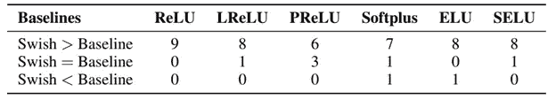

表格数据:Swish 纸

## Swish vs. ReLU

作者发现，通过用 ReLU 单元代替 Swish 单元，当层数从 42 层增加时(当优化变得更加困难时)，与 ReLU 相比有显著的改进。

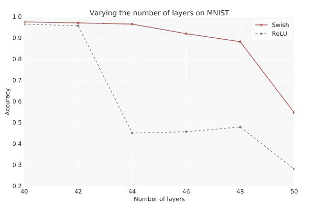

来源:Swish paper

作者还发现，对于不同大小的批处理，Swish 的性能优于 ReLU。

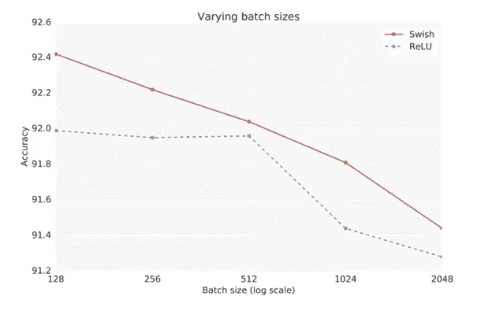

## 在各种数据集上测试

作者针对以下基线激活功能测试了 Swish，结果如下:

*   CIFAR-10 和 CIFAR-100 数据集——Swish 在 CIFAR-10 和 CIFAR-100 的每个型号上都始终与 ReLU 相当或超过 ReLU。
*   ImageNet——Swish 比 ReLU 高出 0.6%，在 Mobile NASNet-A 上高出 0.9%，在 MobileNet 上高出 2.2%。
*   WMT 2014 英语到德语— Swish 在所有四个测试数据集上都优于 ReLU。

## **实施**

实现 Swish 非常简单——大多数深度学习库应该支持 Swish…

```
tn.nn.swish(x)
```

…或者可以表示为 *x* 乘以 sigmoid 函数

```
*x ** tf.sigmoid(x)
```

# 相信了吗？

下次你在训练深度神经网络的时候，试试 Swish 吧！

感谢阅读！如果你喜欢，也可以看看我的其他作品。

此处可找到 Swish paper[。](https://arxiv.org/pdf/1710.05941v1.pdf)