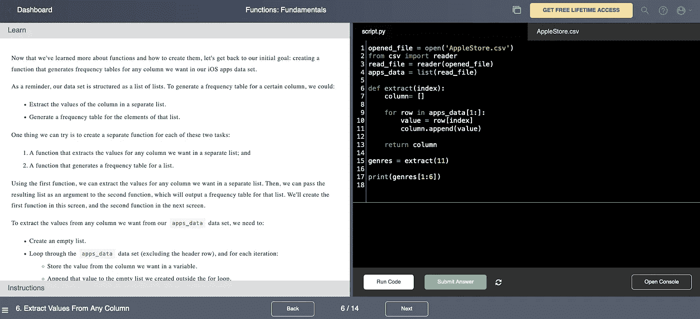

# 30 多岁转行做数据科学。

> 原文：<https://towardsdatascience.com/switching-career-to-data-science-in-your-30s-6122e51a18a3?source=collection_archive---------2----------------------->

## ***不要纠结于已经有答案的问题。在开始向数据科学的职业转型之前，我希望知道以下三件事。***

罗斯·芬登在 Unsplash 上的照片

你已经到了职业生涯中的一个点，继续做同样的事情是没有意义的。也许你很无聊，没有挣到你应得的那么多，或者像我一样，根本就不喜欢你的工作。在职业混乱中，你偶然发现了数据科学，并注意到转行有巨大的机会。另外，你已经在 YouTube 上找到了一些数据科学家的编码教程。

然而，尽管网上有许多专家，但他们中的一些人可能已经开始了向数据科学的职业转型。可能更少的人在 40 多岁时从一个完全不相关的领域做出这样的改变。这表明你一直在看/读的东西可能不适用于你的现实。也就是说，你应该半信半疑地看那些视频。毕竟，你不想浪费你的宝贵时间。因此，在转行从事数据科学之前，我希望处于类似职业和生活阶段的人能告诉我以下三件事:

**1-选择 Python，继续前进。**

如果您已经做了功课，那么您应该知道基本上有两种编程语言最适合从事数据科学:R 和 Python。虽然 R 在统计学家和研究人员中使用，并且它可以用于数据科学，但是 **Python** 是迄今为止你最好的选择。

对于那些很少或没有编程背景的人来说，Python 是最容易理解的编程语言。由于其简化的语法，它非常容易学习，这使得与其他编程语言(如 Java)相比，它的编码速度更快。这是一个优势，因为 Python 允许那些业余程序员阅读你的代码并与你合作。因此，Python 可以提高生产力，加速你的职业转换。

Python 允许您直接从 web 上获取数据，这对于那些想要进行数据分析并产生见解或预测某些人类行为的人来说是完美的。数据收集将是无痛的，这意味着你可以按照自己的节奏在 GitHub 上建立自己的投资组合。更重要的是，大部分使用机器学习的数据处理和围绕人工智能的研究都是用 Python 语言开发的。这是因为 Python 提供了数百个库，例如用于神经网络的 **TensorFlow** 和用于处理数组、矩阵和高级数学函数的 **NumPy** 。

不要纠结于需要学习哪种编程语言。这个决定可以为你节省宝贵的时间，尤其是如果你已经 30 多岁了。所以，选择 Python，继续前进。

**2-不要沉迷于快速教程，优先考虑结构化课程。**

由于数据科学是一个热门话题，许多 YouTubers 网站为初学者提供了快速替代方案:“快速轻松地学习 Python”或“10 分钟内学会熊猫”。然而，研究人员表示，学习过程相对缓慢，需要重复，并且当分布在间隔时间间隔内时最有效。因此，一个结构良好的课程对于建立一个新技能(如编程)的坚实基础至关重要。另外，不要忘记编程既需要认知能力(新语法)，也需要运动技能(打字)。这意味着初学者几乎不可能在几个小时内学会 Python，更不用说在 10 分钟内通过手机观看视频了。

解决方法是什么？看你现阶段想投入多少了。以下是三个选项:

**-无证书免费:**只需去 [Coursera](https://www.coursera.org/specializations/python) 搜索密歇根大学的‘面向所有人的编程(Python 入门)’。

**-一次性付款，成本低:**去 [Udemy](https://www.udemy.com/course/complete-python-bootcamp/) 搜索何塞·波尔蒂利亚的《从零到 Python 中的英雄的完整 Python Bootcamp》。

**-包月会员并且有点贵:**在这个类别中，你可以从三个平台中选择( [DataCamp](https://www.datacamp.com/tracks/data-scientist-with-python) 、 [Codecademy](https://www.codecademy.com/catalog/language/python) 或者 [DataQuest](https://www.dataquest.io/path/data-scientist/) )。所有这些平台都提供了 Python track 数据科学。

我的推荐是试试 [**DataQuest**](http://app.dataquest.io/referral-signup/0ypi2nyz/) 。不仅仅是因为结构良好的课程，还因为一些可能会让你感到惊讶的事情，这也是我希望有人之前告诉我的第三件事，也是最后一件事。

从实践中学习，而不是从观察中学习。

看视频教程似乎是 21 世纪首选的学习方法。网上找个视频很容易；你只需要点击播放，甚至可以多任务。但是在学习数据科学和编程的时候，看视频并不是最优的学习形式。

我相信你看过一个关于如何编写函数或代码的视频。但是，你有没有一边看着它，一边试图理解代码背后的逻辑并在键盘上打字？随着 Python 和函数变得越来越复杂，从视频中学习是行不通的。结果，你将不得不经常反复观看相同的解释，这是低效和费时的。基本上，你会花很多时间暂停视频，并试图找到你想再次开始观看的精确分钟/秒。这很烦人。

也就是说，我强烈推荐 DataQuest，因为他们的讲座不是视频而是文本。你必须阅读，然后开始把你读到的东西打出来。这看起来有点老派，但是对于初学者来说效果很好，他们需要更多的时间来处理他们所学的东西。它们为您提供了在同一屏幕上测试代码的指令和脚本区域。他们的形式对于那些寻求优化学习时间的人来说简直是完美的。

DataQuest 讲座的截图。

最后但同样重要的是，DataQuest 课程是基于现实生活中的数据创建的，如 Android & iOS 应用程序、MoMa 艺术品、S&P500。这很重要，因为你将在实践中学习。他们的方法将显著提高你的学习曲线。同样，这将为你节省宝贵的时间，并让你更有动力转行，因为你看到了作为一名数据科学家工作的感觉。我将在 DataQuest 上写一篇更深入的评论，所以请关注这个空间。

**结论**

总之，如果你正处于向数据科学的职业转型中，可能是在 30 多岁的时候，那么你不会想在已经有明确答案的问题上浪费时间。出于这个原因，我列出了我希望有人在我开始转行之前告诉我的话:

**(1)** 专注于 Python。

**(2)** 选择一门结构良好的课程，在你向更复杂的主题(如机器学习)前进时，获得坚实的基础。

**(3)** 通过做真实的项目来学习，而不是看简单的视频。

希望这篇帖子对你有所帮助。如果你想试试 DataQuest，那么只需访问他们的网站，开始免费试用。作为免责声明，我没有从 DataQuest 或这篇帖子中提到的任何其他平台获得任何报酬来换取我的推荐。所以，我们开始工作吧。

**想获得 Medium 文章的全部访问权限并支持我的工作？使用以下链接订阅:**

 [## 通过我的推荐链接加入 Medium—Renato Boemer

### 作为一个媒体会员，你的会员费的一部分会给你阅读的作家，你可以完全接触到每一个故事…

boemer.medium.com](https://boemer.medium.com/membership) 

**参考文献:**

J. D .卡皮克和 a .鲍恩施密特。[间隔提取:无论相对间隔如何，绝对间隔都能增强学习](https://content.apa.org/record/2011-09722-001) (2011)。J. Exp 心理学。37 (5) 1250–1257.

**【2】**n . j . Cepeda，*等*。[学习中的间隔效应。最佳保持力的时间脊线](https://journals.sagepub.com/doi/full/10.1111/j.1467-9280.2008.02209.x?casa_token=vxYa-jntmaQAAAAA%3AhRIJu7B3nY719Y8wTMv836pjOe8cF_gj4f9S2ihMSDgIu3pRoSsDwE7Ev6pBJWMR64PkyWBTM8bl) (2008)。Sage 期刊心理科学 19(11):1095–1102